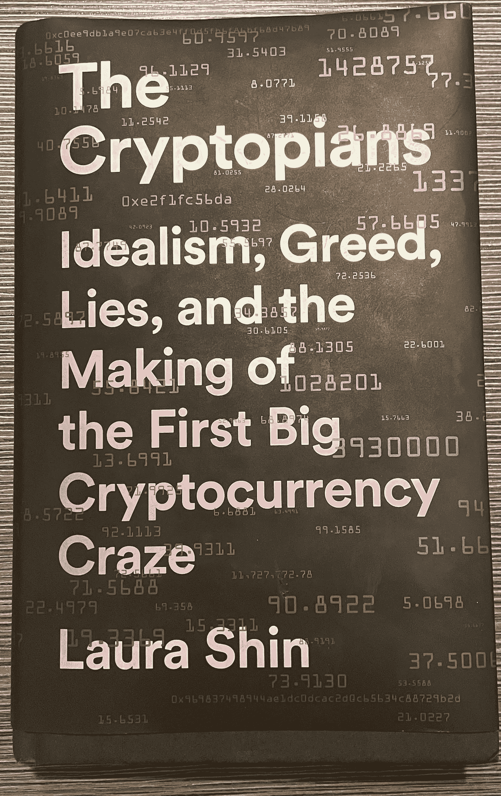

# 隐密行星人:书评

> 原文：<https://medium.com/coinmonks/the-cryptopians-book-review-404f9eb4a103?source=collection_archive---------9----------------------->

当阅读和撰写劳拉·申的《加密人——理想主义、贪婪、谎言和第一次大规模加密货币热潮的形成》的书评时，我不禁想起了我过去的一些事情。

*The Cryptopians — Idealism, Greed, Lies and the making of the First Big Cryptocurrency Craze* by Laura Shin

我想起了从我最喜欢的一部电影中得到的一种感觉。

从片头开始——就在你开始听到微妙的钢琴声时——电影*,社交网络*总是让我兴奋起来，让我想开始工作。互联网热潮中有一些令人振奋的东西。(我也认为这无疑是 2010 年最好的电影之一——而且[昆汀·塔伦蒂诺也同意](https://www.ign.com/articles/quentin-tarantino-names-the-social-network-the-best-movie-of-the-2010s))。

而这正是我在阅读 [*密码本*](https://www.amazon.com/Cryptopians-Idealism-Greed-Making-Cryptocurrency-ebook/dp/B08Y8MQ66Z?&_encoding=UTF8&tag=bridgethegap0a-20&linkCode=ur2&linkId=df08dd69087036f51782d60e3dff26ae&camp=1789&creative=9325) 时的感受。这本书激动人心，鼓舞人心，非常有趣。它从一开始就抓住了你，是翻页机的定义。

事实上，我真的认为这本书有一天会被用作电影的基础。有那么好(总有一天会有一部关于密码的电影——对吗？).

***密码人*是关于什么的？**

这本书原本打算讲述一些与加密货币世界相关的不同事件。它的目标是将加密货币作为一个整体，以太坊只是其中的一部分。然而，在某个时候，申意识到以太坊就是故事。

这本书带你在以太坊是如何形成的——从“内核”到“爆米花”上进行一次狂野之旅它还详细介绍了其他几家在以太坊基础上建立平台的公司的内部工作方式——最著名的是 2016 年被黑客攻击的 [DAO](https://en.wikipedia.org/wiki/The_DAO_(organization)) (实际上[申](https://twitter.com/laurashin/status/1496087239037698048?s=20&t=_ej1hZUCi1mtTRFT417zmw)最近[在《福布斯》的封面故事中对 DAO 黑客](https://www.forbes.com/sites/laurashin/2022/02/22/exclusive-austrian-programmer-and-ex-crypto-ceo-likely-stole-11-billion-of-ether/?sh=782c2c617f58)进行了解密，以及开发者和前 crypto 首席执行官获得了多少钱的信息)。

**认识 Vitalik 滴定管…**

《加密人》还让你独家了解区块链以太坊及其本地加密货币以太的创始人维塔利科·布莱顿的一生。

你会读到创始人如何在区块链早年不太明朗的水域中航行，他的个性是什么样的，他喜欢和什么类型的人保持密切联系，以及他自己和为他工作的其他人如何看待他的管理风格。

当他与几个由软件工程师和商人组成的联合创始人一起工作时，你会看到这一切——他们都有自己有趣的个人背景。

想知道在一家新兴加密公司工作是什么感觉吗？你也会得到的。

有时，你会觉得自己正坐在瑞士楚格的公寓里，这个组织在早期的许多日子里都在这里讨论谁来承担项目的某些责任(楚格[被称为“加密谷】](https://www.coindesk.com/markets/2021/02/18/switzerlands-crypto-valley-has-started-accepting-bitcoin-ether-for-tax-payments/))。你会确切地知道公司面临什么样的技术问题，他们是如何解决的，以及所有有趣的细节。

背后捅刀子、说闲话、指责和做出艰难决定的紧张时刻并不少见。

**臭名昭著的黑客攻击…**

关于 DAO 攻击的章节就像是数字版的加勒比海盗，每一个事件都建立在最后一个事件的基础上。

Shin 将带您了解这一有史以来最臭名昭著的黑客攻击中到底发生了什么，黑客是如何做到的，社区以及几名 DAO 员工是如何回应的，以及所有技术细节的本质。

尽管 shin 把它分解成了很小的解释，但技术讨论占了这本书的很大一部分。Shin 表示，她花了大量的时间来核实一些事情，比如某些日期的代币价格、涉及的技术流程，甚至是[密码俚语](https://investmentfirms.com/crypto-slang-terms-to-know/)。

采访、核实、采购和一般事实核查的工作量是惊人的。当涉及到结合一个诱人的故事，彻底的事实核查，以及写真实的 IRL 事件时，Cryptopians 真正提高了标准。

**重大密码事件……**

推动行业前进的重大事件在 *The Cryptopians* 中得到强调，以帮助您更好地了解加密世界——例如，当文克莱沃斯双胞胎在他们的加密交易所 Gemeni 宣布推出比特币期货产品时，比特币的价格飙升。

这些类型的故事有助于读者了解加密的本质是什么，它是如何发展的，以及这个领域的主要参与者是谁。

说到文克莱沃斯双胞胎——这两个人也参与了《社交网络》中脸书的创作——我认为接下来唯一要做的事情就是弄清楚贾斯汀·汀布莱克将在这部改编的电影中扮演谁。那就写*《隐者 2》*。