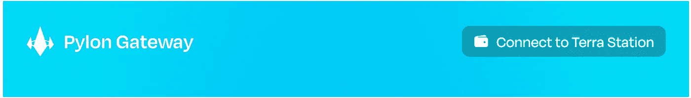
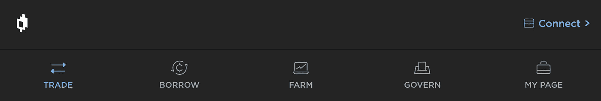

# Terra 治理的现状

> 原文：<https://medium.com/coinmonks/the-current-state-of-terra-governance-3dce3f0258ae?source=collection_archive---------8----------------------->

*DAOs 概述*

DAO(去中心化自治组织)发展迅速，展示了流动和去中心化社区的力量。让我们仔细看看利弊:

# 道的——善

在最佳状态下，刀就像一台流动、透明、润滑良好的机器。社区是道的核心。

**这里是道用来组织和发展社区的一些策略。**

*   **投票🗳**——选举和任命职位。对政策、变革和提案进行投票。
*   **令牌门控访问💰** -用户只有持有特定令牌才能访问群组。
*   **奖励贡献者👩‍💻** —完成任务的贡献者获得道的奖励。通常奖励是通过道的代币或其他加密货币发放的。任务的例子包括 bug 奖金、内容创建和社区管理或参与。
*   **完成任务奖励🛠** —完成链上任务的贡献者从 DAO 获得奖励。通常奖励是通过道的代币或其他加密货币发放的。

# 道的成长领域

现在，DAO 治理面临着一些严重的障碍，使其效率低下并限制了增长。DAO 治理的常见问题包括

*   **时间管理**⏳—刀动的慢。道在推动提案和对各种政策进行投票时可能会很慢。
*   **缺乏参与**👋-保持社区参与和团体参与非常困难。
*   **教育一大群人**📚-很难对社区进行大规模教育。通过各种渠道对大量用户进行利基主题教育会造成混乱。
*   **碎片化** 🧩-用户“被困”在独立的社区中，只参与一个孤立的协议，却错过了更大的图景。此外，每种协议都有自己的论坛，因此用户必须通过多种渠道参与。

因此，大多数协议都转向了延迟分散。

# 几个例子

探秘*陶的《论衡》并仔细看看* [*尖塔*](https://app.pylon.money/)*[*镜子*](https://mirrorprotocol.app/#/trade)*[*锚*](https://app.anchorprotocol.com/)**

# **铁塔(我的)**

****

**用户可以存放 MINE 来创建治理投票，MINE 利益相关者可以对社区基金拨款、协议更新、启动平台项目、参数更改、新功能开发和其他生态系统扩展计划进行投票。**

**阅读 Pylon 协议创始人的这篇帖子，了解更多信息。**

**[https://twitter.com/limowooj/status/1471352728844587014?s=20](https://twitter.com/limowooj/status/1471352728844587014?s=20)**

# **镜子(MIR)**

****

**拥有赌注 MIR 位置的用户可以在投票中投票，每个用户获得的投票权根据其赌注 MIR 的数量进行加权。对于每次轮询，用户可以选择分配他们的总赌注 MIR。因此，当在治理投票中做出决定时，具有更高 MIR 值的用户将具有更大的影响力。**

**MIR 的利益相关者可以提交提案并对各种程序和参数进行投票，例如**

*   **建议类型**
*   **白名单程序**
*   **除名程序**
*   **上市前程序**
*   **修改 Mint 参数**
*   **修改 Gov 参数**
*   **社区补助金**
*   **文本建议**

**阅读镜像中的[治理文件](https://docs.mirror.finance/protocol/governance)了解更多信息。**

# **锚(ANC)**

****

**锚上的治理由锚令牌的利益相关者(ANC)来管理。ANC 充当锚协议的治理令牌，用于投票。投票权与非国大的投票数量成比例。投票人可以在非国大中分配一定数量的投票权，以他们在非国大中的总票数为上限。**

**锚定的新治理提议被称为**民意测验。**任何用户都可以通过支付 ANC 令牌的初始押金来创建投票。ANC 的利益相关者可以创建投票，并对以下投票进行投票:**

*   **修改宣传资料属性—建议更改列入白名单的宣传资料的最大 LTV**
*   **修改市场参数——提议锚货币市场的参数变化**
*   **修改清算参数——提议对锚定公司的清算合同进行参数变更**
*   **修改 ANC 参数—提议锚令牌中的参数更改**
*   **修改治理参数—提议锚定治理中的参数更改**
*   **修改借款利息—提议更改稳定硬币借款利息公式**
*   **修改 ANC 分发—提议与锚令牌分发相关的更改**
*   **社区拨款——提议锚定社区资助的开发工作**
*   **文本建议—提交文本建议**

**阅读 Anchor 的[治理文档](https://docs.anchorprotocol.com/protocol/anchor-governance)了解更多信息。**

**Terra 上的 DAO 允许用各种各样的方法来为社区创造变化和促进成长。尽管他们确实面临一些挫折**

*   **主播治理民意调查技术性很强，参与度往往较低**
*   **Pylon 有更多的参与度，但用户并不像 NFT·莱佛士那样与社区联系紧密**
*   **镜像有利于将新资产列入白名单，但可能会花费时间并面临延迟**

**总的来说，道面临着同样的核心问题:**

*   ****时间管理**⏳—刀动的慢。道在推动提案和对各种政策进行投票时可能会很慢。**
*   ****缺乏参与**👋-保持社区参与和团体参与非常困难。**
*   ****教育一大群人**📚-很难对社区进行大规模教育。通过各种渠道对大量用户进行利基主题教育会造成混乱。**
*   ****碎片化** 🧩-用户“被困”在独立的社区中，只参与一个孤立的协议，却错过了更大的图景。此外，每种协议都有自己的论坛，因此用户必须通过多种渠道参与。**

**我们期待分享我们改善 Terra 治理的计划。在 [Medium](/@Retrogrademoney) 和 [Twitter](https://twitter.com/retrogrademoney) 上关注我们，了解我们的主要公告！**

> **加入 Coinmonks [电报频道](https://t.me/coincodecap)和 [Youtube 频道](https://www.youtube.com/c/coinmonks/videos)了解加密交易和投资**

# **另外，阅读**

*   **[最佳加密分析或链上数据](https://coincodecap.com/blockchain-analytics) | [Bexplus 评论](https://coincodecap.com/bexplus-review)**
*   **[NFT 十大市场造币集锦](https://coincodecap.com/nft-marketplaces)**
*   **[iTop VPN 审查](https://coincodecap.com/itop-vpn-review) | [曼陀罗交易所审查](https://coincodecap.com/mandala-exchange-review)**
*   **[最佳期货交易信号](https://coincodecap.com/futures-trading-signals) | [流动性交易所评论](https://coincodecap.com/liquid-exchange-review)**
*   **[最佳加密交易信号电报](/coinmonks/best-crypto-signals-telegram-5785cdbc4b2b) | [MoonXBT 评论](/coinmonks/moonxbt-review-6e4ab26d037)**
*   **[OKEx 审查](/coinmonks/okex-review-6b369304110f) | [Coinswitch 俱吠罗审查](/coinmonks/coinswitch-kuber-review-1a8dc5c7a739) | [比特币基地收费](/coinmonks/coinbase-fees-831e77d4f2c5)**
*   **[AscendEX 审查](/coinmonks/ascendex-review-53e829cf75fa) | [OKEx 交易机器人](/coinmonks/okex-trading-bots-234920f61e60) | [OKEx 交易机器人](/coinmonks/okex-trading-bots-234920f61e60)**
*   **[火币交易机器人](https://coincodecap.com/huobi-trading-bot) | [如何购买 ADA](https://coincodecap.com/buy-ada-cardano) | [Geco？一次审查](https://coincodecap.com/geco-one-review)**
*   **[币安 vs 比特邮票](https://coincodecap.com/binance-vs-bitstamp) | [比特熊猫 vs 比特币基地 vs Coinsbit](https://coincodecap.com/bitpanda-coinbase-coinsbit)**