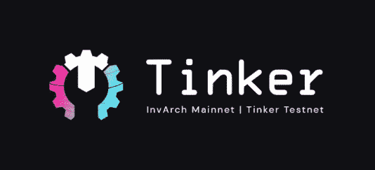
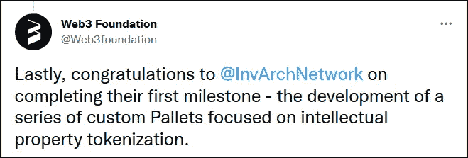
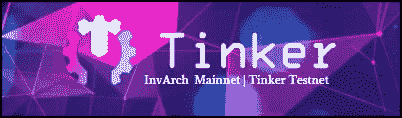
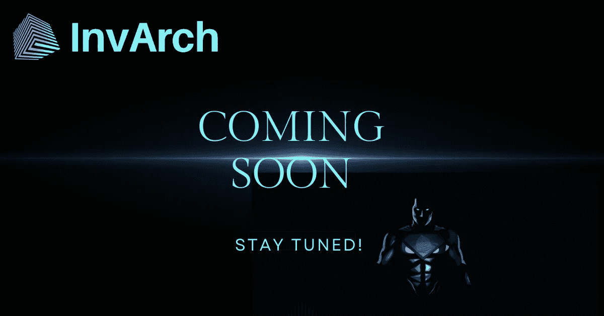

# 因瓦奇维护网|廷克测试网的发展现状

> 原文：<https://medium.com/coinmonks/the-current-status-of-development-for-the-invarch-mainnet-tinker-testnet-3910c74e18b1?source=collection_archive---------18----------------------->

Web3 的 IP 所有权、效用和跨链认证协议 InvArch

InvArch 为其在 2021 年 10 月获得 Web3 基金会的资助而感到自豪，该资助用于成功开发实现 IP 令牌化的定制基板托盘。

[Web3 Foundation Team](https://medium.com/u/d6954f1a46d9?source=post_page-----3910c74e18b1--------------------------------)

# ✅ =完成

**IPF** (知识产权文件)✅
**IPS** (知识产权集合)✅
**IPT** (知识产权令牌)✅
在该协议的基本架构中，InvArch 利用区块链技术允许个人将其知识产权(IP)标记化并存储为知识产权文件(IPF)，将 IPF 组合成称为 IP 集合的集合，并利用与 IP 集合挂钩的可编程 IP 令牌。

**SmartIP** (知识产权智能合约)✅
知识产权文件(IP 文件)可以在 InvArch 上存储满足预定条件时运行的程序。它们可以用于简化各方之间的无信任跟进，以便所有参与者可以立即确定结果，而没有任何第三方的参与或时间损失。
为了说明这一点，以下是联合创始人兼高级 Rust 工程师 Gabriel Facco de Arruda 的一个示例，说明如何以及为什么创建智能知识产权合同:

> 爱丽丝需要资金来建造她的时间机器，鲍勃提供了她需要的钱，并要求 10%的知识产权。她创建了一个 SmartIP，并向 Bob 发送了 10%的 IP 令牌。现在知识产权归账户集体所有；鲍勃拥有 10%的知识产权，爱丽丝拥有 90%。

这个例子揭示了 InvArch 协议的伟大之处，有了它，任何东西都可以成为 DAO(去中心化自治组织)。

**IP 托盘** ✅
团队已经成功完成了真正可组合的 IP 集和 IP 文件的开发！这意味着用户可以自由地添加和删除任何变化的 IP 文件，甚至其他 IP 集合！这是因瓦奇副链的核心基础，并允许因瓦奇旨在向世界提供的自由发展和创新。

# 🆔=开发中

IP 副本是 Tinker Testnet 发布前最后需要完成的功能。

**IP 副本**🆔
IP 副本功能允许复制 IP 集，并将 IP 文件无缝、可互换地放置在不同的 IP 集中。该团队一直专注于使用 Git 和 GitHub 等应用程序镜像文件功能，这是 IP 资产架构背后的一大灵感。InvArch 试图在文件之间反映这种相同的可组合性和功能。

# 修补测试网🆔

向前看，有时候最好的结果需要时间；然而，InvArch 计划很快发布其第一个名为 Tinker 的测试网。最终目标是有一天 Tinker 可以作为一个永久的非激励测试网，模拟或具有中继链连接和与一个或多个其他连接的测试副链通信的能力。Testnet 虽然因为团队开发新功能而落后了几周，但它 100%会在 2022 年第一季度到来。

**多签名(Multisig)** | Multisig 托盘—投票用 IPT🆔
Multisig 通过要求一个以上的密钥来授权交易，增加了一层安全性。通过 InvArch，不同的用户可以将 IPTs 的百分比与 IPS 挂钩，并且需要超过 50%的所有权或 Multisig 来授权更改。

**积云**(基质的链状骨架)🆔Cumulus 是对 Substrate 的扩展，它使得任何基于 Substrate 构建的运行时都很容易成为兼容 Polkadot 的 parachain。
积云共识是底物的共识引擎，遵循 Polkadot 中继链(即副链)。这在内部运行一个 Polkadot 节点，并指示客户端和同步算法要遵循、完成和处理哪个链是正确的。

随着 Testnet 的推出，团队将会把注意力转移到其他特性上，并发布一些非常强大的 alpha 版本，事情将会变得非常有趣！在已知的情况下，以下重要功能仍有待实现:

## 知识产权保护(知识产权保护)

IP 赌注是一种通过分配赌注奖励和网络费用来促进发展的方法。IP 赌注是将 IP 集合赌注或提交给区块链，以便参与以下提到的机制之一:
***- IP 集合引导/ IP 引导*** IP 引导是链上赌注的常见手段，其中用户/提名者选择将他们的风险持有物赌注到 IP 集合，这在所述 IP 集合和整理者之间细分风险赌注回报。
这种标记方法是为不希望牺牲其 IP 集的任何 IP 令牌(IP)的白名单项目设计的。
***——IPT 农业***
作为 IP 自举的替代方案，也是建立 IP 集合的 IPTs 流动性和分配的一种方式。用户将能够选择将他们的赌注奖励的一部分转移到 IP 集合，以换取该 IP 集合的 IPTs 的一部分。
***- IP 集合捐赠*** InvArch 可以具有向项目捐赠赌注奖励的能力，潜在地具有减少参与者在他们各自的物理和法律领域中的应纳税负担的能力。

## IPVM(知识产权虚拟机)

将构建一个知识产权虚拟机，作为智能 IP 合同执行和可组合性测试的不可信环境。

## 跨链认证(XCA)和跨共识消息传递(XCM)

XCA 是一种跨链协议，用于索引、引用和验证不可替换的数字资产，并保护它们免受未经授权的复制、拷贝或任何其他访问。

XCM 是共识系统之间的数据交叉共识通信的格式，可以在链、智能合约、托盘、桥和分片飞地之间进行。

我们的目标是在所有 Web3 InvArch 中建立一个协议，为每个文件创建一系列基于哈希的标识符，例如 CID 哈希和 sim 哈希，为每个文件创建一个真实的、自动的、不可信的数字指纹。指纹将被索引并相互交叉引用，而无需应用程序用户的太多通知。大约 6 到 12 秒后，文件自动更新为“已验证”状态或“已标记”状态(尽管对于其他用例及实例存在其他状态)。最后，所有未经许可而被标记、复制或使用的文件都自动失效。在这个世界里，开源知识产权和社交协作可以携手共存，而没有信任的负担。这就是任务。

## GitArch 项目

关于 GitArch 项目还没有透露太多信息。这个团队一直在幕后工作。这个中间件实现了 InvArch 协议，创建了一个分散的 Git 存储库，简化了代码的认证、许可和管理。我们唯一知道的是，持有并下注少量的$VARCH 将解锁特殊的高级功能和实用特性。

# 结论

因瓦奇公司通过其独特的 IP、NFT、DAO 和波尔卡多特·XCM 技术，正在高速推进区块链空间的革命。该项目将带来全新的用例，如果没有 InvArch 提供的基本技术，这些用例目前是不可能实现的。这个新的功能世界和许多潜在的实用程序会淹没用户，但是团队知道一次实现一个是更明智的。团队和社区很高兴能在 Tinker Testnet 中看到这些迷人的技术。我特别想看看团队是否会为与 InvArch 链的交互带来直观、干净、有吸引力的 UI/UX 体验。

访问因瓦赫官网:
[[]T2 网站](https://invarch.network/)][[推特 ][T10 不和](https://discord.gg/J5Qwcb7tbN)][[亚社会 ][中等 ][**电报**][git hubT28][]](https://github.com/Invarch)

> *加入 Coinmonks* [*电报频道*](https://t.me/coincodecap) *和* [*Youtube 频道*](https://www.youtube.com/c/coinmonks/videos) *了解密码交易和投资*

# 此外，请阅读

*   [it get Review](https://coincodecap.com/bitget-review)|[Gemini vs BlockFi](https://coincodecap.com/gemini-vs-blockfi)cmd |[OKEx 期货交易](https://coincodecap.com/okex-futures-trading)
*   [AscendEx Staking](https://coincodecap.com/ascendex-staking)|[Bot Ocean Review](https://coincodecap.com/bot-ocean-review)|[最佳比特币钱包](https://coincodecap.com/bitcoin-wallets-india)
*   [火币点评](https://coincodecap.com/huobi-review) | [奥克克斯保证金交易](https://coincodecap.com/okex-margin-trading) | [期货交易](https://coincodecap.com/futures-trading)
*   [电网交易机器人](https://coincodecap.com/grid-trading) | [Cryptohopper 审核](/coinmonks/cryptohopper-review-a388ff5bae88) | [Bexplus 审核](https://coincodecap.com/bexplus-review)
*   [7 个最佳零费用加密交易平台](https://coincodecap.com/zero-fee-crypto-exchanges)