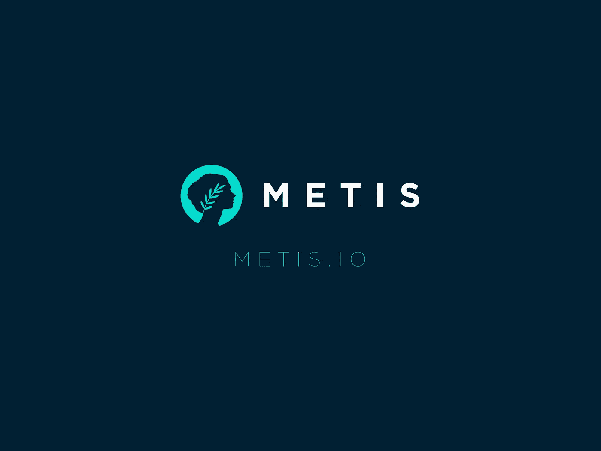
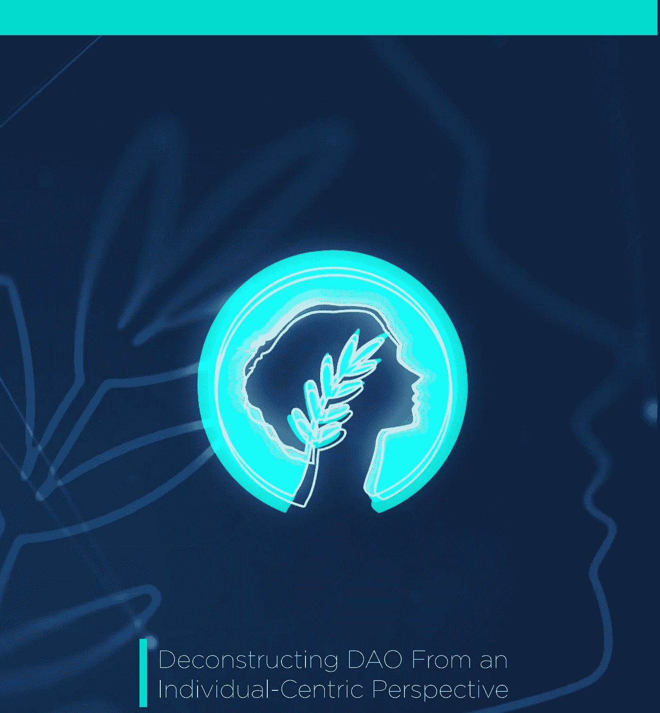
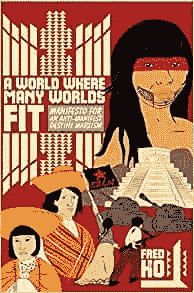

# 道教:DAC 经济

> 原文：<https://medium.com/coinmonks/the-daoism-dac-economy-ad41698e5c8d?source=collection_archive---------13----------------------->

*“道学是与‘道’和谐相处的实践。”*

DAOism

## **欢迎来到道教。就这样，年轻的学徒。**

# **道学#1: DAC 经济**

2021 年，在区块链科技引领的全球数字复兴中，许多 Dao 开始涌现。一种新的 DAO 设备已经从以太坊第二层网络 [MetisDAO](https://medium.com/u/bd38879543ea?source=post_page-----ad41698e5c8d--------------------------------) 中出现——一个分散的自治公司，或#DAC。在我们深入研究这种组织工作、业务和价值的新的革命性方式之前，让我们先熟悉一下 Metis。

## **梅蒂斯**

[*梅蒂斯*](https://twitter.com/MetisDAO) ，在希腊神话中，是宙斯的妻子[和智慧的象征](https://en.wikipedia.org/wiki/M%C3%A9tis)。第二层区块链 Metis 是一种乐观的汇总技术，目前是以太坊上最快和最便宜的 L2。交易只需花费几分钱，大约一秒钟就能完成。Metis 也是最分散化的 L2，并努力在技术和组织管理方面完全分散化。目前的 Metis token 持有者可以每周投票决定 MetisDAO 团队将合作和赞助哪些项目。

Metis 正在打造 Web3 的枢纽——DAC 经济。但要了解 DAC 和 DAC 经济，我们必须首先熟悉什么是 DAO。

## **什么是刀？**

A #DAO 是一个去中心化的自治组织。这意味着它没有中央权威——没有首席执行官。它由集体所有，在区块链上运营，在智能合同上有一套治理和投票规则。成员负责决策、贡献和组织管理。

***道组织实际上是分散自治的吗？***

一般来说，DAO 是使用区块链技术来运行其分散运营的盈利和非盈利组织的总称，尽管 Vitalik 最初分为[非盈利和盈利区块链实体，分别为 DAO 和 DAC](https://blog.ethereum.org/2014/05/06/daos-dacs-das-and-more-an-incomplete-terminology-guide/)。然而，使用治理令牌的 Dao 并没有真正去中心化，因为那些能够购买更多令牌的人可以获得更多的投票权，从而导致我们试图推翻的社会结构，即财阀统治，即通过积累金钱实现的权力集中。

另一方面，不根据拥有的治理令牌数量或成员加入 DAO 的时间分配更多投票权的 DAO 会产生投票权的*不公平平等*。但平等不总是公平的吗？不。(公平是公平的，但那是另一天的话题。)一个只有一个代币的全新会员，可以和一个拥有很多代币的 DAO 长期会员拥有一样多的投票权。

此外，治理令牌可以被丢弃并在市场上交易，不再代表个人的投票权、承诺或对 DAO 的贡献的价值。他们的个人记录(或价值)和投票权不会一直伴随着他们。因此，在当前的网络 3 经济中，去中心化受到财阀统治的威胁，并且在网络 3 经济中缺乏一个容纳个人价值的容器。

此外，管理和行政任务的自动化程度还不足以使 Dao 尽可能高效地运作。

这就是 MetisDAO 的 DAC 经济基础设施的用武之地。现在，我们来深入探讨一下 DAC。

## **什么是 DAC？**

分散自治公司是支付股息的道，而不是像非营利道那样的奖励。此外，DAC 是一个以个人为中心的实体，它可以自动化组织的日常运营，包括工资单、任务管理和其他不再需要由人类执行的管理职责。但是以个人为中心是什么意思呢？

***以个人为中心***

以个人为中心意味着组织及其标志不再是价值的容器，而是个人是价值的容器。以个人为中心的价值是相对于金钱的创造价值，金钱是一种虚构的零和价值，只由一小部分人积累。这种不平等的货币积累也导致了不平等的权力积累。集权是我们货币经济的产物。

[https://youtu.be/lkbYJ8mOjtA](https://youtu.be/lkbYJ8mOjtA)

为了克服金钱、财阀统治和中央集权的威胁，DAC 将在一个通过声誉力量追踪以个人为中心的价值的系统中运行。

***声誉力量***

RDAC 经济中的计算能力(RP)是一个生成的、非提取的*真实值*。在 DAC 中，个人贡献所创造的价值不仅属于 DAC，还通过 RP 机制属于个人，并记录在连续可编程 NFT 上。在这个 NFT 上记录一个人的个人属性和 RP 使它成为解锁生活在 [DAC 经济中的许多个人构成的世界之间合作的无限可能性的关键。](https://drive.google.com/file/d/1eS9Mj0CuVH_AcOXvuI39DygLGvnNsrJ6/view)

*“一个适合多个世界的世界。”*——萨帕塔主义者。

***信任***

RP 还允许一种可跟踪的、不变的信任机制*T21，这可以为合作提供更多的机会。*

在 DAC 中下注也是一种赢得声誉点数和增加会员在系统中的投票权的方法。它确保了如果成员损害了社区或违反了协作，他们会有所损失。

因此，RP 是一种获取真正价值的新兴手段*,这种价值是通过 DAC 内部的合作创造的，使我们超越了传统经济所依赖的有限、集中、零和价值的货币机制。*

## **DAC 经济**

最终，Metis 的愿景是建立一个公平、透明和通用的基础设施，使社区成员能够无忧无虑地在 Web3 中协作。从资金管理到治理和激励，一切都可以在一个发展援助委员会内以自主和自动化的方式处理。Metis 已经预览了其框架，以轻松部署 DAC，铸造 DAC 的令牌，并开始加入参与者和编排社区的日常运营。其完整的 DAC 经济基础设施即将正式发布。

> “是时候让区块链停止成为下一个版本的货币，而是超越货币成为真正价值的体现了。区块链是时候停止试图成为下一个网络(web 3)或多巴胺开发互联网，而是成为连接个人思想的真正互联网了。”— [发展援助委员会经济](https://medium.com/u/394520d3a5f7?source=post_page-----ad41698e5c8d--------------------------------)

如果这篇文章能帮助你了解更多关于 Web3 的知识，我希望你能分享并订阅它！

在这里和[推特上关注我吧！](https://twitter.com/rlntlss_robles)

 [## JavaScript 不可用。

### 编辑描述

twitter.com](https://twitter.com/rlntlss_robles) 

> 加入 Coinmonks [电报频道](https://t.me/coincodecap)和 [Youtube 频道](https://www.youtube.com/c/coinmonks/videos)了解加密交易和投资

# 另外，阅读

*   [有哪些交易信号？](https://coincodecap.com/trading-signal) | [Bitstamp vs 比特币基地](https://coincodecap.com/bitstamp-coinbase) | [买索拉纳](https://coincodecap.com/buy-solana)
*   [ProfitFarmers 点评](https://coincodecap.com/profitfarmers-review) | [如何使用 Cornix Trading Bot](https://coincodecap.com/cornix-trading-bot)
*   [十大最佳加密货币博客](https://coincodecap.com/best-cryptocurrency-blogs) | [YouHodler 评论](https://coincodecap.com/youhodler-review)
*   [my constant Review](https://coincodecap.com/myconstant-review)|[8 款最佳摇摆交易机器人](https://coincodecap.com/best-swing-trading-bots)
*   [MXC 交易所评论](/coinmonks/mxc-exchange-review-3af0ec1cba8c) | [Pionex vs 币安](https://coincodecap.com/pionex-vs-binance) | [Pionex 套利机器人](https://coincodecap.com/pionex-arbitrage-bot)