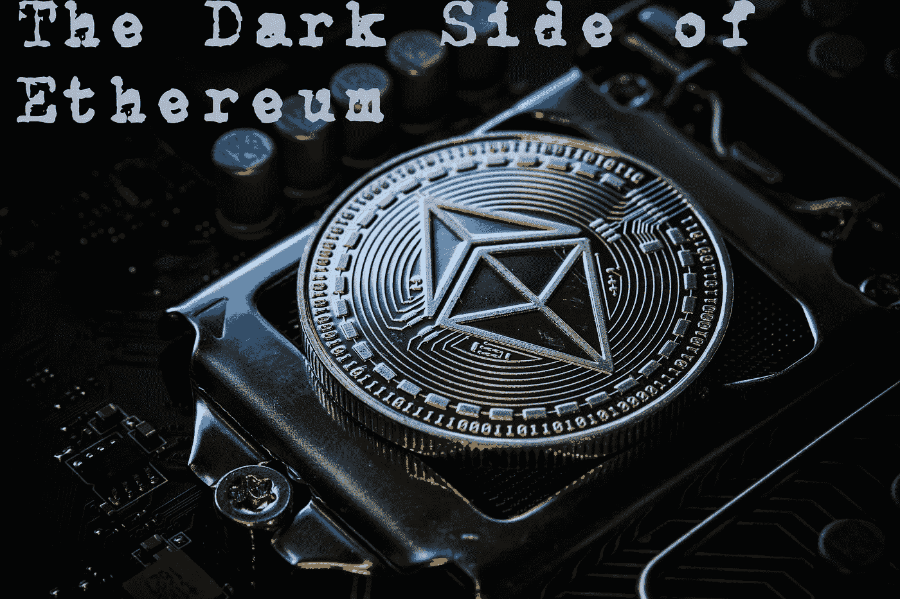

# 以太坊的黑暗面

> 原文：<https://medium.com/coinmonks/the-dark-side-of-ethereum-27bd639aca2a?source=collection_archive---------23----------------------->

*Cover Photo by Michael Förtsch on* [*Unsplash*](https://unsplash.com/photos/d9IlqdHF6kE)

市值排名第二的加密货币以太坊(Ethereum)也被认为是取代 BTC 领先地位的最大候选货币。

“翻转”是一个预期的结果，因为另一种加密货币将最终推翻比特币-BTC，成为市场领导者。这个术语也适用于我们前几年看到的散列率之战。