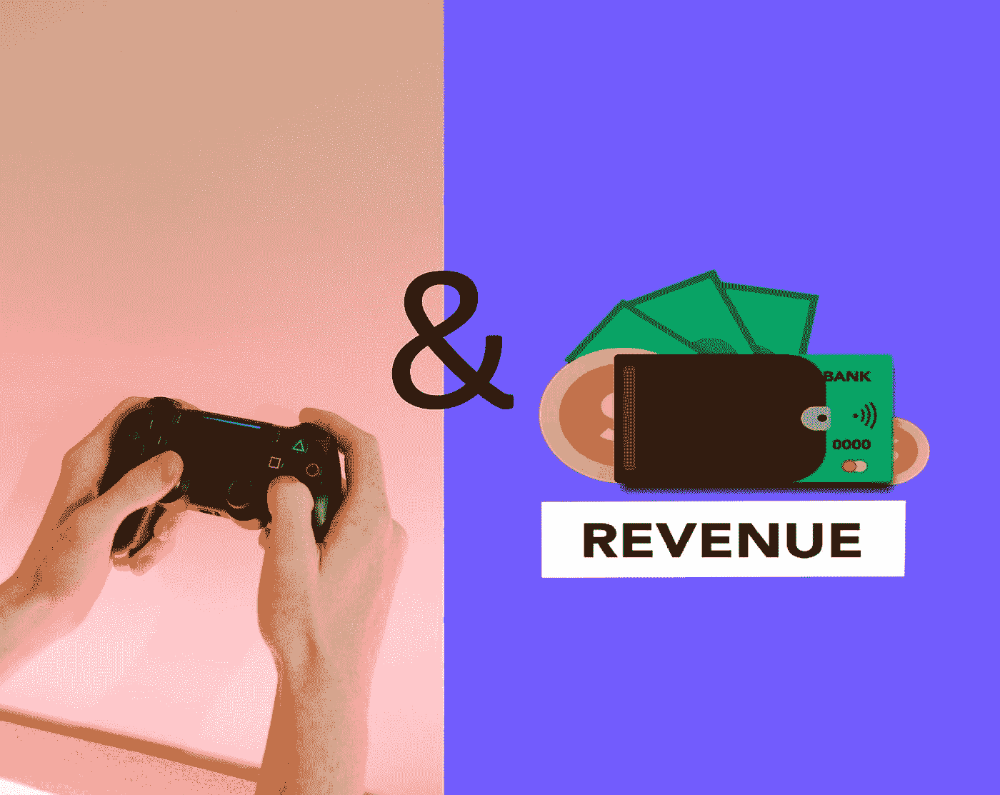
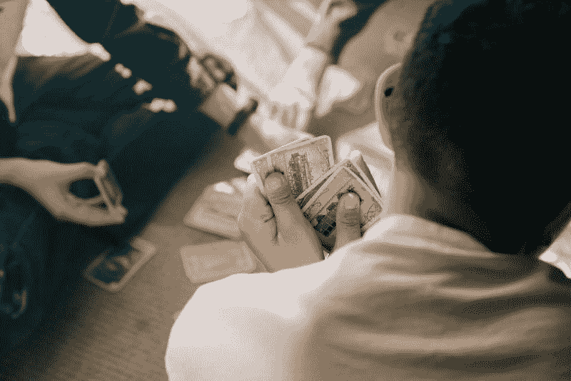
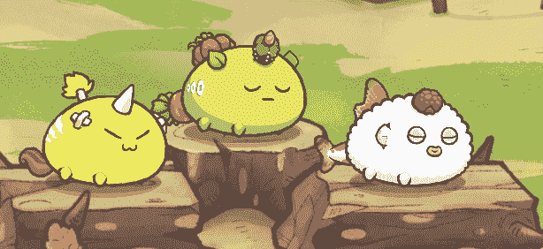

# 游戏的黑暗面，以赚取你需要知道的游戏

> 原文：<https://medium.com/coinmonks/the-dark-sides-of-play-to-earn-games-that-you-need-to-know-c40cec106ba6?source=collection_archive---------23----------------------->

# 介绍

玩这个游戏会成为我的全职收入。我不再需要忍受办公室政治和长时间的通勤。谋生的同时多花点时间在自己的爱好上？算我一个！

好吧，过了一段时间，没成。那是我的天真和愚蠢。这是一件好事，我没有完全同意这种想法。否则，事情会变得更糟。

但是，我知道我不是唯一这样想的人。所以今天，我将与你分享玩游戏赚钱的不愉快的一面。鉴于我作为游戏玩家的背景，特别是在区块链游戏，我有很多东西要分享。

澄清一下，我不是在抨击整个游戏赚钱社区。实际上我很感激，因为这个空间是我学习密码的垫脚石。把我的故事当成一个关于这个领域的冷静的谈话，而不是一个可能误导人的炒作。

这让你更加意识到危险。也帮助你在玩这些游戏时有一个更现实的心态。

说完了，我们走吧。

# 利润第一的思维模式

让我们面对现实吧。人们玩这些游戏的主要原因是因为钱。人们非常关注收入方面，而不是游戏。尤其是 Axie Infinity 的 SLP 价值在 2021 年 7 月达到 0.40 美元的历史高点。

这个 SLP 价值的顶峰对你们中的一些人来说可能并不算高。但是对于像东南亚这样的发展中国家来说，这是一件大事。生活在这些国家的人们可以支付食物、账单和学费等生活费用。

但平心而论，这是玩这些游戏的高尚理由。如果你能养活你的家人并支付账单，那么你就是黄金。这没什么不好。但是如果你变得贪婪并开始利用游戏呢？

# 人们过于得意忘形的例子

## **1。** [**赢交易**](https://www.youtube.com/watch?v=gWcjEkbqi_A)

*Credits to* [*MinimalSwag*](https://www.youtube.com/c/MinimalSwag) *for discovering this exploit | Photo by* [*cottonbro*](https://www.pexels.com/@cottonbro/) *from* [*Pexels*](https://www.pexels.com/)

这是关于与你的对手达成协议和公正交易的胜利。让对手不战而胜，你也一样。这样，由于你的高等级和获胜次数，你将获得更多奖励。我挠你的背，然后你挠我的背。

《被解放的神》开发团队对 win 交易进行了打击，封禁了很多账号。可能仍有一些人徘徊不去，但至少罪犯的数量减少了。也让他们知道这种行为是不能容忍的。

## **2。Bot 使用和漏洞利用**

有些人宁愿用机器人替他们玩游戏。他们会称之为被动收入，因为他们并没有真正参与这个游戏。业务流程自动化是一件好事。但是，这不是一个经营企业的例子。更像是有组织的犯罪。

同样，有些人不会报告游戏错误。他们宁愿利用漏洞，比其他玩家更有竞争优势。如果他们赢得更多，级别更高，那么他们将获得更好的奖励。更高的报酬意味着他们口袋里有更多的现金。

僵尸工具的使用和漏洞利用在游戏世界中并不新鲜。但在这种情况下，罪犯被怂恿去作弊，因为这涉及到巨大的金钱因素。

## **3。Ni No Kuni 原来是 Play-To-Earn**

你可能会认为这个游戏，Ni no Kuni，只是另一个 RPG 游戏。但事实证明，这也是一种“边玩边赚”的游戏。你知道这意味着什么吗？又一个赚大钱的机会。

这就是利润第一思维模式的一个例子。到目前为止，我还没有听说游戏中有任何实际的漏洞，但让我提出这个问题的是某个脸书邮报。

这个人担心人们会因为错误的原因玩这个游戏。在撰写本文时，NKA (Asterite)约为 9.61 美元，NKT (Territe)约为 2.06 美元。如果大多数玩家向 FUD 屈服，以最低价出售代币，价格可能会大幅下降。

如果出现这种情况，那么主要享受玩乐方面的人就要遭殃了。因为大多数玩家太专注于销售和盈利。

# 关键要点

*   玩赚游戏不是可持续的谋生方式
*   因为有金钱因素，作弊者更容易犯罪
*   玩赚游戏可以作为学习密码的垫脚石

# 结论

再一次，把我的文章看作是一个严肃的关于游戏赚钱的谈话。我非常感谢我的经理、朋友和公会会员，因为我能够学到这么多关于加密的知识。我也喜欢他们的陪伴。自从加入公会，我能够赚一些零花钱，并学会了如何使用密码。

我想过离开公会，不再玩 Axie，但是，我仍然可以玩这个游戏。还有我的其他游戏。所以，我会坚持使用棉质 Poofs(白色斑点)，可爱的 Shine(黄色斑点)，和旋转的 Roundball(绿色斑点)一会儿。

当工作开始堆积时，我很可能会辞职，这样我就可以专注于我的任务。

Here’s my Axie Team aka Team Veggie Butternut Fillet (Aqua, Beast, Plant)

但是在我们结束之前，这里有一个**免责声明:**

**记住，这不是财务建议。如果你对任何形式的投资感兴趣，你应该先找一个有执照的财务顾问，他会根据你的需求和风险偏好给你最好的建议。**

如果你想了解更多，这里有一些链接供你参考:

*   [Axie 通过](https://www.youtube.com/watch?v=pHyaFOwUna0)[gugu](https://www.youtube.com/c/GugusAxie)切换到玩赚游戏
*   [NFT 玩赚取游戏的问题](https://www.youtube.com/watch?v=WRHgbynpjeE)由 [Akshon 电子竞技](https://www.youtube.com/c/Akshonesports)
*   [阿谢的游戏赚钱的愿景被](https://www.bloomberg.com/news/features/2022-06-10/axie-infinity-axs-crypto-game-promised-nft-riches-gave-ruin?utm_campaign=mb&utm_medium=newsletter&utm_source=morning_brew)[彭博](https://www.bloomberg.com/asia)打破了

如果你觉得这篇文章内容丰富，那么请分享它。我也想知道你的想法，所以请在回复部分发表评论。希望你能从我的文章中学到一些有价值的东西。感谢您的阅读，并祝一切顺利。

> 加入 Coinmonks [电报频道](https://t.me/coincodecap)和 [Youtube 频道](https://www.youtube.com/c/coinmonks/videos)了解加密交易和投资

# 另外，阅读

*   [CoinDCX 评论](/coinmonks/coindcx-review-8444db3621a2) | [加密保证金交易交易所](https://coincodecap.com/crypto-margin-trading-exchanges)
*   [红狗赌场评论](https://coincodecap.com/red-dog-casino-review) | [Swyftx 评论](https://coincodecap.com/swyftx-review) | [CoinGate 评论](https://coincodecap.com/coingate-review)
*   [Bookmap 评论](https://coincodecap.com/bookmap-review-2021-best-trading-software) | [美国 5 大最佳加密交易所](https://coincodecap.com/crypto-exchange-usa)
*   [如何在 FTX 交易所交易期货](https://coincodecap.com/ftx-futures-trading) | [OKEx vs 币安](https://coincodecap.com/okex-vs-binance)
*   [CoinLoan 审核](https://coincodecap.com/coinloan-review) | [YouHodler 审核](/coinmonks/youhodler-4-easy-ways-to-make-money-98969b9689f2) | [BlockFi 审核](https://coincodecap.com/blockfi-review)