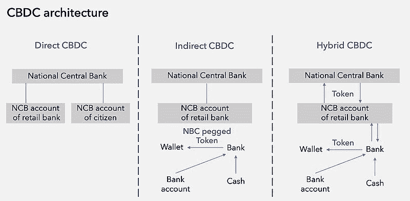
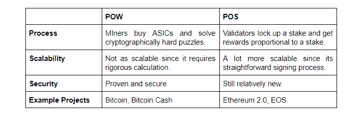
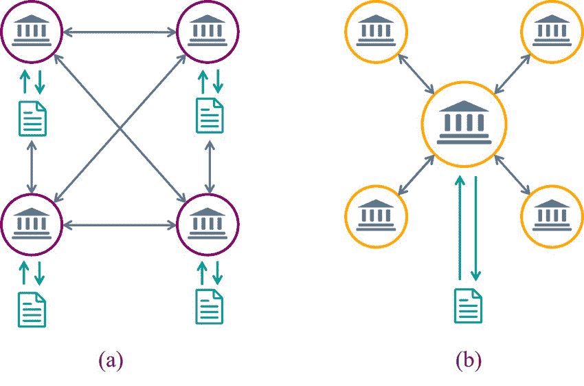

# 央行数字货币背后的黑暗真相

> 原文：<https://medium.com/coinmonks/the-dark-truth-behind-central-bank-digital-currencies-587edccaab3e?source=collection_archive---------20----------------------->

## 你们的政府几乎不加掩饰地试图复制中国的社会信用体系

2009 年 1 月 3 日，一位仅被称为[中本聪](https://www.wsj.com/articles/who-is-bitcoin-creator-satoshi-nakamoto-what-we-knowand-dont-know-11638020231)的神秘人物推出了世界上第一种加密货币[比特币](https://bitcoin.org/en/)。利用分布式账本技术(也称为区块链技术)，比特币向世界展示了去中心化货币的样子。

有了比特币，就不需要印刷机或铸造设备了。不需要央行。没有人操纵财政；随意改变利率，或者搞量化宽松。这是人民使用的货币。任何有电脑的人都可以从第一天开始挖掘它。

在比特币推出的十三年里，已经诞生了数十种其他加密货币。一些公司已经引入了创新的比特币核心理念，包括使用[智能合约](https://corpgov.law.harvard.edu/2018/05/26/an-introduction-to-smart-contracts-and-their-potential-and-inherent-limitations/)。这些自执行程序在满足特定条件时运行。他们已经将简单的加密货币转变为强大的平台，能够支持不可替代令牌(NFT)、去中心化金融(DeFi)应用等。

如今，加密货币行业正迅速成为世界上最大的行业之一。最近的估计是超过 3 万亿美元。

加密正在成为主流。许多政治领导人和政府不喜欢它。

**创建中央银行数字货币**

几代人以来，政府在货币的创造和分配中一直扮演着核心角色。他们铸造硬币并印刷钞票。他们通过监管和其他方式大量介入银行业。所以，毫不奇怪，他们不太乐意把所有的权力交给一个分散的自治组织，或者不交给任何人。

去中心化的趋势让世界各国政府开始考虑如何在不牺牲对货币政策控制的情况下进入数字货币领域。这种愿望是推动中央银行数字货币的重要驱动力。

虽然 CBD 与加密货币有一些共同之处，但它们不是一回事。因此，虽然它们可能比传统的纸币有一些优势，但它们也有一些相当严重的缺点。但为了理解 CBDCs 的好与坏，重要的是掌握它们到底是什么，它们如何工作，以及它们与比特币和以太坊等加密货币有何相似和不同。

**什么是央行数字货币？**

中央银行数字货币是由中央银行发行的数字货币，其价值与其来源国的法定货币挂钩。因此，以美国为基地的 CBDC 将会以美元发行，而以英国为基地的 T4 将会以英镑计价。正因为如此，中央银行不被视为传统法定货币的替代品。它们被设计成与它共存。

虽然创造数字货币看起来像是一个巨大的飞跃，但现实是大多数政府多年来一直在朝着这个方向前进。事实上，像批发中心这样的东西已经在世界上很多地方存在了。

批发 CBD 就像银行储备。中央银行向金融机构提供一个账户，金融机构可以通过多种方式使用该账户，包括存放资金和结算银行间的转账。这些央行可以利用政策工具来影响贷款，并通过这些储备发挥更大作用。

尽管批发 CBD 一直是全球央行的宝贵工具，但其使用仅限于政府和金融机构。另一方面，零售 CBD 将把这一概念带给普通市民。尽管对大多数人来说，实际上并不完全陌生。

随着技术的进步，政府、银行和其他金融机构用基于信用的数字记录余额和交易的系统补充了实物货币。今天，许多人已经几个月没有碰过纸币或硬币了。

借记卡和信用卡让这个世界为全面的数字货币做好了准备。而 CBDCs 是这一方向的最后一步。但是如果是这样的话，CBDCs 将如何工作呢？它们只不过是我们当前系统的延伸吗？或者还有其他原因吗？

CBDCs 将如何运作？

虽然 CBDC 没有规定的工作方式，但最有可能的是从中央银行自己创建的数字账本[开始。这是所有交易最终被记录的地方。从这个意义上说，它将像一个区块链，尽管它不会分散。相反，它将由中央银行操作和控制。](https://www.bankofengland.co.uk/paper/2020/central-bank-digital-currency-opportunities-challenges-and-design-discussion-paper)

支付接口提供商(pip)将包括开发了使用 API 与中央银行分类账接口的平台的公司。只有得到中央银行授权和监管的公司才能使用这个 API。因此，央行将完全控制平台如何访问央行账本，并向客户提供 CBDC。

Source: Petra Bernhardt, CashInfraPro 2021 [https://www.cashinfrapro.com/news/single-view/central-bank-digital-currencies](https://www.cashinfrapro.com/news/single-view/central-bank-digital-currencies)

一般来说，人们会像使用借记卡一样使用 CBDCs。正如我们已经指出的，CBDC 将以本国货币计价。因此，用户可以用 CBDC 像用信用卡或实物现金一样购物。

然而，当涉及到人们如何使用它们时，有一个特性可以在很大程度上使 CBDCs 与众不同。根据 CBDC 的设置，它可能会推出智能合约。这些可编程智能合同可以采取多种不同的形式，并可用于多种目的，从限制其用于不受欢迎的活动到自动收税。

【CBDCs 与加密货币有何不同？

乍一看，CBDCs 和加密货币似乎是一回事。毕竟，两者都是数字货币的形式，由记录在安全账本上的交易组成。两者都可以利用智能合约技术。

虽然 CBD 与加密货币有几个共同的核心概念，但它们不是一回事。

加密货币是使用分布式账本技术构建的，并依赖于一个分散的节点网络，每个节点相互制衡。由于这种设计，加密货币依赖于一种共识机制，如[工作证明](https://ethereum.org/en/developers/docs/consensus-mechanisms/pow/) (PoW)或[利益证明](https://ethereum.org/en/developers/docs/consensus-mechanisms/pos) (PoS)，以确保加密硬币的稳定性和安全性。

Source: [https://blockgeeks.com/guides/interoperability-proof-of-work-vs-proof-of-stake-deep-dive-analysis/](https://blockgeeks.com/guides/interoperability-proof-of-work-vs-proof-of-stake-deep-dive-analysis/)

大多数加密货币没有任何有形的东西支持，如黄金、白银，甚至是一个国家或机构的“完全信任和信用”。相反，比特币和其他加密货币的价值纯粹来自人们对它的需求。

所有这些都将加密货币与 CBD 区分开来。央行数字货币可以使用区块链技术或更传统的集中式数字账本。每个考虑 CBDC 的国家都必须考虑两者的优缺点，决定哪一个最符合他们的目标。

Implementation of; (a) Distributed Ledger Technology (DLT) and (b) Blockchain (Centralised Ledger). ‏‏‎ ‎‏‏‎ ‎‏‏‎ ‎‏‏‎ ‎‏‏‎ ‎‏‏‎ ‎Source: [https://www.researchgate.net/figure/Implementation-of-a-Distributed-Ledger-Technology-DLT-and-b-Blockchain_fig3_347920052](https://www.researchgate.net/figure/Implementation-of-a-Distributed-Ledger-Technology-DLT-and-b-Blockchain_fig3_347920052)

建立在集中解决方案上的 CBDC 不需要像加密货币这样的共识机制。中央银行可以简单地定义流通的数字硬币的数量。

此外，CBDCs 将像其他法定货币一样，由发行它们的国家提供支持。因此，除了简单的需求之外，他们还会有更多的理由。

**CBD cs 的优势**

CBDCs 将提供所有数字货币的许多[优势和好处](https://www.natlawreview.com/article/federal-reserve-examines-pros-and-cons-central-bank-digital-currency)。

他们会让人们更容易以方便的方式支付商品和服务。人们已经越来越少使用现金了。CBDCs 将为他们提供纸币和硬币的数字替代品。一些倡导者认为，这将为没有银行账户的人带来简化的金融服务，降低交易成本，从而提高金融包容性。显然，这是世界各国的一个主要目标，也是推动 CBDC 发展的一个广为人知的驱动因素。

CBDCs 的另一个吸引人的地方是他们可以简化跨境支付。这将降低成本，提高整体的互操作性，使其更容易参与我们世界的全球化市场。

但 CBDCs 的吸引力远不止于简化金融流程。它们还会让伪造和洗钱变得更加困难。智能合约将为各种创新打开大门。

不幸的是，许多这些令人兴奋的可能性可能很快变成可怕的极权主义危险，特别是如果数字货币掌握在一个暴虐的政府手中。

**CBD cs 的缺点**

CBD 的批评者认为，CBD 的建立和实施将导致弊大于利。这不仅仅是因为它们可能被政客滥用和操纵。

与所有数字货币一样，CBDCs 会带来网络罪犯和黑客。密码行业已经见证了无数黑客在区块链制造混乱的例子。虽然 CBDCs 可能有很高的安全性，但其性质使其成为世界各地独立或国家支持的犯罪分子的目标。因此，与纸币相比，它们在这方面处于劣势。

对于 CBD 可能带来的更广泛的变化也存在疑问。虽然分析师可以假设如果将 CBD 引入一个经济体会发生什么，但实际影响是未知的。这些数字货币会如何影响家庭支出？利率？银行准备金？投资？这些问题没有明确的答案。

除了这些问题，CBDC 将如何影响央行实施货币政策的能力也存在不确定性。利率变化对 CBDC 的影响会和现在一样吗？或者，它们会给央行影响通胀、贷款等的方式带来新的复杂因素吗？

许多隐私倡导者也[在 CBDCs 上拉响警报](https://www.ft.com/content/96b14a1d-c9ad-4c55-8494-741c9adf8220)。如果一家央行使用集中账本开发其数字货币，那么这家银行(因此也是政府)将能够获得有关个人支出和其他交易的详细信息。随着当局监控洗钱或恐怖融资等金融犯罪，对个人隐私的侵犯只会增加。

然而，对 CBDCs 最大的担忧是它们被用于类似于中国社会信用体系的潜力。在过去的十年里，中国实施了一个[社会排名系统](https://www.businessinsider.com/china-social-credit-system-punishments-and-rewards-explained-2018-4)，该系统监控公民的行为，根据他们的社会信用对他们进行排名，并做出相应的回应。失去社会信用的原因有很多，包括玩太多电子游戏和贷款拖欠。如果他们的社会信用分数降得太低，中国公民可能会面临一系列惩罚，从没收宠物到限制上网等等。

任何一个利用智能合同的 CBDC 都可能被[设定成几十种极权、压迫和控制的方式。它们可能被禁止用于被认为对社会有害或有其他问题的采购。一个人的全部存款可能会被冻结，而且没有追索权。换句话说，许多拟议中的 CBDCs 与中国的社会信用体系之间只有几步之遥。](https://www.federalreserve.gov/econres/notes/feds-notes/what-is-programmable-money-20210623.htm)

这甚至应该关系到 CBDC 最狂热的支持者。

**目前是否有国家实施 CBDCs？**

世界上已经有几十个国家在研究 CBDCs 的可能性，包括英国、印度、美国和加拿大。然而，只有九个国家和地区正式启动了社区发展中心:

*   安提瓜和巴布达
*   巴哈马群岛
*   多米尼克
*   格林纳达
*   蒙塞拉特
*   尼日利亚
*   圣基茨和尼维斯
*   圣文森特和格林纳丁斯
*   圣卢西亚岛

对于任何有兴趣了解世界各地的 CBD 国家的人来说，[CBDCTracker.org](https://cbdctracker.org/)提供了一个中心枢纽，展示每个国家与 CBDC 相关的努力的最新信息。

**CBD cs 的未来**

如果 CBDCs 的当前状态有任何迹象的话，它们的广泛采用几乎是不可避免的。国际货币基金组织大西洋理事会总裁克里斯塔丽娜·乔治娃最近写道:“货币的历史正在进入一个新的篇章。”

但是这个新的篇章还没有被书写。谈到 CBDCs，世界各国和金融机构仍有大量艰苦的工作要做。挑战和风险可能不是不可克服的，但它们是重大的。

**结论**

如果说过去的一个世纪向世界展示了什么的话，那就是不能相信政治家和政府会管好自己。腐败蔓延，并蔓延到机构的最高层。

当涉及隐私和货币控制问题时，公民不能简单地相信政客的话。这种情况因最近越来越多的虚假真相、误导和政治议程而加剧，这些在疫情随处可见，并受到其推动。

任何 CBDC 要真正发挥作用，发展中的 CBD 必须真诚努力，以保护人民免受政府干预的方式制定这些政策。在那之前，不惜一切代价挑战和抵制。

> *加入 Coinmonks* [*电报频道*](https://t.me/coincodecap) *和* [*Youtube 频道*](https://www.youtube.com/c/coinmonks/videos) *了解加密交易和投资*

# 另外，阅读

*   [有哪些交易信号？](https://coincodecap.com/trading-signal) | [Bitstamp vs 比特币基地](https://coincodecap.com/bitstamp-coinbase) | [买索拉纳](https://coincodecap.com/buy-solana)
*   [ProfitFarmers 回顾](https://coincodecap.com/profitfarmers-review) | [如何使用 Cornix Trading Bot](https://coincodecap.com/cornix-trading-bot)
*   [十大最佳加密货币博客](https://coincodecap.com/best-cryptocurrency-blogs) | [YouHodler 评论](https://coincodecap.com/youhodler-review)
*   [MyConstant 点评](https://coincodecap.com/myconstant-review) | [8 款最佳摇摆交易机器人](https://coincodecap.com/best-swing-trading-bots)
*   [MXC 交易所评论](/coinmonks/mxc-exchange-review-3af0ec1cba8c) | [Pionex vs 币安](https://coincodecap.com/pionex-vs-binance) | [Pionex 套利机器人](https://coincodecap.com/pionex-arbitrage-bot)