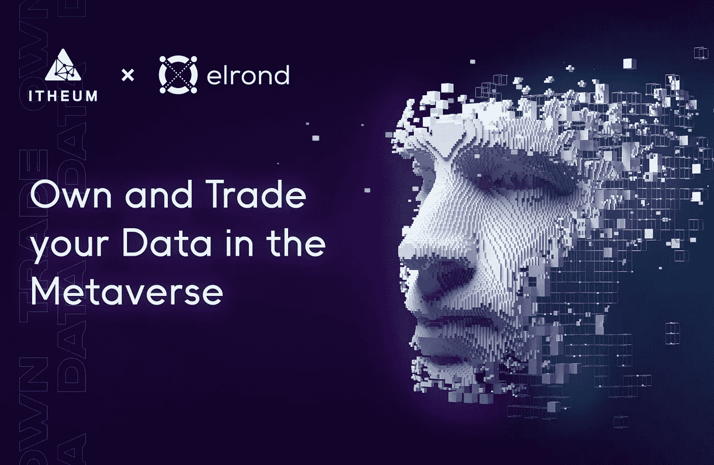

# Web3 的数据价值平台——Itheum

> 原文：<https://medium.com/coinmonks/the-data-value-platform-for-web3-itheum-e133e6df714d?source=collection_archive---------27----------------------->

**Launchpad 彩票代币**

**在元宇宙拥有和交易你的数据听起来怎么样？**

嗯，我们确信你已经听说过 Itheum 项目，所以今天之前没什么新的。因此，我们写这封信是为了向大家宣布，他们的本土 ITHEUM 令牌的 IDO 即将推出，并将在埃尔隆德的 Maiar Launchpad 上推出！

这是 Maiar Launchpad 的第二个项目。

代币销售将采用抽奖形式，在 2022 年 3 月 25 日**当天随机记录用户 EGLD 余额(仅限赌注或委托)。**

****这是这个启动板的规则:****

**他们将为每个通过 KYC 检查的 EGLD 地址计算 EGLD 授权或标记的数量。根据下注或委托的金额，用户将被分配到以下级别之一:**

****第 5 层** —对于 1 至 4 个 EGLD 赌注，您将有资格获得 1 张入场券**

****Tier number 4** —对于 5 至 24 EGLD 赌注，您将有资格获得两张入场券**

****第 3 层** —对于 25 到 99 EGLD 赌注，您将有资格获得 4 张入场券**

****Tier number 2** —下注 100 到 499 EGLD，您将有资格获得 8 张入场券**

****第 1 层** —下注 500 或以上的 EGLD，您将有资格获得 16 张入场券**

****每张彩票的价格:200 美元(以 EGLD 支付)**每一层都将给予用户购买最大数量彩票的选项。用户可以选择购买多少张彩票，但是他不能购买超过基于下注或委托的 EGLD 数量分配的等级所允许的最大数量。**

**每张票将花费 200 美元，以埃及镑支付；以 EGLD 表示的价格将在抽奖日期之前确定。每张中奖票将获得 5000 ITHEUM (1 ITHEUM ≈ 0.04 美元)。未中奖的彩票将能够在抽奖后索回所有购买彩票的资金。所以这是一个没有损失的彩票，因为没有人会输，但也不是所有人都会赢。**

**如果您希望参与，请确保您仔细遵循下面的时间表:**

*   **3 月 9 日开始登记& KYC**
*   **3 月 25 日，KYC 结束，将拍摄 EGLD 标桩快照**
*   **3 月 26 日，你可以购买彩票**
*   **3 月 28 日，他们将宣布获胜的门票**

****提醒！****

**这是一个没有损失的彩票，因为没有人会输，但也不是所有人都会赢。如果你决定投资这个项目，我们祝你好运。**

**如果你想了解更多关于这个项目的信息，你可以点击[这里](https://www.youtube.com/watch?v=Hk7aCzNWJg4)观看我们关于 Itheum 项目的视频。**

**感谢您的阅读，不要忘记:直到下一次，照顾好你的钱！**

> **加入 Coinmonks [电报频道](https://t.me/coincodecap)和 [Youtube 频道](https://www.youtube.com/c/coinmonks/videos)了解加密交易和投资**

# **另外，阅读**

*   **[40 个最佳电报频道](https://coincodecap.com/best-telegram-channels) | [喜美元评论](https://coincodecap.com/hi-dollar-review)**
*   **[折叠 App 审核](https://coincodecap.com/fold-app-review) | [StealthEX 审核](/coinmonks/stealthex-review-396c67309988) | [Stormgain 审核](https://coincodecap.com/stormgain-review)**
*   **[购买 PancakeSwap(蛋糕)](https://coincodecap.com/buy-pancakeswap) | [俱吠罗评论](/coinmonks/coinswitch-kuber-review-1a8dc5c7a739)**
*   **[瓦济里克斯 NFT 评论](https://coincodecap.com/wazirx-nft-review) | [比茨盖普 vs 皮奥克斯](https://coincodecap.com/bitsgap-vs-pionex) | [坦吉姆评论](https://coincodecap.com/tangem-wallet-review)**
*   **[如何使用 Solidity 在以太坊上创建 DApp？](https://coincodecap.com/create-a-dapp-on-ethereum-using-solidity)**