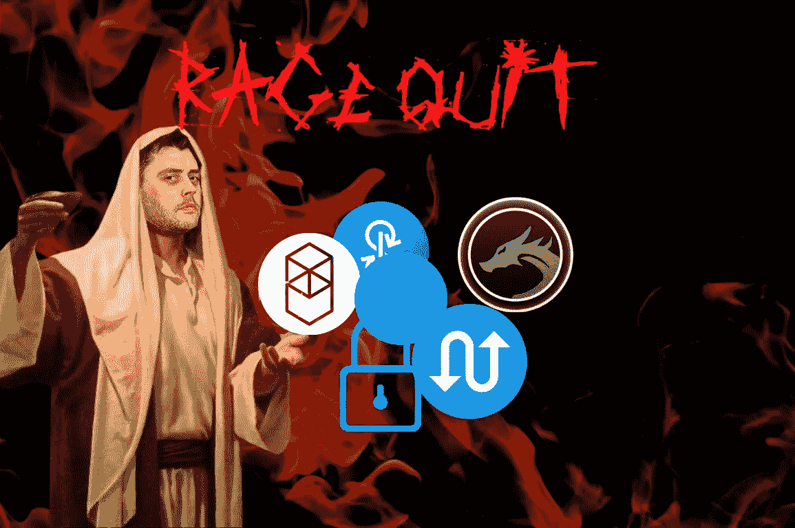

# 我们所知的 DeFi 之死

> 原文：<https://medium.com/coinmonks/the-death-of-defi-as-we-know-it-2042c34fab2c?source=collection_archive---------2----------------------->

## 去中心化金融的教父安德烈·克罗尼辞职了

# 发生了什么事？

如果 Fantom、Yearn、Solidly 和安德烈·克罗涅接触过的任何其他协议的投资者希望有一个安静、放松的周日，他们会非常失望。