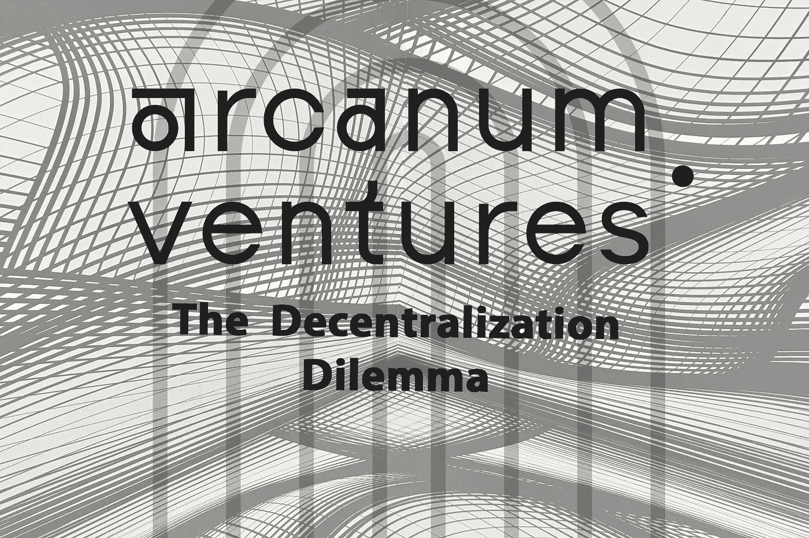

# 分权困境

> 原文：<https://medium.com/coinmonks/the-decentralization-dilemma-e6c5b0c06d1?source=collection_archive---------62----------------------->

尽管对区块链来说，权力下放是一个响亮的号召和信条，但定义权力下放并不像看起来那么容易。随着时间的推移，出现了各种不同的观点和定义，但是开始解决去中心化问题的一个安全的地方是从它的反义词集中开始。

无论是技术、政府、资源还是权力，一个千年来逐渐但似乎不可逆转的认识是，中央集权的实体本质上并不好，它们不能很好地改善多数人对少数人的利益。

去中心化的想法源于一个简单的想法，即任何事物都不是由一个单一的实体来组织、管理、开发或控制的。然而，细微差别和变化从这里开始。 [Vitalik Buterin 将权力下放分为三个独立的类别:](/@VitalikButerin/the-meaning-of-decentralization-a0c92b76a274)

1.  **架构分散**:这可以解释为网络/系统由多少个构建模块、单元或计算机组成，以及它(系统)可以容忍多少百分比的这些构建模块出现故障而不会陷入停顿。
2.  **政治分权**:上例中有多少个人或组织控制了积木盒子的口袋股。
3.  **逻辑分散**:系统的数据和接口结构的行为是像一个蜂巢还是像一个不灵活的单一实体。此外，如果我们将系统分成两部分，每一部分是否会继续作为一个独立的功能单元运行？

# 为了公平下放权力的重要性

开创质量更高的资本主义新时代是 Arcanum Ventures 的一个关键目标，而去中心化是帮助我们实现这一目标的主要因素。在区块链空间的边界之外，权力下放在重新定义可能性方面发挥着关键作用，并正在将世界人口的一部分从经济不平等的枷锁中解放出来。尽管仍处于理想框架的初级阶段，但毫无疑问，权力下放是创建更高效、更稳健的系统和治理的重要工具

# 墙外的权力下放

除了花言巧语，去中心化如何影响加密边界之外的产业，并解决这些传统空间内的棘手问题？

这里有几个例子…

## **弥合移动基础设施差距**

在基础设施脆弱、资源匮乏的发展中国家，从一个地方转移到另一个地方是一件非常麻烦的事情。通过权力下放，我们可以在移动服务提供商之间注入建设性合作的精神。在民主化和开放的移动生态系统下，分散化为通勤者提供了无缝的端到端旅程体验。如果一个移动提供商由于基础设施差距或其他特殊限制而无法到达，另一个提供商可以介入并为他们完成旅程。

## **内容创作者的权益**

集中式平台放弃内容创作者的所有权，保持决策能力和货币化自主权。社区已经看到了很多平台创始人可能改变其货币化政策条款或内容列表限制的例子。这在用户获取阶段尤其常见，在这一阶段，社区成员可以从更有利可图的模式中受益，一旦平台达到临界质量，这些模式随后会转变为托管人更有利可图的商业模式。分散系统使创作者能够保留对其内容的所有权，并且不受公司想继续经营和保持盈利的突发奇想的影响。

## **解决社会腐败**

2008 年，巨富集权金融机构的垮台给民众带来了难以言表的苦难，这是一个分水岭。金融业的中央集权制度是为顶层的少数人操纵的，而其余的人则是如此。金融各方面的权力下放将在金融业的每一项重大决策中促进一个更具包容性的体系。面对金融灾难，普通民众可能会得到他们需要的支持，而不是今天在权力走廊的少数人接受大规模救助和可笑的奖金。

## **年轻民主国家的选举**

发展中民主国家面临的最大挑战往往是公平透明的选举制度。中央集权的问题在这些过时的遗留系统中得到了体现，这些系统由不负责任的少数人控制，他们掌握着宣布胜利的权力。在有效的权力下放和其他辅助技术(如生物识别技术)的帮助下，发展中国家正在向安全、可验证、完全可信的选举制度迈进。

# 与我们的愿景保持一致

## **运输和身份**

协作，而不是聚合！这是新兴移动行业解决方案提供商 [bloXmove](https://bloxmove.com/) 的座右铭，这是一个建立在去中心化理念基础上的项目。利用区块链和分散标识符(DIDs)等新兴技术，bloXmove 正在创建一个电力和移动提供商的全球网络，合作促进更高效的移动产业，同时开发一个更清洁、更可持续的能源产业，能够使用电动汽车作为滚动电池来储存可再生能源。

## **储值酒店**

对于价值交换来说，比特币和[以太坊](https://ethereum.org/en/)是很好的例子，说明了为什么去中心化是健康和可信赖的经济结构的基本要素。由于不受任何政府或企业实体的控制或影响，比特币和以太坊一直被证明是可靠和不可腐蚀的价值储存手段——与货币持有者无关。

## **所有权和股权**

社区是权力下放成功的核心。一个恰当的例子是 21 世纪初维基百科对 Encarta。虽然 Encarta 最初是一个开发得更好的产品，但维基百科专注于社区管理的原则，并保证社区的积极参与，以推动其快速发展。同样，我们认为像 [OpenFabric.ai](https://www.openfabric.ai/) 和 [Ocean Protocol](https://oceanprotocol.com/) 这样的项目是社区外包创造和开发的好例子，而参与者在分散的协议中为他们的工作获得了公平的补偿。

# 这对我们意味着什么？

权力下放让我们能够释放财富创造的未开发的长度和气息。这也有助于平等分配所产生的财富。

在 Arcanum Ventures，我们相信一个由社区驱动的更公平的系统，权力下放有助于我们尽快实现这一目标。然而，这不是一个零和游戏。我们并不认为权力下放是解决所有经济、治理或社会问题的灵丹妙药。

权力下放并不是适用于所有商业模式、行业或系统的万能解决方案，但我们坚信，借助于某种程度的权力下放，每个系统都可以从更开放、更民主化和更透明的安排的内在好处中学习到一些东西。

要了解更多关于区块链行业的权力下放或其他话题，请务必关注下面链接的社交频道上的 Arcanum Ventures。

# 关于奥秘风险投资

Arcanum Ventures 是一家风险资本投资公司，区块链咨询服务和数字资产教育者。我们为区块链的初创企业提供精确的知识和顶级的专业建议。

Arcanum 为其合作伙伴揭开了区块链空间的神秘面纱，为我们的盟友提供了充满激情的、明智的、清晰的、真实的信息。我们揭开区块链、Web3 和其他新兴创新的神秘面纱，发掘其中的机遇。

**社交媒体链接:**

[**推特**](https://twitter.com/ArcanumVentures) **|** [**网站**](http://www.arcanum.ventures/homepage/) **|** [**电报社区**](https://t.me/Arcanumventures)**|**[**LinkedIn**](https://www.linkedin.com/company/arcanum-ventures/)

> 加入 Coinmonks [电报频道](https://t.me/coincodecap)和 [Youtube 频道](https://www.youtube.com/c/coinmonks/videos)了解加密交易和投资

# 另外，阅读

*   [8 大加密附属计划](https://coincodecap.com/crypto-affiliate-programs) | [eToro vs 比特币基地](https://coincodecap.com/etoro-vs-coinbase)
*   [最佳以太坊钱包](https://coincodecap.com/best-ethereum-wallets) | [电报上的加密货币机器人](https://coincodecap.com/telegram-crypto-bots)
*   [交易杠杆代币的最佳交易所](https://coincodecap.com/leveraged-token-exchanges) | [购买 Floki](https://coincodecap.com/buy-floki-inu-token)
*   [3Commas 对 Pionex 对 Cryptohopper](https://coincodecap.com/3commas-vs-pionex-vs-cryptohopper) | [Bingbon 评论](https://coincodecap.com/bingbon-review)
*   [加密复制交易平台](/coinmonks/top-10-crypto-copy-trading-platforms-for-beginners-d0c37c7d698c) | [如何在 WazirX 上购买比特币](/coinmonks/buy-bitcoin-on-wazirx-2d12b7989af1)
*   【Crypto.com 评论】|[【T4 评论】](/coinmonks/crypto-com-review-f143dca1f74c)