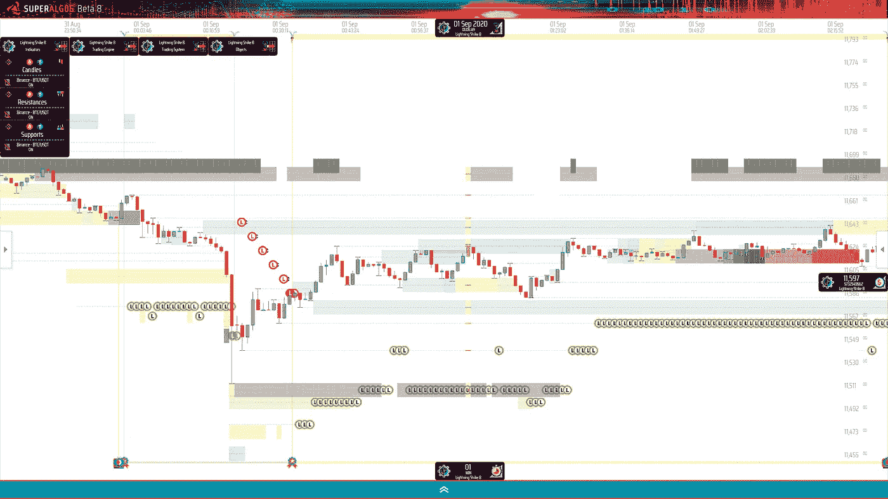
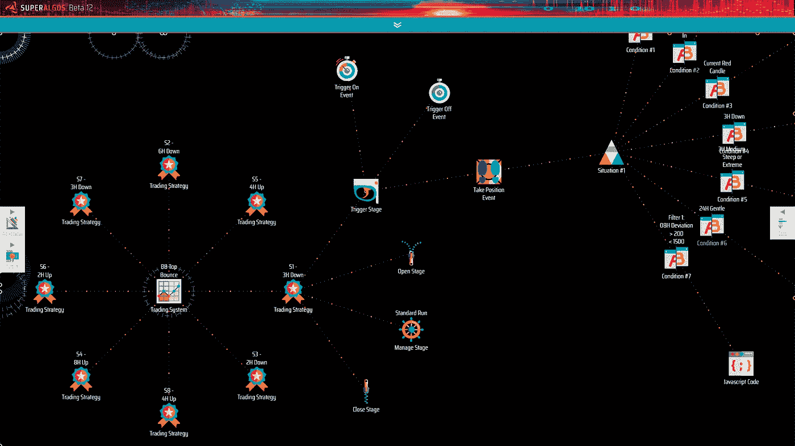

# 算法交易的分散协作方法

> 原文：<https://medium.com/coinmonks/the-decentralized-collaboration-approach-to-algorithmic-trading-1ec8aee53f1e?source=collection_archive---------3----------------------->

## 如何将交易智能众包到分散的交易组织中，以在交易公司的游戏中击败他们。

Superalgos charting space

*2017 年夏天，一小群 fintech 开发人员和亲交易员开始构建终极交易自动化平台，开源它，围绕它开发一个社区，并开始招募人才组建算法交易小组。文章展示了该平台的协作功能，并解释了多学科的专家如何整合技能和物质资源来建立分散的交易组织。*

[Superalgos 平台](https://superalgos.org/crypto-trading-bots-platform.shtml)是免费开源的，目前是 GitHub 搜索结果上[排名第一的“交易机器人”项目。它可能是设计、测试和部署复杂交易机器人的最强大和最灵活的工具包——或者这是经过验证的用户评论所建议的。](https://github.com/search?q=trading+bots)

这是一个面向算法交易员和数据科学家的技术平台。也就是说，可视化环境与原生交易系统设计框架的结合使得非开发人员也可以使用它。

使用 Superalgos 平台交易加密货币就像在三菱 MK-6 增强型移动平台上进入战场——詹姆斯·卡梅伦的未来装甲外骨骼准备战斗的愿景，如《阿凡达》(2009)中所见。

Source: http://toymovie.blogspot.com/2011/12/avata-mitsubishi-mk-6-amplified.html

事实上，该平台可以释放出压倒性的力量。

然而，交易本身是一个非常复杂的问题，交易自动化进一步增加了复杂性。雄心勃勃的交易操作需要许多不同的技能。

首先，您需要能够:

*   想出交易的点子；
*   了解现有指标或建立自己的技术研究；
*   设置并运行数据挖掘操作；
*   设计策略和交易系统；
*   设计执行算法；
*   对你的作品进行回溯测试和前瞻测试；
*   部署你的前几个策略。

尽管这份清单需要许多不同类型的技能，包括创造性的和技术性的，但大多数业余算法交易者已经准备好独自应对上述挑战。

> 然而，如果你对交易是认真的呢？如果你想超越爱好者的方法，追求真正的性能和一致性呢？

在这种情况下，您需要在列表中添加一些任务:

*   设计、测试和部署跨越多个市场的数十项战略；
*   运行机器学习算法来优化每个策略的参数；
*   在协调机器网络上扩大数据挖掘操作，以监控数十个市场，根据您的策略需要，在尽可能多的交易所用尽可能多的指标处理数据；
*   建立一个交易场，多台机器运行你的交易算法，配合你的数据挖掘设备；
*   建立投资组合管理机器人，向交易机器人提供上下文信息，以便它们可以在考虑账户整体状态的情况下做出决策；
*   尽一切努力保持一切正常运行。

> Superalgos 平台已经准备好做上面所有的事情，但是…你准备好了吗？花一分钟考虑以下问题…

*   你是一个经验丰富的交易者，能够想出所有正确的交易想法来测试吗？
*   你是一名数据科学家，准备好深入探索技术分析和量化交易空间了吗？
*   你是否精通策略测试，并且能够证明你没有过度适应数据集？
*   您是能够设计技术基础架构部署的系统管理员吗？
*   您是一名开发-运营工程师吗？您是否准备好保持整个运营正常运行，并在需要时提供 24/7 可用性和冗余？
*   你是一个准备调试任何可能在应用程序级别失败的开发人员吗？

> 如果你对以上任何一个问题的回答都是否定的，那么你需要与团队合作！

这样想吧…

如果你戴着你的 MK-6 AMP 出现在市场上，你肯定能够干掉那些做手工交易或玩愚蠢的即插即用机器人的傻瓜，他们是从一些随机的门户网站或在线服务上得到的。这些人会带着石头和棍子——也许是弓箭——去打仗，所以难怪他们很容易被杀死。

但是，当你遇到由交易公司经营的特种部队时，会发生什么呢？

公司从麻省理工学院招聘数十名数学和计算机科学博士来组建精英突击队。他们也给他们穿上了外骨骼服，并配备了重型火炮、海军、空军、后勤支持、一个满是久经沙场的将军的情况室，以及大量现金来应对可能出现的任何问题。

如果你孤军奋战，你就无法对抗公司！

让我尝试一个不那么戏剧性的足球类比…

独自玩市场就像开一个角球，然后一个人冲向头球。对美国人来说，这就像向前传球，然后去接球——同一个人。

> **这就是为什么我们从一开始就将无摩擦协作作为领先的设计原则来打造 Superalgos。我们是一群技能互补的朋友，我们想建立我们的交易大军！**

我们花了四年时间来构建允许这样做的平台，所以作为用户，不利用内置的协作功能是愚蠢的！

# 标准化

交易智能产生于利用多个复杂概念的相互作用:处理数据产生的信息，从信息中导出的模型，描述如何使用模型中的信息的策略，这些策略的执行，等等。

标准化交易情报资产的格式使资产可移植。便携式资产是可共享的。在 Superalgos 中，一切都是标准化的。

从以下内容开始:

*   从交易所提取的原始数据，作为 1 分钟 OHLCV 数据集；
*   所有支持的时间范围内的蜡烛线；
*   与所有时间范围内指标的已处理数据相对应的数据集；
*   从依赖关系、数据产品、图表上数据的可视化等方面界定指标。；
*   策略和交易系统的定义；
*   投资组合管理机器人和机器学习算法的定义；
*   机器网络和每个网络节点的定义；
*   各种参数、交易时段、数据任务等的定义。；

所有上述资产都是由用户以标准化格式生成的。这意味着这些资产是可移植的，因此可以由交易团队中的任何人部署在平台的任何实例上。

这是实现协同工作的第一步，允许多方处理多个资产，并在必要时与团队的其他成员共享它们。

# 粒度

Superalgos 利用可视化脚本环境来帮助分解复杂性，并以易于理解的方式将其可视化。软件基础设施有助于驾驭复杂的概念及其相互作用，它将复杂性分解成称为节点的小信息单元，并将它们排列成称为层次结构的更大的数据结构。

层次结构是一种数据结构，代表一个支配性的顶级概念，产生一个很长的节点链，通常有许多分支。系统管理不同类型的层次结构，每个层次结构都有特定的关注点。

例如，一个交易系统可能包含多个策略，每个策略有四个阶段，每个阶段都有自己的定义，包括条件、情况、公式等等。

The definition of a trading system and its strategies

这些定义中的每一个都是独立的数据结构。

这意味着用户不仅可以共享交易系统，还可以在任何适当的级别交换信息:公式、执行算法、订单定义、策略阶段或整个策略。

# 通信

标准化和精细化支持协同工作，因为作为一个团队玩市场的用户可以交换他们产生的每一条交易情报，并在他们的场所内使用其他人的工作。

虽然听起来很强大，但事实是这只是接下来的基础:Superalgos 平台客户端可以通过对等网络互连，以无摩擦的方式直接从客户端到客户端交换信息。

> 当前的实现使团队能够部署开放或封闭的 p2p 网络，在运行交易会话的同时将信息作为信号进行广播和消费。

我们来解开上面的说法。

当团队希望与被邀请加入该组的特定用户组交换信号时，他们会部署封闭网络。网络也可以是开放的，任何用户都可以接入网络来广播或消费信号。

此时可以广播的信息实际上是在运行交易会话时由系统管理的所有类型的数据结构，具有前面描述的相同粒度级别。为了保持网络流量的可控性，信号不携带实际数据。相反，它们以元数据为特征，指示信号代表什么类型的信息，数据存储在哪里，以及如何访问它。

为了冗余和弹性，数据可以分布在多个存储提供商之间。所有消息都经过加密签名，数据以加密方式存储。

# 模块性

在 Superalgos 中，设置和运行交易操作所涉及的每项功能都可以在多种配置中彼此独立运行。

例如，您可能有一台运行数据任务和交易任务的机器，并在一台本地机器上处理整个部署。或者，您可以选择让平台的一个实例控制跨多台机器甚至多个网络的大型数据挖掘操作，而平台的另一个实例运行一个交易场，消费别处产生的信息。

Definition of a small trading farm

平台的灵活模块化允许拥有不同的团队成员，每个成员都有特定的能力和职责。这也意味着，交易团队可以通过增加愿意贡献物质资源(如计算或数据存储设施)以及专业知识或工作的新员工来扩大运营规模。

# 不需要信任

Superalgos 是为无信任的协作而设计的。前提是你要能和其他用户搭档，即使你不是那么了解他们，或者完全信任他们。

> **其核心思想是，交易团队应该合作产生一个集体交易智能和一个共同的基础设施，但每个成员都应该能够在没有交易对手风险的情况下进行交易，并做出自己的决定。**

交易对手风险问题得到了解决，因为每个团队成员都可以在自己的场所运行他们的交易机器人，以团队在策略、数据等方面产生的交易智能为食。团队成员不需要从中央账户进行交易。他们都可以独立交易，控制资金，交换密钥，并最终控制他们的机器人的特定行为。

例如，交易团队可以建立一个公共的数据挖掘基础设施和一个交易场，交易场有运行每个策略所需的交易机器人。共享设置以信息、模型和策略的形式体现了团队的交易智慧。这个交易场然后可以将每个机器人的信号广播到团队的对等网络。然后，每个团队成员可以运行他们的交易机器人，监听网络中的信号，每个人都有自己的账户。此外，每个成员可以决定他们是否希望严格按照信号行事，或者他们是否希望引入额外的逻辑来定制他们的机器人的行为。

因为团队成员的职责可能被清楚地界定，所以团队核心成员产生的知识产权不需要与所有团队成员共享。例如，制定战略的核心成员可能希望尽可能地保守秘密。这是完全可能的，因为不是团队中的每个人都需要访问策略的实际定义。

当然，团队也可以在可信的环境中自由工作，共享尽可能多的敏感信息或知识产权。

# 变得巨大

到目前为止，我们讨论了 Superalgos 如何实现无摩擦协作。但最终目标是能够处理大规模的群体，从而最大限度地发挥集体智慧的潜力。

贸易合作的实际增长极限可能存在，也可能不存在。不难想象几十个专家在一个交易团队中一起工作。成百上千的人能积极地贡献出一个集体的交易智慧而不互相踩脚吗？几千怎么样？我们还不知道，但我们会找到答案的！

不管有多少人可能积极贡献，还有另一个有趣的途径值得探索。想象一个成功的分散交易组织，如前所述，具有良好和一致的性能指标。

> 如果团队决定在所有成员下订单后立即向未经许可的点对点网络广播交易信号，会发生什么？

花几分钟思考这个想法。

# 更多信息

*   了解更多关于 [Superalgos 项目和建立交易情报网络的信息](https://superalgos.org)。
*   [直接从资源库下载平台](https://github.com/Superalgos/Superalgos)。
*   加入社区或在[电报](https://t.me/superalgoscommunity)或[不和谐](https://www.reddit.com/r/Superalgos/)上提问！

> *加入 Coinmonks* [*电报频道*](https://t.me/coincodecap) *和* [*Youtube 频道*](https://www.youtube.com/c/coinmonks/videos) *了解加密交易和投资*

## 也阅读

 [## 我正在投资 Superalgos(SA)，这就是原因！

### 一个很好的提前进入的机会:公平的发布，一个完成的产品，和刚刚开始的市场营销！

medium.com](/coinmonks/im-investing-in-superalgos-sa-and-this-is-why-a2a729f07de6)  [## 加密交易机器人——19 款最佳免费加密交易机器人

### 2022 年币安、比特币基地、库币和其他密码交易所的最佳密码交易机器人。四进制，位间隙…

medium.com](/coinmonks/crypto-trading-bot-c2ffce8acb2a)  [## 杠杆代币[多头代币]终极指南

### 杠杆化令牌是具有杠杆化风险敞口的 ERC20 令牌，不考虑保证金、要求、管理…

medium.com](/coinmonks/leveraged-token-3f5257808b22)  [## 最佳加密交易所| 2022 年十大加密货币交易所| CoinCodeCap

### 哪一个是最好的加密交换？在本文中，我们将根据多种加密货币列出 10 大加密货币交易所

coincodecap.com](https://coincodecap.com/crypto-exchange)  [## 2022 年最佳加密交换平台| CoinCodeCap

### 随着时间的推移，我们大多数人将转向 dex 以获得更好的安全性和隐私。因此。在这里，我们将讨论…

coincodecap.com](https://coincodecap.com/best-swap-platforms)  [## 10 大最佳在线赌场|赢得并赢取免费 BTC 2022 | CoinCodeCap

### 接收、支付和赚取加密货币| |有各种各样的最佳在线赌场可供选择，有可能…

coincodecap.com](https://coincodecap.com/best-online-casinos)  [## 2021 年最佳加密借贷平台| 6 大比特币借贷平台

### 获得比特币和其他加密货币的最佳贷款利率

medium.com](/coinmonks/top-5-crypto-lending-platforms-in-2020-that-you-need-to-know-a1b675cec3fa)  [## 2021 年 6 大最佳硬件钱包|顶级加密硬件钱包[更新]

### 最好的加密货币硬件钱包是绝对必要的。我们将在 NGRAVE、Ledger Nano X 和…

medium.com](/coinmonks/the-best-cryptocurrency-hardware-wallets-of-2020-e28b1c124069)