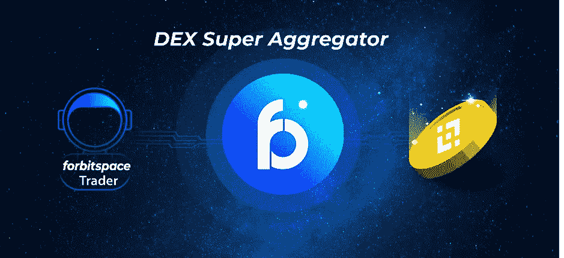
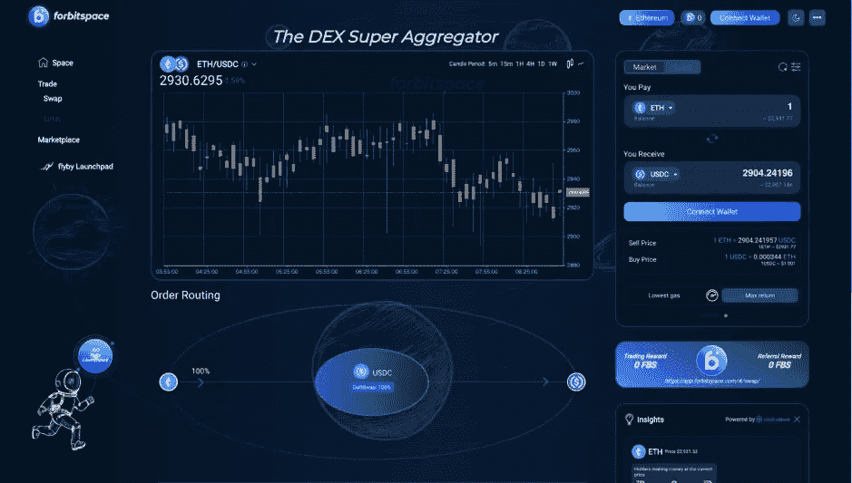
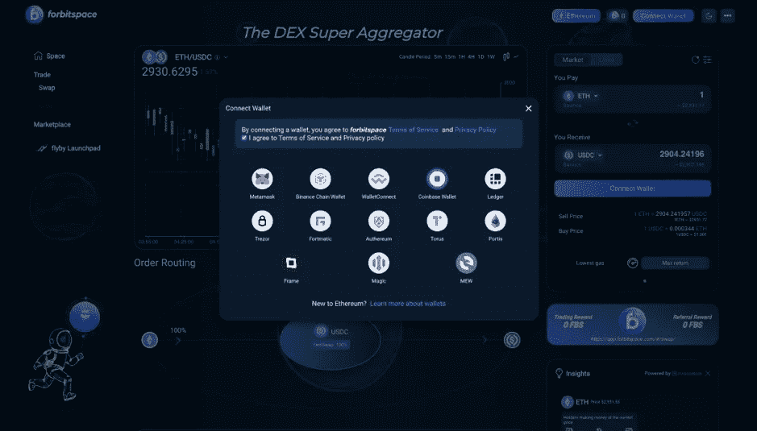
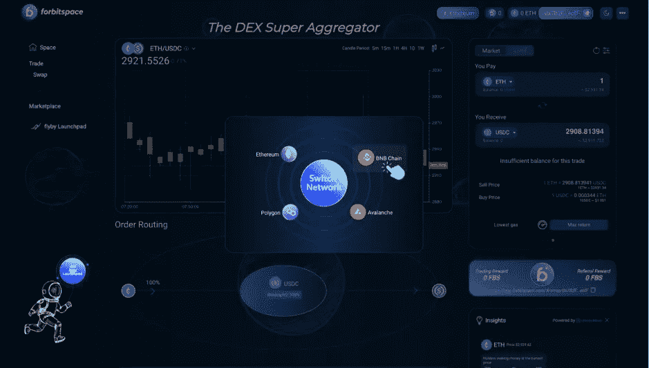
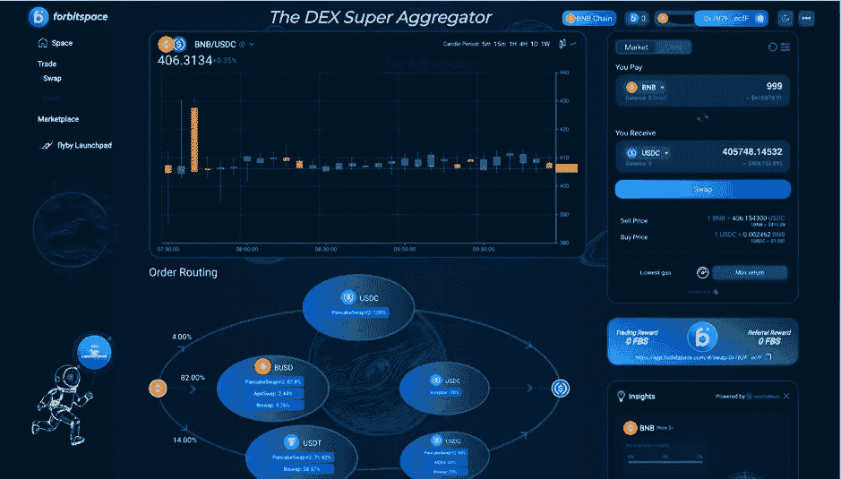

# 分散式 Exchange 超级聚合器现已在 BNB 链上运行

> 原文：<https://medium.com/coinmonks/the-decentralized-exchange-super-aggregator-is-now-live-on-bnb-chain-74724768d85b?source=collection_archive---------49----------------------->

区块链产业正在迅速扩张，几乎每天都有新的区块链项目诞生。事实上，最近和最快的区块链是对连锁店做得更好。

BNB 智能链正在经历大规模的发展，基于 BSC 开发的项目数量与日俱增。这是因为 BNB 连锁店拥有最低的燃气费和更快的速度，这两者都吸引了用户和项目。另一方面，Biggert BRC20 对 BNB 来说是一个艰难的竞争，因为它有最低的汽油费和最快的链条。

我们已经看到了 BSC 生态系统的快速发展和开发者兴趣的整体增长。对 BSC 感兴趣凭借 10 亿美元的增长基金，BSC 正以有史以来最快的速度在区块链增长，BSC 生态系统的使命是吸引下一个 10 亿用户使用 crypto 并加速其采用。使用数字资产和区块链技术，在最近的时间里，BSC 利率已经上升，没有停止的迹象。

伴随这一发展的是 dex 的发展。DEX(去中心化交易所)是一种在区块链平台上以毫无生气的方式构建和运行的交易货币。DEX 交易所允许在区块链网络上进行点对点的买卖交易，而无需通过任何中介。

其中之一就是 **forbitspace** 。集成两个 BSC 链的多链平台。forbitspace 是币安智能链正式推出的 DEX 聚合器协议。用户现在可以在 BNB 链上交易代币。使用 spacelight 智能订单路由算法，加密交易商可以挖掘深度流动性并获得更好的定价低成本&高效获得最大流动性并获得本地交易所的最佳价格，如 Sushi、Jetswap、WaultFinance、Ellipsis、Nerve、Beltfi、PantherSwap、BiSwap、Wbnb、BakerySwap、PancakeSwapV2、CoinSwap、Smoothy、DODOV2 等。

要在 BNB 链上使用 **forbitspace** ，下一步需要将默认 mainnet 改为 BNB 链网络。一旦您访问了 forbitspace，您将需要连接您的钱包才能开始在 forbitspace 上进行交易

**forbitspace** 目前支持加密市场上如此多的热门钱包，包括 Metamask、币安链钱包、比特币基地钱包、Wallet Connect 等。在这篇文章中，我将指导你如何使用 forbitspace 和 Metamask Wallet。

**第一步:访问比特空间**

“以太坊”按钮显示当前你正在使用的 mainnet。由于以太坊是访问 forbitspace 时的默认主网，所以当您想要更改主网时，可以点击此按钮切换到其他网络

**第二步:连接你的钱包**

您需要将您的兼容钱包连接到 **forbitspace** 上，这是通过 BNB 链开始使用 forbitspace 的第一步。点击界面右上角的“连接钱包”按钮

**第三步:更换 mainnet**

连接钱包后，您需要将默认网络切换到 BNB 链，才能在 BNB 链上使用**的比特空间**

**第四步:选择令牌并交换**

完成连接钱包后，您可以在“您支付”和“您收到”部分选择您想要交换的两个代币，开始在 **forbitspace** 上进行交易。确保令牌的顺序正确。

然后，再次仔细检查代币及其金额后，单击“交换”。

> 加入 Coinmonks [电报频道](https://t.me/coincodecap)和 [Youtube 频道](https://www.youtube.com/c/coinmonks/videos)了解加密交易和投资

# 另外，阅读

*   [如何在 FTX 交易所交易期货](https://coincodecap.com/ftx-futures-trading) | [OKEx vs 币安](https://coincodecap.com/okex-vs-binance)
*   [OKEx vs KuCoin](https://coincodecap.com/okex-kucoin) | [摄氏替代品](https://coincodecap.com/celsius-alternatives) | [如何购买 VeChain](https://coincodecap.com/buy-vechain)
*   [ProfitFarmers 回顾](https://coincodecap.com/profitfarmers-review) | [如何使用 Cornix Trading Bot](https://coincodecap.com/cornix-trading-bot)
*   [如何匿名购买比特币](https://coincodecap.com/buy-bitcoin-anonymously) | [比特币现金钱包](https://coincodecap.com/bitcoin-cash-wallets)
*   [瓦济里克斯 NFT 评论](https://coincodecap.com/wazirx-nft-review)|[Bitsgap vs Pionex](https://coincodecap.com/bitsgap-vs-pionex)|[坦吉姆评论](https://coincodecap.com/tangem-wallet-review)