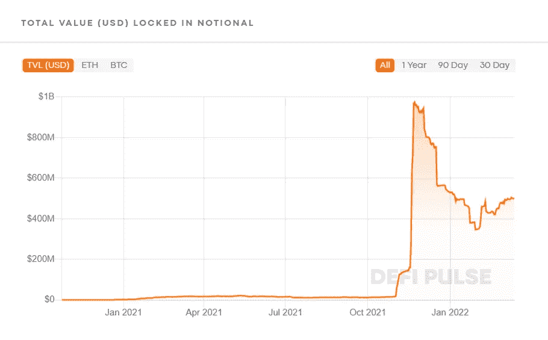

# 固定收益产品的定义

> 原文：<https://medium.com/coinmonks/the-defization-of-fixed-income-products-7e72ed4f57b1?source=collection_archive---------14----------------------->

几个世纪以来，借贷作为固定收益产品蓬勃发展。这给了贷款人在到期时赚取固定利息的保障，也给了借款人估计到期时对贷款人的净债务并做出相应计划的公平机会。根据 ICMA 的数据，这种潜在的简单性和对冲任何市场波动的能力已经推动全球固定收益市场截至 2020 年 8 月达到 128.3 万亿美元的巨大规模。这些固定收益产品/债券的功能要么是“零息债券”——交易价格远低于其面值，要么是“剥离债券”——其主要成分分为零息债券和一系列息票支付。

随着这个万亿美元市场对分散化和效率的需求不断增长，人们试图扰乱固定收益市场。这些包括创建无许可和无信任的固定收入 Defi 协议，如名义、收益、元素、Pendle 和 88mph。为了更好地理解它们，让我们深入研究这些有前途的项目。

**1。名义金融-** 名义金融是以太坊上的一个分散协议，促进固定利率、固定期限的加密资产借贷。它使用一种叫做 fCash 的新型金融工具。在借贷方面，fCash 在概念上类似于零息债券，因为它代表了持有人的正未来现金流，并给予他们以预定数量的稳定硬币赎回代币的权利，同时它在借款人方面产生了未来义务，表明债务和未来现金流出。

固定利率是在交易时确定的，但对每个用户来说并不相同。由于流动性池中 fCash 和 stablecoins 数量的波动，跟随 Alice 的贷方 Bob 可能收到不同的利率，例如 4.8%或 5.1%。对于参与者来说，这相当于固定但不同的利率。

Valuing fCash

“名义”的一个关键特征是它的交易 fCash，其流动性曲线是专门为低滑点交易定制的。名义上并不完全依赖于市场的无形之手，但也依赖于主动提供一种新的结构来保持流动性曲线的有效性，通过计算由治理确定的两个参数和由流动性提供者确定的一个参数的曲线。

Total Value Locked in Notional till date.

目前，名义银行是固定收益 DeFi 协议中的佼佼者，其锁定的总价值为 4.96 亿美元，其 747 个用户贡献的总贷款量为 3.74 亿美元。

谈到它的局限性，对于借款人来说，甚至在到期日之前就被清算的风险总是存在的。此外，提供的到期期限仅限于精心挑选的少数几个，并且不经过发现阶段，在发现阶段，市场可以自己决定什么是理想的到期期限。

**2。Yield Protocol-**Yield Protocol 是基于以太坊的有抵押的固定利率、固定期限借贷协议。Yield 推出了其 *fyTokens* (固定收益代币)，这是一种基于以太坊的 ERC 20 代币，可以在预定到期日后一对一赎回基础资产。例如，一个 fyDai 令牌在到期日后可兑换一个 Dai。

Source: Yield

fyTokens 不支付利息，而是以其赎回价值的折扣进行交易(就像零息债券一样)，到期时以其全部面值赎回即可获利。利率可以通过贴现值和基础资产到期时的价值之间的差额来计算。

Zero-Coupon Bond Price Calculation

对于贷款人来说，未来收益率通过以下公式计算:

收益率协议的一个重大成就是其专门的 AMM 方程，该方程解释了零息债券固有的向上价格漂移，允许有限合伙人在不使自己暴露于非永久性损失(IL)和持续套利的情况下存放资本。

目前，Yield 的 LTV 为 2080 万美元，总贷款额为 470 万美元。该平台的用户总数超过 4000 人，其中 335 人为借款人。

收益率协议的借款人也可能成为市场波动的牺牲品，在到期之前被清算，甚至容易受到 Oracle 漏洞的攻击，因为它们是建立在制造商 DAO 上的，而 DAO 依赖 Oracle 获得资产市场价格。最后，提供的到期期限仅限于少数几个，并且不经过发现阶段，在发现阶段，市场可以自己决定什么是理想的到期期限。

**3。Element Finance-** Element 是一个针对固定和可变收益市场的开源协议。与传统金融中的息票剥离工作方式非常相似，Element 将存款分为两个独立的可互换代币，即本金代币(PT)和收益代币(YT)，并通过在主要协议(如 earning)上下注和使用收益生成金库来实现资本化。想要将初始资本部署到其他地方的成熟投资者可以将他们的 PTs 折价出售给被动投资者，被动投资者可以获得固定的 APR，因为他们在到期时总是可以 1:1 的比例赎回他们的基础资产。

《元素》最显著的一面是可以自由地对自己的投资进行杠杆操作，并成倍增加收益。这是通过在其定制的 AMM(也称为元素池)上出售本金代币，并在持有收益代币的同时将获得的金额重新存入以再次出售本金代币来实现的。

TVL in Element Finance

目前，Element Finance 锁定的总价值为 1.54 亿美元，在所有固定收入协议中拥有最大的用户群(25964 人)。

Element Finance 还为其借款人带来类似的清算风险以及 Oracle 漏洞利用风险。此外，所提供的到期期限仅限于少数几个，并且不经过发现阶段，在发现阶段，市场可以自己决定什么是理想的到期期限。

**4。Pendle Finance-** Pendle 是一个建立在以太坊和雪崩区块链基础上的 DeFi 收益率交易协议，用户可以在该协议中获得收益率资产的固定收益率或复合收益率敞口。彭德尔引入了一种新型的 DeFi 衍生物:随时间衰减的代币。然而，基本方法非常类似于息票剥离，其中存款被分割为所有权令牌(OT)和随时间衰减的收益率令牌(YT)。固定收益可以通过在 Pendle AMM 上出售可变收益生成 YT 来提前获得。

Pendle AMM formula

该协议将**【时间】**添加到池的常数乘积不变公式 **(x.y=k)** 中，以在其 AMM 上提供更高效和准确的期货收益令牌交易。

彭德尔 TVL 在 2021 年 9 月达到 4700 万美元的峰值，此后一直稳步下降。目前，这个新协议锁定的总价值约为。一千一百万美元。

Pendle Finance 也有与其借款人相关的类似清算风险，以及协议的 Oracle 漏洞利用风险。此外，池的成熟期不经历发现阶段，而是由协议预设。

**5。88mph-** 88mph 是一个多链固定速率收益率生成协议。88 mph 的智能合约利用投资者的存款赚取利息，并在 Aave、Compound、Harvest 和向往等平台上耕作。提供给投资者的固定利率由这些协议中浮动利率的 30 天指数移动平均值(EMA)决定。然而，为了对冲波动率，88mph 不提供完整的 APY，而是提供浮动利率 EMA 的 50%作为固定利率。

$MPH Tokens Supply

88 英里/小时还通过额外奖励他们在公开市场上以 21.588 美元交易的英里/小时象征性奖励，激励贷款人将他们的资金存入固定利率 APY 池。

88 英里/小时智能合约的总保证金为 4270 万美元，而投资者在该平台上赚取的利息高达 140 万美元。

88 英里/小时的固定 apy 是 7 天均线的 50%,容易受到极端市场波动的影响，这在加密领域并不罕见。除此之外，该协议还有被 Oracle 利用的风险。

## 结论

虽然已经引入了一些固定收益产品作为 DeFi 的一部分，但这些协议尚未获得足够的流动性(在 TVL 不到 10 亿美元，或不到货币市场协议 TVL 的 5%)。这主要是由于他们在以太坊区块链上实现它们的困难，以及其他智能合同架构问题，如 AMM 低效、固定期限和滑动。与货币市场协议中超过 180 亿美元的贷款相比，这些协议中借入的贷款存量不到 4 亿美元(2%)。在固定利率贷款方面，这个领域是开放的，到目前为止还没有明确的赢家。

> 加入 Coinmonks [电报频道](https://t.me/coincodecap)和 [Youtube 频道](https://www.youtube.com/c/coinmonks/videos)了解加密交易和投资

# 另外，阅读

*   [比特币基地 vs 瓦济克斯](https://coincodecap.com/coinbase-vs-wazirx) | [比特鲁点评](https://coincodecap.com/bitrue-review) | [波洛涅克斯 vs 比特鲁](https://coincodecap.com/poloniex-vs-bittrex)
*   [德国最佳加密交易所](https://coincodecap.com/crypto-exchanges-in-germany) | [Arbitrum:第二层解决方案](https://coincodecap.com/arbitrum)
*   [币安交易机器人](/coinmonks/binance-trading-bots-d0d57bb62c4c) | [OKEx 评论](/coinmonks/okex-review-6b369304110f) | [Atani 评论](https://coincodecap.com/atani-review)
*   [最佳加密交易信号电报](/coinmonks/best-crypto-signals-telegram-5785cdbc4b2b) | [MoonXBT 评论](/coinmonks/moonxbt-review-6e4ab26d037)
*   [如何在 Bitbns 上购买柴犬(SHIB)币？](https://coincodecap.com/buy-shiba-bitbns) | [买弗洛基](https://coincodecap.com/buy-floki-inu-token)