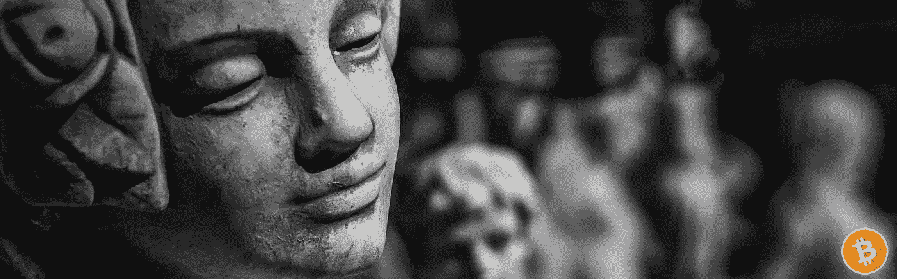

# 德根时代已经结束

> 原文：<https://medium.com/coinmonks/the-degen-era-has-ended-32f1b0e448ed?source=collection_archive---------40----------------------->

## 比特币最大化的案例

你可能注意到秘密世界崩溃了。

一个假定的“周期”的结束——这是密码影响者世界一致同意的。的确，下一次我们再次加油并继续抛物线将标志着进入一个新的**周期。**

**很有可能有一天,**比特币**会像往常一样(不是金融建议)将之前的历史高点远远甩在身后。**

**在那之前，我们必须等待。**

**等待事情自行解决。**

**因为这个周期，密码世界因为许多原因而崩溃——不仅整个市场遭受了两个主要世界实体想要自相残杀的宏观经济灾难，我们还在实验融资的过于复杂的技术上注定了数十亿美元的资本，这种技术被称为区块链技术兄弟。**

**这只是已经破裂的泡沫的开始。**

## **德根文化**

**诚然，有很多成功的高收益金融产品、NFT、即玩即赚计划。不可否认的利润…**

**不幸的是，事实证明他们只提供了一种*产品*，这种产品被宣传为类似比特币，不必要地使用了它的所有*部件，*这是技术和营销术语，但具有讽刺意味的是，它更类似于比特币被发明出来取代的产品。**

**虽然比特币被发明出来是为了抗脆弱、去中心化和不可改变— **这是它的主要价值主张**—*这些产品只是为 gainz bro 而发明的。***

**具有讽刺意味的是，那些将自己与比特币联系在一起的项目，结果并不比“传统机构”好多少。大多数情况下，他们是最差的。**

**他们制造了灾难，像 2008 年那样的市场崩溃，而比特币就是为了防止这些灾难而诞生的——一直以来，广告都在做比特币能做的事情，但做得更好。**

**一次又一次的崩溃，我们看到他们都失败了。**

**我们现在意识到，他们的营销宣传力度很大，吸引了大众，因为*与比特币的关联，以及比特币将*实际上*对整个金融行业的影响。***

**随着每一次崩溃，越来越有可能只有比特币会被广泛采用。**

## **再见，德根斯**

**从一个周期到下一个周期，我们看到了一个少数自恋者快速致富计划的时代，以及大众的经济灾难——建立在宣传分散和公平的货币精神的基础上。你知道，就像比特币。**

**讽刺的是。**

**营销术语— **去中心化、区块链、密码学、令牌经济学、无银行。****

**掩盖这些产品真实面目的行话和关键词:货币网络*属于*想要 ***创造*** ***货币的人。*****

**这些人寻求中央集权，同时以某种方式说服大众投资这种更好版本的比特币是值得的。**

**我们已经见证了骗子在参与他们的货币网络的其他人之上建立了一个巨大的开端。**

**然而，比特币之所以有用，仅仅是因为它不可改变的代币供应——结合了**和**所有的加密技术功能，这些项目跳过了后者。你不可能同时拥有一个安全的货币网络。**

**使用类似比特币的技术创建新的货币网络的事情是，除非协议与比特币的协议完全一样，否则创造者将在其余时间对所有参与者拥有固有的优势。**

**比特币的美妙之处在于，**网络**中没有任何人可以改变它。就算聪智回归了，没有网络的共识，他也做不了什么。**

**此外，在“区块链”初始化时，比特币网络中没有人获得大部分的代币。工作证明采矿*产生了*所有的供应。**

**虽然现货市场最终通过供求关系决定价格，但我们看到价格进一步上涨。**

**在比特币网络中，每个人都必须公平地玩，如果他们想玩的话。**

**原始的。**

## **生活是艰难的**

**在过去的这个周期中，当德根夫妇开始利用他们一生的积蓄来换取加密货币、投机性非金融债券和高收益金融产品时，事情开始失控。**

**这些货币网络变成了个人崇拜，比特币的含义——让每个人对固有的高风险资本努力有了绝对的信心。**

**更糟糕的是，在过去的这个周期里，比特币第一次尝到了真正的流行媒体曝光的滋味。到处都有新奇的密码。名人四处兜售项目。**

**不知何故，加密投机成了每个人的游戏，只要与比特币有关联——并且是一种“加密货币”——大的投资回报率就可以得到公众的信任。事实是，这些组织甚至比你所谓的“腐败金融机构”更不值得信任。**

**市场上充斥着大人物——对投资回报率和增长有很大的要求……完全忽略了他们想象中的货币网络的固有风险。**

**虽然德根夫妇*宣传*区块链的行话，但他们只是通过与*Crypto -*联系起来，掩盖了他们想象中的货币体系的内在脆弱性，这实际上意味着与*比特币的联系。*具体来说，比特币的**安全方面**。**

**但是*更快*和*更大的投资回报*，当然。**

**事实上，这些产品实际上是比特币的对立面，在内心深处，我们知道即使看起来有吸引力，它实际上也需要首先与比特币联系起来。**

## **比特币并不脆弱**

**尽管德根包包在短期内会产生高额利润，但你永远无法确定自己是会成为一个呼风唤雨的包包持有者，还是会留下一个毫无价值的包包。胜算对你不利。**

**投资*任何具有*瞬时价值*的*网络就是你被骗的原因。比特币根本不是这么回事，讽刺的是恰恰相反。**

*比特币的全部目的在于，积累比特币的人相信，它永远不会失败。*

*到目前为止，他们是对的。对那些能看见的人来说，看起来他们在未来是对的。*

*人们选择将价值储存在一个网络中，他们认为这个网络比传统的金融渠道——股票、债券、房地产和美元本身——更加安全可靠。这个网络将会比未来为我们准备的金融灾难更持久。*

*他们是 ***而不是*** 给人的印象是，他们拿着*彩票*快速致富——这些彩票是一些古怪的亿万富翁通过利用*区块链理工大学的兄弟发的。**

## *像专业人士一样使用比特币*

*当你*不能确定某件事的时候，你就不应该拿你的大量资金去冒险。或者任何与此相关的资本。即使当你对某事非常确定时，风险仍然需要降低。**

*现实地说，*大多数*明智的投资者只会有非常少的资金配置到比特币。通过这种方式，他们真的真的确定他们不会损失任何钱，同时还能在“T56 加密货币”中获得敞口。*

*这些投资者中的许多人增加了他们的配置，从未重新平衡他们的投资组合，比特币很快成为多元化投资组合中最受欢迎的资产。*

*让那个投资者成为你。*

## *新的周期*

*现在，在看到一批又一批被营销欺骗的包包持有者后，越来越多的人开始理解比特币的价值主张不是为了获得大收益而承担*风险，*而是参与一个比我们习惯的更好的金融系统。*

*由于德根不确定哪一种狗屎币可以让*购买 dip*——哪一种可以避免归零——比特币制造者只是专注于在被广泛采用之前积累足够的 Sats 所有这些狗屎币和腐败的金融机构最终知道自己的位置。*

*似乎是不可避免的。*

> *加入 Coinmonks [电报频道](https://t.me/coincodecap)和 [Youtube 频道](https://www.youtube.com/c/coinmonks/videos)了解加密交易和投资*

# *另外，阅读*

*   *[BigONE 交易所评论](/coinmonks/bigone-exchange-review-64705d85a1d4) | [电网交易机器人](https://coincodecap.com/grid-trading)*
*   *[氹欞侊贸易评论](https://coincodecap.com/anny-trade-review) | [CoinSpot 评论](https://coincodecap.com/coinspot-review)*
*   *[新加坡十大最佳加密交易所](https://coincodecap.com/crypto-exchange-in-singapore) | [购买 AXS](https://coincodecap.com/buy-axs-token)*
*   *[投资印度的最佳加密软件](https://coincodecap.com/best-crypto-to-invest-in-india-in-2021) | [WazirX P2P](https://coincodecap.com/wazirx-p2p)*
*   *[西班牙 5 大最佳文案交易平台](https://coincodecap.com/copy-trading-spain)*
*   *[Pionex 双投](https://coincodecap.com/pionex-dual-investment) | [AdvCash 审核](https://coincodecap.com/advcash-review) | [支持审核](https://coincodecap.com/uphold-review)*