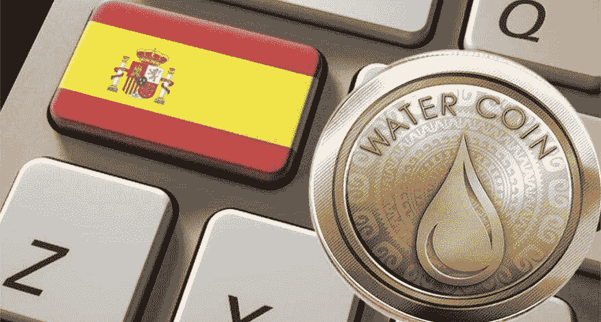

# 西班牙对加密货币的需求正在增长，你使用它们吗？

> 原文：<https://medium.com/coinmonks/the-demand-for-cryptocurrencies-is-growing-in-spain-do-you-use-them-a39598f7d4e3?source=collection_archive---------77----------------------->

比特币和以太坊引领了西班牙最受欢迎的加密货币，这为数字货币增加了新的追随者。

三十多年前，也就是 1998 年，它首次被描述。但直到 2009 年，一位名为中本聪(尽管这不是他的真名)的开发人员创造了第一种加密货币:比特币，从而催生了我们现在知道的更现代的加密货币概念，并在十年内飞速发展。

21 世纪的货币
互联网上的数字货币(Digital currency)或数字货币(digital money)是一种不同于真实货币的交易媒介，具有类似于实体货币的属性，允许即时交易和无边界的财产转移。它们可以用来购买实物商品和服务，但也可以局限于某些社区，如社交网络或在线游戏。

比特币等数字货币被称为“去中心化的数字货币”，这意味着没有一个中心点来控制货币供应。

西班牙对比特币日益增长的需求
AIMC，媒体研究协会，20 年来每年都在准备一份关于西班牙互联网使用情况的报告，使用该国“最大的样本”。根据 AIMC 报告，2021 年是西班牙加密货币的繁荣年:

12.3%的受访者在某个时候拥有一辆汽车，而 2020 年和 2019 年的比例分别为 8.5%和 7.5%。西班牙人对数字货币越来越感兴趣，他们主要选择两种最知名的在线货币:比特币(8.3%)和以太坊(5.6%)。

与其他选项相比，这两种加密货币在一年内增长了 2.6 个百分点，增幅为 4.7%。此外，最近一年拥有虚拟货币的人相当活跃:84.7%的人与虚拟货币进行了某种交易，这比 2020 年增加了 13 个百分点:

60.7%的人购买了加密货币
38.7%的人出售了加密货币
17%的人收到了加密货币
12.7%的人用加密货币进行了支付

另一方面，投资是绝大多数人(82.7%)持有它们的主要原因。我们会在 2023 年的 AIMC 报告中看到目前 2022 年加密货币同样的上升趋势吗？

*原载于***。**

> *加入 Coinmonks [电报频道](https://t.me/coincodecap)和 [Youtube 频道](https://www.youtube.com/c/coinmonks/videos)了解加密交易和投资*

# *另外，阅读*

*   *[3 商业评论](/coinmonks/3commas-review-an-excellent-crypto-trading-bot-2020-1313a58bec92) | [Pionex 评论](https://coincodecap.com/pionex-review-exchange-with-crypto-trading-bot) | [Coinrule 评论](/coinmonks/coinrule-review-2021-a-beginner-friendly-crypto-trading-bot-daf0504848ba)*
*   *[莱杰 vs n rave](/coinmonks/ledger-vs-ngrave-zero-7e40f0c1d694)|[莱杰 nano s vs x](/coinmonks/ledger-nano-s-vs-x-battery-hardware-price-storage-59a6663fe3b0) | [币安评论](/coinmonks/binance-review-ee10d3bf3b6e)*
*   *[Bybit Exchange 审查](/coinmonks/bybit-exchange-review-dbd570019b71) | [Bityard 审查](https://coincodecap.com/bityard-reivew) | [Jet-Bot 审查](https://coincodecap.com/jet-bot-review)*
*   *[3 commas vs crypto hopper](/coinmonks/3commas-vs-pionex-vs-cryptohopper-best-crypto-bot-6a98d2baa203)|[赚取加密利息](/coinmonks/earn-crypto-interest-b10b810fdda3)*
*   *最好的比特币[硬件钱包](/coinmonks/hardware-wallets-dfa1211730c6) | [BitBox02 回顾](/coinmonks/bitbox02-review-your-swiss-bitcoin-hardware-wallet-c36c88fff29)*