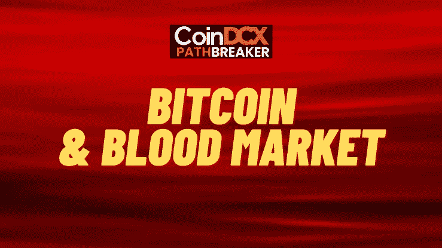
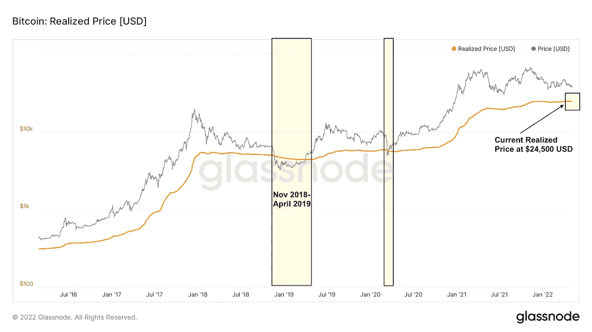
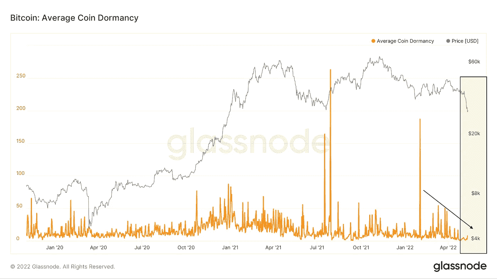
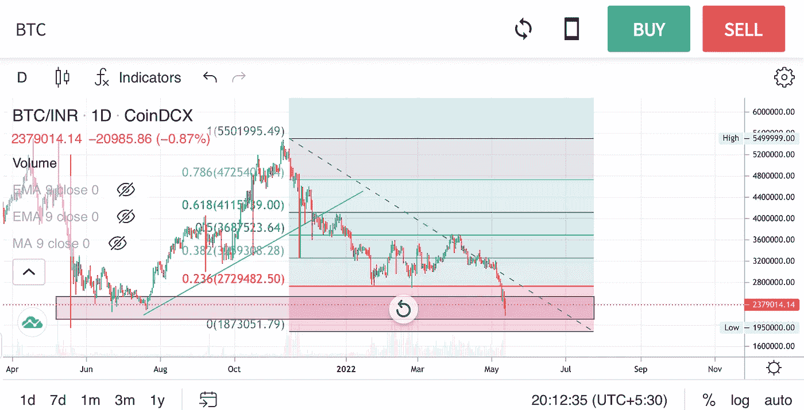
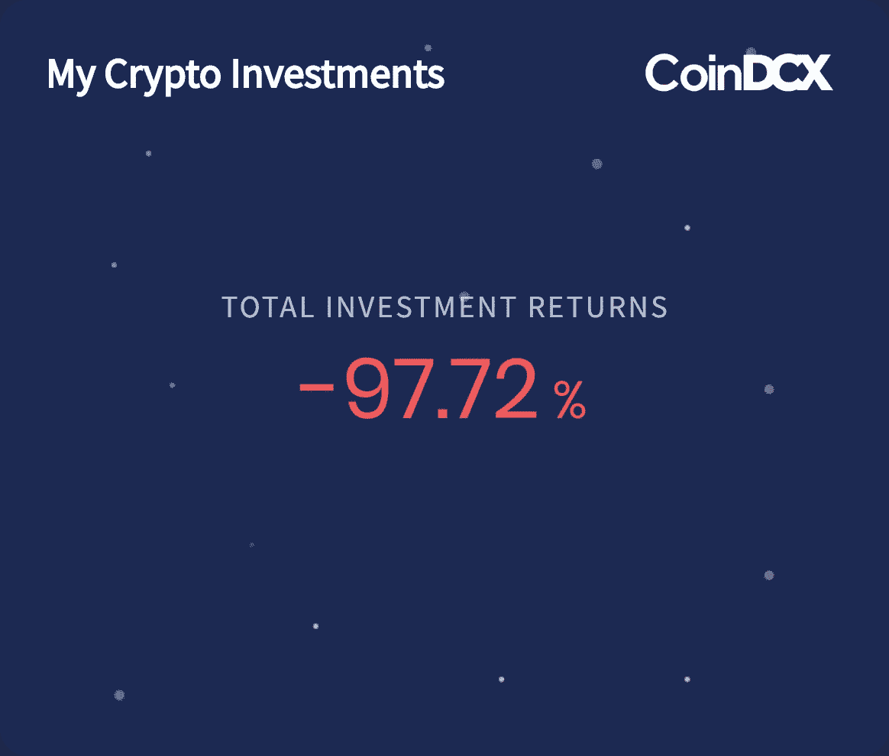
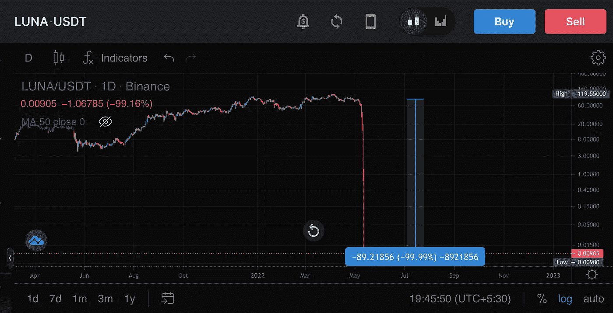
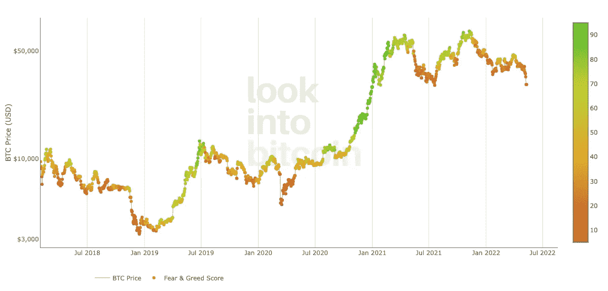
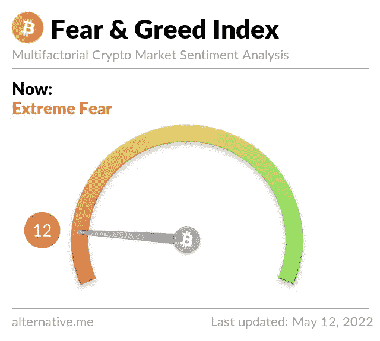
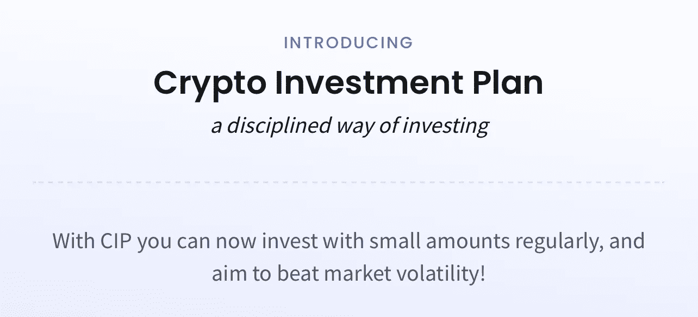

# 隐秘情感的毁灭- 2022

> 原文：<https://medium.com/coinmonks/the-destruction-of-crypto-sentiment-2022-5d1df128e591?source=collection_archive---------55----------------------->

# CoinDCXpathbreaker

密码市场正在见证毁灭。投资者情绪和投资组合创历史新低，而损失和精神崩溃创历史新高。

由于整个 Terra 的惨败，交易者失去了他们一生的积蓄&看起来已经没有什么可做的了。我现在不会进入理论或图表(因为每个图表看起来都一样，除了露娜)

## 通过连锁数据实现的价格

这里我们看到了 BTC 实现的价格。这是 BTC 交易的平均价格，也是观察长期底部的"**公平价值标准**。

目前实现的价格为 24500 美元。向该区域投降将标志着接近宏观图表上的潜在底部。

值得注意的是，2019 年我们在实现价格以下停留了 4 个多月，但从历史上看，低于实现价格的交易是长期买入的最佳时机。

## 链上休眠

有一些非常有趣的数据与 BTC 链分析。这个度量被称为链上休眠。

休眠仍然相当低，这意味着大部分出售是来自最近的买家，目前看来，长期持有人非常强劲。

这意味着，在目前的价格下，上述参与者没有投降的迹象。

## 理解最近偏差

一旦价格上涨，我们倾向于相信价格会继续上涨，反之亦然。

技术上来说，BTC 并没有收于每周的区间低点以下。没人买。要明白供给和情绪之间是反比关系。**高人气:低流动性**(没人卖，人们想成为潮流的一部分)——**低人气:高流动性**(人们卖)。

本地趋势明显是向下的，主要趋势向上(月图)比看跌更中性。

那些经历兴奋的人现在确实是熊，兴奋不会持续很长时间。我不排除多年熊市的可能性，但这些时刻通常是积累蓝筹股的好时机。聪明点，等待确认，未雨绸缪。

## 抽取和销毁

My current LUNA Investment 🤮

当你们中的许多人刚刚因其对 **$LUNA** 的敞口而面临巨大损失的时候，谈论**剧烈下跌**可能会非常令人沮丧，但如果我在艰难时期不谈论这一点，这在**绿色日子**将毫无意义。

LUNA/USDT

发生在 **$LUNA** 身上的事情发生得太快了，以一种无法预测的方式发生。每个人都认为它太大而不能倒

无论阴谋论是什么，大多数市场参与者，包括我自己，都不知道这种情况会发生，甚至可能发生。在我的交易旅程中，我经历过多次这样的事件，这就是为什么我每天都建议知道如何限制你的资本敞口。不要带着你 100%的资本和毕生积蓄去冒险。

作为交易者，你最重要的工作是管理风险。每天我都在想，如果整个密码市场崩溃会发生什么，我围绕这个想法建立了我的系统。我希望我的资本暴露在每个市场上最好的制度下，即使这样，我也知道我一直有多大的风险。

在牛市中孤注一掷可能会很好，但是最终人们会被抓住，因为他们不知道什么时候离开市场，因为他们的赌瘾不允许他们有耐心。

作为交易者，我们不是来尽快赚大钱的，因为这伴随着最大的风险。我们在这里是长期的，要接触最多的牛市，并在那些季节结束时离开。

是的，我们可能不会成为那些只下一次注就把 1000 美元变成 100 万美元的交易者，但请记住，那些展示这些动作的交易者是那些在**毁灭**中幸存下来的交易者，他们很可能会比他们赚到钱的速度更快地把钱还给市场。我们希望成为长期产生稳定收入的交易者。

## 恐惧和贪婪指数

恐惧情绪继续困扰着市场，随着价格在 **Terra** 系统崩溃中螺旋上升。不管比特币抛售背后的原因是什么，在建立任何新头寸时，都需要考虑风险因素。显然，目前极度恐惧的环境并不支持投机者的乐观情绪。

根据图表，在比特币的历史上，这种情绪很少比目前更糟糕。虽然沉浸在 10-12 点的极度悲观情绪中，但这有可能成为投降的远端，以及比特币市场似乎连续 6 个月的持续下跌。

随着波动因素的加剧，处于趋势错误一方的风险也在增加，面临亏损的可能性。然而，比特币目前所处的领域，历史上曾带来逆转。这个指数并不保证价格不能再低了。尽管如此，从历史上看，这种情绪最高涨的时候是比特币产生最佳购买机会的时候。

散户加密投资者的整体洗牌正在发生，这通常标志着更有利的长期买入机会。当然，这是过去几周和几个月图表中的主题。

正如过去多次讨论的那样，BTC 损失 32，000 美元是未来几天的死亡信号。这也导致了恐惧/贪婪指数——尽管该指数不是一个时间指标，像 RSI，随机 RSI，MACD，移动平均线交叉。

…

CIP on CoinDCX

在 [CoinDCX](https://coindcx.com/signup) 上注册一个账户，只需几个简单的步骤&立即开始使用**的加密投资计划**在[**CoinDCX**](https://medium.com/u/a30fa2b03c2f?source=post_page-----5d1df128e591--------------------------------)

CIP 将帮助你避免市场的噪音，并长期积累硬币，而不会因价格波动而遭受巨大打击🌝

*   投资计划起价低至₹200-₹5000
*   计划是每周，金额直接从主钱包中扣除
*   没有必要转换资金到 USDT 或其他硬币