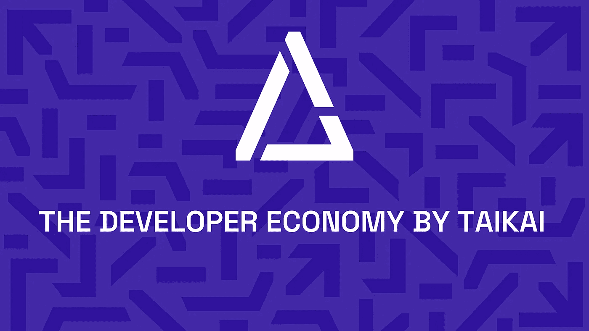

# 开发者经济是太凯实验室团队及其生态系统的愿景！

> 原文：<https://medium.com/coinmonks/the-developer-economy-as-a-vision-of-the-taikai-labs-team-and-its-ecosystem-5ae14c3081f2?source=collection_archive---------45----------------------->

TAIKAI 是一个连接创造者和公司的建筑商中心，利用黑客马拉松、奖金和招聘挑战来帮助你成长。

泰凯网络实验室**的团队**是**一群 **Web3 先驱，他们的愿景是通过他们的生态系统和独特的 Web3 产品为公司和创作者提供解决方案。****

**泰凯网络实验室**被公认为 2022 年葡萄牙**发展最快的 50 家创业公司之一**。葡萄牙被认为是欧洲最繁荣的创业生态系统之一，不同团队和项目之间的竞争环境**欣欣向荣。**

开发商经济是我们目前所知的新事物，而泰凯在这里通过其产品提供这一愿景。

***如何实现？***

> 未来取决于开发者，看起来下一代互联网 web3 将统治这个领域。这意味着未来几年的下一个项目将会是分散的，开发者已经并将会在整个过程中扮演头号角色。

泰凯团队正在为开发商建立一个完整的生态系统，因此也为即将到来的项目的开发。

**生态系统分为 3 个产品:**

1.  Dappkit(用于开发 web3 应用的 SDK)
2.  赏金协议(Bepro 网络)
3.  黑客马拉松平台(黑客马拉松活动和招聘挑战)

*   Dappkit 是一个 SDK，任何开发者都可以使用它来开发 web3 应用程序。值得一提的是，dappkit 是以这样一种方式创建的，开发人员只需要知道 javascript 就可以使用它。

> *正如泰凯实验室团队所说，*
> 
> 只用 3 行代码开发你的 web3 项目！

**完整信息在此:**https://dappkit.dev/

*   bounty 协议是一个以完全去中心化的方式连接开发者和运营商的平台。一个操作者可以为一个项目创造奖金，然后任何开发者都可以参与其中。开发人员根据他们的工作获得报酬，奖金通过策展人和理事会进行分配。

**完整信息在此:**[https://docs . be pro . network/getting-started/the-network](https://docs.bepro.network/getting-started/the-network)

**Bepro 网络 web app:**[https://development . be pro . network/](https://development.bepro.network/)

*   黑客马拉松平台用于为 web2 和 web3 公司、企业和初创企业组织黑客马拉松活动和招聘挑战。这是通过这些事件和挑战发现新人才和创新想法的最佳方式之一。

**完整信息在此:**[https://taikai . network/en/organizations](https://taikai.network/en/organizations)

> 这三种产品的结合为开发者和项目带来了一个完整的生态系统，他们将开始在一个完全去中心化和公平的环境中使用有用的工具和开源 web3 代码进行创作。

*Bepro 与 V2 的网络协议将于 2022 年第三季度发布更多更新。*

**将增加新的功能，使协议更加强大:**

1.  白标协议基础设施
2.  撤销赠款/资金申请
3.  NFT 一体化

**在这里查看即将发布的更新:**[https://taikai . organization . site/V2-be pro-Protocol-moon beam-Deployment-232 f 10 CB 92 cc 49579469 b 0 e 5c 42 e 2818](https://taikai.notion.site/V2-Bepro-Protocol-Moonbeam-Deployment-232f10cb92cc49579469b0e5c42e2818)

> **泰凯社交媒体平台:**
> 
> [**网站**](https://taikai.network/en)
> 
> [**领英**](https://www.linkedin.com/company/taikainetwork/)
> 
> [**Instagram**](https://www.instagram.com/taikainetwork/)
> 
> [**推特**](https://twitter.com/taikainetwork)
> 
> **Bepro 网络社交媒体平台:**
> 
> [**网站**](https://bepro.network/)
> 
> [**不和**](https://discord.com/invite/bepronetwork)
> 
> [**推特**](https://twitter.com/bepronet)
> 
> [**Linkedin**](https://www.linkedin.com/company/betprotocol/)
> 
> [**Instagram**](https://www.instagram.com/bepronetwork/)
> 
> [**电报**](https://t.me/betprotocol)

> 加入 Coinmonks [电报频道](https://t.me/coincodecap)和 [Youtube 频道](https://www.youtube.com/c/coinmonks/videos)了解加密交易和投资

# 另外，阅读

*   [折叠 App 审核](https://coincodecap.com/fold-app-review) | [Kucoin 交易机器人](/coinmonks/kucoin-trading-bot-automate-your-trades-8cf0ca2138e0) | [Probit 审核](https://coincodecap.com/probit-review)
*   [如何匿名购买比特币](https://coincodecap.com/buy-bitcoin-anonymously) | [比特币现金钱包](https://coincodecap.com/bitcoin-cash-wallets)
*   [币安 vs FTX](https://coincodecap.com/binance-vs-ftx) | [最佳(SOL)索拉纳钱包](https://coincodecap.com/solana-wallets)
*   [比诺莫评论](https://coincodecap.com/binomo-review) | [斯多葛派 vs 3Commas vs TradeSanta](https://coincodecap.com/stoic-vs-3commas-vs-tradesanta)
*   [Capital.com 评论](https://coincodecap.com/capital-com-review) | [香港的加密借贷平台](https://coincodecap.com/crypto-lending-hong-kong)
*   [如何在 Uniswap 上交换加密？](https://coincodecap.com/swap-crypto-on-uniswap) | [A-Ads 评论](https://coincodecap.com/a-ads-review)