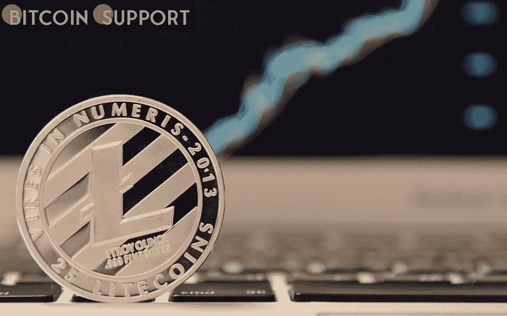

# Litecoin 的开发者已经在测试网上部署了 Mimblewimble 升级

> 原文：<https://medium.com/coinmonks/the-developers-of-litecoin-have-deployed-the-mimblewimble-upgrade-on-the-testnet-e9981f51b5bb?source=collection_archive---------22----------------------->

**Visit our website:-** [**https://bitcoinsupports.com/**](https://bitcoinsupports.com/)

在测试网上，Litecoin 团队推出了新版本的 Litecoin Core 0.21.2 客户端。此版本包含对 Mimblewimble 扩展块(MWEB)和 Taproot 的更改。

“在最终发布之前，我们一直在非常努力地工作，以消除所有的错误。我们感谢所有在 testnet 上协助我们测试 MWEB 的人！”Litecoin 的创始人查理·李说。

Mimblewimble 是一种能够实现更好的可扩展性和匿名性的协议。它利用多种技术，包括保密交易和 CoinJoin，隐藏发送方和接收方的输入和输出，并将多项交易合并为一项交易。MWEB 的主要开发人员 David Burkett 表示，寻找漏洞的工作正在进行中，该团队即将在 mainnet 上发布 Core 0.21.2。

**“我相信我们已经接近结论了。帮助我们识别最后几个顽固的缺陷，这样我们就可以专注于激活。也许到那时我将最终能够睡觉)，**

他向用户发表讲话。

2021 年 11 月比特币网络上激活了主根更新。这是 2017 年以来最显著的进步。

**访问我们的网站:-**[**https://bitcoinsupports.com/**](https://bitcoinsupports.com/)

**免责声明:以上为作者观点，不应视为投资建议。读者应该自己做研究。**

> 加入 Coinmonks [电报频道](https://t.me/coincodecap)和 [Youtube 频道](https://www.youtube.com/c/coinmonks/videos)了解加密交易和投资

# 另外，阅读

*   [用信用卡购买密码的 10 个最佳地点](https://coincodecap.com/buy-crypto-with-credit-card)
*   [最好的卡达诺钱包](https://coincodecap.com/best-cardano-wallets) | [Bingbon 副本交易](https://coincodecap.com/bingbon-copy-trading)
*   [印度最佳 P2P 加密交易所](https://coincodecap.com/p2p-crypto-exchanges-in-india) | [柴犬钱包](https://coincodecap.com/baby-shiba-inu-wallets)
*   [八大加密附属计划](https://coincodecap.com/crypto-affiliate-programs) | [eToro vs 比特币基地](https://coincodecap.com/etoro-vs-coinbase)
*   [最佳以太坊钱包](https://coincodecap.com/best-ethereum-wallets) | [电报上的加密货币机器人](https://coincodecap.com/telegram-crypto-bots)