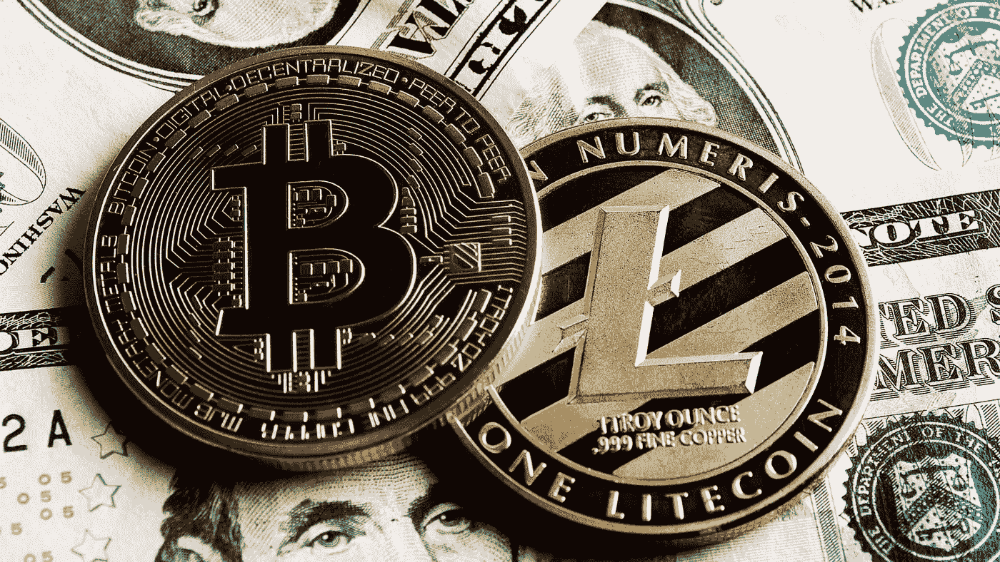

# 比特币和莱特币的区别！它们如何影响加密货币的价值？

> 原文：<https://medium.com/coinmonks/the-difference-between-bitcoin-and-litecoin-how-do-they-influence-the-cryptocurrency-value-d8b38de162ef?source=collection_archive---------26----------------------->

比特币和不同替代币的战斗正在成为加密货币世界中越来越突出的战斗。尽管比特币占据了市场的大多数人，但它的选择正变得越来越受欢迎。替代硬币通常是为了解决比特币的一些限制而创建的。因此，altcoins 通常使用特定的协议和加密算法。

Photo Source on Google

他们也有不同的关注点:

*   **隐私**
*   **稳定**
*   **替代支付方式**

就声誉而言，比特币通常比比特币和替代币更胜一筹。它试图成为一种替代性的、数字化的、点对点的现金设备。其引入的目的是分散金融界的权力，并提供更高程度的透明度。它的创造者旨在再次向人民展示力量，并允许对我们的预算拥有自主权，而不是将控制权交给一个由银行组成的政府。

# 莱特币

莱特币是市场上其他一些著名的替代硬币。在中间，莱特币并不总是与比特币有所区别——至少当考虑到它们各自的代码时。但是，莱特币的开采速度比比特币快得多，块生成时间为 2 . 5 分钟。更快的块技术时间背后的目的是允许更快的交易确认实例，寻求补救比特币的一些限制。莱特币还允许铸造总计 8400 万英镑的现金，比比特币高 4 倍。

虽然莱特币的代码类似于比特币，但它利用了 SHA-256 上的一套加密规则。Scrypt 算法使 Litecoin 挖掘可用于更广泛的目标市场，因为它可以在非公共计算机系统上使用。这消除了一些与比特币采矿相关的过高价格和权力层级。

# **比特币和莱特币的区别**

## **市值**

比特币和莱特币截然不同的另一个地方是它们的市值，所有创造的硬币的全美元市场价值比特币更受欢迎，因为它能够被大型农场和矿池开采；此外，对它的需求已经上升到如此之高，以至于它要求非常高的加密货币对美元的汇率。莱特币的市场潜力小得多，因为比特币的交付量更小，需求更大。

## **算法**

到目前为止，比特币和莱特币之间最根本的技术差异是它们采用的不同加密算法。比特币使用的是历史悠久的 SHA-256 算法，而莱特币使用的是一种相对较新的算法，名为 Scrypt。

这些不同算法的主要实际意义是它们对挖掘新硬币过程的影响。无论是比特币还是莱特币，确认交易的过程都需要相当的计算能力。货币网络的一些成员，被称为矿工，分配他们的计算资源用于确认其他用户的交易。作为交换，这些矿工可以获得他们开采的货币单位

## **分布**

比特币和莱特币的另一个主要区别是每种加密货币可以生产的硬币总数。这就是 Litecoin 与众不同的地方。比特币网络永远不会超过 2100 万个硬币，而莱特币最多可以容纳 8400 万个硬币。5 理论上，这听起来像是莱特币的一个重大优势，但其现实世界的影响最终可能被证明是微不足道的。这是因为比特币和莱特币都可以分成几乎无限小的数量。事实上，可转移比特币的最小数量是一个比特币的一亿分之一(0.00000001 比特币)，俗称一个“satoshi”。7 因此，这两种货币的用户购买低价商品或服务应该没有困难，不管一枚完整的比特币或莱特币的总体价格可能会有多高。

## **底线**

虽然比特币和莱特币可能是当今加密货币领域的黄金和白银，但历史表明，这个充满活力的新兴领域的现状甚至可以在几个月内发生变化。我们所熟悉的加密货币能否在未来的岁月里保持其地位，还有待观察。随着加密货币行业的不断发展，硬币的类型也将不断变化。拥有不同用途的不同硬币不应该被认为是一件消极的事情。用户有了更多的选择，也在更大程度上鼓励他们从法定货币转向加密货币。

> *加入 Coinmonks* [*电报频道*](https://t.me/coincodecap) *和* [*Youtube 频道*](https://www.youtube.com/c/coinmonks/videos) *了解加密交易和投资*

# 另外，阅读

*   [Bookmap 评论](https://coincodecap.com/bookmap-review-2021-best-trading-software) | [美国 5 大最佳加密交易所](https://coincodecap.com/crypto-exchange-usa)
*   最佳加密[硬件钱包](/coinmonks/hardware-wallets-dfa1211730c6) | [Bitbns 评论](/coinmonks/bitbns-review-38256a07e161)
*   [新加坡十大最佳加密交易所](https://coincodecap.com/crypto-exchange-in-singapore) | [收购 AXS](https://coincodecap.com/buy-axs-token)
*   [红狗赌场评论](https://coincodecap.com/red-dog-casino-review) | [Swyftx 评论](https://coincodecap.com/swyftx-review) | [CoinGate 评论](https://coincodecap.com/coingate-review)
*   [投资印度的最佳加密软件](https://coincodecap.com/best-crypto-to-invest-in-india-in-2021)|[WazirX P2P](https://coincodecap.com/wazirx-p2p)|[Hi Dollar Review](https://coincodecap.com/hi-dollar-review)