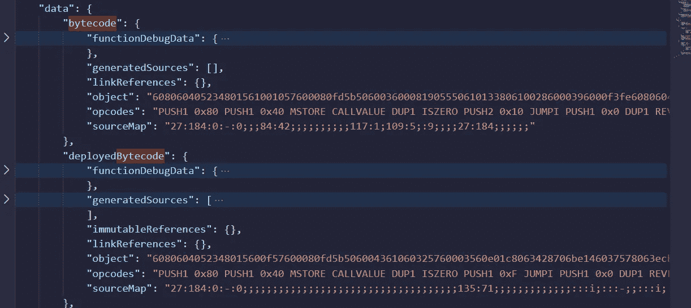
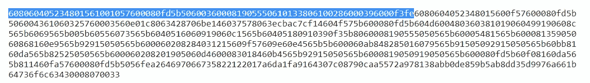
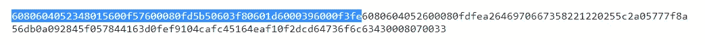

# 字节码和部署的字节码之间的区别

> 原文：<https://medium.com/coinmonks/the-difference-between-bytecode-and-deployed-bytecode-64594db723df?source=collection_archive---------2----------------------->


如果您检查 Remix 或 Truffle 生成的 JSON 文件，在编译智能合约时，您会注意到它包含两种不同的字节码:字节码和部署的字节码。其他 IDE 可能会对这些字节码中的一个使用不同的名称。

其中之一，通常称为字节码，是将被发送到网络用于创建智能契约的二进制代码。另一个是部署的字节码，是存储在区块链上的二进制代码，每次调用契约时都会执行。

这样，字节码将比部署的字节码有更多的字节。(被调用的)字节码是初始代码和部署的字节码的连接。我们先看这个，然后解释初始代码的用途。

# 字节码和部署的字节码

让我们使用一个简单的契约，如下所示:

```
pragma solidity ^0.8.7; contract TestBytecode {         uint public valor;         constructor() {         
      valor = 3;     
   }          function setValor(uint _valor) public {         
      valor = _valor;     
   }  
}
```

契约的唯一目的是存储一个可以改变的变量。可以在 Remix 上试试。编译完成后，在*契约/工件*文件夹中，你会发现一个名为 *TestBytecode.json* 的文件。在它里面，有两个字节码，如下图所示:



One can find the bytecode and the deployedBytecode in Remix.

我将复制并粘贴下面的代码。字节码是:

```
608060405234801561001057600080fd5b506003600081905550610133806100286000396000f3fe6080604052348015600f57600080fd5b506004361060325760003560e01c8063428706be146037578063ecbac7cf14604f575b600080fd5b604d600480360381019060499190608c565b6069565b005b60556073565b6040516060919060c1565b60405180910390f35b8060008190555050565b60005481565b60008135905060868160e9565b92915050565b600060208284031215609f57609e60e4565b5b600060ab848285016079565b91505092915050565b60bb8160da565b82525050565b600060208201905060d4600083018460b4565b92915050565b6000819050919050565b600080fd5b60f08160da565b811460fa57600080fd5b5056fea264697066735822122017a6da1fa9164307c08790caa5572a978138abb0de859b5ab8dd35d9976a661b64736f6c63430008070033
```

部署的字节码是:

```
6080604052348015600f57600080fd5b506004361060325760003560e01c8063428706be146037578063ecbac7cf14604f575b600080fd5b604d600480360381019060499190608c565b6069565b005b60556073565b6040516060919060c1565b60405180910390f35b8060008190555050565b60005481565b60008135905060868160e9565b92915050565b600060208284031215609f57609e60e4565b5b600060ab848285016079565b91505092915050565b60bb8160da565b82525050565b600060208201905060d4600083018460b4565b92915050565b6000819050919050565b600080fd5b60f08160da565b811460fa57600080fd5b5056fea264697066735822122017a6da1fa9164307c08790caa5572a978138abb0de859b5ab8dd35d9976a661b64736f6c63430008070033
```

请注意，第一个比第二个大。再深入一点，你会注意到第一个包含了第二个。为了检查这一点，一个技巧是寻找第一个操作码 *0xfe* 。它可能标志着初始代码的结束和部署的字节码的开始。我在下图中标记了它:



The code tagged is the initial code. What is left is the deployed bytecode.

现在让我们看一个更简单的合同。

```
pragma solidity ^0.8.7; contract TestBytecodeAgain {      
   constructor() {}  
}
```

生成了两个字节码。第一个是完整的代码，包括初始代码和将存储在区块链上的代码。

```
6080604052348015600f57600080fd5b50603f80601d6000396000f3fe6080604052600080fdfea2646970667358221220255c2a05777f8a56db0a092845f057844163d0fef9104cafc45164eaf10f2dcd64736f6c63430008070033
```

第二个问题是区块链号上将储存什么。

```
6080604052600080fdfea2646970667358221220255c2a05777f8a56db0a092845f057844163d0fef9104cafc45164eaf10f2dcd64736f6c63430008070033
```

正如我们在下图中再次看到的，字节码包含初始代码和部署的字节码。



# 初始代码的目的是什么？

只运行一次的智能合约函数是它的构造函数。没有必要将此功能存储在区块链上，因为它不能再次执行。因此，它的执行是在初始代码中编写的，而不是在部署的字节码中。

此外，用户可以在合同创建后立即向其发送本币，因此有必要验证合同是否接受本币。该检查在部署时运行，如果创建者向不接受本地货币的合同发送本地货币，则应恢复合同创建。

这向我们表明，有一个完整的脚本必须只在部署时执行，并且这个脚本包含在初始代码中。这就是为什么有两个二进制代码:一个必须在创建合同时发送，其中包含初始代码，另一个将存储在区块链上。

**感谢阅读！**

伊娃·戈洛贝特斯在 [Unsplash](https://unsplash.com/s/photos/binary-code?utm_source=unsplash&utm_medium=referral&utm_content=creditCopyText) 拍摄的照片

> 加入 Coinmonks [电报频道](https://t.me/coincodecap)和 [Youtube 频道](https://www.youtube.com/c/coinmonks/videos)了解加密交易和投资

# 另外，阅读

*   [3 商业评论](/coinmonks/3commas-review-an-excellent-crypto-trading-bot-2020-1313a58bec92) | [Pionex 评论](https://coincodecap.com/pionex-review-exchange-with-crypto-trading-bot) | [Coinrule 评论](/coinmonks/coinrule-review-2021-a-beginner-friendly-crypto-trading-bot-daf0504848ba)
*   [莱杰 vs n rave](/coinmonks/ledger-vs-ngrave-zero-7e40f0c1d694)|[莱杰 nano s vs x](/coinmonks/ledger-nano-s-vs-x-battery-hardware-price-storage-59a6663fe3b0) | [币安评论](/coinmonks/binance-review-ee10d3bf3b6e)
*   [Bybit Exchange 评论](/coinmonks/bybit-exchange-review-dbd570019b71) | [Bityard 评论](https://coincodecap.com/bityard-reivew) | [Jet-Bot 评论](https://coincodecap.com/jet-bot-review)
*   [3 commas vs crypto hopper](/coinmonks/3commas-vs-pionex-vs-cryptohopper-best-crypto-bot-6a98d2baa203)|[赚取秘密利息](/coinmonks/earn-crypto-interest-b10b810fdda3)
*   最好的比特币[硬件钱包](/coinmonks/hardware-wallets-dfa1211730c6) | [BitBox02 回顾](/coinmonks/bitbox02-review-your-swiss-bitcoin-hardware-wallet-c36c88fff29)