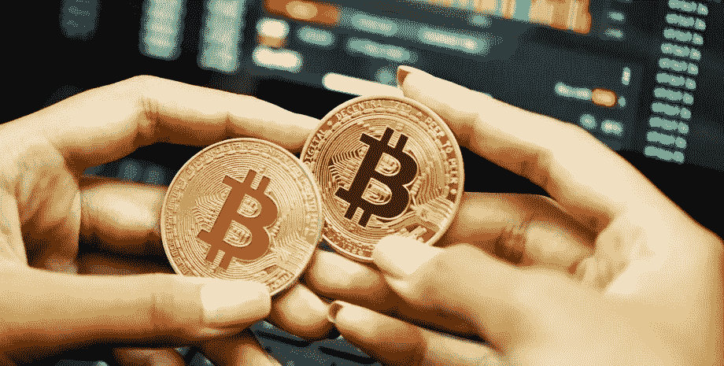
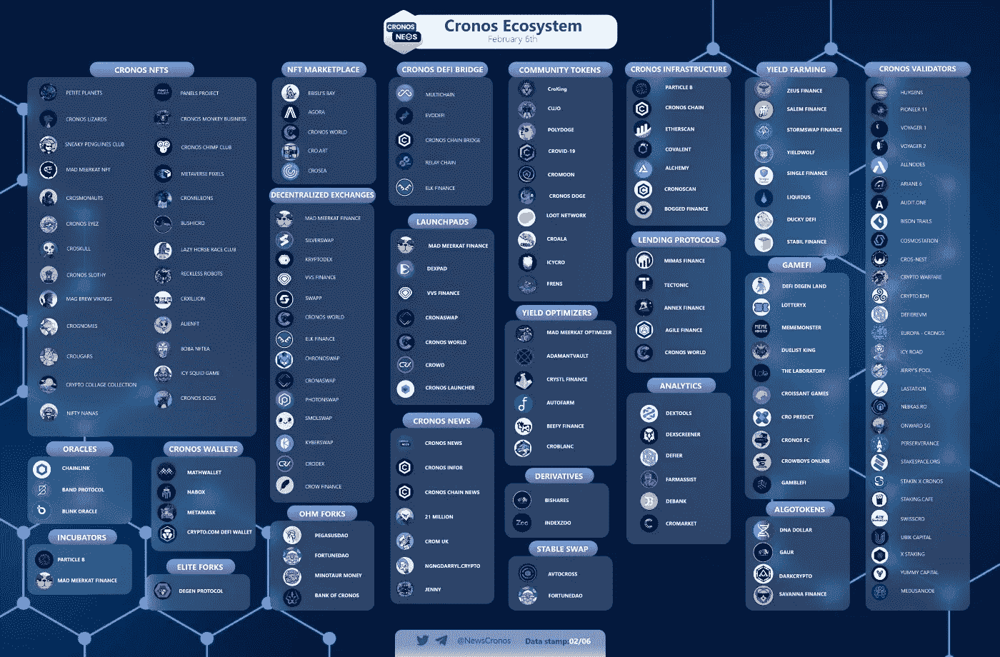

# 硬币和代币的区别很简单:以克罗诺斯代币为例

> 原文：<https://medium.com/coinmonks/the-difference-between-coins-and-tokens-simply-cronos-token-as-example-6bf1ac3fc711?source=collection_archive---------30----------------------->

“加密”一词用于涵盖多种货币。但实际上，硬币和代币是有区别的。让我们更深入地看看这里。

进入加密货币世界的第一步可能会很复杂，有时会令人困惑。你肯定听说过比特币吧？但是，除此之外，其余的多重硬币和区块链项目呢？

为了更好地理解这一切，更容易将加密货币分为两个特定的类别:硬币和代币。

好吧，让我们给出基本的定义。

**硬币**是任何具有独立区块链的加密货币(比特币、以太坊、XRP 等)

需要澄清的是:**替代币**不是比特币。所以以太坊和 XRP。将被称为 altcoins。

**代币**是加密货币，没有自己的区块链，但可以在另一个区块链上使用。当他们生活在另一个区块链上时，他们受益于它的技术。(ERC-20 代币，克罗诺斯代币($ https://cronos.org/[)](https://cronos.org/))等)。

硬币是指任何具有独立区块链的加密货币，如比特币或以太坊。

比特币的本土代币 BTC 是市场上流动性最强的加密货币。它拥有加密货币生态系统中最高的市值和已实现的市值。

硬币的另一个例子，以太坊的以太(ETH)是智能合约平台的原生硬币，用于创建在分散区块链上运行的通用计算机程序。

像大多数其他硬币一样，以太用于发送或接收，管理资产，支付汽油费，与网络内的 dApps 互动。

现在让我们看看代币。它们是在现有的区块链上创建的。目前，最常见的区块链令牌平台是以太坊。在以太坊平台上构建的令牌被称为 ERC 20 令牌。与此同时，宇宙，币安智能链，和克罗诺斯链得到他们在这一行的强势地位。

需要理解的一个重要问题是:任何人都可以在其中一个平台上制作自己的定制令牌。

大多数令牌是为分散式应用程序或 dApps 而存在的。当开发者创建他们的代币时，他们可以决定他们想要制造多少个单位。他们将在区块链上支付一些本地加密货币作为一种费用。

一旦创建，令牌通常用于激活它们所设计的应用程序的功能，或者可用于其他目的(实用程序)。克罗诺斯连锁店的 CRO 或币安智能连锁店的币安硬币(BNB)。

现在更简单的定义。硬币原产于他们自己的区块链，而代币则建立在另一个区块链之上。

此外，硬币和代币最常见的用法如下。

硬币经常被简单地用作货币；然而，有些硬币确实有其他用途。这些包括被用作交易的燃料、在网络上验证交易的股份等。因此，作为 Cronos 链的本地加密货币，CRO 被用于 Cronos 生态系统中的支付、交易和金融服务。

同时，代币有不同的用途。在某些情况下，他们是为了投票权等功能。在其他情况下，它们用于 dApp 上的交易(如 Civic)或以折扣费用等方式奖励用户。(比如币安)。

希望这能让你在这些方面更加自信。无论如何，请在下面的评论中写下你可能有的所有问题。

感谢您的关注。在我的下一篇文章中再见！；)💋

@ Crodo _ io # Crodo # CRONOS @ CRONOS _ chain $ CROD @ crypto com

> 加入 Coinmonks [电报频道](https://t.me/coincodecap)和 [Youtube 频道](https://www.youtube.com/c/coinmonks/videos)了解加密交易和投资

# 另外，阅读

*   [十大最佳加密货币博客](https://coincodecap.com/best-cryptocurrency-blogs) | [YouHodler 评论](https://coincodecap.com/youhodler-review)
*   [AscendEx 保证金交易](https://coincodecap.com/ascendex-margin-trading) | [Bitfinex 赌注](https://coincodecap.com/bitfinex-staking)
*   [最佳卡达诺钱包](https://coincodecap.com/best-cardano-wallets) | [Bingbon 副本交易](https://coincodecap.com/bingbon-copy-trading)
*   [印度最佳 P2P 加密交易所](https://coincodecap.com/p2p-crypto-exchanges-in-india) | [柴犬钱包](https://coincodecap.com/baby-shiba-inu-wallets)
*   [八大加密附属计划](https://coincodecap.com/crypto-affiliate-programs) | [eToro vs 比特币基地](https://coincodecap.com/etoro-vs-coinbase)
*   [最佳以太坊钱包](https://coincodecap.com/best-ethereum-wallets) | [电报上的加密货币机器人](https://coincodecap.com/telegram-crypto-bots)