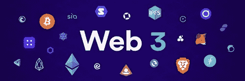

# Web 2 和 Web 3 的区别。

> 原文：<https://medium.com/coinmonks/the-difference-between-web-2-and-web-3-3a2ad7073c5f?source=collection_archive---------18----------------------->

随着世界科技知识的不断增长，我们往往会不时听到新的概念或术语。

我们经常听到的一个概念是 Web 3。但是什么是 Web 3 呢？这对你我有什么影响？

目前的产品 Web 2 侧重于用户之间的互动。用户将他们的数据(通过注册过程)提供给社交媒体平台、电子商务网站等，并根据他们的数据和偏好反馈信息。

例如，我们可以用 Twitter 来说明这一点。注册后，你可以根据自己的喜好访问内容，也可以根据自己的喜好定期查看广告内容，这使得应用程序能够正常运行。

它极大地改善了我们的生活方式。从浏览社交媒体到在 Airbnb 上预订某人的房产，在 WhatsApp 上给朋友打几个小时的电话，再到在网上随意购物，这似乎是纯粹的幸福。

但是它有一个陷阱:**垄断**。

这些公司掌握着用户数据的最高权力。由于这种垄断，它们可以被看作是“集中的”。一觉醒来，你可能会发现你的账户因为你做了或没做的事情而被删除或封锁。所有行业都有，包括银行和金融业。

所有这些，都是 Web 3 要解决的问题。它提供了“去中心化”，取消了公司的垄断。用户不再与产品服务器交互，而是使用分类账。这就是区块链的用武之地。

区块链从字面上看就是一串区块。链上的每个块都包含人们正在执行的事务。它们被散列并链接在一起，形成一个长长的事务链。然后，这些文件被复制并分发到区块链网络上的不同计算机上。

Web 3 还提供了与其他参与者互动的可能性，而不需要通过中间人，也不需要“集中”机构的授权。

在金融系统中，它用节点(连接到区块链并分散在世界各地的计算机)取代了会计师和物理总账，这更安全，也更分散。信息不会只由一个实体持有，而是对特定系统中的每个人开放。

随着关于这个主题的信息量的增加，要跟上潮流可能会变得势不可挡。这就是[方块游戏](http://blockgames.gg)和 [Zuri 团队](http://zuri.team)与 [Nestcoin](http://nestcoin.com) 合作要解决的问题。他们帮助 Web 3 和区块链的初学者获得扩展这个新兴行业所需的知识和技能。

> 加入 Coinmonks [电报频道](https://t.me/coincodecap)和 [Youtube 频道](https://www.youtube.com/c/coinmonks/videos)了解加密交易和投资

# 另外，阅读

*   [如何购买 Monero](https://coincodecap.com/buy-monero) | [IDEX 评论](https://coincodecap.com/idex-review) | [BitKan 交易机器人](https://coincodecap.com/bitkan-trading-bot)
*   [CoinDCX 评论](/coinmonks/coindcx-review-8444db3621a2) | [加密保证金交易交易所](https://coincodecap.com/crypto-margin-trading-exchanges)
*   [红狗赌场评论](https://coincodecap.com/red-dog-casino-review) | [Swyftx 评论](https://coincodecap.com/swyftx-review) | [CoinGate 评论](https://coincodecap.com/coingate-review)
*   [Bookmap 点评](https://coincodecap.com/bookmap-review-2021-best-trading-software) | [美国 5 大最佳加密交易所](https://coincodecap.com/crypto-exchange-usa)
*   [如何在 FTX 交易所交易期货](https://coincodecap.com/ftx-futures-trading) | [OKEx vs 币安](https://coincodecap.com/okex-vs-binance)
*   [CoinLoan 审查](https://coincodecap.com/coinloan-review) | [YouHodler 审查](/coinmonks/youhodler-4-easy-ways-to-make-money-98969b9689f2) | [BlockFi 审查](https://coincodecap.com/blockfi-review)
*   [XT.COM 评论](https://coincodecap.com/profittradingapp-for-binance)币安评论 |
*   [SmithBot 评论](https://coincodecap.com/smithbot-review) | [4 款最佳免费开源交易机器人](https://coincodecap.com/free-open-source-trading-bots)
*   [比特币基地僵尸程序](/coinmonks/coinbase-bots-ac6359e897f3) | [AscendEX 审查](/coinmonks/ascendex-review-53e829cf75fa) | [OKEx 交易僵尸程序](/coinmonks/okex-trading-bots-234920f61e60)