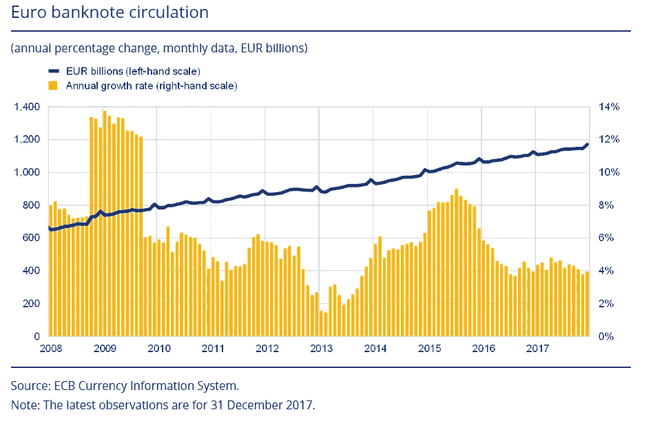

# 数字欧元:反对去中心化的特洛伊木马？

> 原文：<https://medium.com/coinmonks/the-digital-euro-a-trojan-horse-against-decentralization-2c278a1c6122?source=collection_archive---------22----------------------->

区块链技术和去中心化正在席卷全球。有些人喜欢只关注崩溃的浪潮，没有看到另一个浪潮正在背后膨胀，相信最终，这个或那个黑客，骗局，失败的项目或庞氏骗局是公众区块链技术棺材上的最后一颗钉子。但也有人理解它的真正潜力:大多数集中式服务的非中介化。

公共区块链是开源的。它们很脏。它们不稳定。他们不可预测。它们移动和进化的速度超出了任何人的预期。这是故意的。它是一个特性，而不是一个 bug。在开源世界中，进化和稳定并不是通过投资数十亿美元雇佣一些顶级天才，让他们关起门来解决问题，并像典型的专有软件一样，将他们的解决方案作为额外的安全层保护在保密墙后来实现的。相反，开源通过试错而繁荣，有数十亿双眼睛检查公开可用的代码，还有数十亿双手试图破解它。Linux，这个非常成功的开源操作系统，已经经历了很多次的分叉，发展成了几个不同的版本。并非所有版本的 Linux 都是稳定或可靠的。但是 Linux 存在的时间越长，它就变得越稳定和用户友好。

公共区块链是新的“Linux”。它始于比特币，它被分成数千个平行的区块链，每个都有自己的特点和调整:一些旨在提高交易速度，一些旨在提高可扩展性等。但最终，每个人都在关注的最突出的特征是技术背后的用例:不可变的共享分类账或数据库，可以以未经许可的方式更新，但通过加密和计算能力得到保护，以防止任何第三方任意篡改数据。自然的用例是…钱。

如今，大多数货币都以数据库中一行代码的形式存在。目前，这是一个中央数据库，受到高度安全保护，基本上由私人商业银行管理。但是这项技术已经过时，在过去的几十年里几乎没有创新。虽然互联网已经成功地将世界各地的人们联系起来，但试着从一个大陆向另一个大陆汇款，看看是否像发送电子邮件或 WhatsApp 一样简单。

私营公司试图解决这些问题，通过提供某些资金转移服务(例如，参见 Transferwise ),中央企业利用了市场的缺陷。但是这种集中的做事方式已经变得太累赘了。由于对恐怖主义和洗钱的恐惧，任何集中化的企业都必须承担大量的监管和 KYC 程序的负担，以便让当地的农民或汉堡爱好者上船，因为它们对金融系统的稳定或恐怖分子的融资造成了巨大的危险。令人欣慰的是，我们有证据表明，所有反洗钱/KYC/金融交易(反洗钱、了解客户、恐怖融资)法律都非常有效，值得为一部分人承受额外的“摩擦”和金融排斥风险。Oups！事实上，不，他们没有。[在过去的几十年里，许多大银行被当场抓获，清洗了价值数百万(如果不是数十亿)€的金钱，主要来自无家可归者和无证移民(讽刺 X100)……](https://glintpay.com/en_us/blog/every-top-10-bank-fined-150-billion-laundered-annually-2/)当然，他们受到了监管机构的赞扬，监管机构认为反洗钱/KYC/反洗钱法律需要进一步收紧，而不是简单地承认它们不起作用。此外，请忽略这样一个事实:最终，你可以创建像基本银行账户这样的金融产品，对每月交易的数量和金额有限制，并且绝对不需要凭证或身份。如今，人工智能可以很容易地识别被认为“正常”的银行账户使用模式，并标记任何可疑的支出类型和收入来源。障碍来自其他地方。虽然清洗数百万美元可能有利可图，尤其是在盈利能力创下新低的时候，但让某些客户加入进来是没有利润可言的。有一个衡量标准:“CLV”或客户终身价值。大多数客户都应该购买保险，获得贷款和抵押贷款，并在一生中投资金融产品。这些是你想搭乘的客户。但是当地的农民和卖汉堡包的人呢？他们在大部分时间里只会使用一个基本的账户和卡来支付和接收款项，(ab)以几乎为零的成本使用你的服务，这造成了额外的管理负担，最重要的是，鉴于你的员工缺乏财务知识，他们可能会用大量的问题和难题来烦你的员工。不。那些顾客可以去别的地方。实际情况是，在非盈利客户和不符合反洗钱/KYC/金融交易要求的客户之间有很大的重叠。首先，所有的非法移民，无家可归者等等。感谢上帝，我们有反洗钱法，否则这些街上的流浪汉会洗他们收集的这么多钱，金融系统会崩溃。

但接下来是公开的区块链。现在，任何有互联网连接的人都可以在不征求任何人同意的情况下开户。事实上，任何能够暂时接入互联网的人都可以创建一个所谓的“纸质钱包”，甚至不用接入互联网也能收到付款，只需要一个二维码，并通过记忆一个“种子短语”(一串 12 个或更多的单词)来付款。当然可以。只要是比特币或“神奇的互联网货币”，这是一回事。公共机构和银行可能不喜欢，但这不是真正的竞争。人们认为这更像是一种投机性资产，而不是对其支付基础设施的威胁。但是后来稳定的加入出现了。有很多。从像 DAI stablecouin(maker Dao)或 USDC 这样的聪明人到不太聪明的人(像现在已经不存在的 Terra UST 或有争议的 USDT 或 Tether)。无论如何，同样的原则适用。任何有互联网连接的人都可以开立稳定账户，并使用稳定账户收发款项。这完全是另一回事了。突然间，任何人都可以在没有任何形式的反洗钱/KYC 的情况下向世界各地汇款。一个来自委内瑞拉或黎巴嫩的人可以从世界上任何其他人那里获得美元，并开始用它们向该国任何其他人付款，而公共当局对此无能为力，除了关闭互联网。这还不是全部。有了智能合同和所谓的 DeFi(分散融资)空间，人们可以用他们的稳定资本做很多事情:把它们放入流动性池，或者把它们借出去，产生收益或利息……可编程货币才刚刚开始，可能性是无穷无尽的:小额支付、分散保险、借贷等。

现在，这引起了私人银行和公共当局的注意。

部分注意力集中在对消费者的损害上。许多人因为被好到难以置信的回报和收益(UST 超过 20%的年利率)所诱惑，投资了像泰拉 UST 这样的失败项目，失去了他们一生的积蓄！！！)但是，正如我在上面解释的，这是开源做事方式的一个特点:试错。每一次黑客攻击、每一次骗局、每一次欺诈都使得下一次更难得逞或更不可能发生，原因很简单，因为开源生态系统适应并消化了所有这些错误，不幸的是，这往往会损害最终用户的利益。然而，目前试图通过监管“打击”公共区块链是徒劳的或适得其反的。这就像试图让开源软件*而不是*开源，或者去除迭代和试错机制，这是开源软件自然进化过程的核心。主要问题是，大多数人不理解这一事实，因此错误地认为一个有数百万追随者的项目是“安全的”，忘记了多样化，对冲他们的赌注，并依赖于生态系统，这些生态系统已经存在了最长时间，因为他们已经接触到更多的黑客攻击尝试，并经历了更多的反复试验/错误，因此自然不太可能像 Terra Luna 那样突然崩溃。

但是很大一部分注意力也集中在这样一个事实上，即非中介化现在是一个真正的威胁。当你可以自由地即时开立一个 stablecoin 账户，以非常低的成本通过第 2 层解决方案进行支付，并通过各种 DeFi 生态系统或在线平台获得至少约 5%的 stablecoin 利率(这将很容易抵消交易成本，让你获得实际净正收益)时，为什么还要继续为你的银行账户支付月费(这给你带来 0%的利率，有时甚至收取负利率？

但是私人银行能做些什么呢？他们的支付系统已经数字化了。他们还能做什么？因此，央行行长们提出了“数字美元”或“数字欧元”的概念，这就像是现金的数字版本。

这时候我的眉毛就竖起来了，因为我对数字欧元看得越多，就越不理解这个概念。让我们来看看让我困惑的事情:

*   **数字欧元将成为数字现金？**

只有大约 5%的货币总量以现金的形式存在。其余大部分是“债务货币”，或者是每当私人商业银行向某人(企业、消费者、国家等)发放贷款时凭空创造出来的货币。这种货币遵循复式记账原则，也就是说，每创造一欧元，就必须有一项资产或负债。例如，每当银行发放贷款时，出现在你银行账户上的 1000€实际上就是银行欠你的钱。作为回报，你签了一份合同说你欠银行 1000€。所以金钱在某种程度上抵消了。银行在一栏中写“+1000”，在另一栏中写“-1000”，过一会儿，当贷款被偿还时，就好像你把+1000 加到-1000，你又回到零。当然，这是对事情运作方式的过度简化，但当我们谈论数字欧元时，你会明白它有多重要。现金就很不一样了。它永远不会被摧毁。这就是所谓的“基础货币”或货币体系的一部分，它始终存在。很难清楚地确定它的角色，但我会说它有点像经济引擎的油。它创造了一个稳定层，让交易得以继续，让经济稳步前进，即使在债务资金层面出现一点不稳定。

在更复杂的层面上，我认为任何经济体中可用的现金数量都代表债务利息。这对你来说可能很难理解，但是当你贷款时，贷款中唯一没有被毁掉的部分就是利息。如果你以 10%的利率贷款 1000€，年底一次性付清，无论如何，你必须通过劳动重新获得 1100€，并偿还银行 1100€。虽然 1000€将退出流通或被销毁，但多出来的 100€代表着银行的利润。这 100€将继续在经济中流通。我认为，经济或金融体系中的现金数量可能在物理上等同于银行从债务中获得的利息。

[https://www . ECB . Europa . eu/pub/economic-bulletin/articles/2018/html/ECB . ebart 201806 _ 03 . en . html](https://www.ecb.europa.eu/pub/economic-bulletin/articles/2018/html/ecb.ebart201806_03.en.html)

这些与数字欧元有什么关系？

嗯，一切。数字欧元是以“数字现金”的形式出现的。但是那看起来像什么？首先，我们必须问一个数字欧元是如何被“创造”或印刷出来的。对于钞票或现金，这很容易。中央银行印制欧元钞票，分发给银行，然后银行通过自动取款机向客户提供这些钞票。本质上，无论何时你从银行账户中取出现金，你基本上都是在要求银行兑现它欠你的钱的承诺。正如我前面说过的，当你的银行账户上有 1000€时，这意味着银行承诺它准备好了 1000€的现金供你支配。这么想吧。你账户上的 1000€就像你和银行之间的一份合同，上面写着“我欠马丁 1000€”。如果你以现金的形式要求，就好像你要求你的银行兑现承诺。一旦你有了那 1000€，如果你把它放在另一家银行，那家银行会为你开一个账户，并把 1000€存入你的账户。作为将这 1000€存入另一家银行的交换，你再次收到一个视觉承诺，即该银行欠你这 1000€(以你在银行账户上看到的余额的形式)。

但是，它将如何与数字欧元合作呢？从表面上看，人们可以直接在央行开立账户。如果是这样的话，它实际上就相当于现金，因为有了现金，除了央行之外就没有对手了。就债务资金而言，如上所述，总有一个交易对手或反向资产。出现在银行账户上的大部分现存货币之所以存在，只是因为在某个地方，有人同意偿还等量的债务。换句话说，与现金相反，货币只有短暂的寿命。整个金融体系的稳定依赖于货币的无缝创造/毁灭循环，这是商品和服务的创造/毁灭循环的一面镜子。在一个理想的世界里，你购买的商品应该只和最初用来创造它们的信用或金钱一样长久。例如，如果一个企业必须借 100 万€来生产 100，000 双鞋，并且必须在 5 年内偿还这笔贷款，那么在 5 年后，理想情况下，这 100，000 双鞋将被他们的客户扔掉，并因此从经济中“消失”,与此同时，为制造它们而创造的货币也从金融系统中消失。如果市场上的商品数量比货币数量多，就会出现通货紧缩(太少的货币追逐太多的商品)。如果与货币数量相比，市场上没有足够的商品，就会出现通货膨胀(过多的货币追逐过少的商品)。因此，你解决编程过时的梦想破灭了。这是当前以债务为基础的金融体系的一个重要特征。繁荣的二手市场实际上会扼杀经济和金融体系。最终，这就是现金的用途。这种“石油”促进了有限的二手、消费者对消费者的交易，比如你的庭院销售或你的 Facebook 市场交易。苹果公司太了解这个问题了，它臭名昭著的废弃旧手机政策，就像许多其他公司一样，他们更喜欢销毁产品而不是捐给穷人(比如时装和服装)。如果商品离开经济的速度与债务偿还的速度不一样或不相似，那么经济和金融系统就有麻烦了。

让我们追踪一位在欧洲中央银行开立数字欧元账户的客户。很有可能，要开立这样一个账户，客户必须通过 KYC 程序，这样账户就可以与他/她的身份直接挂钩。到目前为止，这很像在私人银行开户。除了这样一个帐户可以免费使用的事实之外，至少我是这样认为的。但是，麻烦开始了。为了用欧元向帐户“收费”,客户需要从另一个帐户接收欧元付款，或者从他/她的银行帐户向数字欧元帐户发送一些欧元。然而，这将如何工作呢？欧洲央行真的会为每个欧洲消费者生成一种“特殊的”IBAN 格式，比如 CBXX XXXX XXXX XXXX XXXX，以便能够将欧元发送到这样一个账户，然后在一个没有 IBAN 格式的特殊账户中将这笔钱转换成数字欧元吗？而这只是冰山一角。后端会发生什么？通常，当你从一家银行向另一家银行汇款时，流动的不仅仅是钱。资产/负债必须或多或少同步变动。换句话说，如果你将 1000€从 A 银行转移到 B 银行，你基本上是在转让一份合同或承诺，即 B 银行现在欠你转让 1000€的任何人的债。为了让 B 银行接受这一承诺，它会要求 A 银行转移某种价值 1000€的资产，如债券或现金。但这将如何与欧洲央行合作呢？它还会要求银行将其部分资产转移至资产负债表吗？然后，当欧洲央行将数字欧元转换回债务货币，并将其发送到一个银行账户时，它是否也会将其部分资产转移到该银行？这里有很多问题需要回答。例如，既然欧洲央行的资产负债表可以变成负值而不会产生任何影响，那么数字欧元是否可以被用来通过减轻银行持有欧元的责任来拯救银行呢？银行会利用欧洲央行的资产负债表几乎无懈可击的事实，在向欧洲央行输送一些债务资金欧元的同时，向欧洲央行输送垃圾债券或其它它希望抛售的无价值资产吗？

这也提出了一个问题，当有人想再次将数字欧元转换为私人银行债务货币时，到底会发生什么。欧洲央行会给银行送去抵押品，销毁数字欧元，并要求收款银行把债务资金记入此人的账户吗？简而言之，数字欧元的创造/毁灭周期需要澄清。

*   **这对银行有什么好处？**

如果数字欧元真的成功了，那么我不明白为什么人们还会在私人银行拥有银行账户，他们需要支付费用，而且在欧洲央行或央行层面不存在交易对手风险。在极端情况下，央行可以将所有现有的私人银行转变为分支机构。私人银行仍将出售保险、提供信贷和抵押贷款(或负责货币创造)，但资金将直接记入欧洲央行账户并转换成数字欧元，抵押品(债务合同)将转移到欧洲央行的资产负债表上。银行只会出售信用，但不会为此承担责任。这在道德风险和审慎风险方面引发了许多问题。在这种情况下，银行将保留利润(利息)，但不必承担违约风险。

*   **数字欧元会有什么限制，如果有的话？**

当然，任何限制都会让数字欧元的吸引力低于现有的数字银行货币或分散的稳定欧元。如果数字欧元能够完美地模仿现金的所有特征，那么它可能会有未来。这实质上意味着:

*   不，KYC:任何人都可以匿名开户。
*   完全隐私:交易是不可追踪和加密的。
*   完全非托管功能:任何第三方都不能任意冻结、阻止或以任何方式限制、约束或撤销交易。
*   离线能力:可以在不同设备之间汇款，而不必依赖互联网。这可以通过多种方式实现，但是利用网状网络可能是值得探索的事情。

最重要的是，允许数字欧元与智能合约兼容(使其可编程)，将真正把现金带入 21 世纪，并将金钱转化为真正的公共产品。

有些人可能害怕这样的数字欧元，因为这意味着放弃*的控制权*，这是任何当局自古以来就有麻烦的事情。事实上，这让我想到了我的第四点…

*   **变相命令经济？**

集中账本上的可编程货币有一个非常有趣的属性:如果它在一个集中实体的控制之下。欧洲央行目前为实现某些经济目标而使用的宏观经济政策工具，即利率水平和量化宽松，相当于用大锤打死一只蚊子。它会造成很大的伤害，但蚊子很可能会存活下来。10 多年来，自 2008 年金融危机以来，增长和通胀一直保持平稳，远未达到 2%的目标，尽管利率为零甚至为负。而现在，通胀率突然跃升至 10%。欧洲央行需要新颖的政策工具，而数字欧元很可能就是其中之一。可编程货币可以有如此多的用途:实施负利率以“刺激”消费，以某种方式惩罚反对“制度”的人(参见加拿大对组织加拿大和美国之间封锁的抗议者的制裁，或中国的社会评分系统)，防止人们购买非 ESG 友好型金融产品，甚至可能是被认为不可持续的常规产品，更普遍的是，将消费模式定位在更细粒度的水平上。 实时跟踪每一笔交易，以更好地监控经济和金融系统，并使用各种工具来微观管理支出，以各种方式使用收集到的支出数据(广告、信用评分或保险等风险溢价评估……)，当然，任何精通业务的公职人员都会申明，数字欧元将*永远不会*被用于那些反乌托邦目标。 然而……这就像制造了大量的核武器，并且相信它们永远不会被*使用。我们真的*相信*在未来，无论哪种类型的政府或政党掌权，这些工具都不会以这些方式使用吗？不过，我还是有点明白了。共产主义和资本主义似乎在玩一个小小的对换游戏。像中国这样的共产主义国家已经逐渐在他们的政治武库中加入了自由幻想的元素。消费资本主义在通过大量营销、广告和各种其他社会工程策略来人为创造需求方面极其强大，确保任何提议都会有需求。这是一个非常强大的系统，因为人们相信他们每次去超市都是免费的。这缓解了共产主义独裁和压迫政权的日常流行的情绪，并使大众远离像想要民主或自由这样的危险想法。另一方面，资本主义国家正在逐渐增加共产主义*指令经济*政策工具，因为它们对于实现某些目标非常实用。命令经济工具可以让行动更快，而不是通过宣传和营销来操纵人们，让他们相信特定的行为是为他们好，然后才强制执行。也许数字欧元和 ESG(环境、社会和治理)标准和分数是朝着这个方向迈出的步伐。可悲的是，最终，公共当局基于恐惧和控制，采取了这两个系统的两个最糟糕的 T21 特征，而不是两个最好的关于信任和自由的特征。与自由资本主义和关怀共产主义相对的操纵资本主义和控制共产主义。通常情况下，共产主义和资本主义之间的真正融合应该创造一个每个人的基本需求都得到满足的社会(关怀共产主义)，这允许每个人自由表达他们的才华(自由资本主义)，创造一个个人以各种形式自由表达的空间(艺术、工作、创造力……)，这将导致分散化的更高秩序或“群体智慧”效应的诞生，在这种情况下，经济将反映数十亿自由个人的分散化智慧，不再忙于为自己的生存而斗争或被各种私人和公共行为者操纵。我们的政策制定者似乎害怕他们的人民，认为如果你给人民那种自由，他们将在几年内消耗这个星球，人类将在原始资源匮乏、气候变化、灾难性自然灾害等恶劣条件下灭亡。因此，为了拯救人类自身，许多决策者可能有意或无意地将自己视为某种“救世主”，就像一位父亲拯救他们吸毒成瘾的青少年，将他或她带回家，置于他或她的安全、保护和非常严格的控制之下，因为他或她的孩子(公民)“不可信任”。*

_______________________________

你们中的许多人可能实际上同意这个观点。人性*是*不负责任的少年。如果不对人们的行为和消费模式进行严格控制，我们*肯定会成为*。对这种观点的反驳会把我带入形而上学的领域，这超出了本文的范围。但我可以向你保证，最终，在任何一种全球集中控制的体系下，人类都没有希望。想象一下，如果在你的大脑中，有几个“精英”神经元能够任意决定其他神经元应该或不应该如何组织。你觉得你会有多蠢？在人类历史的这一点上，我们有机会实现的是一种形式的**集体分布式智能的出现，它诞生于数十亿人，这些人确保了他们的生存和基本需求，并可以自由地做出决定，无论是个人还是财务决定，以一种最好地反映他们真实身份的方式，表达他们真实的自我，作为我们自己身体如何工作的一面镜子，在那里每个细胞都受到照顾，接收它需要的东西， 并且可以自由表达它最擅长的:成为胃细胞、皮肤细胞、心脏细胞，而不必为了“取悦爸爸”或“确保它的生存需要”而放弃这样的身份或个性。**

如果你想知道数字欧元*应该*是什么样的，[我邀请你阅读我的论文《镜像生物学》，这篇论文探讨了当前过时和破碎的金融和货币体系的未来。与此同时，我将密切关注数字欧元的发展，因为这关系到很多事情。](https://www.academia.edu/44084783/Mirroring_biology)

> 加入 Coinmonks [电报频道](https://t.me/coincodecap)和 [Youtube 频道](https://www.youtube.com/c/coinmonks/videos)了解加密交易和投资

# 另外，阅读

*   [3 商业评论](/coinmonks/3commas-review-an-excellent-crypto-trading-bot-2020-1313a58bec92) | [Pionex 评论](https://coincodecap.com/pionex-review-exchange-with-crypto-trading-bot) | [Coinrule 评论](/coinmonks/coinrule-review-2021-a-beginner-friendly-crypto-trading-bot-daf0504848ba)
*   [莱杰 vs n 格拉夫](/coinmonks/ledger-vs-ngrave-zero-7e40f0c1d694) | [莱杰纳诺 s vs x](/coinmonks/ledger-nano-s-vs-x-battery-hardware-price-storage-59a6663fe3b0) | [币安评论](/coinmonks/binance-review-ee10d3bf3b6e)
*   [Bybit 交易所评论](/coinmonks/bybit-exchange-review-dbd570019b71) | [Bityard 评论](https://coincodecap.com/bityard-reivew) | [Jet-Bot 评论](https://coincodecap.com/jet-bot-review)
*   [3 commas vs crypto hopper](/coinmonks/3commas-vs-pionex-vs-cryptohopper-best-crypto-bot-6a98d2baa203)|[赚取加密利息](/coinmonks/earn-crypto-interest-b10b810fdda3)
*   最好的比特币[硬件钱包](/coinmonks/hardware-wallets-dfa1211730c6) | [BitBox02 回顾](/coinmonks/bitbox02-review-your-swiss-bitcoin-hardware-wallet-c36c88fff29)
*   [block fi vs Celsius](/coinmonks/blockfi-vs-celsius-vs-hodlnaut-8a1cc8c26630)|[Hodlnaut 审核](/coinmonks/hodlnaut-review-best-way-to-hodl-is-to-earn-interest-on-your-bitcoin-6658a8c19edf) | [KuCoin 审核](https://coincodecap.com/kucoin-review)