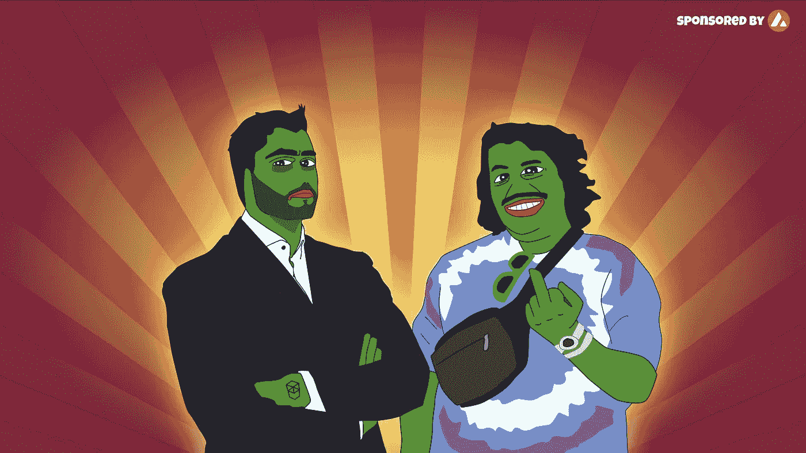
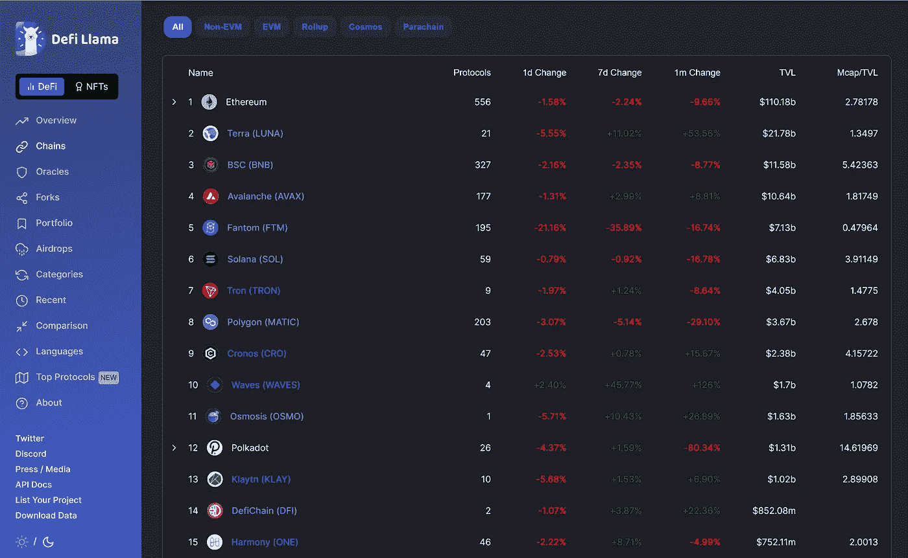

# 青蛙爸爸的消失和凡托姆的垮台。

> 原文：<https://medium.com/coinmonks/the-disappearance-of-the-frog-father-and-the-downfall-of-ftm-81cc77e3e8f6?source=collection_archive---------34----------------------->

你可能会问，谁是德菲的青蛙爸爸？好吧，如果你不知道的话，那就是安德烈·克罗吉。他是 DeFi 的创始人，最著名的是创建了 earn Finance 和 Keep3rV1。

在 2022 年初，当安德烈停用他的推特账户时，有大量关于他离开 DeFi 空间的猜测。

说实话，Andre 的商业伙伴 [Anton Nell](https://medium.com/u/5f2f4f824a41?source=post_page-----81cc77e3e8f6--------------------------------) 今天在他的推特上证实了这些猜测。

我认为安德烈加固了他的项目吗？

**肯定不是。**

我相信他只是在接受所有的戏剧性事件和批评后休息一下。随着最近 Solidly 的推出，他被指责为糟糕的用户界面和错误的界面。

也就是说，Fantom 生态系统遭受了巨大的打击。也导致 Fantom 连锁从排名第三的 TVL 跌至第五。

TVL of DeFi chains

**那么，这对$FTM 及其社区意味着什么？**

基本面还是那个**一样的**。[Crypto banner](https://medium.com/u/2ee241b9d69a?source=post_page-----81cc77e3e8f6--------------------------------)的首席执行官在下面的推文中说得很好。

Fantom 基金会发表了一份关于整个情况的官方声明。

确保每个人都知道$FTM 不是一个人的团队，一切都会好的。

安德烈会回来吗？

我认为下面的推文总结得很好。

**作为投资人，我们应该怎么做？**

HODL 和买多多！这是积累更多$FTM 和$BOO、$LQDR、$BEETS 等优质项目的大好机会。

正如传奇人物沃伦·巴菲特所说:“当别人贪婪时要恐惧，当别人恐惧时要贪婪。”

最佳策略是将美元平均成本投入到这些硬币中，但耐心是一种美德，因为你不想被落下的刀子接住。

以下是推文中的一条总结线索。