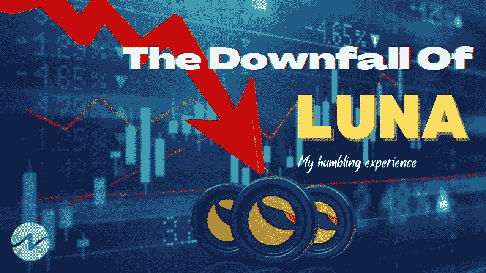
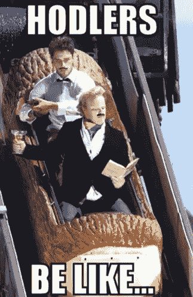
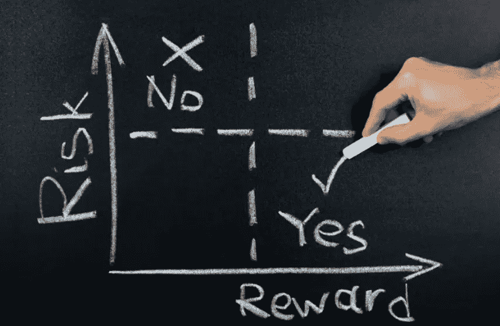
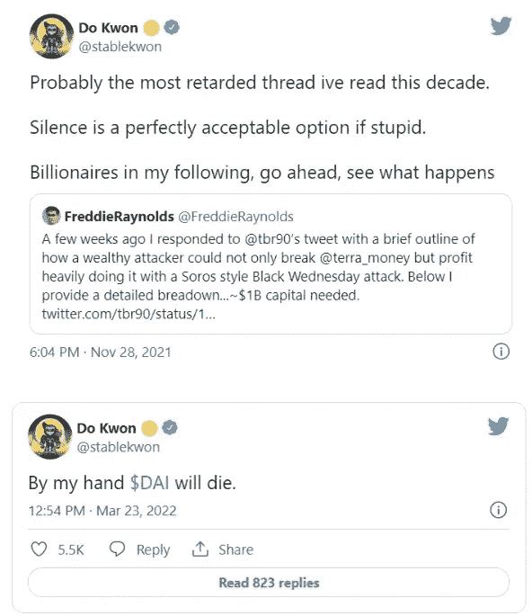
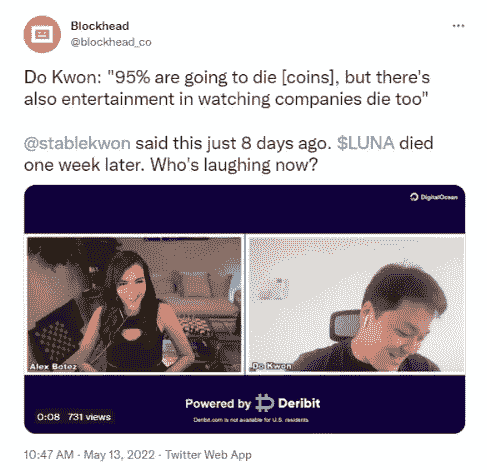
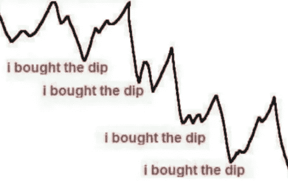
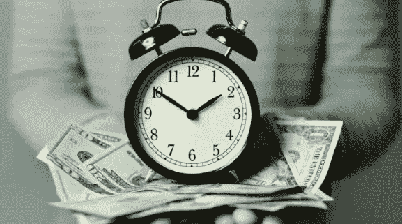
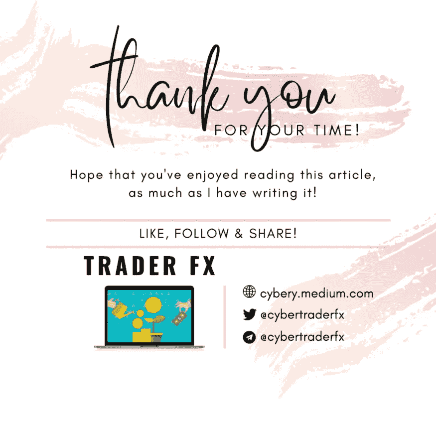

# 卢娜的垮台:我从地球惨败中学到的 8 个教训

> 原文：<https://medium.com/coinmonks/the-downfall-of-luna-8-lessons-i-learnt-from-the-terra-fiasco-3ec361b23d2f?source=collection_archive---------4----------------------->

erra 的成名就像它的崩溃一样引人注目——没有人预见到它会以这样的规模出现，因为 LUNA 在短短几天内从 119 美元(ATH)的历史高点跌至几乎 0 美元，抹去了数十亿美元的投资。我的加密货币投资组合是我认为值得持有的稳定硬币和加密货币的多样化组合——遗憾的是，卢娜和 UST 在名单上，尽管不是非常重要的一部分。随着加密货币市场为 Terra 的惨败而哀叹——这是可以理解的——过去几天，我一直在思考几个重要的学习点，这些学习点是我从这次令人羞愧的亏损经历中获得的，或许稍微丰富了我的投资之旅。

# **#1 情人眼里出西施**

Image taken from Bjor Artworks

正如情人眼里出西施，投资者眼中的价值也是如此。曾经有一种名叫 LUNA 的硬币引发了几乎所有加密货币爱好者的敬畏，因为它在 2021 年的表现令人难以置信，其价值增长了 13，800%，超过了当时大多数领先的加密货币。4 月 5 日，LUNA 飙升至 119.1 美元的历史高点，同时还有大量围绕 Terra DeFi 应用的兴趣。事实上,“月亮”这个名字和硬币本身的标志性符号受到了如此巨大的敬畏和钦佩，因为它不断超越自己，创造新的奇迹——这让加密货币社区兴奋不已。就拿我来说，我已经被 FOMO 带入了市场狂热，一路买进了露娜的部分股票。事实上，没有人会想到曾经被如此敬畏的东西会在一天之内失去它的全部价值！随着市值的大幅稀释和硬币贬值，人们再也不能以同样的方式看待卢娜了，不是吗？

# **#2 止盈/止损——霍丁策略并不总是最好的策略**

如果你一直在投资，你很可能会遇到 HODL 这个术语，它可能是一个朗朗上口的行话，但对语言纯粹主义者来说却是一个祸害！这个词是“hold”的拼写错误，它的起源可以追溯到 2013 年[比特币论坛](https://bitcointalk.org/index.php?topic=375643.0)上的一篇帖子，帖子是由一个喝醉的、半清醒的用户写的，他咆哮着自己糟糕的交易技巧和从那时起简单持有比特币的决心。他几乎不知道，从那时起，经过 HODL 处理的比特币价格已经飙升至其 ATH 的 60，000%以上！因此，HODL-ing 被广泛认为是投资者的首选投资策略，因为很难把握市场时机。

然而，霍德林适合所有人吗？显然不尽然。如果你是交易者，霍德林可能不是最好的策略；如果你是一名长期投资者，并且相信一枚硬币的价值，你可以简单地购买并 HODL 数年，抵制在价格下跌期间恐慌性抛售的诱惑，因为价格最终可能会升值。

HODL ing 适用于所有硬币吗？也许比特币更适合长期 HODL 投资，因为历史一再表明，替代币(除了以太坊)在熊市期间往往会大幅修正并损失很大一部分价值，相比之下，比特币相对表现更好。LUNA 是一个例外，它在短短几天内损失了几乎 100%的价值，证明了这一点。

因此，什么是合适的策略？这因个人投资偏好和风险承受能力而异；但始终要有一个合理的止盈/止损目标。记住，上升的东西，必须下降；另一方面，反过来也不一定总是正确的——因此，通过在必要时止损来保护资本非常重要，尤其是在 LUNA 垮台所展示的单边市场中。

# **#3 多不一定好**

虽然我们人类天生倾向于回报更高的产品，但退一步看看风险与回报的比率或许是重要的——这值得吗？也许带着某种程度的后见之明的偏见回顾过去，人们可以批判性地指出 Terra 生态系统的算法设计中的缺陷和不完善之处，例如高达 20%的锚协议的不切实际的高收益率，这在长期(显然是短期)内是不可持续的，因为它可能会用完激励借贷的 ANC 代币，随后将不得不发行更多的代币，从而使流通中的代币贬值。一个健全的投资组合需要是可持续的；如果一个项目提供的回报听起来好得令人难以置信(尽管如此，在 DeFi 领域也并非完全不可能)，请务必三思，并彻底做好自己的研究，以确定此类投资的价值和可靠性，因为这关系到您的血汗钱！

# **#4 永远保持谦逊！**

Do Kwon，总部位于新加坡的 Terraform Labs 的首席执行官，因为各种错误的原因而成为人们谈论的话题——与其说是因为 Terra 生态系统的明显失败，不如说是因为他(不合时宜的)傲慢，这引发了社区的愤怒，适得其反。跆拳道过去贬低其他实体和加密货币的一系列自负而浮夸的推文被挖掘出来并引起轰动，增加了已经失去亲人的网民的愤怒。一定要记住，一点点谦卑对成功大有帮助！

# **#5 不要接住落下的刀**

永远不要低估加密货币的能力——波动性是它们的中间名。即使有最好的技术分析知识，人们也永远无法预测市场的底部——如果你相信一个硬币的长期可行性和潜力，美元成本平均法是一种策略——少量买入，在你前进时平均你的进场价格；毕竟，把握市场时机是困难的，因为没有人有水晶球可以预测未来。没有人会想到 LUNA 能够在短短几天内完成几乎抹去其全部价值的壮举——在此过程中购买这些股票无异于燃烧血汗钱。除了少量买入之外，或许更好的逢低买入的方式是买入势头的复苏部分，而不是下跌部分——因为谁也不知道下跌是否会继续。永远记住，晚买赚得少，好过过早买损失多。回顾过去，在 LUNA 惨败的情况下，随着低迷的红色日子的进展，采取观望的方法会更好。

# **#6 钱丢了还能赚；失去的时间永远被谴责**

我遗憾地读到投资者在失去毕生积蓄后结束自己生命的消息，他们选择了与 UST 脱钩，这意味着一种稳定的货币与美元保持 1:1 的平价。虽然说起来容易做起来难，尤其是从第三人称的角度来看，但生命的价值远远超过金钱所能量化的——家庭、朋友和生活中许多重要的小事。因为时间确实是终极货币，失去的物质资产总是可以重建和重新获得的，尽管需要付出艰苦的努力；而时间或生命一旦浪费掉，就会永远受到谴责。在这个投资之旅中保持头脑冷静是非常重要的，它肯定会充满起伏——这将我们带到下一点。

# 永远不要把所有的鸡蛋放在一个篮子里

A 从加密货币令牌的选择到游乐场(DeFi/ CeFi)，再到数字资产的安全存储(冷/热钱包)，我始终在各个层面保持多元化的投资组合。没有一项投资是安全的；只有时间能证明。我很幸运，在 4 月份更高的时候，我逃脱了将我所有的稳定币收藏局限在 UST 的诱惑，否则这将意味着绝对的灾难。我的加密投资组合的大部分投资于稳定的国家主要是 USDC(和 USDT，在有限的程度上)和一些在衰落的 UST，在各种为我产生被动现金流的 [CeFi 平台](/coinmonks/the-top-high-yield-cryptocurrency-savings-account-for-stablecoins-with-the-best-signup-bonuses-11e297e7f7e1)，希望对冲我生病的本国法定货币的贬值。一种新的算法稳定币， [USDD](/coinmonks/how-to-earn-60-apr-on-usdd-stablecoin-with-kucoin-a-review-tutorial-ced909409f2c) 这些天来迅速流行起来，它承诺了一种类似的机制，但不同的方法来实现对卢娜的算法锁定。

# #8 永远不要投资你输不起的钱

Image taken from Heartland Boy

总是根据风险对你的投资组合进行分层；加密货币本质上属于所有资产中风险最高(但回报最高)的一种。因此，不言而喻的是，你不应该将你一生的积蓄投资于任何一种加密货币令牌，无论它看起来多么有前途，因为市场并不总是对投资者最友好。尽管我们都是加密货币和分散金融的支持者，但在持牌金融机构中保持一定比例的金融投资组合以备不时之需仍然很重要。

# 乌云背后的一线希望

Image taken from dreamstime

从各种意义上来说，尤娜的垮台真是令人大开眼界；在我哀悼投资损失的同时，我也不断提醒自己抬起头，吸取这些宝贵的人生教训，继续我激动人心的投资之旅。毕竟学习是一生的旅程；没有杀死你的东西，的确让你变得更强！

另一方面，从 Terra 留给我们的混乱中恢复过来，Terra 2.0 即将到来，LUNA 将被空投到它的社区，如 [**提案 1623**](https://station.terra.money/proposal/1623) 所述。在 2022 年 5 月 27 日创世纪时，LUNC、USTC 和 aUST 的合格持有者将在新链上空投 LUNA。

你对此有什么想法？欢迎在下面留下评论。保持安全，抓住投资伙伴，因为这通常是黎明前最黑暗的时刻！

和往常一样，这不是财务建议！而只是我投资过的，觉得值得分享的投资平台。在投资前做好自己的研究，不要存你输不起的钱。下面有什么问题可以随时问我。

*如果你喜欢这篇文章，* [*跟着&订阅*](/@cybery) *！*

*查看以下值得信赖的平台！*

*🎁*[*honey gain*](https://r.honeygain.me/CYBER577DD)*一款被动收入 app，从你未使用的互联网带宽中赚钱。* [*免费获得 5 美元*](https://r.honeygain.me/CYBER577DD) *，无需投资。*

*🎁* [*蛋糕 Defi*](https://cakedefi.com/?ref=677920) *一站式投资平台，以高达 100%的年利率烘焙被动现金流！* [*在 DFI 用 50 美元存款获得 50 美元奖金*](https://cakedefi.com/?ref=677920) *。*

*🎁*[*Nexo*](https://nexo.io/ref/hce5cfdt5o?src=web-link)*一家先进、受监管的数字资产机构，提供即时加密贷款，资产年利率高达 36%，是一家交易所，在 200 多个司法管辖区提供 40 多种法定货币的服务。* [*用 100 美元存款获得 25 美元*](https://nexo.io/ref/hce5cfdt5o?src=web-link) 奖金*。*

*🎁*[*Hodlnaut*](https://www.hodlnaut.com/join/RTbHxuJMX)*一个强大的加密借贷平台，从你闲置的加密货币中产生被动现金流，年利率高达 9.4%。* [*在 USDC 存款 1000 美元可获得 30 美元*](https://www.hodlnaut.com/join/RTbHxuJMX) *奖金，存款 1500 美元可获得 50 美元。*

*🎁*[*Kucoin*](https://www.kucoin.com/r/af/rJH29LZ)*一个庞大的加密货币交易所，提供有趣的产品，如赌注、自由交易机器人和比特币云挖掘服务。*

*🎁* [*火币*](https://www.huobi.com/en-us/topic/double-invite/register/?invite_code=5t5jb) *一个加密货币交易所，提供多样化的产品、免费空投和交易机器人。*

*🎁*[*MEXC*](https://www.mexc.com/en-US/register?inviteCode=mexc-1NAJC)*一家持有 MX 代币的加密货币交易所，有着有趣的列表和频繁的空投。*

*🎁*[*Crypto.com*](https://read.cash/@TraderFX/10-tips-to-maximize-earnings-on-honeygain-an-effortless-free-passive-income-app-68535728#bad-link)*一家位于新加坡的加密货币交易所。* [*得到 25 美元*](https://crypto.com/app/fcbsjmf5pb) *在 CRO 赌赢一张红宝石牌。*

*🎁*[*Pionex*](https://www.pionex.com/en-US/sign/ref/mWhH4v29)*一个免费的多功能套利交易机器人，自动化低买高卖的过程，全天候。*

***针对马来西亚投资者***

*🎁*[*Luno*](https://www.luno.com/invite/EDXG2X)*在 BTC 用 100 令吉购买 BTC 获得 25 令吉奖金！*

*🎁* [*斯塔沙威*](https://www.stashaway.my/referrals/kenleel9jx) *免费投资 6 个月！*

*🎁Wahed code 'KENLIE1' RM10 注册奖金*

*🎁Capbay P2P 代码' 8879c6' RM100 注册奖金*

*🎁* [*亦然*](https://download.versa.com.my/1bAf/referral?deep_link_value=QF218MMB) *用 100 令吉存款获得 10 令吉奖金！*

*🎁*[*KDI*](https://app.digitalinvesting.com.my/registration/signup?referral_code=103433)*用 250 令吉存款获得 10 令吉奖金！*

***接我*** [***中***](https://cybery.medium.com/)***|***[***read . cash***](https://read.cash/r/TraderFX)***|***[***Youtube***](https://www.youtube.com/c/SmartInvestingChannel)***|***[***推特***](https://twitter.com/cybertraderfx)

> *加入 Coinmonks* [*电报频道*](https://t.me/coincodecap) *和* [*Youtube 频道*](https://www.youtube.com/c/coinmonks/videos) *了解加密交易和投资*

# 另外，阅读

*   [Bookmap 点评](https://coincodecap.com/bookmap-review-2021-best-trading-software) | [美国 5 大最佳加密交易所](https://coincodecap.com/crypto-exchange-usa)
*   最佳加密[硬件钱包](/coinmonks/hardware-wallets-dfa1211730c6) | [Bitbns 评论](/coinmonks/bitbns-review-38256a07e161)
*   [新加坡十大最佳加密交易所](https://coincodecap.com/crypto-exchange-in-singapore) | [购买 AXS](https://coincodecap.com/buy-axs-token)
*   [红狗赌场评论](https://coincodecap.com/red-dog-casino-review) | [Swyftx 评论](https://coincodecap.com/swyftx-review) | [CoinGate 评论](https://coincodecap.com/coingate-review)
*   [投资印度的最佳密码](https://coincodecap.com/best-crypto-to-invest-in-india-in-2021)|[WazirX P2P](https://coincodecap.com/wazirx-p2p)|[Hi Dollar Review](https://coincodecap.com/hi-dollar-review)