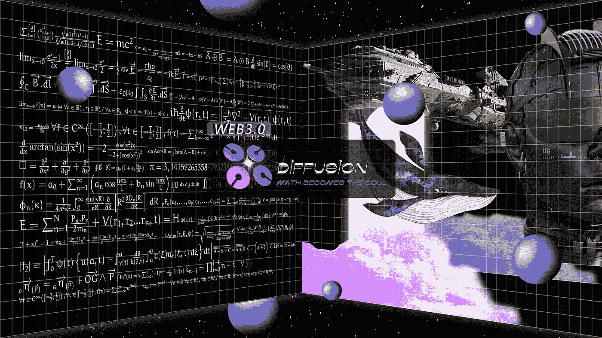

# 《漫道》的双重现实与《漫道》的疯狂多元世界

> 原文：<https://medium.com/coinmonks/the-dual-realities-of-diffusiondao-and-crazy-multiverse-7b4cc0437989?source=collection_archive---------23----------------------->

这篇文章剖析了扩散道的起源和内在逻辑。我们是一个庞大的群体，追求勇敢、严谨、挑战、充满希望而又疯狂的抱负。每一个创始故事都像是一个讲述蝴蝶和飓风的故事。我们更愿意和大家进行思想层面的交流，而不是讲述创始团队的琐碎细节。我们已经在加密货币领域待了这么长时间，但我们一次又一次地深入思考它的未来和数字空间的未来。如前所述，文明的力量正在发生，因为 WEB 3.0 即将到来，它的灵魂即将在数字领域爆发。由于算法涉及积分、拉格朗日乘子、随机序列等。相对来说，很少有人阅读《扩散岛白皮书》。这是导致最初的粉丝在理解扩散道时产生一些困惑的主要原因，也就是它是如何工作的。简单来说，你可以把 DiffusionDAO 理解为 WEB 3.0 或 meta verse 的金融基石，是由一系列经过验证的复杂算法组成的一整套金融系统，可以实现健康稳定的生态系统。发展的效果是保持核心资产 DFS 相对稳定，核心资产不会过度贬值。举一个简单的例子，当 DFS 的市场价格是 50 美元时，如果系统给出的 DFS 内部储备是 47 美元，那么极端的情况发生了，每个人都想出售自己的 DFS，每个 DFS 价值 47 美元，这是迄今为止加密资产从未实现的，但在扩散道，这将成为常态，并证明 DFS 是一种值得信赖的资产。

然而，并不是每个人都熟悉数理金融，因为它更复杂，所以当我们最初设计扩散道时，我们考虑了它可能出现的两个方面。你可以观察到我们的视觉设计已经倾向于更年轻和更有活力的观点。我们希望每一个参与者都能通过传播道达到他们期望的结果，无论是对艺术、名誉还是财富的追求，我们有信心能够提供这样的机会。扩散道的表现形式可以追溯到萨勒的数理金融专业知识和经验。坦率地说，扩散道的存在来自数学，数学金融，因此我们的白皮书清楚地描述了我们的数学模型。其中，比较重要的有新凯恩斯主义的最优货币政策、DSGE 模型和目标通货膨胀率。因此，在扩散道的设计之初，我们考虑的是更好的体验感和创造力。正如我们所提到的，我们想创建一个经济裙带道组织，在那里我们将有很多其他的生态系统开放，这些生态系统充满了机会，创造力，艺术，哲学，以及卓越但并非最不重要的财富。在星光阶段，我们正在开始一个非常重要的阶段，它发生在星光爆炸之后，我们因为大爆炸事件获得了很多好评，并积累了一定的关注度，因为开始扩散道的时机是星光期间最重要的阶段，这就是扩散道的疯狂多元宇宙。扩散道的疯狂多元宇宙正在探索“如果有第二次生命，你会做什么决定”这一哲学问题。相比之下，在过去，有一些主要方面影响着我们的生活，那就是我们的大学，我们的职业，我们生活的城市，甚至我们的伴侣。这些选择对我们的生活产生了巨大的影响，也造就了今天的我们。我们总是在想，如果我们的生活能够重新开始，我们会是什么样子。在 Web 2.0 的世界中，数字空间似乎能够给我们这样一个做出选择的机会，比如经典的角色扮演游戏《魔兽世界》，它让每个人都有机会重新选择职业、种族，以及《魔兽世界》所构建的虚拟空间。战斗，成长，社交，赚取成就。但遗憾的是，Web 2.0 带来的沉浸感在现实世界中往往会产生毒害作用。我们意识到无论我们在游戏中取得了多大的成就，但回到现实世界后，一切都没有改变。换句话说，由于在 Web 2.0 世界中度过的时间，现实世界中的生活受到了损害。生活被过度痴迷 Web 2.0 影响的例子太多了，就不一一赘述了。今天 Web 3.0 的到来，实际上是在解决 Web 2.0 的核心问题，即你创造的东西是否真的属于你，或者你在数字空间的成就是否会让你在现实世界中有所成就。Web 3.0 创造的数字资产目前可能并不完美，但 Web 3.0 创造的数字资产将改变你的现实。你拥有的就是你的。比如闷猿 NFT 的楼面价是 0.01 ETH，持有的人今天能以 90 ETH 的价格卖出。我相信原持有者已经获得了成就和财富。他在 Web 3.0 的世界里所获得的，属于他们这样的人。

最初的 Web 3.0 产品或元宇宙产品往往具有单一的世界观，如无聊的猿，主题只是浴室涂鸦。扩散道与其他产品的本质区别在于，扩散道是由严谨的数学模型推导出来的，也就是说扩散道的整个多元宇宙是由一系列算法推导出来的，这就奠定了良好的经济基础。萨尔说，主系统与多元宇宙非常相似。我们也认同我们喜欢“中央财政协议”这个称呼。我们正在考虑将即将推出的核心产品命名为第一宇宙——金融大都会。DiffusionDAO 的多元宇宙金融中心非常有趣，将很快推出 universe 1 的产品演示，你可以直观地看到，如果你相信你可以给第一个宇宙一个更好的名字，请发邮件告诉我们。相信我，当你的想法被采纳时，我们会给你一笔非常宝贵的财富来感谢你的智慧。

首先，扩散道解决了数字空间急需建立的规范而稳定的经济基础。有了这个基础，你和我，或者数字空间的任何人，都可以充分发挥想象力，在扩散道上构建一个平行宇宙。孵化出的宇宙越多，道本身的扩散就越稳定。关于平行宇宙的一个很酷的事情是，我们在最初的设计中一直在推动不同宇宙的构建，你可以发挥你的想象力，选择不同的宇宙，选择不同的角色，这个选择就是我们最初讨论的“如果生命可以重来，你会怎么选择？”。这一切都要感谢这个建立在 Web 3.0 上的平行宇宙，你在这些宇宙中关注，你创造的一切都会影响或改变你的现实世界。

你可以选择进入一个媒体为王的平行宇宙，成为一个有价值的 KOL，你可以影响很多人，在这个宇宙中获得影响力和财富。同样你可以是其他宇宙的厨师、运动员、银行家、屠龙者、海盗，当然你也可以是龙、飞机、老虎，甚至是莫比乌斯环、纪念碑谷等矛盾人物。，你可以将你的灵魂绑定到你的 NFT，进入这些不同的宇宙。这些不同的选择会给每个人重新选择的机会。由于 WEB3 的到来，你在平行宇宙中获得的数字资产将变成现实世界中的真实资产。当然，这只是兴趣层面的获得，你会得到的远不止这些。上面我们一直在说的说法，是关于生命重新选择的话题，以及重新选择的机会和可能性，很有意思，很刺激，但在这里还不够疯狂而且我想告诉你的是，谁属于扩散道的平行宇宙，那么扩散道的所有平行宇宙都属于你。这是千真万确的，因为我们将把每个平行宇宙的收入权交给发起道组织的人，当第一个宇宙上线时，我们将陆续开放。你可以简单的理解为，你有机会拥有一个运行在 Web 3.0 世界的“魔兽世界”或者“Axie Infinity”，你可以在你的宇宙中获得更多的灵魂和居民，让他们在你的宇宙中做出选择。

在接下来的几周里，你会看到这些平行宇宙。扩散道的平行宇宙正在开放。我们接受社区的提议并实现这些宇宙。我们需要的是您的智慧和建议，您可以给我们发送电子邮件或参加我们的各种现场活动，以描述您对宇宙的看法，并让扩散道将其变为现实。扩散岛非常乐意开放更多的宇宙来满足不同选择的需求。扩散道就像一个空间创造者和观察者，当平行宇宙的数量足够大时，第一个宇宙的鲁棒性会更强，反过来，他会创造更多的平行宇宙，并支持它们的发展。所以，我把题目定为《扩散道的两面》。经济裙带型道组织是一种数学表达。最优货币政策是一个不断调整的算法模型。这是理性的，也是严肃的。《扩散岛》的疯狂多元宇宙色彩鲜艳，身临其境，情绪激昂，这一个给了大家改变的希望，另一个，在严肃的算法下，给了大家安全感。扩散道的两面将更好地支持多元宇宙的发展。我们将很快开始这一阶段。我们希望这些宇宙的出现能给每个人一个选择，给每个人一个未来。

> *加入 Coinmonks* [*电报频道*](https://t.me/coincodecap) *和* [*Youtube 频道*](https://www.youtube.com/c/coinmonks/videos) *了解加密交易和投资*

# 另外，阅读

*   [Bookmap 评论](https://coincodecap.com/bookmap-review-2021-best-trading-software) | [美国 5 大最佳加密交易所](https://coincodecap.com/crypto-exchange-usa)
*   最佳加密[硬件钱包](/coinmonks/hardware-wallets-dfa1211730c6) | [Bitbns 评论](/coinmonks/bitbns-review-38256a07e161)
*   [新加坡十大最佳加密交易所](https://coincodecap.com/crypto-exchange-in-singapore) | [购买 AXS](https://coincodecap.com/buy-axs-token)
*   [红狗赌场评论](https://coincodecap.com/red-dog-casino-review) | [Swyftx 评论](https://coincodecap.com/swyftx-review) | [CoinGate 评论](https://coincodecap.com/coingate-review)
*   [投资印度的最佳密码](https://coincodecap.com/best-crypto-to-invest-in-india-in-2021)|[WazirX P2P](https://coincodecap.com/wazirx-p2p)|[Hi Dollar Review](https://coincodecap.com/hi-dollar-review)