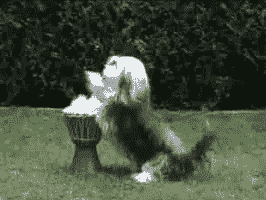
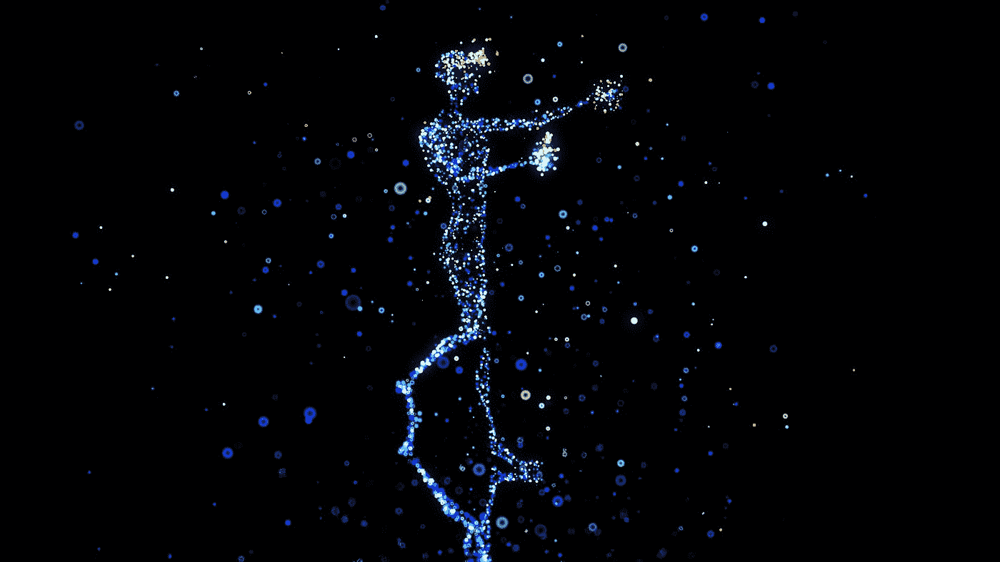
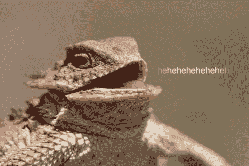

# 我们一生中最简单的宏观加密交易

> 原文：<https://medium.com/coinmonks/the-easiest-macro-crypto-trade-of-our-lifetimes-13f0ed6bd594?source=collection_archive---------19----------------------->

Photo by [Tyler Lastovich](https://unsplash.com/@lastly?utm_source=medium&utm_medium=referral) on [Unsplash](https://unsplash.com?utm_source=medium&utm_medium=referral)

如果你和我一样，那么你对知识和信息有着强烈的渴望，这会让你在宏观投资领域占据优势。

对一些人来说这是编码，其他人是经济学，等等。

虽然我是第一个告诉你在商业世界里没有“免费的午餐”的人…

有生以来，我第一次相信，对于那些认识到机会的人来说，有免费的午餐。

但是在我进入这个话题之前，你必须明白我一直在寻找这样一个机会。

我已经创作内容将近 6 年了，包括写/出版我自己的书(像 ceoat20.org 的)，主持多个播客(像 T4 的【Project EGG】和 [Crypto Gaming Institute](http://cryptogaming.institute/podcast) )，以及发布数百个 YouTube 视频。

在那段时间里，我读了数百本书，与成千上万的人交谈过——包括亿万富翁、NYT 畅销书作家、艾美奖获得者、连续创业者、博士等等——在我的一生中，我可能完成了近 10，000 个小时的学习。

我还建立了大约 8 个不同的企业——包括营销机构、电子商务商店、媒体公司、科技创业公司——担任美国 5000 强中发展最快的公司的合作副总裁，并担任美国顶级 CBD 营销机构的业务发展总监。

**创造、建设、工作、研究、社交、学习等等。我从未遇到过对人类如此重要的机会。**

如果你关注了我最新的内容，那么你可能知道它是什么。

如果没有，请保持开放的心态(媒体已经扼杀了这个词，尽管它很美)，因为它将比几乎任何其他东西都更能触动你的生活。

我们的免费午餐是…

…请击鼓…

**元宇宙！！！！！！！！！**

好的，一半的人在这一点上点击离开。

做他们真糟糕。

让我们首先正确定义元宇宙，因为很多人都在纠结这个问题。

**元宇宙是以数字形式存在的一切事物的总和，包括互联网、照片、音频、视频、文件等。**

现在想一想…

如果随着时间的推移，人类越来越倾向于互联网(智能手机、视频游戏/通话、电脑等)。)，而元宇宙包括互联网，那么逻辑必然要求人类走向元宇宙。

目前，未来的元宇宙最有可能是虚拟现实、增强现实、加密、区块链、web3 和互联网的结合，所有这些都与技术联系在一起。

Photo by [julien Tromeur](https://unsplash.com/@julientromeur?utm_source=medium&utm_medium=referral) on [Unsplash](https://unsplash.com?utm_source=medium&utm_medium=referral)

它将触及生活的方方面面，也将是我们度过时光的地方。

人们不会开车 30 分钟去星巴克喝咖啡——他们会戴上耳机或激活大脑中的芯片，和朋友一起在任何他们想要的虚拟空间中漂浮。

也许他们正在骑着龙与试图接管天王星的邪恶僵尸战斗。

也许他们想回到过去，参观旧石器时代，看看他们最喜欢的恐龙。

或者，也许某个发展中国家的人只是想玩游戏赚更多的钱，而不是做一些无聊的虚拟助理工作。

不管我们进入元宇宙的原因是什么，最终我们都将被迫进入，不管我们愿不愿意。

作为投资者、企业家、内容创作者、游戏玩家，无论是谁，我们都不能不看到未来像一颗爆炸的星星一样在不太遥远的地方闪耀。

人们用一生的时间来寻找这种巨大的趋势或机会，以便他们可以围绕它建立职业生涯，现在你有能力成为 0.01%的人，他们有能力最大限度地利用这种必然性。

我不能告诉你你应该如何利用这个正在我们眼前建设的明显巨大的产业，但我恳求你考虑一下。

不管你现有的技能是什么，这都是你成功的机会。

看视频，听播客，读文章，参加课程，为某人工作，开始做某事，这些都没关系。

**采取行动。**

我们现在确实处于这一趋势的早期，你可以试验、搞砸、学习、重复很多年，直到你找到属于你的那一份。

我该怎么开枪？

我创办了加密游戏研究所(podcast ),因为我以前曾经采访过这个行业的推动者和转移者，了解 wtf 正在进行，并帮助我社区中的其他人与我一起获得知识。

我主持分散游戏者(播客，因为我以前做过，记得吗？)的团队，这是迄今为止元宇宙最大的赌场。

我帮助 AFKDAO (crypto gaming nft 租赁平台)讲述他们的故事并筹集资金，这样我就可以会见更多的风投/游戏/公会，并与他们合作建立基础设施，以便让下一波主要的游戏玩家加入 crypto。

我经常看视频、听播客、读文章和做研究，所以我尽我所能了解 crypto 正在发生什么。

我帮助那些摇滚的人们联系起来，这样他们就可以为建设元宇宙尽自己的一份力量。

我把我的净资产的很大一部分(不要根据这篇文章来做，请自己做研究)放入 crypto，这样我就可以投资这个领域，磨练我作为投资者的技能，并努力找到我自己通往世代财富的火箭船。

最重要的是，我正尽我所能成为这个未来的一部分。

最酷的是它在工作。

我遇到过一些非常成功的人，目前正在以某种方式或形式与他们一起工作或播种。

毫无疑问，在我聚焦元宇宙的几年内，我将成为这场革命的一部分。

杰夫·贝索斯因为说他创办亚马逊是因为他想建立一个互联网公司，让整个行业围绕着他成长而出名。

我们不必创造下一个亚马逊，但我们应该从这位一代企业家身上学到东西。

不要错过朋友——你的孙子们以后会感谢你的。

> *加入 Coinmonks* [*电报频道*](https://t.me/coincodecap) *和* [*Youtube 频道*](https://www.youtube.com/c/coinmonks/videos) *了解加密交易和投资*

# 另外，阅读

*   购买 Dogecoin 的 7 种最佳方式
*   [iTop VPN 审查](https://coincodecap.com/itop-vpn-review) | [曼陀罗交易所审查](https://coincodecap.com/mandala-exchange-review)
*   [比特币基地 vs 瓦济克斯](https://coincodecap.com/coinbase-vs-wazirx) | [比特鲁点评](https://coincodecap.com/bitrue-review) | [波洛涅克斯 vs 比特鲁](https://coincodecap.com/poloniex-vs-bittrex)
*   [美国最佳加密交易机器人](https://coincodecap.com/crypto-trading-bots-in-the-us) | [经常性回顾](https://coincodecap.com/changelly-review)
*   [A-Ads 审查](https://coincodecap.com/a-ads-review) | [Bingbon 审查](https://coincodecap.com/bingbon-review) | [Mudrex 投资](https://coincodecap.com/mudrex-invest-review-the-best-way-to-invest-in-crypto)
*   [最好的卡达诺钱包](https://coincodecap.com/best-cardano-wallets) | [Bingbon 副本交易](https://coincodecap.com/bingbon-copy-trading)
*   [氹欞侊贸易评论](https://coincodecap.com/anny-trade-review) | [Paybis 评论](https://coincodecap.com/paybis-review) | [Keevo 钱包评论](https://coincodecap.com/keevo-wallet-review)
*   [印度最佳 P2P 加密交易所](https://coincodecap.com/p2p-crypto-exchanges-in-india) | [柴犬钱包](https://coincodecap.com/baby-shiba-inu-wallets)