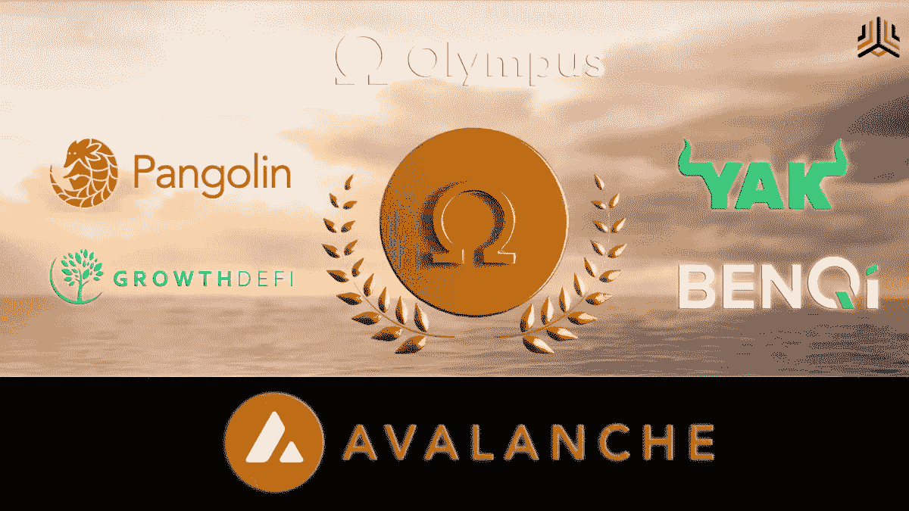

# 最简单的方法

> 原文：<https://medium.com/coinmonks/the-easiest-way-to-get-gohm-6b447b5df8ba?source=collection_archive---------45----------------------->

## 使用雪崩网络

[Credit](https://avalanche.today/olympus-pro-announces-avalanche-cohort-1/).

1.  在[比特币基地](https://coinbase.com/join/macaul_l9)上购买 [AVAX](https://coinmarketcap.com/currencies/avalanche/)
2.  将 AVAX 移动到你的加密钱包，比如 MetaMask(这里有一个简单的[教程](https://support.avax.network/en/articles/4626956-how-do-i-set-up-metamask-on-avalanche)来设置它)
3.  做小额测试交易
4.  连接到 [TraderJoe](https://traderjoexyz.com/home#/) (确保是正确的网站)
5.  从[奥林巴斯文档](https://docs.olympusdao.finance/main/contracts/tokens#gohm)获取 gohm 智能合同地址(这是…