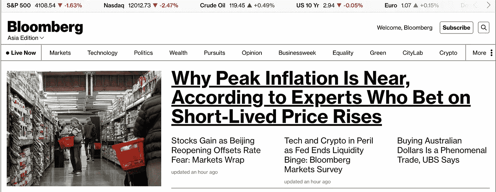
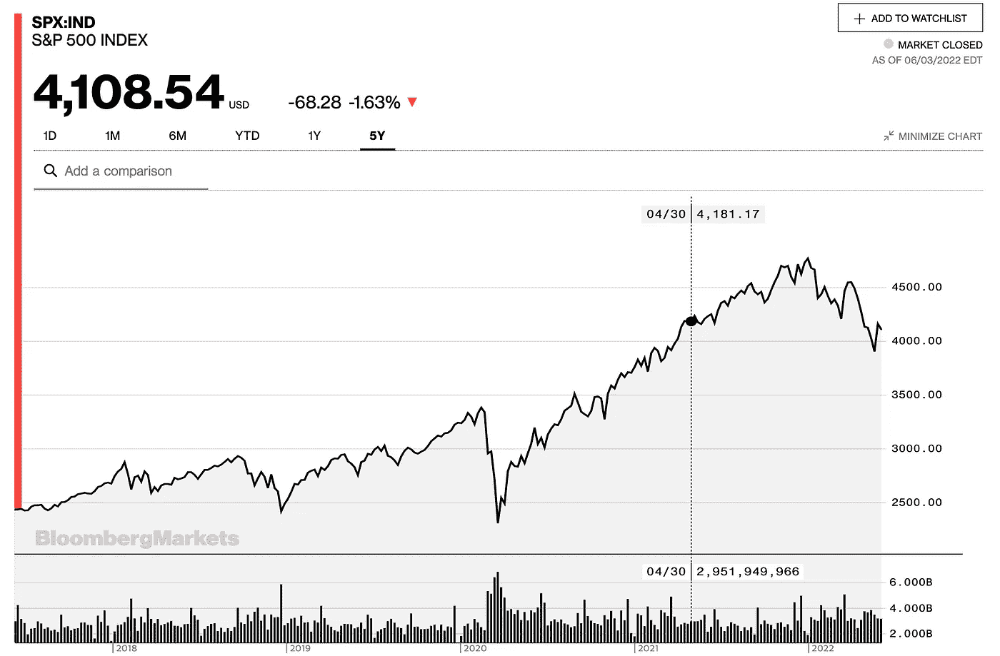
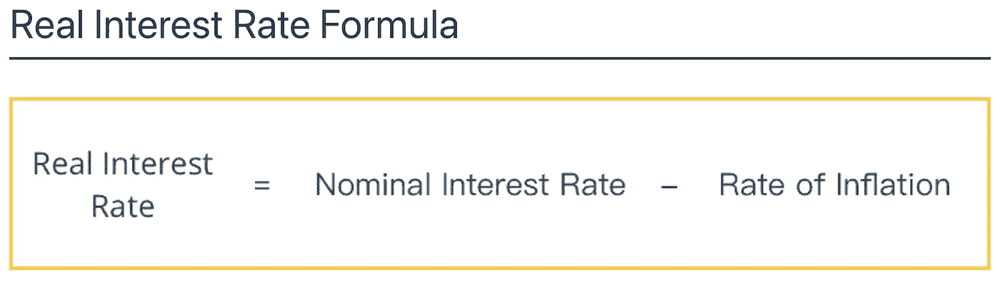
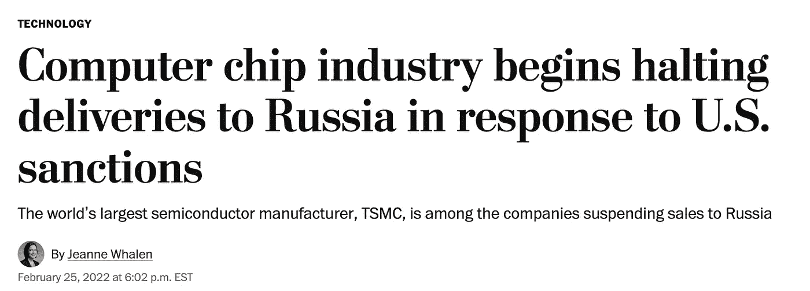
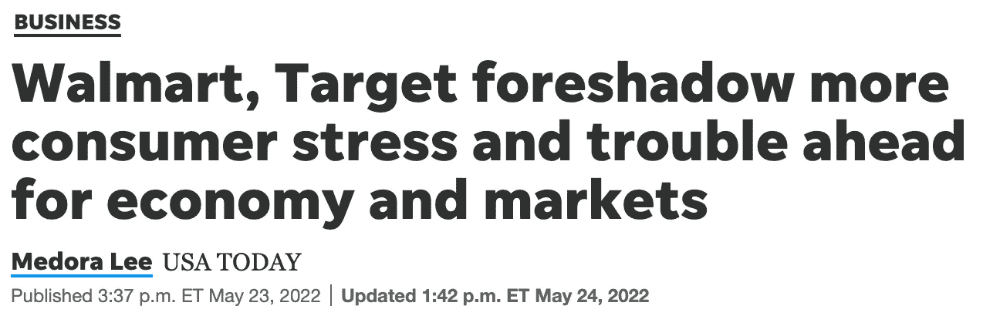

# 经济衰退永远不会到来——对通货膨胀的不同理解

> 原文：<https://medium.com/coinmonks/the-economic-recession-will-never-come-a-different-understanding-of-inflation-342bed19d922?source=collection_archive---------2----------------------->

膨胀，膨胀，膨胀。这几天看新闻越来越没劲儿了。现在有无数关于通货膨胀是否会被抑制，美联储是否会进一步提高利率，以及它是否会导致经济衰退的辩论。没人知道，直到那天到来。然而，目前的市场气氛似乎从来没有现在吉祥。在俄罗斯入侵后，油价仍然保持在 100 美元以上，由于上海封锁，供应链处于危险之中，通货膨胀率仍然居高不下，尽管有一个微妙的见顶迹象(同比 8.5%至 8.2%)。沃尔玛和塔吉特遭遇收入冲击，特斯拉宣布减薪 10%。我最近看到的唯一积极消息是石油输出国组织同意增加石油产量。因此，由于一系列明显的不利问题，市场上弥漫着对经济衰退的焦虑和不确定性。看看现在的美国股票市场，它已经抹去了过去两年的大部分收益。

The market has boomeranged to the level of April 2021

然而，为了保持公正的观点，倾听对方的意见总是很重要的。以我的偶像肯·费希尔为首的一群乐观的人否认经济衰退的到来。让我们来看看他们基于什么理由对游戏表现出强烈的信心。

强调一点，我并不是认为衰退不会到来。只是有这个逻辑。所以请以此为参考，自行过滤掉一些不可信的部分。最终，你要为你所有的投资决定负责。

1.  通货膨胀促进经济发展。

这是过度通胀最普遍的副作用:

*   价格上涨
*   货币贬值
*   购买力下降，生产成本上升。
*   变得难以维持生计。

但这是一个平庸和过于简单的教科书解释，在现实生活中是无效的。让我们考虑一下。通货膨胀产品的价值随着时间的推移而增加。那么消费者会怎么做呢？他们在价格飙升前迅速购买产品。因此，通货膨胀会刺激需求。这就是通货膨胀本身如何对经济产生促进作用。

问题自然就来了:“如果加息，那么融资成本就会上升。那经济不就慢下来了？”嗯，这是困在金融界的一个短视的想法。财务人员只处理名义利率。由于利率预计将在今年内从零跃升至 2-3 %,融资成本似乎大幅上升。然而，世界是由人们交易实际商品和服务的实体经济流通的。在实体经济中，重要的是实际利率，而不是名义利率。

如上所示，实际利率是名义利率减去通货膨胀率。虽然美联储提高了基本利率，但经济经历的通货膨胀超过了基本利率。在“实际利率=名义利率-通货膨胀率”的公式中，由于后者比前者上升得多，显而易见，实际利率的值下降了。因此，我们可以把它理解为融资比以前更便宜了。

从我的祖国韩国的例子中，我们可以看到这种逻辑似乎是合理的。一些韩国巨头如三星和现代最近宣布了一些惊人的投资计划。一些人分析这是最近选举的结果——尹总统承诺在竞选期间减少对私营部门的干预。但是，我认为最根本的原因还是通货膨胀。现在实际利率特别低，没有什么比把干粉储存在库存里更糟糕的了。

2.美联储的政策

让我把结论放在最开始。在给定的框架下，美联储和拜登政府目前的意图可以解释如下:

*   a)维持低实际利率以振兴实体经济。
*   b)提高名义利率以抑制金融业过热。

a 部分已经解释过了。让我来发掘 b 部分。

对当前股市暴跌最直接的解释如下:

*   利率上升。
*   融资成本上升，估值中使用的贴现率也上升。
*   股票价格下跌。

这话完全正确，但也可以用“通胀提振经济”的框架来消化。让我们回到通货紧缩时代，以便解开它。

乌克兰战争敲响了集团经济的警钟。这预示着通货膨胀时代即将来临。(我稍后会上传一个关于集团经济的单独故事，但让我简单地介绍一下。请原谅我一段话。)战前，全球经济因分工和比较优势的果实而变得丰富。美国和欧洲等发达国家专注于第三产业和技术，中国专注于制造业，劳动力成本低廉，俄罗斯和中东专注于能源生产，自然资源丰富。由于这种系统的规模经济，供应成本很低。结果，通缩趋势持续了 20 多年。然而，俄罗斯的入侵给该系统的可信度造成了一个缺口。现在，全世界都意识到，面对这样的政治问题，这个经济体系是脆弱的。因此，现在出现了一场世界范围的生产线内部化运动。阿迪达斯撤出了中国，把他们的工厂搬到了德国，而美国现在正试图把 TSMC 和三星这样的半导体制造商叫到他们自己的土地上。这种趋势显然会降低生产效率，并长期支撑通胀。

The world economy is stepping into the phase of deglobalization.

我们不要偏离主题太多。我强调的是，过去 20 年，世界正经历一个通缩时代。我之前说过通货膨胀刺激经济。相反，通货紧缩会导致经济萎缩。通货紧缩意味着商品和服务的价值下降(不考虑折旧和摊销)。从消费者的角度来看，他们会推迟购买，直到价格下降。需求下降了，所以产量也下降了。这导致了投资的停滞。为了弥补这一点，金融业挺身而出，向市场注入流动性。即使该公司处于亏损状态，它也因金融部门的积极投资而得以扩大。这也是近几年风投行业和股市像刚出水的鲜鱼一样扑腾的原因。

然而，市场体制已经改变。由于通货膨胀，公司本身将积极投资。如果金融行业继续像以前一样在通货紧缩时期注入资金，将会使经济产生泡沫。从这个角度来看，加息可以被理解为驯服金融业的一种尝试。

我想引入一些数字来表现专业。我们来对比一下市盈率和债券收益率。首先，S&P500 目前的平均市盈率约为 20 倍。市盈率的计算方法是市值除以 12 个月的净收入。20 的市盈率意味着，如果一家公司保持这一收入 20 年，它赚的钱与该公司当前的市值一样多。其次，我们来看看 10 年期美国国债利率。目前的利率在 3%左右。因此，如果我购买 100 美元的 10 年期美国国债，我每年将获得 3 美元的回报。现在，我们来求市盈率的倒数。标准普尔 500 的平均市盈率是 20，所以它的倒数是 5%。这让你可以直接比较股票和债券的回报。

美国债券的收益率现在是 3%，美国股票的收益率是 5%。目前，两者之间的差异为 2%，如果美联储未来进一步加息，这一差异将进一步缩小。例如，假设美国债券收益率和股票收益率之差缩小到 1%。美国国债是无风险证券。考虑到风险，更多的资金将从股票市场流向债券市场。通过这一过程，加息可以防止金融市场进一步过热。

3.衰退将是短暂的——坎蒂隆效应

在这种情况下，股市将下跌，而经济将继续受到通胀的提振。虽然不会完全控制物价，但无论如何都会振兴经济，所以不会出现衰退。

但是如果我们理解通货膨胀的本质，我们可以合理地预期一个非常短暂的停滞期。这是由于坎蒂隆效应。通货膨胀不足以简单解释为“物价上涨，现金贬值”的现象。这是因为不同商品和服务的价格上涨速度不同。例如，每个人都听到或说出自己的哀叹，包括房价、食品价格和咖啡价格在内的一切都在上涨，除了我的工资。其实不是这样的。劳动力成本最终也会上升。然而，由于劳动力成本的顽固本质，它往往会在最后上涨。这是因为一旦劳动力成本上升，就很难削减。

劳动力成本并不是价格上涨较晚的唯一例子。当有更多的竞争对手，即没有定价权的公司和行业时，价格不会轻易上涨。沃尔玛(Walmart)和塔吉特(Target)就是典型的例子，它们最近遭遇了收入冲击。两者互为对手，互为替代。如果任何一方提高价格，消费者就会被另一方吸收。这就是沃尔玛和塔吉特在何时提价的问题上小心翼翼地相互博弈的原因。而这种时机博弈越久，公司的盈利能力就越差。这是因为在通货膨胀时期，劳动力成本等生产成本已经在上升。

我提出了 Cantillon 效应来解释短暂的经济衰退，但既然我已经解释到这里，让我们更进一步，详细阐述它。就原油而言，通胀启动后，价格将立即飙升。这就是当今经济正在发生的情况。当然，战争的冲击促成了需求的激增。但透过坎蒂隆效应的镜头，由于石油输出国组织具有卡特尔的特征，他们不会玩那种小心翼翼的游戏。他们通过公开讨论来决定价格。苹果是另一个很好的例子。我估计当他们的新产品发布时，价格会有相当大的幅度的上涨。这是因为苹果公司今天将其品牌力量推向了顶峰，它吹嘘自己拥有忠诚的顾客，即使价格变得更贵，他们也会购买。我们称之为定价权。具有较强定价能力的公司和行业能够将通货膨胀的负担转嫁给消费者，因此更有可能在通货膨胀时期生存下来。

总之，回到正题。如此，各行业将会出现价格上涨的时机博弈。这将在短期内显著降低公司的盈利能力。因此，经济可能会遭受短暂的衰退。但这只不过是短暂的调整。在这种情况下，不会出现全面的经济衰退。

4.我个人对美联储政策的看法(没错，是个人观点)

我对市场的看法不变。如果有经济衰退的迹象，美联储将再次变得温和。我警觉地猜测杰伊·鲍威尔可能已经启动了他的速度控制。

中期选举在 11 月。加息在政治上从来都不是好事，因为它会在短期内损害经济。因此，执政党将避免在选举前夕加息。这也部分解释了为什么美联储在上半年匆忙实施大步骤。

此外，市场上的过热已经有所缓解。年通货膨胀率已经从 8.5%上升到 8.3%。股市也回到了 20 年来的平均水平。此外，30 年期抵押贷款利率已升至 5%。在现状上进一步勒紧裤腰带可能很容易引发经济衰退。因此，我认为美联储可能很快会放松一点(如果不放松也没关系)。

5.摘要

让我简单总结一下这篇文章:

*   不会有大的经济衰退
*   这是因为通货膨胀具有刺激经济的作用
*   加息会保留实际利率但拉低名义利率。这将振兴实体经济，但减轻金融市场的过热。
*   然而，由于坎蒂隆效应，预计这将是一次短期衰退。

> 加入 Coinmonks [Telegram group](https://t.me/joinchat/Trz8jaxd6xEsBI4p) 并了解加密交易和投资