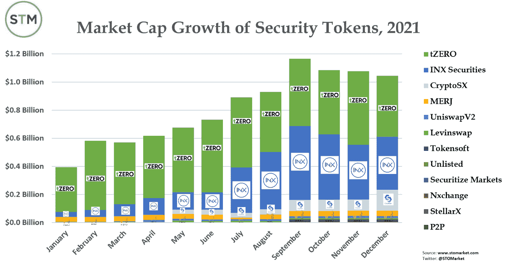
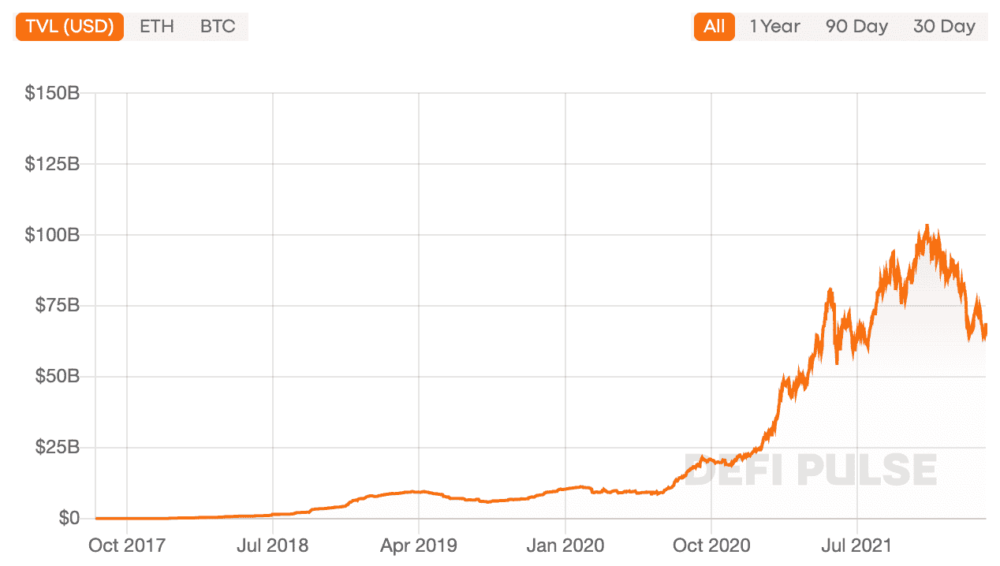
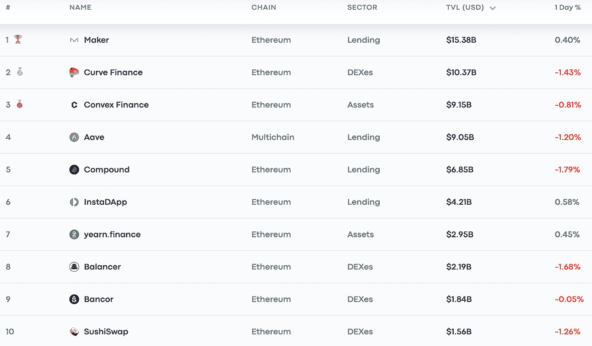
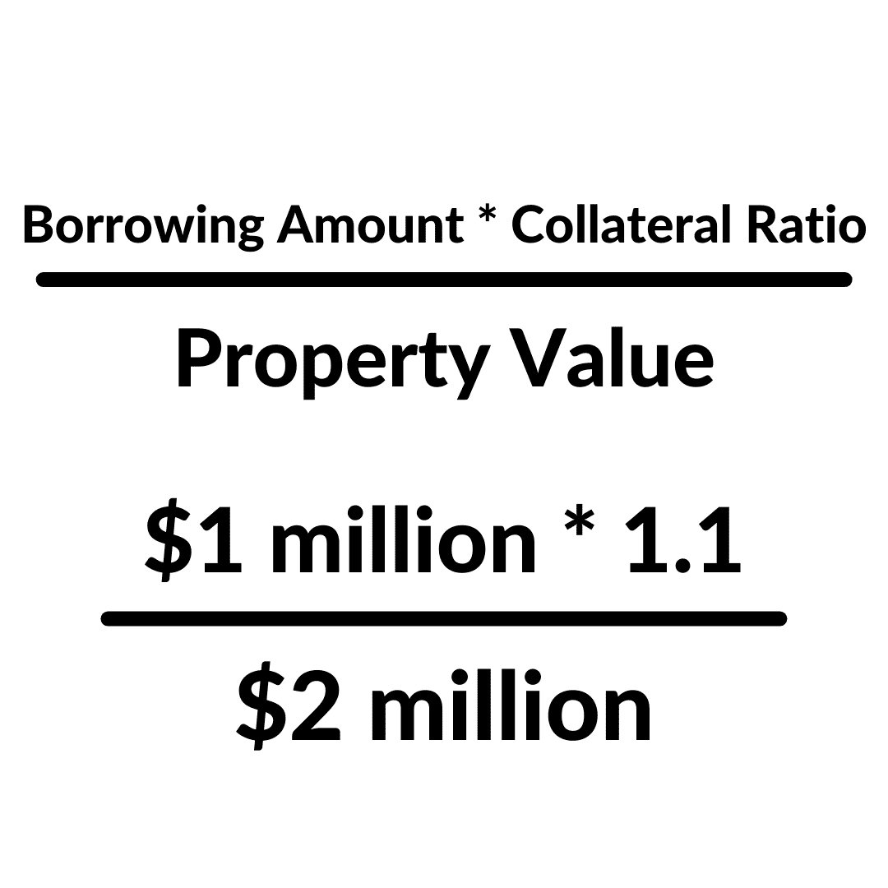

# 数字金融和传统金融的新兴纽带——安全令牌。

> 原文：<https://medium.com/coinmonks/the-emerging-link-in-digital-and-traditional-finance-the-security-token-c6ad4f75d2ec?source=collection_archive---------15----------------------->

真实世界资产的全球化、无摩擦所有权

与许多观点相反，我的信念是，一个更加“无银行”的世界主要不是通过纯粹的数字、链上经济的扩张来实现的，而是通过将物理世界融入数字世界来赋予区块链更多的效用来实现的，反之亦然。到目前为止，安全令牌独立于其将真实世界的资产连接到美国合法的区块链的能力，以及连接加密和非加密人力资源的能力。我将主要介绍安全令牌对传统和数字金融系统的潜在影响，并计划在未来详细介绍更具体的安全令牌主题。

我希望能让不同背景的人接触到有希望的信息，并不时地混合一些个人观点。虽然我不是行业专家，而且我不断发现自己在学习(当今世界没有这样的人)，但我确实相信我有别人可能会觉得有价值的见解和观点。

这篇文章不是很专业，但是如果对一些术语有简单的理解，可能会有所帮助

*   挑战
*   安全性
*   注册 A+，注册 D，注册 S，注册 CF
*   创客道
*   杠杆作用
*   稳定币
*   不动产投资信托公司

**安全令牌简介:**

大多数代币基本上可以分为几类:实用代币、支付代币、不可替代代币(NFT 代币)和安全代币。出于许多原因，安全代币对我来说是最有趣的，同时对精通技术的投资者和传统投资者来说也是如此。

证券令牌是一种资产的数字表示，如房地产、艺术品、股票、天然商品或风险投资基金股份等。简单地说，安全令牌模拟了传统的安全性，只是集成到了区块链中。安全令牌最常见的区别在于其在美国的法律地位，受到 SEC 的监管，并与任何其他证券一样对待，这与不受监管的令牌(如上面列出的其他令牌)相反。证券代币发行(STO 的)通常通过 Reg D、Reg A+、Reg S 以及在某些情况下通过 Reg CF 向 SEC 备案来完成，这允许私人公司通过出售各种证券从投资者那里筹集资金。选择哪种方式向美国证券交易委员会提交 STO，部分取决于你计划筹集多少资金，向合格投资者还是非合格投资者出售，以及定期财务披露的水平。安全令牌体现了加密货币世界中的许多价值，如流动性、部分所有权和全球化经济的促进，同时在美国仍具有合法地位。安全令牌通常代表以下部分所有权:

1.  股权
2.  债务
3.  收入/利润份额

**市场一瞥**

[Source: Security Tokens: Annual PerformanceReview & Outlook for 2022](https://docsend.com/view/ykr3cuj8w877gcuz)

从 2021 年初到 2021 年 11 月，安全令牌市场市值增长了约 26%。在撰写本文时(2022 年 2 月)，安全令牌的市值约为 39 亿美元，最近大幅增长。

[Source: Security Tokens: Annual PerformanceReview & Outlook for 2022](https://docsend.com/view/ykr3cuj8w877gcuz)

到目前为止，房地产一直主导着安全令牌市场，占其使用案例的 30%以上。这可能是因为房地产是流动性最差的资产类别。证券代币提供了流动性，房地产可以从中受益，这将在本文后面详细讨论。

# 传统金融的改进

安全令牌给传统世界带来的是推动加密货币市场价值的一些因素。安全令牌可以为货币和资本市场带来的三大优势是:

1.  **流动性**

“流动性”有时让我觉得是一个吸引注意力的时髦词，但安全标志确实在这种动态中增加了价值。通过证券化、INX 和 tZero 等二级交易所，资产头寸可以很容易地进行交易。理论上，证券代币发行者可以通过提供可以在 365 年 7 月 24 日任何时候买卖的小部分资产来利用“流动性溢价”。这对于投资长期非流动资产特别有用，例如，股票所有权的交易是通过自动市场定价完成的。

在购买时，你的所有权也立即转移到你的账户上，而不是像交易公司的公共股票那样需要两个工作日左右。由于市场的流动性，基础资产受益于反映当前估值的实时定价。

**2。全球化**

我个人最喜欢的安全令牌的特点是，通过区块链的资产所有权不考虑国界。例如，在全球范围内购买美国房地产权益和股票比以往任何时候都更容易，这使得获得高质量的美国投资变得更加民主化。众筹可以从整个世界的投资池中进行，而不仅仅是在美国。美国的风险投资初创公司现在可以通过从世界各地吸引股权投资来筹集资金，从而大幅扩大其潜在受众。打破壁垒，给世界带来同样的投资机会，这就是区块链本身的意义所在。

**3。细分**

最后，安全代币提供了根据你的选择购买大或小比例资产的选择，类似于比特币可以被多达 16 位小数整除。证券代币发行者还可以利用价格溢价，以略高于向少数投资者出售大宗资产的价格，出售非常小的细分资产。与私人公司 IPO 的最低投资额相比，[证券令牌市场](https://stomarket.com/)的研究主管皮特·加夫尼写道:

“关于合格投资者和非合格投资者之间的差异，一个似乎真正有意义的方面是这两个群体的最低投资额。最低投资额为 10，000 美元的产品通常是通过注册 D 或注册 S 为合格投资者保留的，而最低投资额为 500 美元通常表明散户投资者有兴趣。

*来源:* [*国安令牌 2022*](https://docsend.com/view/ykr3cuj8w877gcuz)

与传统市场相比，安全令牌市场的最小值通常非常小，甚至几乎不存在。“象征经济学”由发行者自行决定。例如，为了筹集 100 万美元，它可以被分成 20 万个以 5 美元的价格出售的代币，或者可能是以 250 美元的价格出售的 4 千个代币。

**潜在用例:David**

让我们举一个简单的例子，一个名叫大卫的投资者，他正在选择一个地区购买房产，因为他相信市场正在增长，因此他的目标是从价格上涨中获得回报。一些选项包括

*   购买房产

随着住宅价格中值达到 47.8 万美元的历史新高，自 2000 年以来上涨了 233%，自己获得房产变得前所未有的困难，尤其是在像博尔德公司这样的新兴市场，那里的房屋拥有价格中值为 90.6 万美元。除此之外，这些价格导致住房拥有率持续下降。

*   REIT 的

房地产投资信托基金仍然会招致中间人的成本，因为投资者只获得股息。对于一系列房产，投资者在选择时可能希望的房产特性较少，例如房产位置、住宅与商业、房屋大小、学校区域以及许多变量中的税收特征。

此时，您可能开始理解安全令牌的可能价值，因为您可以拥有选择的**特定**属性的**部分**；因此，大卫选择在当地医院附近的好社区购买 8%的住宅租赁。但现在让我们说，由于市场趋势的原因，大卫决定他想退出他的位置；大卫可以很容易地把他的代币拿到二级交易所，并立即以市价出售，因为房地产证券代币提供了巨大的**流动性**。最后，我没有具体说明大卫的基地在哪里。全球化的区块链的力量意味着大卫可能位于经济不稳定的国家，如委内瑞拉，或者仅仅位于中国，希望利用繁荣的美国房地产市场。

# **对分散融资的改进**

分散金融(DeFi)是区块链对传统银行的回应，向任何有互联网连接的人提供金融服务。随着使用案例的增加，观察 DeFi 如何与发达国家的银行竞争是一件有趣的事情，但同时也为没有发达国家所享受的基本金融服务的国家提供基本银行服务。

DeFi 不断发展以满足消费者的需求并与银行竞争，但如果没有整合物理世界(我将称之为现实世界资产(RWA))，真正“无银行”的想法对大多数人来说是不现实的。

DeFi 协议不断发展，不断创新，以跟上计算机工程的进步，但我将列出许多协议所属的一些服务:

*   借款/贷款
*   保险
*   分散交易所
*   派生物
*   支付

[Source: DeFi Pulse](https://www.defipulse.com/)

DeFi 通过其锁定的总价值(TVL)来全面衡量，这是一个衡量所有协议中委托的资金总额的指标。2021 年 11 月初，TVL 在 DeFi 创下了超过 1000 亿美元的历史最高水平。在撰写本文时，TVL 的 DeFI 为 690 亿美元。

**DeFi 困境**

传统银行有几个主要和次要的功能，但它可以归结为两个基本功能，借款和贷款。这一概念的基本功能是将资金从有剩余资金的经济主体输送到资金短缺的经济主体。顺便提一下，这种借贷是 DeFi 中最大的服务，因为该生态系统旨在削弱传统银行的市场份额。DeFi 中 3/10 的最大协议是借贷平台，在撰写本文时，这三者之间的 TVL 总额约为 310 亿美元。DeFi 借贷与您在当地银行的工作方式非常不同，各有利弊，但使用安全令牌有可能使 DeFi 借贷成为主流。

[Source: DeFi Pulse](https://www.defipulse.com/)

在撰写本文时，最大的借贷协议依次是制造商 DAO、Aave 和 Compound，其中制造商 DAO 的总价值为 150 亿美元。如果你不熟悉这些协议是如何工作的，可以看一个快速视频，比如 [this](https://www.youtube.com/watch?v=aTp9er6S73M) 来理解本节的其余部分。

**问题在于**为了获得贷款，你通常需要存入**价值 100 美元的以太坊，例如为了借 67 美元的以太坊**。Maker 目前的抵押贷款与未偿还贷款比率为 172%，那么为什么还会有人借钱呢？如果你看过视频或者有一个大概的了解，那是因为投资者在某些情况下会利用他们的头寸。但杠杆更多的是一种先进的交易策略，而不是执行传统的银行功能，尤其是世界各地需要的功能。虽然超额抵押并不理想，但重要的是要理解这是目前的现实，因为 DeFi 是分散的，并且基于匿名借款人、贷款人，因此贷款人无法保证借款人会偿还面值。

**证券代币借入&借出**

虽然安全令牌只能将过度抵押率从 150%降低到 110%，例如因为它们由稳定资产支持，而不是易变加密，但它们可以解决从非流动性资产获得流动性的问题。在提到的三个借贷协议中，制造商 DAO 是目前唯一一个通过安全令牌接受真实世界资产作为抵押品的公司，假设抵押品通过了去年刚刚在 2021 年实施的申请。这一点很关键，因为现在借款&通过 DeFi 贷款提供的不仅仅是杠杆，而是与传统银行完全分离的实际借款用例。

**用例:阿廖沙**

让我们通过一个名为 Allyson 的房地产开发商的简单快速的例子来演示这是如何工作的。Allyson 刚刚购买了一块土地，她计划以 200 万美元开发，并计划建造一个仓库，这将额外花费 100 万美元。Allyson 可以向银行或私募股权公司寻求额外的融资来建造她的仓库，但由于严格的银行要求，或股权问题，她决定求助于 DeFi。如果 Allyson 通过了 Maker DAO 应用程序，那么她可以使用安全令牌合法地标记她的属性，以用作抵押品。假设抵押贷款比率为 110%，Allyson 可以抵押 55%的证券来获得价值 100 万的稳定货币 DAI(可轻松兑换成美元)。随着 RWA 在链上的扩展，这样的场景将更加有形，分散融资。

# 展望未来，2022 年及以后

**观众**

采用安全令牌的一个关键问题是谁会接受这项技术？这当然取决于基础资产类型(房地产、股票等)。)，以及所有权类型(股权、债务、收入分享)。受众是寻求投资更安全、回报更稳定的替代产品的本土投资者吗？在区块链寻找安全暴露的非秘密当地人？投资者在熊市中寻找避险工具？随着人们对区块链和加密货币的看法变得越来越两极化(尤其是在去年)，这项技术是否具有吸引传统投资者的价值主张？此外，加密货币会变得更加政治化吗？我认为区块链是打破政治壁垒的手段，给予每个人以最大利益行事的自由。当然还有一些没有答案的问题，但是随着时间的推移，如果有任何技术可以在“数字货币”的话题上把人们对立的货币思想联系起来，那么安全令牌似乎最有潜力，原因如上所述，但也超出了本文的范围。

**关闭思路**

虽然传统金融和分散金融经常被认为是不一致的，但我希望我展示了它们如何以安全令牌的形式共同工作，使双方受益。如果您正在阅读这篇文章，那么我可以保证，您正在见证安全令牌之旅的相对开始，因为它的真实世界用例将区块链带到真实世界才刚刚开始。由于安全令牌的开发还很早，而且其主要价值主张(**合法性**)风险极小，随着世界各地政府法规的不断发展，未来如何对待它们仍存在不确定性。对于任何旨在为世界提供一个更好的自由金融体系的人来说，由于安全令牌，真正的变革从未如此容易实现。

个人资料:

[推特](https://twitter.com/AltoGrayson)简介

[领英](https://www.linkedin.com/in/grayson-alto-243bb21ba/)简介

[中等](http://graysonalto.medium.com)轮廓