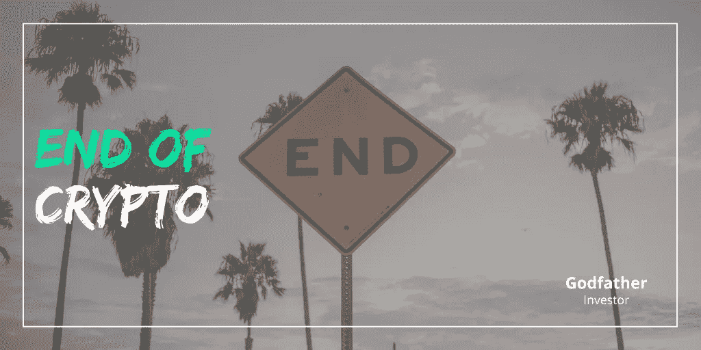

# 密码的终结

> 原文：<https://medium.com/coinmonks/the-end-of-crypto-9cafabcf2638?source=collection_archive---------1----------------------->

## 熊市带来了伤害。没有人喜欢赔钱。如果你正在经历压力和痛苦，要知道你并不孤单。​

美联储及其 0.5%的加息，加上接下来 6 月和 7 月的两次加息(每次似乎都超过 0.5%)，使市场下跌了约 20%。纳斯达克的情况甚至更糟，跌幅高达-30%。