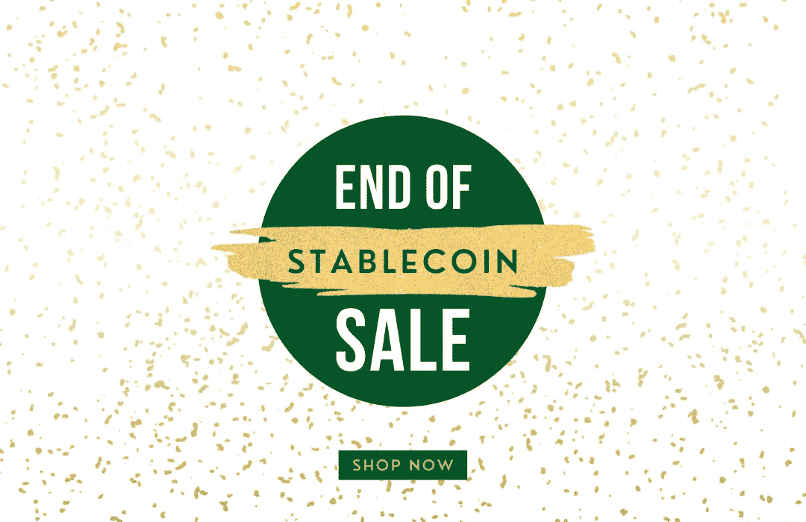

# 稳定币的末日？

> 原文：<https://medium.com/coinmonks/the-end-of-the-stablecoin-4ddd3442373f?source=collection_archive---------47----------------------->

市场崩溃了🔥由于露娜发烧，昨天午夜🤕。

Image credit: [https://www.coindesk.com/markets/2022/05/12/terras-luna-has-dropped-997-in-under-a-week-thats-good-for-ust/](https://www.coindesk.com/markets/2022/05/12/terras-luna-has-dropped-997-in-under-a-week-thats-good-for-ust/)

稳定的 UST 币应该是 1 美元，但实际上是 0.22 美元。这意味着你将花费 1 美元购买 0.22 美元的代币。你立刻损失了 78%的利润。