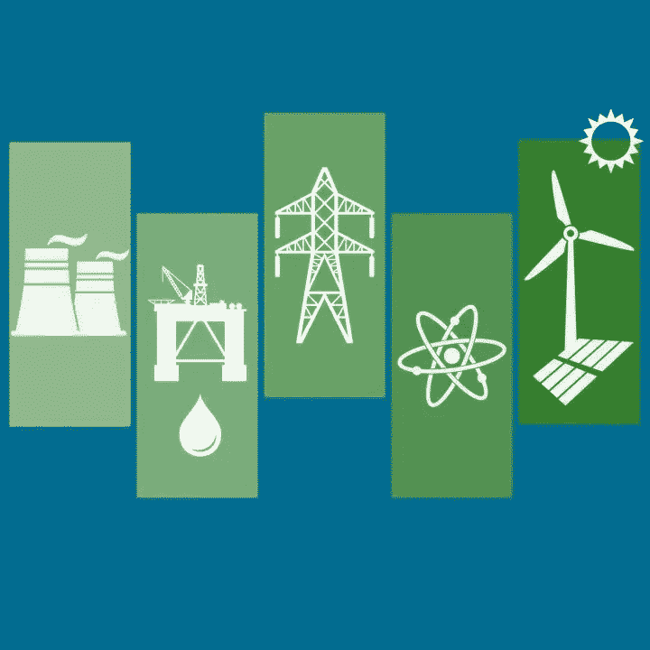
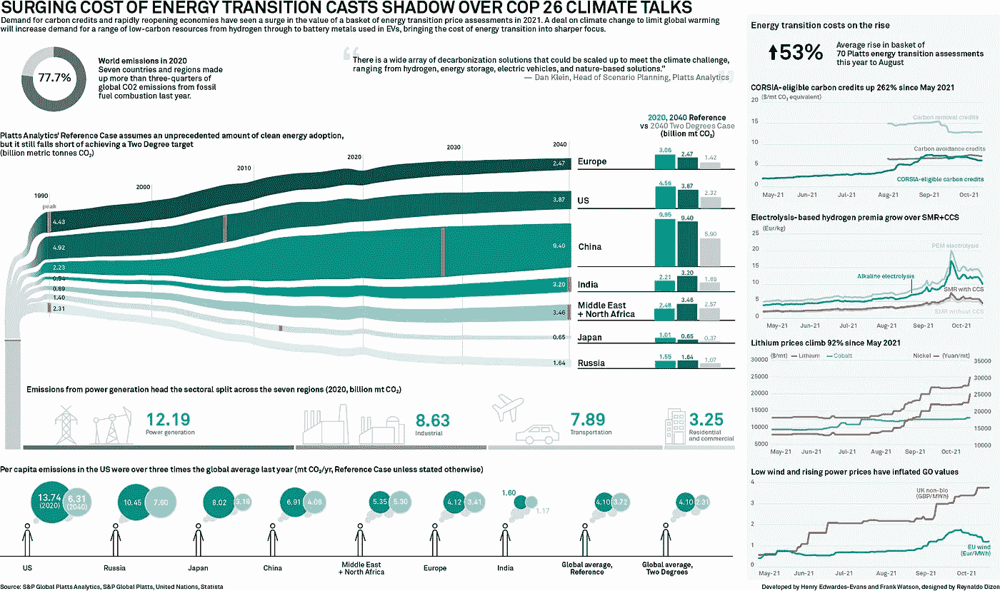
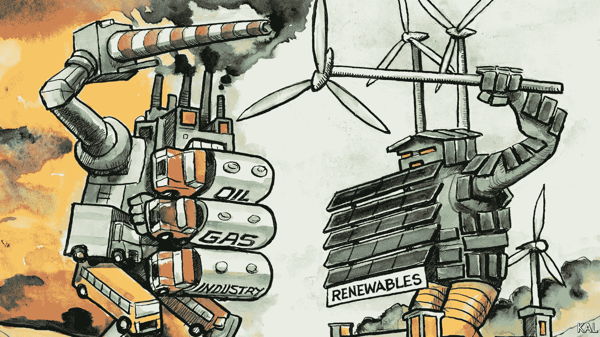
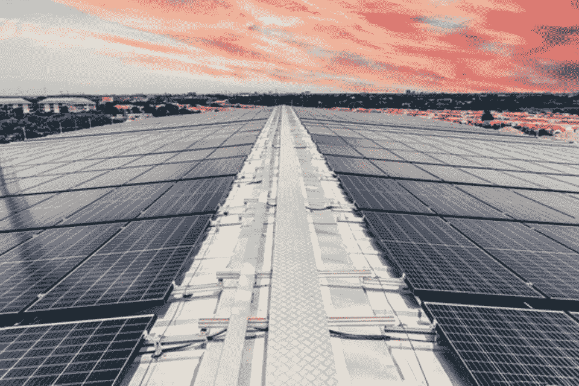
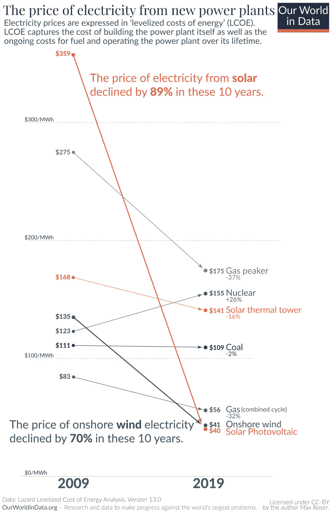
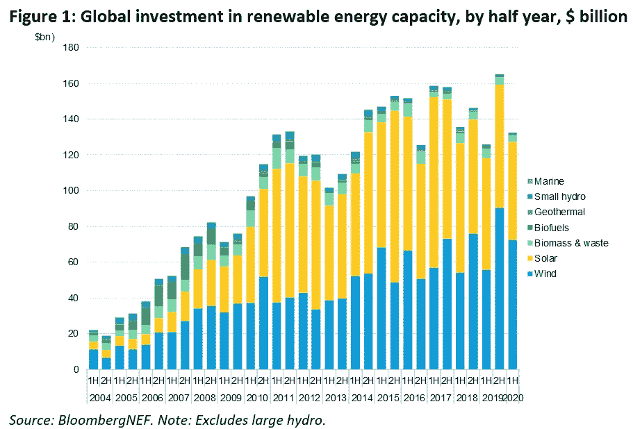

# 能源转型的困境:这不仅仅是成本的问题

> 原文：<https://medium.com/coinmonks/the-energy-transition-dilemma-it-aint-only-a-matter-of-costs-801683882818?source=collection_archive---------57----------------------->

Green energy sources are increasingly affordable, but the transition is struggling to take off.

数据说明了一切:

## 至少在现在的 6 到 7 年里，可再生能源每兆瓦时的成本一直低于传统化石燃料。

*亦作*

## 过去 10 年，太阳能的成本下降了 90%,这要归功于太阳能电池板生产的规模经济，也要归功于技术进步使得太阳能电池组件的效率越来越高。

相反，在过去的十年里，传统来源**的能源生产成本**基本保持不变——除去地缘政治问题:开采、运输和提炼技术没有出现可能导致价格下降的特殊发展。

事实上，这些年来，由于供应困难和其他因素，如战争和不利的地缘政治形势，一些化石原料的价格已经上涨，而且最近比以往任何时候都要高。

## 因此，问题出现了:为什么世界仍然如此依赖天然气、石油和煤炭？

# 绿色能源，但还不够。

一些事情确实正在发生，尽管非常缓慢。在 *2019* ，**全球新增装机容量的 72%** 来自可再生能源，在过去 20 年里，非化石能源的份额甚至增加了两倍。

*然而*，这些数字仍然很小，无法对总体二氧化碳排放量产生重大影响。还因为，根据美国能源部[*的估计，2000 年至 2020 年间天然气的使用量增加了一倍多*](https://www.eia.gov/energyexplained/natural-gas/use-of-natural-gas.php)*，尽管它的排放量*比**煤**或**油**低 60%，但肯定**不能被认为是零影响能源。****

# **成本的变化$$$**

## **在向可再生能源转移的过程中，这种阻力的原因是什么？**

**这个问题主要与**变更**的成本有关。如果建造一个新的可再生能源工厂比建造一个旧类型的工厂更便宜是真的，那么当涉及到**转换**时，这就不是真的了。改造一个燃煤电厂 ***不经济*** ，这也是大能源公司不愿意投资改造的原因。**

****

**正如 Ashley Langer 在《大众科学》中解释的那样，以 T2 和美国为首的能源生产国正处于能源锁定期。**

> ***老的化石燃料发电厂现在已经完全***折旧，生产一个额外单位能量的* ***边际成本几乎接近燃料的成本。******

***另一方面，在可再生能源工厂生产相同单位能量的成本在不久的将来会非常高，因为它贴现了建造新工厂的成本。***

***很明显，这是一种短视的推理，但它符合 ***投资者*** 的期望，他们的目标是从他们的行为中获得最大利润，与传统的能源生产挂钩。***

# ***政治来拯救…还是不拯救？***

******

***在制定和有效实施可再生能源产业能够蓬勃发展的立法框架方面，政治家们并不以敏锐著称；相反，提供化石燃料的矿业公司、*与能源生产商签订的合同通常期限很长，并保证提供数千个工作岗位。****

## ***简而言之，它们是非常微妙的社会和经济平衡，没有哪个统治者愿意插手，并有可能看到他/她的授权受到威胁…***

******

## ***…太多的激励和利益受到威胁…***

# ***技术:一种好的力量***

******

***但是我们到了真正的关键人物:科技可以再次帮助我们。***

> ****根据分析，每兆瓦时的***生命周期成本，即在电厂整个生命周期内计算的成本*，正接近于现有传统电厂增加产能所需的****【30】*******【41】****美元。*******

******

***我们已经(并且仍然)见证了可再生能源价格的大幅下降——根据国际可再生能源机构(IRENA)的一份新报告，无补贴的可再生能源现在通常是最便宜的能源生产来源。***

******报告*** 发现，可再生能源的安装和维护成本是大规模采用的重要绊脚石，继续呈**下降趋势**。除了政府和企业现有的努力，这些较低的成本有望进一步推动可再生能源的大规模采用，有可能实现国际能源署(IEA)提出的到 2050 年实现碳中和零排放的宏伟目标。***

*** [## 4 张图中的零净价之路

### 一项新的研究表明，到本世纪中叶实现净零排放将需要我们的能源系统进行“彻底转变”。

www.weforum.org](https://www.weforum.org/agenda/2021/05/net-zero-emissions-2050-iea/)*** 

# ***道路仍然是向上的……但是有希望***

***O 关于气候变化 ***挑战的最糟糕的误解之一是这是一个很容易解决的问题…******

> ***不幸的是，事实并非如此……这种转变并不容易***

***我们之所以希望该行业有一个光明的未来，可再生能源的部署和采用会更快，是因为它们遵循一条陡峭的学习曲线，而化石燃料则不会；投资受到限制，投资者不愿意部署资本，因为人们认为可再生能源成本高*导致可再生能源风险高，导致需要可再生能源发电资金的个人和企业的贷款利率高*。*****

**但这种观点已经改变，如下图所示，资本已经涌入这个不断增长的行业:**

****

**资本部署，以及其他嵌入在组合中的成分*增加盈利能力，增加发展网络的激励*，以及最后*但并非最不重要的*限制 ***气候变化****——*与时间赛跑——深刻影响人类及其在地球上的生存追求。**

**因此，很明显，政府将在能源转型中发挥决定性作用，例如，通过有利的税收制度支持绿色工厂的建设、这些结构内人员的雇用以及目前在传统能源部门就业的人员在劳动力市场的重新安置。**

****

***更新&最新消息和分析—关注我的* ***推特*** *@FilandroMi***

***额外资源:***

*   **人类与能源:一种交织的永恒关系
    [https://medium . com/coin monks/human-and-Energy-an-twisted-relationship-d29e 7602 ca 51](/coinmonks/mankind-and-energy-an-intertwined-relationship-d29e7602ca51)**
*   **气候变化的代价:
    [https://mirev 89 . medium . com/the-cost-of-Climate-Change-97d6b 23163 E8](https://mirev89.medium.com/the-cost-of-climate-change-97d6b23163e8)**
*   **能源辩论和为什么变化如此缓慢:
    [https://medium . com/the-capital/the-ENERGY-DEBATE-why-we-don-there-change-the-current-system-5 a9 c 60 a 10 a1d](/the-capital/the-energy-debate-why-we-dont-bother-changing-the-current-system-5a9c60a10a1d)**
*   **比特币在能源叙事中的位置:
    [https://medium . com/the-capital/比特币-能源-辩论-b25ca499d3e5](/the-capital/bitcoin-the-energy-debate-b25ca499d3e5)**
*   **可再生能源的学习曲线*信用*到[喜玛拉雅 Bir Shrestha](https://medium.com/u/ba33e6d0d27b?source=post_page-----801683882818--------------------------------):
    [https://towards data science . com/learning-Curve-effect-on-the-global-variable-renewable-energy-deployment-73 D1 e 28 da 390](https://towardsdatascience.com/learning-curve-effect-on-the-global-variable-renewable-energy-deployment-73d1e28da390)**
*   **人工智能和机器学习在可再生能源未来的影响:
    [https://www . Forbes . com/sites/forbestechcouncil/2021/11/30/how-artificial-intelligence-and-Machine-Learning-is-transforming-the-future-of-renewable-energy/？sh=6567aefc541b](https://www.forbes.com/sites/forbestechcouncil/2021/11/30/how-artificial-intelligence-and-machine-learning-are-transforming-the-future-of-renewable-energy/?sh=6567aefc541b)**
*   **核能的竞争性价格:
    [https://world-Nuclear . org/information-library/economic-aspects/economics-of-Nuclear-power . aspx](https://world-nuclear.org/information-library/economic-aspects/economics-of-nuclear-power.aspx)**
*   **按来源分列的电费:
    [https://en.wikipedia.org/wiki/Cost_of_electricity_by_source](https://en.wikipedia.org/wiki/Cost_of_electricity_by_source)**
*   **2020 年可再生能源发电成本美元由*IRENA*:
    [https://www . IRENA . org/publications/2021/Jun/Renewable-Power-Costs-in-2020](https://www.irena.org/publications/2021/Jun/Renewable-Power-Costs-in-2020)**
*   **到 2025 年实现零排放——国际能源机构的研究:
    [https://www . weforum . org/agenda/2021/05/net-ZERO-emissions-2050-IEA/](https://www.weforum.org/agenda/2021/05/net-zero-emissions-2050-iea/)**

> **加入 Coinmonks [电报频道](https://t.me/coincodecap)和 [Youtube 频道](https://www.youtube.com/c/coinmonks/videos)了解加密交易和投资**

# **另外，阅读**

*   **[3 商业评论](/coinmonks/3commas-review-an-excellent-crypto-trading-bot-2020-1313a58bec92) | [Pionex 评论](https://coincodecap.com/pionex-review-exchange-with-crypto-trading-bot) | [Coinrule 评论](/coinmonks/coinrule-review-2021-a-beginner-friendly-crypto-trading-bot-daf0504848ba)**
*   **[莱杰 vs n rave](/coinmonks/ledger-vs-ngrave-zero-7e40f0c1d694)|[莱杰 nano s vs x](/coinmonks/ledger-nano-s-vs-x-battery-hardware-price-storage-59a6663fe3b0) | [币安评论](/coinmonks/binance-review-ee10d3bf3b6e)**
*   **[Bybit Exchange 审查](/coinmonks/bybit-exchange-review-dbd570019b71) | [Bityard 审查](https://coincodecap.com/bityard-reivew) | [Jet-Bot 审查](https://coincodecap.com/jet-bot-review)**
*   **[3 commas vs crypto hopper](/coinmonks/3commas-vs-pionex-vs-cryptohopper-best-crypto-bot-6a98d2baa203)|[赚取加密利息](/coinmonks/earn-crypto-interest-b10b810fdda3)**
*   **最好的比特币[硬件钱包](/coinmonks/hardware-wallets-dfa1211730c6) | [BitBox02 回顾](/coinmonks/bitbox02-review-your-swiss-bitcoin-hardware-wallet-c36c88fff29)**
*   **[BlockFi vs 摄氏度](/coinmonks/blockfi-vs-celsius-vs-hodlnaut-8a1cc8c26630) | [Hodlnaut 审核](/coinmonks/hodlnaut-review-best-way-to-hodl-is-to-earn-interest-on-your-bitcoin-6658a8c19edf) | [KuCoin 审核](https://coincodecap.com/kucoin-review)**