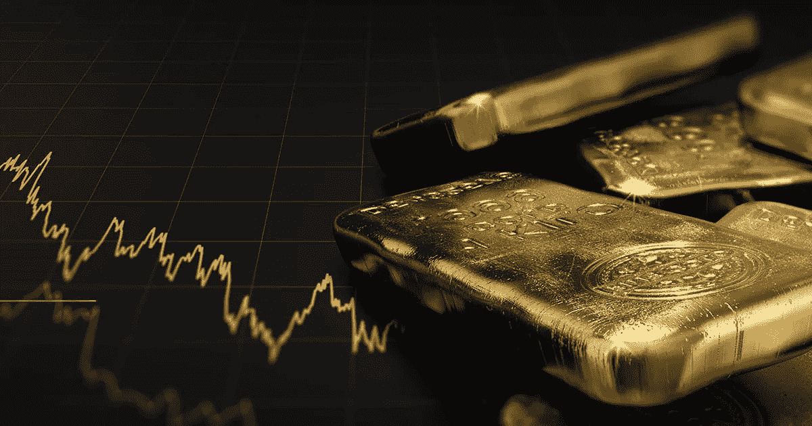
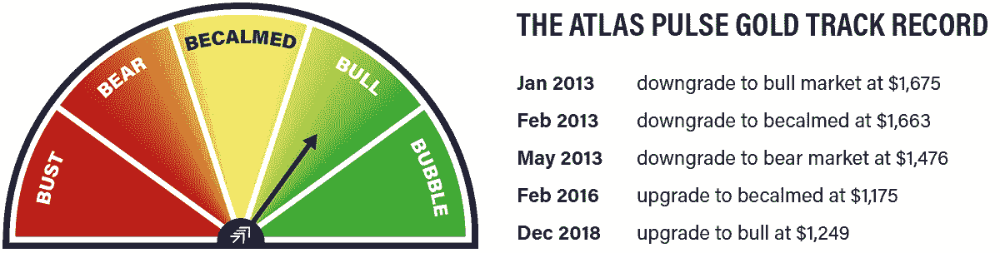
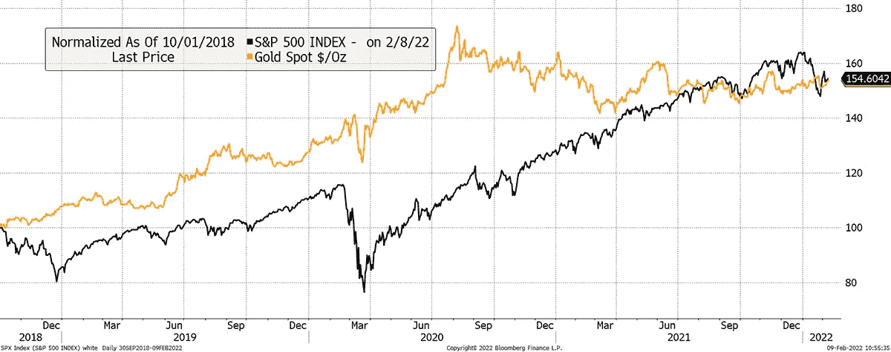
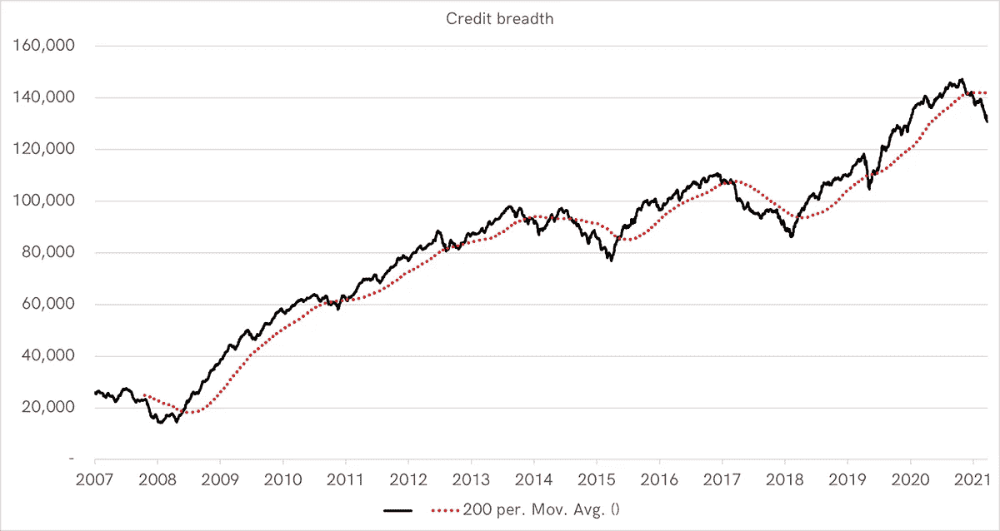
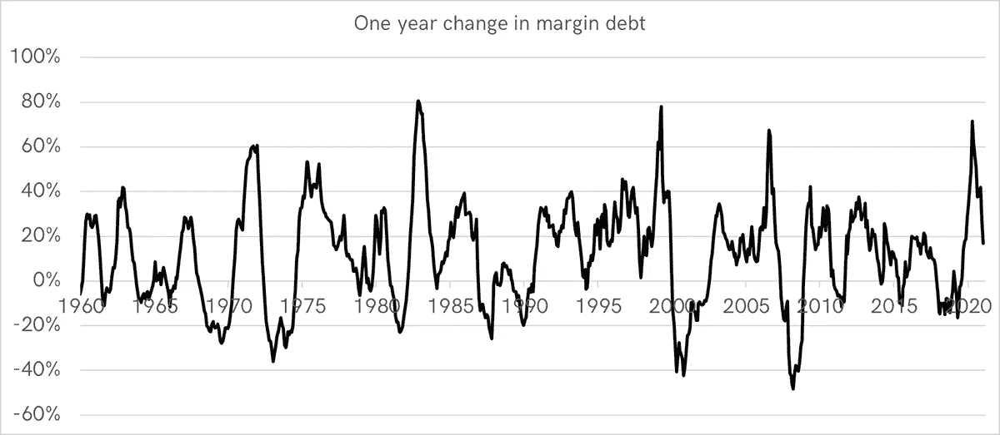
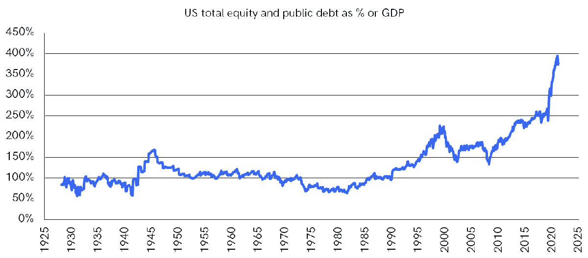
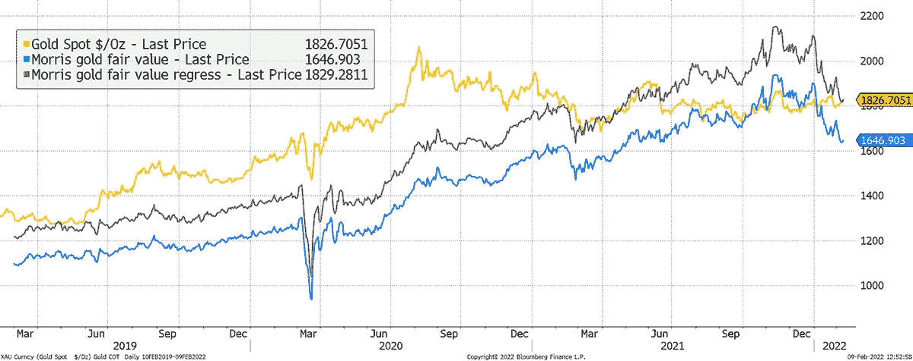
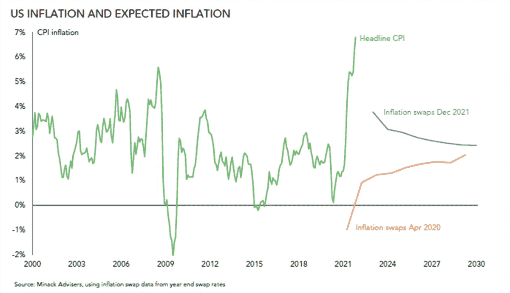
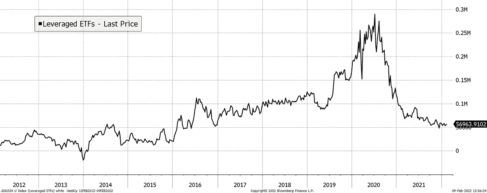

# 股票泡沫破裂

> 原文：<https://medium.com/coinmonks/the-equity-bubble-bursts-64990724a170?source=collection_archive---------24----------------------->

我一直听到同样的老论点。黄金是不值钱的，因为它没有收益，所以无法估价。然而，当出现问题时，精明的投资者会转向它。近几年来，金融市场被挤压得太厉害了，以至于他们已经没什么可给的了。

# 突出

*   股票泡沫已经破裂
*   **宏观:**实际利率上升，但价格保持不变
*   **估价:**公允价值
*   **流量和人气:**看涨
*   **技术:**基地建设

在我们每月的黄金和比特币网络研讨会系列中，我们非常高兴地欢迎邓肯·麦金尼斯。邓肯是 Ruffer 的比特币人，你可能记得他们在 2020 年末有一次非常成功的交易，资金来自他们的黄金头寸。他们认为，比特币不一定会取代黄金，但它有自己的位置，并将永远成为宏观格局的一部分。在 ByteTree，我们同意。

几个月后，Ruffer 卖掉了他们的比特币，因为他们对机构采用的多年预测比他们想象的要快得多。他们看到了高价和炒作周期，获利数十亿美元。最新的资料显示，Ruffer 的黄金和黄金股票敞口回到了 7.7%，这大致是多年来的水平。推断是收益返回黄金。

我们讨论了这两种资产之间的比较，以及宏观经济环境如何可能导致债券和股票的回报率下降、波动性增加以及对通胀敏感的资产环境改善。比特币和黄金都是合适的候选者，但黄金更喜欢避险条件，这就是我们现在的处境。

有这么多的不确定性，黄金是一个强有力的理由，你可以在这里观看采访。我们感谢邓肯深思熟虑的讨论，并期待在二月底与世界黄金协会主席约翰·里德交谈。他不知道的黄金市场不值得知道。

# 政权

从历史上看，当满足以下两个或两个以上条件时，黄金就是一种投资:

1.  短期实际利率低于 1.8%。**真**
2.  以一篮子货币衡量的黄金价格正在上涨，以 35 个月的指数移动平均线衡量。**真**
3.  黄金相对于标准普尔 500 的价格，以 35 个月的指数衡量。**2022 年预测。**

如此多的传统思想家已经放弃了黄金。

> 父啊，赦免他们，因为他们不知道自己在做什么。

我一直听到同样的老论点。黄金是不值钱的，因为它没有收益，所以无法估价。然而，当出现问题时，精明的投资者会转向它。近几年来，金融市场被挤压得太厉害了，以至于他们已经没什么可给的了。

在通缩冲击期间，金价在 2008 年和 2020 年 3 月下跌，人们对此感到困惑。投资者不切实际地认为在危机中黄金应该上涨。如果这是他们想要的，那就买股票看跌期权。但不要指望你的看跌期权会在接下来的牛市中带来可观的回报。当出现问题时，黄金下跌较少，然后在其余时间表现为一种可观的长期通胀对冲。当实际利率崩溃时，它就会飙升。精明的投资者看到了这一点。

从 2018 年 9 月下旬的上一次相对低点(黄金对 S&P)至今，黄金和标准普尔 500 的回报是相同的。然而，听听人们的意见，你可能会认为黄金已经崩溃，而股票已经狂飙突进。这只是一个时机的问题。正如我所说的，它们是一样的。

# 轮到黄金了

Source: Bloomberg. *As described since 1/10/2018*.

股市泡沫已经破裂。股权分散的公司如贝宝(PayPal)36%、脸书 34%和网飞 33%都被击败了。

剩下的 FAANGs 表现得更好，但是他们崩溃只是时间问题。它们只是被错误定价了，没有任何资产可以永远逆潮流而动，尤其是在债务周期结束的时候。

# 宏指令

债券市场的广度已经缩小，这意味着下跌的债券多于上涨的债券。如果有任何疑问，只要看看信贷状况，当它们恶化时，就赶紧避险。不仅仅是债券收益率上升，而且利差扩大的出现也迟早会造成影响。

Source: FINRA. *Number of bonds rising versus falling since 2007*.

债券下跌在 2008 年、2015 年和 2018 年是痛苦的，而这一次，它们有可能变得更糟。看看欧元区就知道了，那里的 10 年期债券收益率仍为 0.2%。回溯到 2011 年，当欧洲债券市场最后一次崩盘时，其收益率超过了 3%。我觉得投资者低估了未来几年的变化空间。

保证金债务正在下降，进一步证明了好日子的结束。最近的峰值跟随先前的峰值所示的示例性轨迹记录。所有这些都导致了金融市场的严重混乱。

Source: FINRA. *Change in margin debt since 1960*.

然后是经济的金融化。将全部股票和公共债务市场加在一起，并显示它们占经济的百分比，可以清楚地看出事情已经发展到什么程度。我们过去认为泡沫中的金融资产是经济的 200%,然而今天是 400%。我们以前从未接近过这些水平，1980 年以前，平均水平约为 100%。

Source: Bloomberg, BTAM

当有证据表明熊市已经来临的时候，金融市场却不合理地沾沾自喜。

# 估值、流量和情绪

黄金的估值仍然有利，但不再便宜。最近几个月，我扩展了估值方法，纳入了两种最适合的方法；一个回归和一个平均值。两者相差 180 美元或 10%，从大的方面来看，这还不算太差。

# 黄金仍在公允价值范围内

Source: Bloomberg. *Morris gold fair value methodologies and gold past three years. To see this model,* [*please visit ByteTree Terminal*](https://terminal.bytetree.com/gold/valuation) *where it is updated daily*.

问题在于，债券收益率正在上升，而通胀预期却没有上升。这种二分法来自于这样一种信念，即过去的事情没有改变。我们有一个后封锁的繁荣，那里有供应链热点，但现在封锁已经结束，事情已经恢复正常。这意味着通胀下降，而债券收益率上升，为失控的增长降温。这是一种普遍的看法，但我们并不认同。

这很乐观，但仍是主流观点。在邓肯·麦金尼斯(Duncan MacInnes)的采访中，他指出，利率和通胀前景往往是极其错误的。2020 年 4 月，流行的观点是，总体价格水平将会崩溃，因为我们在封锁期间没有花太多钱。到底发生了什么？出现短缺，价格飙升。事情在变化，也许我们不应该相信一致的市场观点。

Source: Minack Advisers

尽管金价比一个月前更高，但它的价值还是相当可观的，并能在风暴中提供安全保障。如果对通胀的看法发生变化，我们认为这种可能性很大，那么任何上涨都将受到基本面的支撑。

不难看出黄金价格会上涨，因为定位仍然很低。ByteTree 的 ETF 流量数据正在改善，但更好的是市场上缺乏投机者。我们处于 2016 年初看到的相同水平，当时金价刚刚超过 1000 美元，没有人在乎。

# 没有人再投机黄金了

Source: Bloomberg. *Leveraged gold ETFS long less short assets $000s since 2012*.

# 摘要

Ruffer 打得很好。他们看到风险条件在 2020 年末回归，用少量黄金换取比特币，将利润打包并回购黄金。壮观。

黄金很少在牛市中表现良好，投资者持有黄金可能会表现不佳。这就是为什么黄金击败标准普尔 500 是关键，因为它给了投资者信心，他们不会表现不佳。这正在发生，我相信这还会持续一段时间。

我很看好。感谢您阅读*寰脉*。

本文作者是 ByteTree 的联合创始人兼首席投资官**查理·莫瑞斯**。这篇文章是从我们的网站上交叉发布的，最初发表于 2022 年 2 月 9 日。

访问 [**ByteTree 终端**](https://terminal.bytetree.com/) 获取实时跟踪的**比特币**链上数据。我们还跟踪**以太坊**、**黄金**和**白银**的资金流。

[**订阅**](https://bytetree.com/mailing) 我们的邮件列表，免费每周更新。

> *加入 Coinmonks* [*电报频道*](https://t.me/coincodecap) *和* [*Youtube 频道*](https://www.youtube.com/c/coinmonks/videos) *了解加密交易和投资*

# 另外，阅读

*   [3 商业评论](/coinmonks/3commas-review-an-excellent-crypto-trading-bot-2020-1313a58bec92) | [Pionex 评论](https://coincodecap.com/pionex-review-exchange-with-crypto-trading-bot) | [Coinrule 评论](/coinmonks/coinrule-review-2021-a-beginner-friendly-crypto-trading-bot-daf0504848ba)
*   [莱杰 vs n 格拉夫](/coinmonks/ledger-vs-ngrave-zero-7e40f0c1d694) | [莱杰纳诺 s vs x](/coinmonks/ledger-nano-s-vs-x-battery-hardware-price-storage-59a6663fe3b0) | [币安评论](/coinmonks/binance-review-ee10d3bf3b6e)
*   [Bybit Exchange 审查](/coinmonks/bybit-exchange-review-dbd570019b71) | [Bityard 审查](https://coincodecap.com/bityard-reivew) | [Jet-Bot 审查](https://coincodecap.com/jet-bot-review)
*   [3 commas vs crypto hopper](/coinmonks/3commas-vs-pionex-vs-cryptohopper-best-crypto-bot-6a98d2baa203)|[赚取加密利息](/coinmonks/earn-crypto-interest-b10b810fdda3)
*   最好的比特币[硬件钱包](/coinmonks/hardware-wallets-dfa1211730c6) | [BitBox02 回顾](/coinmonks/bitbox02-review-your-swiss-bitcoin-hardware-wallet-c36c88fff29)
*   [BlockFi vs Celsius](/coinmonks/blockfi-vs-celsius-vs-hodlnaut-8a1cc8c26630)|[Hodlnaut 点评](/coinmonks/hodlnaut-review-best-way-to-hodl-is-to-earn-interest-on-your-bitcoin-6658a8c19edf) | [KuCoin 点评](https://coincodecap.com/kucoin-review)
*   [Bitsgap 审查](/coinmonks/bitsgap-review-a-crypto-trading-bot-that-makes-easy-money-a5d88a336df2) | [Quadency 审查](/coinmonks/quadency-review-a-crypto-trading-automation-platform-3068eaa374e1) | [Bitbns 审查](/coinmonks/bitbns-review-38256a07e161)
*   [密码本交易平台](/coinmonks/top-10-crypto-copy-trading-platforms-for-beginners-d0c37c7d698c) | [Coinmama 审核](/coinmonks/coinmama-review-ace5641bde6e)