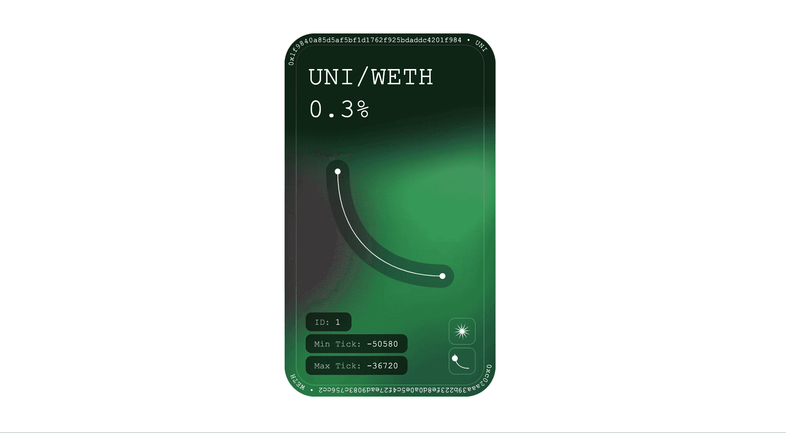

# 不可替代代币的本质(NFT)以及我们在 NFT 身上遗漏了什么

> 原文：<https://medium.com/coinmonks/the-essence-of-non-fungible-token-nft-and-what-we-are-missing-about-the-nft-d185889b2953?source=collection_archive---------30----------------------->

**Uniswap v3 Position NFTs of Opensea**

在区块链，有两种代币；一个是代表“价值”的令牌，称为 ERC-20，另一个是代表“权利”的令牌，称为 ERC- 721 或不可替代的令牌(NFT)。

自从毕普的《NFT》拍卖以来，许多媒体都把非物质文化遗产作为数字收藏来关注。然而，NFT 并不是数字收藏的专利。**NFT 的真正本质是代表着**区块链中某种东西的“正确”。

## ERC-20 代表“价值”，ERC-721 代表“权利”

Process of minting **coin**

Process of minting **token**

在著名的区块链网络以太坊中，方块生成者(矿工)获得一枚硬币(以太)作为方块生成的奖励。

然而，随着以太坊生态系统扩展到各种分散式应用程序(Dapp)，或分散式财务(DeFi)，以太坊生态系统需要一个标准化的界面来表示硬币。

读者可能会认为已经有硬币了，那我们为什么还需要一个新的界面呢？

如果你在交易所经历过加密交易，你会认为`我交易硬币没有任何问题。怎么了？`

加密交易没有问题，但在 Dapp 或 DeFi 中使用硬币效率很低。

在 Dapp 或 DeFi 中，有各种服务，例如交换有价值的东西，但是硬币对于这些服务来说是低效的，因为一些原因，例如高成本费用和兼容性。因此，诸如 ERC-20 和 ERC-721 的标准化接口令牌被提出用于 Dapp 和 DeFi 的高效服务。

我们可以在现实世界中找到这种高效服务的系统。例如，航空公司，如卡塔尔航空公司和阿联酋航空公司，在乘客为航班支付货币时提供里程，乘客可以在以后用里程换取机票。如果我们把现实世界的货币和里程数放到区块链生态系统中，这些就相当于硬币和代币。

具体来说，ERC-20 令牌代表以太坊生态系统中具有“价值”的东西，因此我们可以在 Dapp 或 DeFi 中使用 ERC-20 令牌进行易货交易，就像我们在现实世界中使用航空公司服务的里程数一样。

然而，要覆盖以太坊生态系统中的各种服务，**以太坊生态系统不仅需要一个代表“价值”的令牌，还需要一个代表“权利”的令牌**

让我们想想现实世界中的“对”。如果爱丽丝为一次飞行支付货币，航空公司不仅给里程，代表物物交换的“价值”，而且给机票，代表乘坐该航班的“权利”。

ERC-20 代表了以太坊生态系统中有“价值”的东西。那么以太坊生态系统中什么代表“对”？这就是被称为 NFT 的 ERC-721 出现的原因。

**代表着“正确”是 NFT 的精髓。**

## NFT 的精髓

Image from [Pixel](https://www.pexels.com/ko-kr/photo/7578901/)

我已经提到代表“正确”是 NFT 的精髓。那买 NFT 的意义是什么？

购买 NFT 意味着购买某物的“权利”。

为了更好地理解购买某物的“权利”，让我们看看现实世界中购买“权利”的案例。最常见的例子是房地产，如土地或建筑物。

比如爱丽丝买楼，并不是说爱丽丝把楼装在口袋里带来，而是说爱丽丝把楼的“权利”装在口袋里带来。也就是说，爱丽丝可以通过出租或出售**大楼来赚钱，因为爱丽丝拥有**大楼的“权利”。

让我们回到 NFT。很多媒体或内容平台铸造 NFT，投资人购买 NFT。现在，我们必须认识到有些事情很奇怪。**投资者购买了代表内容“权利”的 NFTs，但投资者并不拥有任何内容权利**。除了卖出 NFT，投资者还能利用他们的 NFT 赚钱吗？

例如，让我们假设网飞用乌贼游戏的第一集创造了 NFT，并把它卖给了爱丽丝。爱丽丝能用爱丽丝的 NFT 赚钱吗？在目前的 NFT 市场上，爱丽丝唯一能赚钱的方法就是通过出售鱿鱼游戏《第一集 NFT》来获利。尽管网飞出售了《鱿鱼游戏》第一集的“版权”,但网飞仍然利用《鱿鱼游戏》第一集赚钱。

如果人们不能利用建筑物的“权利”赚钱，他们就不会购买建筑物的“权利”。然而，在 NFT 市场，这些事情正在发生。

目前，我们忽略了购买 NFTs 意味着购买内容的“权利”，就像购买内容的版权一样。然而，许多媒体和平台在没有给 NFT 投资者任何内容“权利”的情况下制造和销售非网络电视。

NFT 的价格不是泡沫，而是合理的，如果投资者获得 NFT 内容的真正“权利”，因为我们可以预计，随着内容的价值增加，NFT 的价值也会增加。

然而，如果 NFT 持有者没有任何“权利”，这就是荒谬的交易，购买动作玩偶肯定比购买 NFT 更好。

Image from [Pixel](https://www.pexels.com/ko-kr/photo/1716861/)

## NFT“权利”的正确使用方式

Image from [Uniswap](https://uniswap.org/blog/launch-uniswap-v3)

在我看来，NFT 最显著的使用案例是 Uniswap v3 的流动性池(LP) NFT。

在 Uniswap v3 中，当 Alice 给 LP 流动性时，Alice 得到一个代表流动性的 NFT。例如，如果爱丽丝给 LP 10 个醚和 10 个 Dai 作为流动性，爱丽丝得到 LP NFT，表示“你有 10 个醚、10 个 Dai 和流动性奖励的‘权利’”。因此，如果鲍勃向爱丽丝购买 LP NFT，鲍勃获得爱丽丝的乙醚、DAIs 和清算奖励的“权利”。

如果你不熟悉 Uniswap，你一定很容易理解，如果你想象像 Alice 一样用 10 个 Ethers 和 10 个 DAIs 建造一个公寓来获得租房费用，Bob 从 Alice 那里购买了这个公寓。

## 下一步是什么

在这篇文章中，我介绍了我们必须了解的 NFT。

在下一篇文章中，我打算写关于使用 NFT 在期货市场交易的内容。这还没有被证明是有利可图的，但我认为这将是 NFT 未来的一个使用案例。

> 加入 Coinmonks [电报频道](https://t.me/coincodecap)和 [Youtube 频道](https://www.youtube.com/c/coinmonks/videos)了解加密交易和投资

# 另外，阅读

*   [币安期货交易](https://coincodecap.com/binance-futures-trading)|[3 commas vs Mudrex vs eToro](https://coincodecap.com/mudrex-3commas-etoro)
*   [如何购买 Monero](https://coincodecap.com/buy-monero) | [IDEX 评论](https://coincodecap.com/idex-review) | [BitKan 交易机器人](https://coincodecap.com/bitkan-trading-bot)
*   [CoinDCX 评论](/coinmonks/coindcx-review-8444db3621a2) | [加密保证金交易交易所](https://coincodecap.com/crypto-margin-trading-exchanges)
*   [红狗赌场评论](https://coincodecap.com/red-dog-casino-review) | [Swyftx 评论](https://coincodecap.com/swyftx-review) | [CoinGate 评论](https://coincodecap.com/coingate-review)
*   [Bookmap 评论](https://coincodecap.com/bookmap-review-2021-best-trading-software) | [美国 5 大最佳加密交易所](https://coincodecap.com/crypto-exchange-usa)