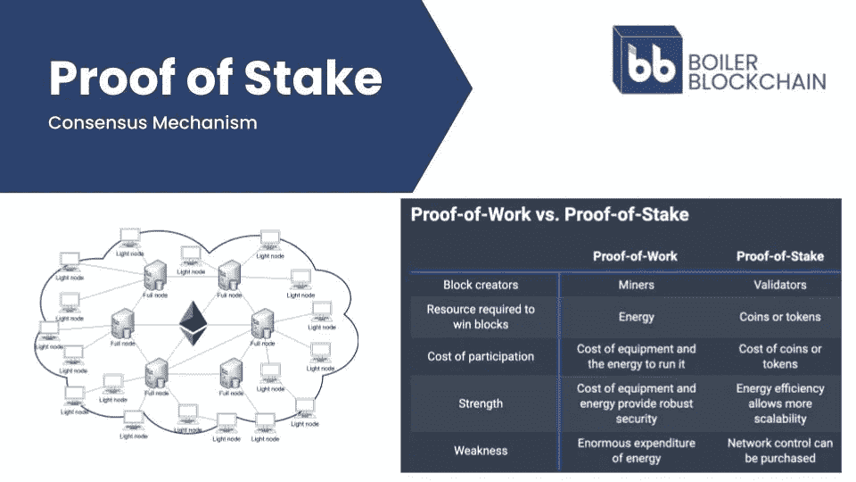
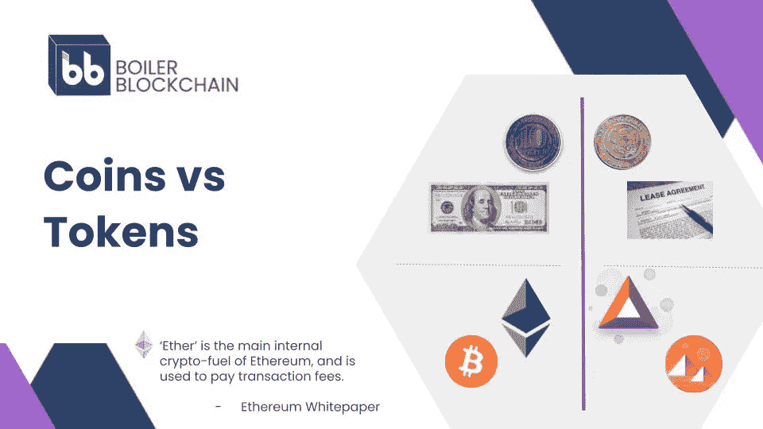
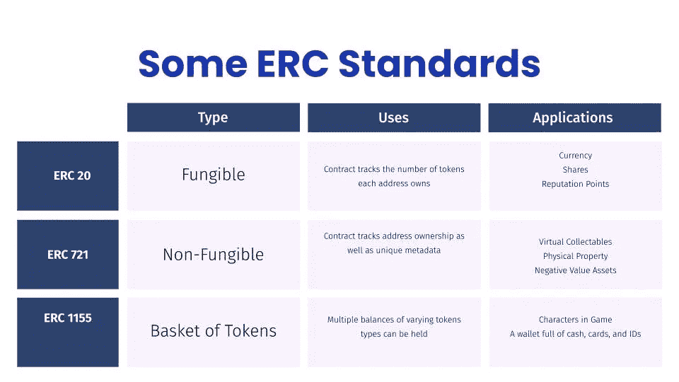
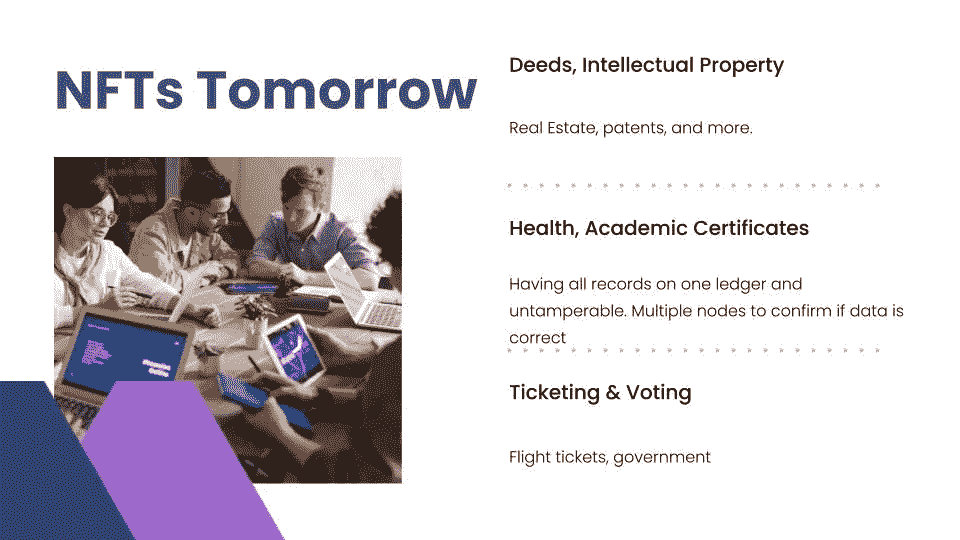
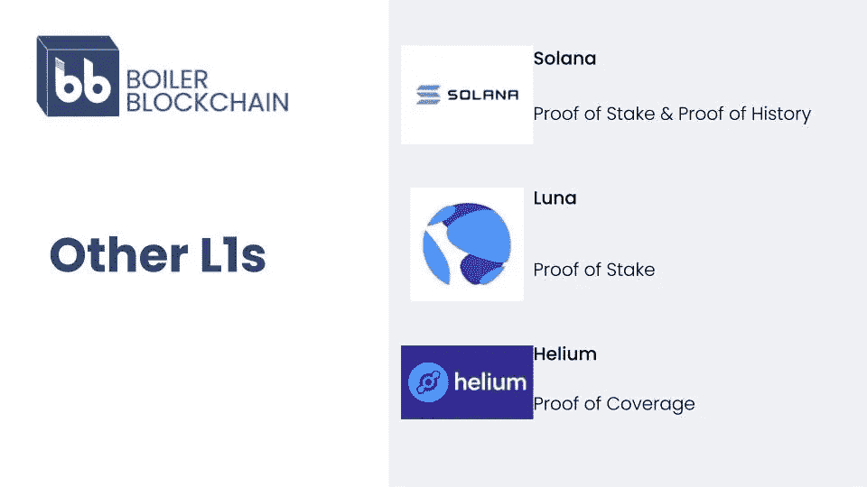

# ETH 标准:为智能合约开发奠定基础

> 原文：<https://medium.com/coinmonks/the-eth-standard-setting-the-stage-for-smart-contract-development-300fb97b0e04?source=collection_archive---------43----------------------->

在我们上一篇教育文章中，我们讨论了两个基本的区块链主题:[密码学和共识](/coinmonks/blockchain-fundamentals-cryptography-consensus-protocols-cbd4a24cdf1a)。现在，我们将在后一个主题的基础上，看看利益相关共识的具体应用，以及它帮助释放的区块链创新。

在开始之前，先澄清一个关键术语是有帮助的:智能合约。智能合同是自动执行协议条款的数字合同。我们中的大多数人几乎没有注意到今天合同管理中所涉及的大量体力劳动。银行，保险公司，房地产。这样的例子不胜枚举。尽管我们的社会经历了所有的数字化，但我们仍然依赖大量的手动流程来管理我们生活中一些最基本的资产。由区块链和其他计算技术驱动的智能合同旨在改变这种情况。

当然，智能合约超越模拟合约还有很长的路要走。但迄今为止，有一个网络比其他任何网络都更有助于展示智能合约的革命性潜力。让我们更深入地了解以太坊。

—

当 Vitalik Buterin 在 2013 年分发[原创以太坊白皮书时，他很难预测到他将释放的创新浪潮。该项目于 2014 年 1 月公开宣布，当时以太坊已经获得了一个核心开发团队和泰尔奖学金(Thiel Fellowship)10 万美元的资助。其余的，正如他们所说，都是历史了。](https://cointelegraph.com/ethereum-for-beginners/who-is-vitalik-buterin#:~:text=birth%20of%20Ethereum.-,The%20birth%20of%20Ethereum,very%20much%20about%20digital%20currency.)

以太坊在早期也不是没有挣扎。然而，以太坊令人难以置信的崛起是无可争议的。无论以何种标准衡量——活跃用户数、开发者、市值或代币价格——以太坊都让竞争对手的智能合约平台相形见绌。此外，以太坊成功地实现了一个独特的共识机制，称为“利害关系证明”,从而取得了成功。与用于比特币网络的共识机制(工作证明)不同，利害关系证明需要下表中列出的几个差异。如果你在寻找更深层次的东西，你可以在这里阅读差异的详细概述[。](https://www.coinbase.com/learn/crypto-basics/what-is-proof-of-work-or-proof-of-stake#:~:text=In%20proof%20of%20work,%20the,in%20the%20network's%20best%20interests.)

A slide demonstrating the key differences between Proof-of-Work and Proof-of-Stake consensus mechanisms.

随着以太坊网络的发展，它获得了越来越多的用户。这反过来吸引了越来越多想要在网络上构建应用程序的开发人员。一个被称为网络效应的良性循环随之而来。与其他技术平台一样，随着越来越多的用户通过平台参与，以太坊也从价值呈指数级增长的现象中受益匪浅。此外，以太坊平台的扩展为解释当今流行的一些区块链网络要素提供了一个有用的案例研究。

*燃气费*

每一个以太坊用户最糟糕的噩梦，为了验证交易，向以太坊网络节点支付燃气费进行补偿。每个区块链都需要某种费用。费用防止无休止或昂贵的交易，并激励人们运行达成共识所需的单个网络节点。不幸的是，当网络上的验证需求很高时，以太坊燃气费会变得非常昂贵。

*硬币&代币*

在区块链网络上，硬币是一种支付方式。以太网(ETH)就是为以太坊网络服务的，用于支付燃气费。同时，以太坊上的各种项目使用令牌来表示一种资产。令牌被绑定到特定的智能合同，并在以太坊网络上发布以验证所有权。例如，拥有一个特定的不可替代的令牌(NFT)代表了网络世界中数字财产的所有权，这个网络世界被称为[“分散的土地”。](https://en.wikipedia.org/wiki/Decentraland)

这种结构与美国经济有相似之处。美元是这个领域的货币——它被用作记账单位、交易媒介和支付维持政府运转的税收。但也有各种代表真实资产的“代币”。例如，租约代表了承租人对不动产的临时权利。

*令牌标准化*

就像互联网随着时间的推移开发标准化协议一样，以太坊的开发者也为智能合约令牌创建了标准。令牌系统是分配所有权并允许从不同方转移的数据库。以太坊上一些最常见的令牌标准概述如下。

*不可替换令牌(NFT)*

近几个月来，NFT 是一种吸引了大量关注的代币形式。由于数字艺术项目的巨大成功，大多数人已经开始了解 NFTs，例如[Beeple 6900 万美元的销售](https://www.theverge.com/2021/3/11/22325054/beeple-christies-nft-sale-cost-everydays-69-million)或名人推动的 [Bored Ape 游艇俱乐部](https://boredapeyachtclub.com/#/)。苏富比和佳士得等主要的艺术品拍卖行已经利用了这一趋势。尽管如此，正如下面的幻灯片所展示的，NFTs 的潜力远远超出了艺术。

*钱包*

创建加密货币钱包是为了帮助用户在一个地方管理他们的代币和账户余额(即资产)。MetaMask 是用于与以太坊网络交互的最受欢迎的钱包之一。

—

以太坊为研究区块链网络的基础提供了一个有用的案例。然而，今天以太坊远不是唯一争夺开发者和用户的智能合约平台。以太坊网络的巨大成功刺激了其他旨在提供类似服务的网络的建立。

区块链行业的一些人将新贵竞争者称为潜在的“联邦理工学院杀手”这个想法是，有一天，一个新的网络可能会取代以太坊，成为市场上占主导地位的智能合约平台。

每个网络都吹嘘自己独特的特点，如新颖的共识机制、较低的天然气费用或增强的可扩展性。以太坊的竞争对手是否真的有能力超越以太坊的地位还有待观察。但毫无疑问，以太坊网络为智能合约平台设定了最初的标准。任何人都不知道智能合约将何去何从。

> 加入 Coinmonks [电报频道](https://t.me/coincodecap)和 [Youtube 频道](https://www.youtube.com/c/coinmonks/videos)了解加密交易和投资

# 另外，阅读

*   [Bookmap 评论](https://coincodecap.com/bookmap-review-2021-best-trading-software) | [美国 5 大最佳加密交易所](https://coincodecap.com/crypto-exchange-usa)
*   最佳加密[硬件钱包](/coinmonks/hardware-wallets-dfa1211730c6) | [Bitbns 评论](/coinmonks/bitbns-review-38256a07e161)
*   [新加坡十大最佳加密交易所](https://coincodecap.com/crypto-exchange-in-singapore) | [购买 AXS](https://coincodecap.com/buy-axs-token)
*   [红狗赌场评论](https://coincodecap.com/red-dog-casino-review) | [Swyftx 评论](https://coincodecap.com/swyftx-review) | [造币厂评论](https://coincodecap.com/coingate-review)
*   [投资印度的最佳密码](https://coincodecap.com/best-crypto-to-invest-in-india-in-2021)|[WazirX P2P](https://coincodecap.com/wazirx-p2p)|[Hi Dollar Review](https://coincodecap.com/hi-dollar-review)