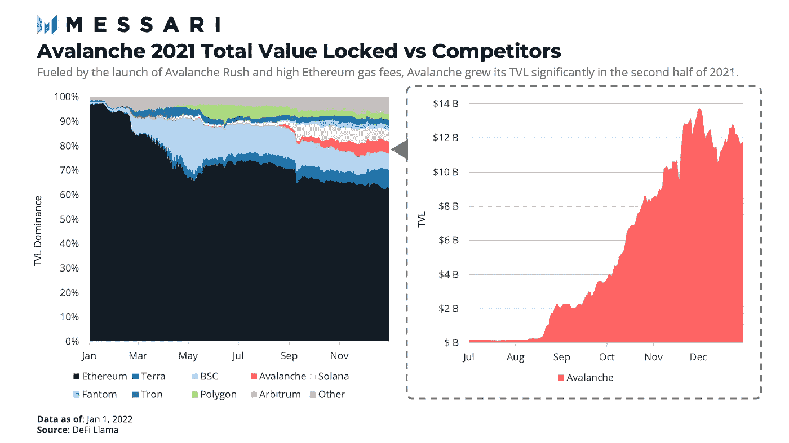
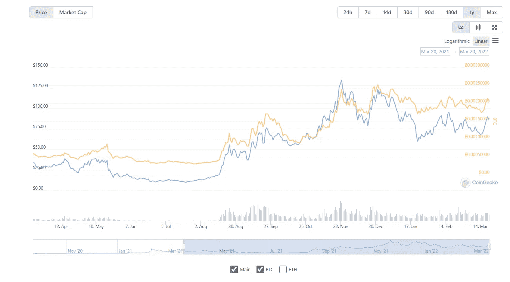

# 以太坊黑仔:雪崩

> 原文：<https://medium.com/coinmonks/the-ethereum-killer-avalanche-3a0caa2029e2?source=collection_archive---------43----------------------->

雪崩区块链正在飞速发展，春天正在到来

在 2021 年下半年，雪崩增长的总价值超过 100 亿美元。这是 6 个月的爆炸性增长。他们在 21 年末筹集了 1.8 亿名为“Rush”的开发者激励基金，用于开发 Defi 应用程序，导致令牌价格飙升 113%。这只是这个区块链的开始，最终比以太坊快 100 倍，不到 1 秒“世卫组织喜欢等待”和新的 2.9 亿美元的开发者基金。为了锦上添花，我们来谈谈子网。不起眼的名字我说的对吗？让我们来看看区块链的一些大玩家是怎么说的。

Aave 的创始人兼首席执行官 Stani Kulechov 在一份声明中说:“雪崩子网使我们能够为机构创建一个理想的环境来进行链上迁移。”“这是朝着传统金融和分散金融之间的障碍不复存在的未来迈出的重要一步。”

Avalanche 基金会主任 Emin Gün Sirer 表示:“子网将成为加密的下一个增长引擎，实现只有在网络级控制和开放实验的规模下才有可能实现的新功能。

新年伊始，这个链条上正在发生的一些事情是

1.  启动 2.9 亿美元的生态系统成长开发者基金
2.  即将推出的 defi 王国将被称为 Crystalvale，对于那些不知道的人来说，Defi 王国对和谐一号来说是巨大的。这对 Avax 及其支持者来说意义重大。
3.  区块链游戏即将登陆 Avax
4.  我有没有提到游戏化的银行业即将到来，看看 Crabada 和疯狂的 Apy 和疯狂的海绵宝宝主题游戏就知道了。如果你花时间去学习动力学，这种东西的收益率是非常高的。
5.  子网是这些第 1 层的未来，看看 Polkadot 和 Cosmos。对于 Avax 来说，这是一个游戏规则的改变者，很快我们就会看到所有这些开发和资助的结果反映在代币定价上。

雪崩刚刚升温！！

我会每周发送雪崩的更新，所以如果你有什么想看的，请关注并评论。感谢你们花时间阅读我的文章，我感谢你们每一个人，让我们一起成长。

为了帮助我们让您及时了解快速发展的加密新闻，请考虑通过以下链接在媒体上注册

[https://medium.com/@sstrider30/3a0caa2029e2?source = friends _ link&sk = 42750 DC 1546 be 04 adedeff 374 AE 11741](/@sstrider30/3a0caa2029e2?source=friends_link&sk=42750dc1546be04adedeff374ae11741)

在 Twitter 上关注我

 [## JavaScript 不可用。

### 编辑描述

twitter.com](https://twitter.com/sstrider30) 

> 加入 Coinmonks [电报频道](https://t.me/coincodecap)和 [Youtube 频道](https://www.youtube.com/c/coinmonks/videos)了解加密交易和投资

# 另外，阅读

*   [比斯勒评论](https://coincodecap.com/bitsler-review)|[WazirX vs coin switch vs coin dcx](https://coincodecap.com/wazirx-vs-coinswitch-vs-coindcx)
*   [赢取注册奖金——10 大最佳加密平台](https://coincodecap.com/earn-sign-up-bonus)
*   [最佳加密交易信号电报](/coinmonks/best-crypto-signals-telegram-5785cdbc4b2b) | [MoonXBT 评论](/coinmonks/moonxbt-review-6e4ab26d037)
*   [Coinswitch 俱吠罗评论](/coinmonks/coinswitch-kuber-review-1a8dc5c7a739) | [电网交易机器人](https://coincodecap.com/grid-trading) | [比特币基地收费](/coinmonks/coinbase-fees-831e77d4f2c5)
*   [Bitget 评论](https://coincodecap.com/bitget-review) | [双子星 vs BlockFi](https://coincodecap.com/gemini-vs-blockfi) | [OKEx 期货交易](https://coincodecap.com/okex-futures-trading)
*   [OKEx vs KuCoin](https://coincodecap.com/okex-kucoin) | [摄氏替代品](https://coincodecap.com/celsius-alternatives) | [如何购买 VeChain](https://coincodecap.com/buy-vechain)