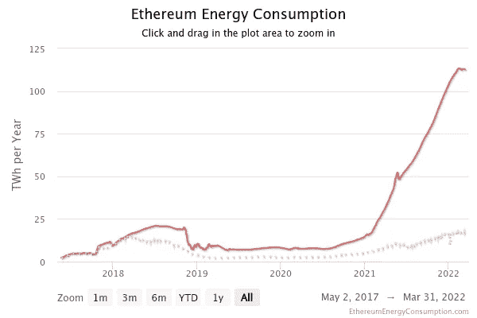

# 以太坊合并即将到来:什么，为什么，何时？

> 原文：<https://medium.com/coinmonks/the-ethereum-merge-is-coming-what-why-and-when-b72a4037a57e?source=collection_archive---------9----------------------->

Source: digiconomist.com

## 以太能量消耗

自 2015 年成立以来，以太坊一直在推动加密货币的新前沿，通过其工作证明共识，平均每 12 或 13 秒增加一笔交易。据数字经济学家估计，如今以太坊的工作验证安全模型每年大约消耗 100 万亿瓦时