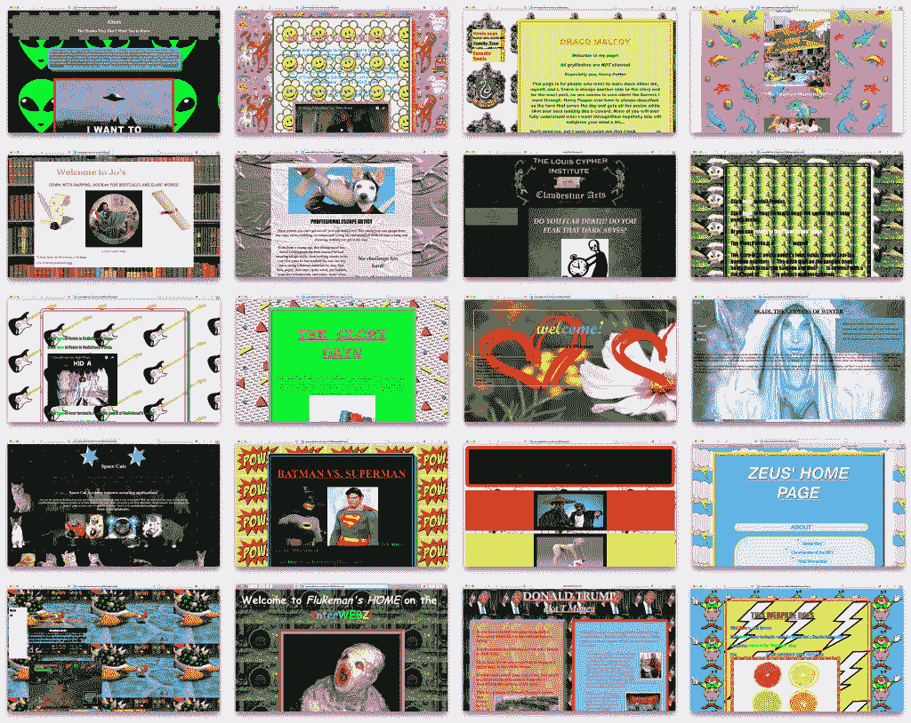

# Web 3.0 的演变:跟随金钱

> 原文：<https://medium.com/coinmonks/the-evolution-of-web-3-0-follow-the-money-d050d20cfec8?source=collection_archive---------16----------------------->

Source: [https://www.adamhammond.com/ugly-90s-webpages/](https://www.adamhammond.com/ugly-90s-webpages/)

Web 3.0 是万维网的最新发展。关于可能成为 Web 3.0 基础的技术有很多讨论，但是我对可能驱动它的商业模式更感兴趣。

问题是“Web 3.0”这个名字仍然很模糊，对不同的派别有着不同的意义，从那些设想交易型网络的人到那些支持更分散的点对点体验的人，再到我们最终可能拥有并跟踪我们所有数据的地方。哪一派赢了？现在很难说，但你可以打赌，最终的赢家将是产生最多美元的人，而预测这一点最简单的方法就是跟着钱走。让我们从头开始。

# Web 1.0 商业模式

还记得在互联网的早期，信息只是想要免费的吗？在 Web 1.0 的那些令人兴奋的日子里，任何人都可以成为自己的出版商，只要你有一个域名、一个 index.html 和(可选的)一点点设计感。以今天的标准来看，网络是一片贫瘠的土地，缺乏可访问的地方意味着内容为王，每个网站的价值都是以眼球来衡量的。根据供求定律，人们应该愿意为内容付费，但当时尝试的付费墙和微交易基本上都失败了，只有在在线视频游戏领域才真正流行起来(稍后将详细介绍)。

可以说，Web 1.0 的死亡是因为无法产生可靠的收入，同时将风险投资的钱浪费在超级碗广告上。但这也是注定的，因为公众不愿意通过编辑和上传 HTML 文件来手工轰炸网站，以发布他们的假日照片或庆祝他们最喜欢的独立乐队。是时候重启了。

# Web 2.0 商业模式

因为 Web 1.0 出版对我们大多数人来说过于繁重，所以大门对任何愿意让公众轻松成为新兴数字领域内容创造者的公司都是敞开的。这一次的赢家是如今占主导地位的熟悉的内容平台，从脸书和 Instagram 到 YouTube 和抖音。Web 2.0 世界中的价值衡量标准充斥着大量的内容，大多以图片、视频和文本的形式出现，从被动的眼球演变为互动的点击、喜欢和关注。

更重要的是，在 Web 1.0 时代激增然后(大部分)灭绝的互联网资产的非理性繁荣被一系列务实的赚钱者所取代，他们想出了如何不劳而获，同时仍然为投资者提供可观的回报。魔法？也许吧，但这真的只是电视魔力的一个轮回。

回想一下，在电视时代，电视网为填充节目(又名节目)付费，以创造一种产品(又名观众)，然后卖给广告商(又名公司)。显而易见，Web 2.0 经济模式只是互联网时代的电视，具有一个关键优势:普通公众创造了~免费*的填充物，使 Web 2.0 平台远比电视网络更有利可图。

* [每天有 72 万小时](https://www.oberlo.ca/blog/youtube-statistics)的内容被上传到 YouTube 上 x 365 天/ [支付给创作者的 150 亿美元](https://www.socialmediatoday.com/news/youtube-generated-288-billion-in-ad-revenue-in-2021-fueling-the-creator/618208/)广告收入=每小时 0.02 美元。

难怪 Web 2.0 平台如此成功，但对于普通大众来说，事实证明没有免费的午餐，即使是虚拟的午餐。正如 Shoshana Zuboff 在她的书“[监视资本主义的时代](https://www.socialmediatoday.com/news/youtube-generated-288-billion-in-ad-revenue-in-2021-fueling-the-creator/618208/)”中指出的，“我们使用免费的 Web 2.0 属性来喜欢、分享、关注、发推特和点击的代价是我们的隐私。这是有道理的，因为广告商希望尽可能针对特定的目标群体做广告。因此，Web 2.0 属性从我们的在线行为中了解我们越多，他们就能向广告商销售更好的产品。

但是普通大众已经开始反对 Web 2.0 商业模式。即使是我们这些无所隐瞒的人也不希望我们的生活变成一场杜鲁门秀。当然，可以通过使用广告/cookie 拦截器或管理隐私设置来选择退出，但事实是，解开应用程序配置的死结[很久以前就脱离了普通用户](https://www.lifewire.com/stop-google-from-tracking-your-searches-4123866)的控制。结果，政府开始鼓吹监管。就目前而言，即使 Web 2.0 模型受到了不可挽回的损害，普通公众仍然坚持使用它，但是有更好的方法吗？

# Web 3.0 商业模式

我们现在正处于 Web 3.0 的风口浪尖，就像大多数尖端技术一样，它已经与我们同在，只是分布不佳。事实上，分发是 Web 3.0 的关键原则之一，有时被描述为 Web 的去中心化版本。尽管如此，对于分权到底意味着什么还没有真正的共识。对一些人来说，这是一个点对点版本的网络，类似于今天的 BitTorrent，但是如果我们继续跟着钱走，我们想要的版本使用去中心化的区块链。

> **快速解释**:区块链与比特币和以太坊等加密货币联系最为紧密，但实际技术只是一个分布式账本，可以用来跟踪任何东西。由于它是分布式的(即，许多不同的人拥有一份拷贝)，并且使用[数学证明](https://blockworks.co/proof-of-work-vs-proof-of-stake-whats-the-difference/)模型来验证交易，所以很难作弊，这使得它成为跟踪交易的好方法，例如当一些东西(钱、房契、视频游戏中的马甲等)易手时。

Decentraland.org[就是一个利用区块链技术的分散式 Web 3.0 网站的好例子，它本质上只是一个虚拟世界，在这里你的虚拟角色可以四处漫游并与不同的属性互动。这里的诀窍是，你看到的和与之互动的一切都以一种名为 MANA 的专有加密货币定价:](https://decentraland.org/)

*   创作者支付法力购买虚拟世界中的土地(又名财产)，他们可以开发成商店或互动体验。例如，JP 摩根和斯凯奇正在创造你可以参观的房产。
*   创造者也支付法力来创造物品/可穿戴物品/消耗品，你可以购买来装备你的化身。
*   作为分散之地的游客，你可以支付法力来参与一些体验，例如赌场游戏，或者作为音乐会或贵宾区的入场费。
*   你可能还想用法力购买数码商品，比如装备你的角色的 Skecher 鞋。

如果分散土地听起来很像一个以微交易为特色的在线视频游戏，那是有很好的理由的:微交易模式已经将视频游戏的收入推向了顶峰，远远超过了电影和音乐行业的总收入。分散的商业模式创新通过 Web 2.0(和视频游戏)为广告商提供了双重服务:

*   企业可以创建内容(即，通过开发他们的资产)，这也是广告的一部分。这样，他们可以更好地为目标客户量身定制内容。
*   企业可以从“游戏中”的直接购买中获得$美元，而不是从效率低得多的 Web 2.0 广告点击中获得。

越是成功的创作者在建立吸引更多用户的引人注目的体验方面越成功，分散的土地就越有可能获利，因为受欢迎程度将推高对他们的魔法加密货币的需求。

# Web 3.0:还没准备好，玩家一

虽然 Web 3.0 虚拟世界为所有者和参与企业提供了引人注目的收入潜力，但目前还不清楚除了传统的 Web 2.0 资源或已建立的多人在线视频游戏之外，它对公众有什么好处，这两者都已经向他们现有的庞大观众介绍了他们自己的虚拟世界(如 [Meta](https://www.youtube.com/watch?v=rtLTZUaMSDQ) )和互动体验(如[堡垒之夜](https://www.youtube.com/watch?v=cX_rTJHnXn0))。

对于为什么公众想要迁移到 Web 3.0 属性，已经提出了多种论点，但大多数都归结为让用户通过以下方式获得收入的承诺:

*   要么是[足够有钱](https://market.decentraland.org/)去虚拟房地产市场投机，要么是足够有才华去创造和赚钱引人注目的数字体验/可穿戴设备。不幸的是，拥有这么多可支配收入的普通大众充其量只是少数。
*   利用虚拟世界作为工作，并赚取加密货币以实现游戏中的目标。从长远来看，这种方法[可能不可行](https://www.businessinsider.in/investment/news/axie-infinity-has-an-inflation-problem-and-without-more-players-its-going-to-be-a-tough-fix/articleshow/87840750.cms)。
*   赚取虚拟世界中的数字资产(武器、衣服等)并出售它们来赚取加密货币。

> 请注意，这种玩家收入模式在在线视频游戏中已经存在多年，不需要加密货币。对于那些想要赚钱的人来说，缺点一直是当在线游戏/虚拟世界不可避免地受欢迎程度下降并被关闭时，那些搁浅的资产就会消失。即使这些资产在游戏/世界结束后仍然存在于区块链，也很难想象除了作为纪念品之外，还会有很大的需求。

这种基于加密货币的 Web 3.0 模型也有许多其他缺点，尤其是加密货币的波动性(和投机)，这可能导致赌博和证券监管在这些虚拟世界起飞前就被应用到这些虚拟世界中。

Web 3.0 仍处于婴儿期，但我们基本上已经回到了另一个版本的 Web，其特点是内容匮乏，公众受益的方式有限。商业模式需要更多的工作，特别是为用户提供独特的令人信服的理由来放弃不断发展的 Web 2.0 属性，并在这个加密驱动的虚拟世界中占据一席之地。否则，它似乎注定只是 Web 3.0 环境中的一个小众部分。

> 加入 Coinmonks [电报频道](https://t.me/coincodecap)和 [Youtube 频道](https://www.youtube.com/c/coinmonks/videos)了解加密交易和投资

# 另外，阅读

*   [CoinFLEX 评论](https://coincodecap.com/coinflex-review) | [AEX 交易所评论](https://coincodecap.com/aex-exchange-review) | [UPbit 评论](https://coincodecap.com/upbit-review)
*   [AscendEx 保证金交易](https://coincodecap.com/ascendex-margin-trading) | [Bitfinex 赌注](https://coincodecap.com/bitfinex-staking) | [bitFlyer 审核](https://coincodecap.com/bitflyer-review)
*   [麻雀交换评论](https://coincodecap.com/sparrow-exchange-review) | [纳什交换评论](https://coincodecap.com/nash-exchange-review)
*   [支持卡审核](https://coincodecap.com/uphold-card-review) | [信任钱包 vs MetaMask](https://coincodecap.com/trust-wallet-vs-metamask)
*   [Exness 回顾](https://coincodecap.com/exness-review)|[moon xbt Vs bit get Vs Bingbon](https://coincodecap.com/bingbon-vs-bitget-vs-moonxbt)