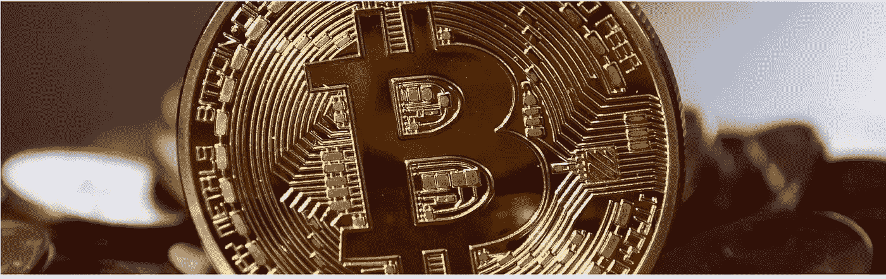

# 通往奴役之路的金融体系

> 原文：<https://medium.com/coinmonks/the-financial-system-on-the-road-to-serfdom-bdcd22b2262f?source=collection_archive---------24----------------------->

罗纳德·斯托弗勒和马克·瓦莱克采访了杰夫·布斯，谈了他对当前金融体系的看法，以及它是如何扭曲社会并危及我们的未来的。他还谈到了这个问题的可能解决方案。

你可以在这里查看完整的讨论[，或者继续阅读这个摘要。](https://www.youtube.com/watch?time_continue=4&v=hd7BTMjc5qw&feature=emb_title)

# 通往维也纳的漫长道路

与我们迄今采访的许多其他人相反，杰夫·布斯来自企业家方面，而不是金融方面。如果企业家对市场需要什么产品和服务的预测是正确的，他们就会创造出繁荣的企业。如果不是这样，他们就不会成功。在这种环境下，他看到了快速的变化，并对市场如何运作产生了浓厚的兴趣。随着公司创造越来越多的财富，技术发展越来越快，问题很快出现了，为什么价格没有以那个速度下降。对这个答案的探索导致了奥地利经济学派和最终的比特币。在这次旅行中，他也写了一本关于这个问题的书。

# 一点点偷窃是可以的

在某种程度上，信贷扩张造成了债务泡沫，政府无法用税收偿还。到了那个时候，通货膨胀就会取而代之。它是当今政府的主要收入来源。尽管如此，许多人认为税收才是真正的问题。社会上另一个广为接受的观点是，通货膨胀是必要的。这导致了荒谬的想法，即每年 2%的盗窃是好的，但 6%或更多是坏的。这个问题没有得到解决，这个系统继续掠夺人们。社会的大多数人都是输家，因为他们无法用其他资产来抵消这种盗窃。贫困的人们于是向同一个政府要钱，变得依赖。

# 通往另一边的桥

2008 年危机的策划者如今仍在掌控着我们的体系。随着时间的推移，通缩修正没有发生，最终的崩溃变得越来越糟糕。因为那将会是彻底的崩溃。像一个真菌，法定货币和债务投资了社会的所有政党，要摆脱真菌将不得不做巨大的破坏。但是如果它不发生，必要的损害会越来越大。我们现在已经深入到这一体系中，为了维护这一体系，我们很快将不得不抛弃整个自由市场和民主，并进一步集中力量来维持这一体系。比特币可能是解决这个问题的一种方法。目前，相对于比特币，所有价格都在下降。这可能会永远持续下去。如果我们想逃离当前的体系，比特币可能是一个不错的选择。它分散的自由市场性质使它在迄今为止我们看到的所有其他选择中脱颖而出。你可以讨厌它，甚至试图关闭它；它不会停止它。慢慢地，比特币正在对所有东西重新定价。随着每个周期的进行，越来越多的人被卷入其中。今天的大多数人只是无法想象这个过程成功的未来。

# 对等物

如果比特币可以成为去中心化和自由市场的一条道路，那么 CBDCs 则代表了相反的情况。CBDCs 是进一步扩展我们现有系统的解决方案。此外，它们为当今的强国提供了另一个巨大的好处；监视。高通胀和货币抑制非常不受欢迎。通过把金钱和你的社会行为联系起来，你创造了一个难以想象的控制工具。此外，房地产等其他资产与比特币相比相形见绌，因为它们无法移动。你想在黎巴嫩拥有房地产吗？只要社会不出现更大的问题，这是抵御通货膨胀的一个很好的手段。

更多类似的故事或关于黄金、比特币和宏观经济的新闻和文章，请访问我们的网站[这里](https://ingoldwetrust.report/?lang=en)。

《2022 In Gold We Trust 报告》定于 5 月 24 日发布。您可以在[这里](https://ingoldwetrust.report/igwt/?lang=en)查看或下载《2021 年报告》或订阅接收《2022 年报告》。

在 [Youtube](https://www.youtube.com/channel/UCO1kBepErpjsxa54ll7cB8Q) 、 [Twitter](https://twitter.com/IGWTreport) 或 [Linkedin](https://www.linkedin.com/showcase/ingoldwetrust-report/) 上关注我们。

> *加入 Coinmonks* [*电报频道*](https://t.me/coincodecap) *和* [*Youtube 频道*](https://www.youtube.com/c/coinmonks/videos) *了解加密交易和投资*

# 另外，阅读

*   [有哪些交易信号？](https://coincodecap.com/trading-signal) | [Bitstamp vs 比特币基地](https://coincodecap.com/bitstamp-coinbase) | [买索拉纳](https://coincodecap.com/buy-solana)
*   [ProfitFarmers 点评](https://coincodecap.com/profitfarmers-review) | [如何使用 Cornix 交易机器人](https://coincodecap.com/cornix-trading-bot)
*   [十大最佳加密货币博客](https://coincodecap.com/best-cryptocurrency-blogs) | [YouHodler 评论](https://coincodecap.com/youhodler-review)
*   [my constant Review](https://coincodecap.com/myconstant-review)|[8 款最佳摇摆交易机器人](https://coincodecap.com/best-swing-trading-bots)
*   [MXC 交易所评论](/coinmonks/mxc-exchange-review-3af0ec1cba8c) | [Pionex vs 币安](https://coincodecap.com/pionex-vs-binance) | [Pionex 套利机器人](https://coincodecap.com/pionex-arbitrage-bot)