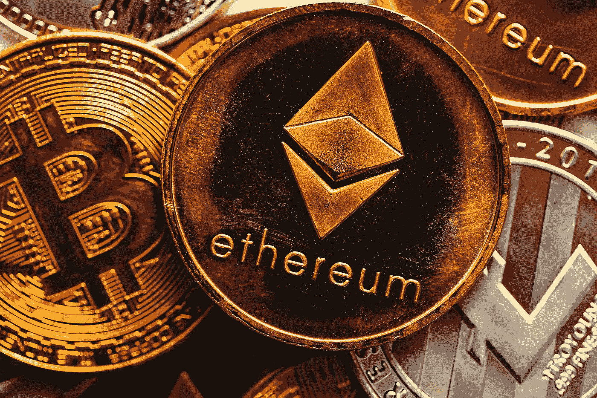

# 在加密中你需要做的三件事

> 原文：<https://medium.com/coinmonks/the-first-3-things-you-need-to-start-in-crypto-cf5cdce784e0?source=collection_archive---------68----------------------->

Its time to start

所以你想进入 crypto 但是你不知道从哪里开始。好吧，别再找了。以下是你在加密货币世界中入门所需的前三样东西

1)数字钱包——这是你储存数字货币的地方。有许多不同类型的钱包可供选择，重要的是选择一个适合你。一定要做好调查，找到最适合你的。我使用 Metamask，是的，你可以有一个以上的钱包。从比特币基地钱包到信托钱包，还有很多其他的。这些钱包被称为热钱包，一旦你变得更高级一点，你可能会想看看像莱杰或特雷佐冷钱包。

现在，在你的钱包里有一些加密货币之前，你可能需要一点教育。从长远来看，了解基本知识会有所帮助，比如什么是区块链，或者代币和硬币之间有什么区别。

2)学习资源-谈到加密货币，有许多不同类型的学习资源。你可以在互联网上找到文章、视频、播客等等。我喜欢关注的几个播客是无银行和无束缚的。现在，如果你正在寻找一种加密货币的实时价格，你可能会想看看 Coinmarketcap 或 Coingecko。不要忘记那些总是谈论空间的应用程序，比如 Twitter 或 Discord。

所以，你有自己的钱包，你有一点教育希望，你已经找到了你喜欢的东西。也许你喜欢 NFT 或者对 DeFi 感兴趣。现在你必须决定要买什么样的加密货币。如果你查一下 Coinmarketcap.com，有 1800 多种可供选择。我不会试图买下全部，甚至大部分。大部分都是从比特币或者以太坊之类的情侣开始的。这是一些最受欢迎的产品，人们在刚开始购买时往往会购买。那么，你在哪里购买加密货币呢？

3)交换——现在你知道你想买什么了，是时候买了。你需要找到一个交易所来这样做。有许多不同类型的交易所，有许多不同的特点。再次强调，做好调查并找到适合你的工作是很重要的。每个交易所的费用、交易和转让限额都是不同的。一些受欢迎的交易所是比特币基地、币安和双子座。这些都是集中式交换，一旦你有了一点经验，你可能会想看看一些 DEX(分散式交换)。几个流行的 DEX 是 Uniswap (UNI)、dYdX (DYDX)和 PancakeSwap (CAKE)都有令牌。

现在你已经有了开始工作所需要的东西，那么你会做什么呢？去以太坊或者索拉纳上买个 NFT？你会去 DeFi 兔子洞开始种植吗？还是直接买比特币和 HODL？你可以做任何你想做的事情，只是不要再错过几年成长中的行业。

现在你有了，开始你的加密货币世界之旅需要的前三样东西。接受教育，了解该领域的所有最新消息。最后，玩得开心，不要害怕尝试新事物。

如果您是这个领域的新手，您可能不理解这些术语。

热钱包-连接到互联网的钱包

冷钱包-又名硬件钱包-与互联网断开连接

去中心化金融

NFT -不可替代的令牌

HODL -亲爱的生命，坚持住