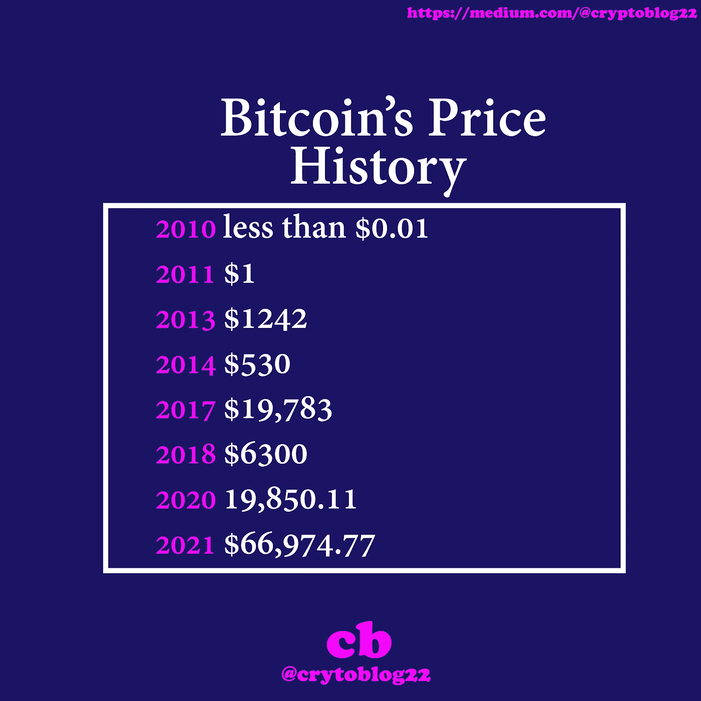

# 前 5 种加密货币及其现在的价值

> 原文：<https://medium.com/coinmonks/the-first-5-cryptocurrencies-and-their-worth-now-df80991740ea?source=collection_archive---------14----------------------->

自从比特币在公众接受度方面取得巨大成功以来，许多其他加密货币已经问世。截至 2022 年 2 月，存在超过 10，000 种加密货币。以比特币为模型的加密货币统称为 altcoins，在某些情况下， [shitcoins](https://www.investopedia.com/terms/s/shitcoin.asp) 或 memecoins。

让我们来看看最初创造的五种加密货币以及它们现在的价值。

**1 比特币**
比特币于 2009 年由中本聪创造，是人们通过互联网汇款的一种方式。这种数字货币旨在提供一种替代支付系统，这种系统的运行将不受任何中央控制或银行或政府的监督。它依赖于点对点软件和加密技术。

比特币的诞生取得了巨大的成功，大公司接受了它，各国也将其合法化。微软在 2014 年成为比特币的早期采用者，当时它开始接受这种加密货币作为 Windows Phone 和 Xbox 等平台的游戏、应用和其他数字内容的支付。
埃隆·马斯克(Elon Musk)在 2021 年初掀起了波澜，当时他宣布特斯拉将购买价值 15 亿美元的比特币，并接受世界上最受欢迎的加密货币作为其车辆的支付手段，贝宝(paypal)等其他大公司也接受比特币作为支付手段。

2021 年 10 月 1 日，比特币创下了 66974 美元的新 ATH，截至今天 2022 年 2 月 23 日，其价格为 38247 美元。

这是一张比特币价格历史的图片

Litecoin (LTC)成立于 2011 年，比比特币晚两年，创始人是前谷歌工程师查理·李。莱特币也是基于一个开源的全球支付网络，像比特币一样不受任何中央机构的控制。莱特币可以作为向世界任何地方的人支付的一种途径，而不需要中介来处理交易。

查理·李的想法是创造另一种加密货币，在执行交易时比比特币更快。莱特币网络的目标是每 2.5 分钟处理一个块，而不是比特币的 10 分钟。这使得莱特币确认交易的速度比比特币快 4 倍。

当莱特币在 2013 年首次亮相时，1 LTC 价值 4.30 美元。2021 年 5 月 10 日，它触及 410.26 美元的历史高点，而 2015 年 1 月 14 日创下 1.15 美元的历史低点。截至今天 2022 年 2 月 23 日，LTC 价格为 107 美元。按市值计算，莱特币目前是第 20 大加密公司。

**3 name coin** name coin(NMC)是一种加密货币，最初由比特币软件派生而来。它基于比特币的代码，并在其基础上构建了额外的功能。Namecoin 使用与比特币相同的工作证明(PoW)共识算法。然而，Namecoin 是作为分散式域名系统(DNS)的基础而开发的。这枚硬币的创造者打算结束互联网审查，加强互联网相关的安全和隐私。
未来，Namecoin 及其底层技术还可用于文件签名、安全投票程序、公证服务，以及为个人和实体建立存在证明。

在价值和市值方面，Namecoin 已经落后于其他加密货币。截至 2020 年末，Namecoin 的交易价格约为 0.40 美元，其历史最高价格为 9.88 美元。

**4 Peercoin**
Peercoin 由软件开发商 Sunny King 和 Scott Nadal 于 2012 年创立。就像比特币和莱特币一样，Peercoin 存储价值，提供完全匿名，并且可以在没有任何中央机构的情况下通过互联网发送。
它是第一种结合使用利益证明(PoS)和工作证明(PoW)一致算法的数字货币。
Peercoin 是为了解决比特币高能耗的问题而创建的，它利用了一种用于验证区块链的利益证明(PoS)系统。

2021 年 10 月 8 日，Peercoin 创造了 13 美元的新 ATH。截至今天 2022 年 2 月 25 日的 Peercoin 价格为 0.58。

尽管有一个充满希望和创新的开始，Peercoin 不再是市值最高的硬币。

Dogecoin 最初是一个笑话，基于一个以柴犬(一种日本品种的狗)为特色的流行文化。Dogecoin 将自己标榜为比特币的“有趣”版本，其标志是一只日本狗。它的加密技术和无限供应是更快、适应性更强、对消费者更友好的比特币版本的一个论据。

Adobe Inc .澳大利亚悉尼办事处的产品经理杰克逊·帕尔默在 2013 年创造了 Dogecoin，以此来讽刺围绕加密货币的炒作。与此同时，IBM 的软件开发人员比利·马库斯(Billy Markus)发现了 Dogecoin buzz。Markus 联系了 Palmer，请求他允许他在一个真实的 Dogecoin 后面开发软件。
帕尔默和马库斯于 2013 年 12 月 6 日推出 dogecoin。两周后的 12 月 19 日，Dogecoin 的价值上涨了 300%。

2021 年 1 月，Dogecoin 在 24 小时内上涨了 800%以上，达到了 0.07 美元的价格，这是 Reddit 用户关注的结果，部分原因是埃隆·马斯克的鼓励。
2021 年 2 月，在马斯克、探听狗和吉恩·西蒙斯的推特鼓励下，Dogecoin 创下了 0.08 美元的新高。

感谢阅读，请订阅我们的帖子。

> 加入 Coinmonks [电报频道](https://t.me/coincodecap)和 [Youtube 频道](https://www.youtube.com/c/coinmonks/videos)了解加密交易和投资

# 另外，阅读

*   [氹欞侊贸易评论](https://coincodecap.com/anny-trade-review) | [火币保证金交易](/coinmonks/huobi-margin-trading-b3b06cdc1519)
*   [分散交易所](https://coincodecap.com/what-are-decentralized-exchanges) | [比特 FIP](https://coincodecap.com/bitbns-fip) | [Pionex 评论](https://coincodecap.com/pionex-review-exchange-with-crypto-trading-bot)
*   [用信用卡购买密码的 10 个最佳地点](https://coincodecap.com/buy-crypto-with-credit-card)
*   [最好的卡达诺钱包](https://coincodecap.com/best-cardano-wallets) | [Bingbon 副本交易](https://coincodecap.com/bingbon-copy-trading)
*   [印度最佳 P2P 加密交易所](https://coincodecap.com/p2p-crypto-exchanges-in-india) | [柴犬钱包](https://coincodecap.com/baby-shiba-inu-wallets)
*   [八大加密附属计划](https://coincodecap.com/crypto-affiliate-programs) | [eToro vs 比特币基地](https://coincodecap.com/etoro-vs-coinbase)
*   [最佳以太坊钱包](https://coincodecap.com/best-ethereum-wallets) | [电报上的加密货币机器人](https://coincodecap.com/telegram-crypto-bots)
*   [交易杠杆代币的最佳交易所](https://coincodecap.com/leveraged-token-exchanges) | [购买 Floki](https://coincodecap.com/buy-floki-inu-token)