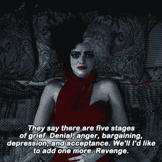
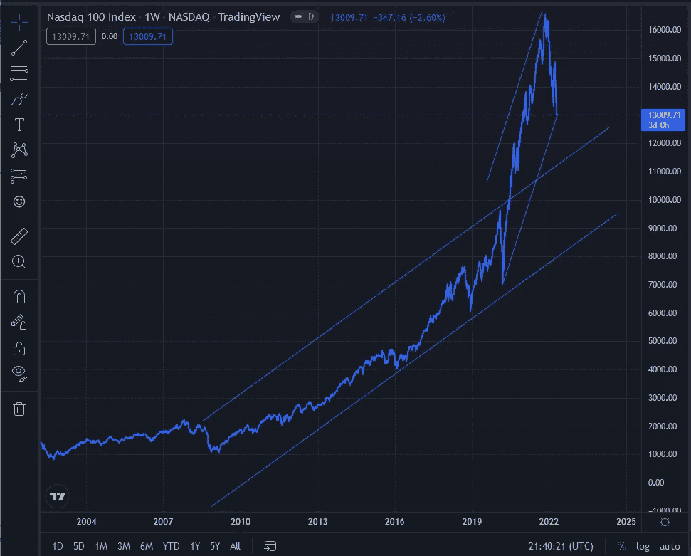
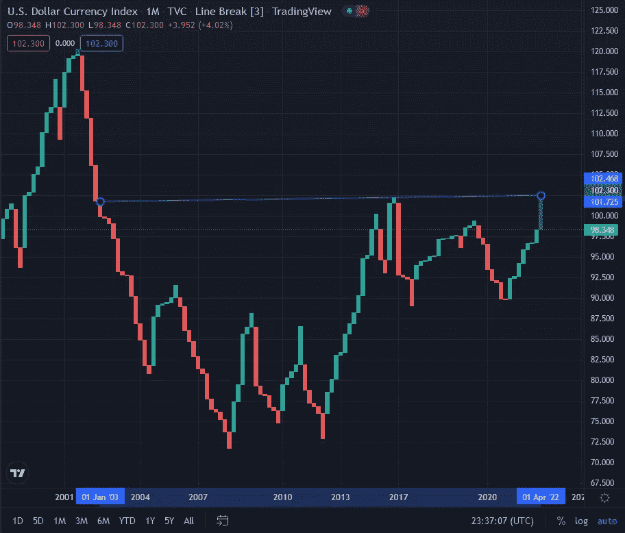
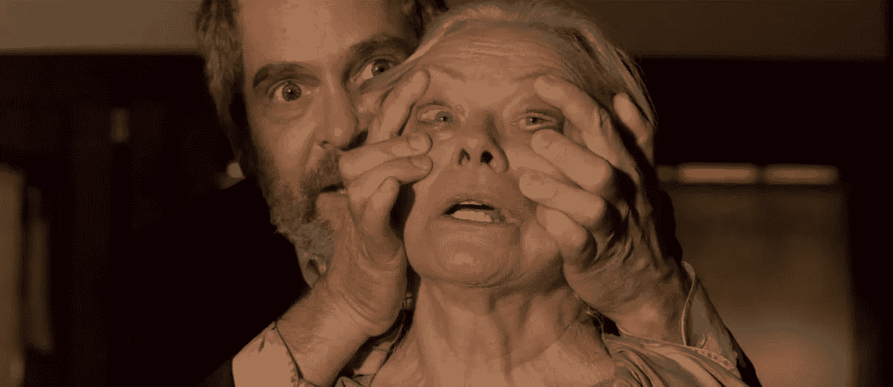

# 悲伤的五个阶段

> 原文：<https://medium.com/coinmonks/the-five-stages-of-fed-grief-ce5369481ec9?source=collection_archive---------24----------------------->

***或者:我是如何学会不再担心并爱上核武器的***

精神病学家伊丽莎白·库伯勒-罗斯在她 1969 年具有里程碑意义的关于死亡和垂死的书*中，概述了现在著名的悲伤的五个阶段[尽管当前的临床批评认为这种模式已经过时，但否认/愤怒/讨价还价/沮丧/接受的路径已经在中间的半个世纪里根深蒂固。](https://en.wikipedia.org/wiki/Five_stages_of_grief)*

That last one is good for Disney+ villains and Elon Musk.

加密市场最近感觉就像一场公牛葬礼，所以也许是时候看看库伯勒-罗斯博士会把我们排在哪里了。

**否认**

事实证明，尽管那些模型只在纸上有效的纸张推销商们所宣扬的信念，让数万亿新印刷的美元充斥市场会让每一张美元变得一文不值。尽管这种解决新冠肺炎黑天鹅事件的方法是否有用还有待商榷，但问题是账单迟早会到期。

然而，美联储很晚才意识到这个显而易见的发现，直到去年年底才提出通货膨胀将是“短暂的”的观点但市场也一直生活在否认中，每当美联储主席发表明智的声明，表示要停止开动印钞机时，市场就会持续动荡。

RRRRRRRRRRRRRRRB

**愤怒**

当然，这种情况已经足够多了，虽然我不想在这里过多地陷入政治漩涡，但显然，11 月的中期选举似乎预示着对拜登经济学的坚决指责。很明显，“普京涨价”的旋转已经耗尽了扭矩。如果这是他们得到的最好的，这将是一个漫长，炎热的夏天。

如果燃料价格超过 4 美元/加仑，食品价格高得离谱，那么漫长炎热的夏天会变得越来越长，越来越热。

**讨价还价**

美联储正试图迫使投资者做出一个苏菲的选择:[给市场踩刹车，否则我们将通过大幅加息来为你刹车](https://www.washingtonpost.com/business/if-stocks-dont-fall-the-fed-needs-to-force-them/2022/04/06/84c9322e-b599-11ec-8358-20aa16355fb4_story.html)。老实说，这一领域急需一些修正，因为政府为保持后 COVID 时代的经济而投入的两年现金狂欢最终让市场有点，嗯，资本主义。

If your blow-off top lasts longer than two years, call your doctor and stare at a picture of Janet Yellen.

但随着口罩和 vax 的授权继续下降，世界各方喜欢它的 2019 年(嗯，除了[中国](https://www.cnn.com/videos/world/2022/04/26/china-shanghai-covid-19-measures-lockdown-fences-online-uprising-ebof-culver-dnt-vpx.cnn))，经济的基本健康状况正在改善。通过除颤和阿托品的大规模震动来维持生命的尸体现在是一个正在康复的病人，就在美联储试图减速的时候，它正在增加马力。

膨胀的美元也有一个违反直觉的副作用:在通胀环境中，[美元可能贬值，但其他货币贬值更多。因此，当美元打喷嚏时，其他货币，如日元和人民币就染上了肺炎。净效应是，美元指数(DXY)可能会以自](https://www.barrons.com/articles/strong-dollar-earnings-stock-market-51647038289) [50 美分首次触及图表](https://www.billboard.com/charts/hot-100/?rank=68)以来的最高价收盘一个月:

That’s 78 Cent, in today’s money.

作为大多数金融交易(当然包括 BTC/美元对)的分母，如果美元是 swole(50 美分肯定是), amirite ？)，分子看起来更小。

**抑郁症**

这就是我们进来的地方，一个起伏不定的加密市场的沉闷被一个快速反弹的希望短暂平息，只看到它在美联储挥动手指和发出啧啧声时熄灭。

比特币 maxis 将这种资产称为“数字黄金”和“终极通胀对冲”，但对市场而言，king crypto 及其所有主题基本上都是科技股。这有一定的道理，因为 web3 绝对处于新技术的前沿。但 crypto 需要两类投资者才能真正腾飞:散户和机构投资者。前者将大部分边际美元花在了汽油和食品上，而后者伴随着“不要和美联储作对”的口号长大，并遵循这一剧本，从周期性股票中转出。

但尽管这感觉像是游行的结束，但重要的是要记住:比特币正在测试自那以来从未见过的低点。。。[三月](/coinmonks/unblocking-blockchain-part-ii-db305bb94704)。不是 1987 年或 1929 年。不管 TA permabears 怎么想，都没有理由站在窗台上。。。

ADA could still hit that mark even if BTC jumped to six figures.

。。。还没有。

**验收**

接受这一点很重要:

还记得我贴在上面的纳斯达克图表吗？那张看起来像是由两片伟哥和一份维多利亚的秘密目录驱动的图表？尽管正如我所写的，NDX 经历了近 18 个月来最糟糕的一天，但它明天可能会暴跌 30%，而且仍然只是处于其长达十年的历史通道的中间。

不管它应该还是不应该，我们必须承认，至少在短期内，比特币是依附于它的，是纳斯达克的迈克尔的皮查埃尔。BTC 的 30%理发投入了 30，000 美元。看着它。

Pictured: what Peter Schiff wishes he could do to PlanB.

现在接受这个事实:这可能是它能跌到的最低点。迈克尔·塞勒的切入点就在那里，[跆拳道还远没有完成收购](/coinmonks/bitcoins-going-to-the-moon-2ab759ce4c5f)，[其他休眠的鲸鱼已经醒来](https://zycrypto.com/mysterious-bitcoin-whale-quiet-for-over-7-years-suddenly-woke-up-shortly-before-btc-slipped-under-45k/)。[哈希利率刚刚创下历史新高](https://www.fxstreet.com/cryptocurrencies/news/bitcoin-price-tumbles-but-this-metric-just-reached-a-new-all-time-high-202204260850)，[富达将让其 401(k)投资者叠加 sat](https://www.wsj.com/articles/fidelity-to-allow-retirement-savers-to-put-bitcoin-in-401-k-accounts-11650945661)，[澳大利亚刚刚批准了一个现货比特币 ETF](https://www.bloomberg.com/news/articles/2022-04-20/bitcoin-etfs-set-to-roll-out-in-australia-to-test-crypto-demand) 。

最现实的下行是 30%。上升空间是无限的。

你可能不想买，但你肯定想 HODL。

如果市场确实下跌，你有机会以你可能从未想过会再见到的价格购买改变世界的技术。

> 加入 Coinmonks [电报频道](https://t.me/coincodecap)和 [Youtube 频道](https://www.youtube.com/c/coinmonks/videos)了解加密交易和投资

# 另外，阅读

*   [OKEx vs KuCoin](https://coincodecap.com/okex-kucoin) | [摄氏替代品](https://coincodecap.com/celsius-alternatives) | [如何购买 VeChain](https://coincodecap.com/buy-vechain)
*   [ProfitFarmers 回顾](https://coincodecap.com/profitfarmers-review) | [如何使用 Cornix Trading Bot](https://coincodecap.com/cornix-trading-bot)
*   [如何匿名购买比特币](https://coincodecap.com/buy-bitcoin-anonymously) | [比特币现金钱包](https://coincodecap.com/bitcoin-cash-wallets)
*   [瓦济里克斯 NFT 评论](https://coincodecap.com/wazirx-nft-review) | [比茨盖普 vs 皮奥克斯](https://coincodecap.com/bitsgap-vs-pionex) | [坦吉姆评论](https://coincodecap.com/tangem-wallet-review)
*   [如何使用 Solidity 在以太坊上创建 DApp？](https://coincodecap.com/create-a-dapp-on-ethereum-using-solidity)