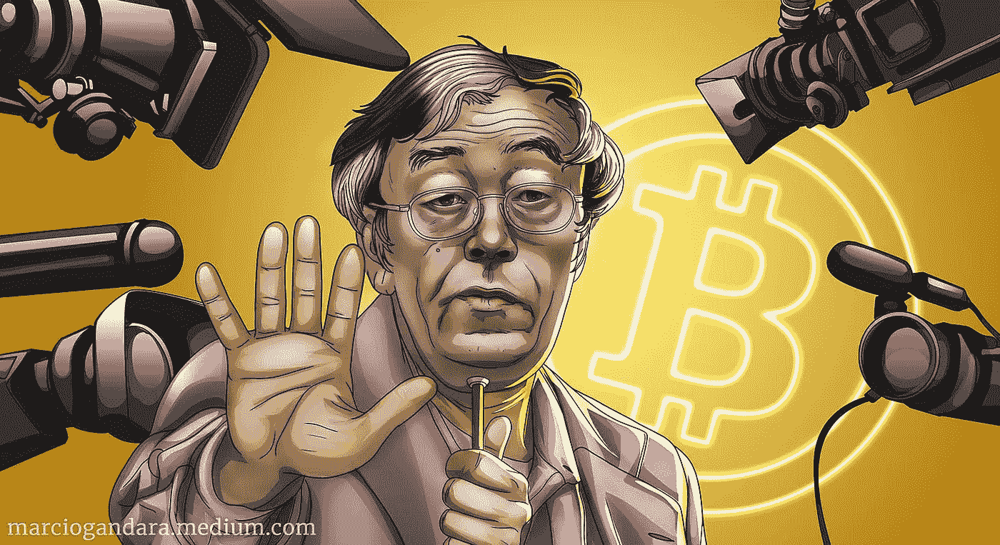
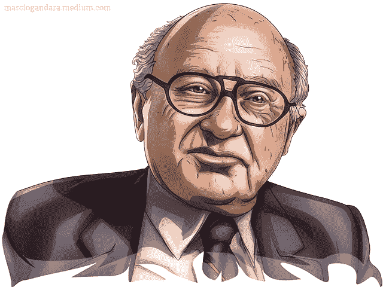
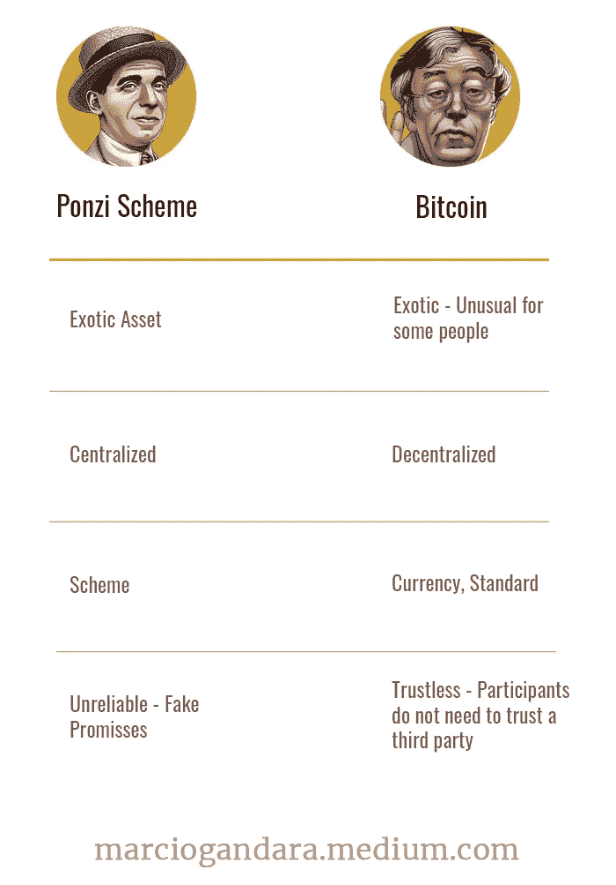

# 中本聪被遗忘的文字:比特币既不是庞氏骗局，也不是欺诈骗局，原因就在这里

> 原文：<https://medium.com/coinmonks/the-forgotten-writing-of-satoshi-nakamoto-bitcoin-is-neither-a-ponzi-nor-a-fraudulent-scheme-and-ae2d75242fb9?source=collection_archive---------1----------------------->

The Forgotten Writing of Satoshi Nakamoto | Illustration: Will Tang | marciogandara.medium.com

奥瑞安·中本聪曾经走过加州圣盖博的街道，但没有人注意到他，直到莉亚·古德曼走进了他的生活。但这不再是一个爱情故事。利亚在两名警察的陪同下来到多里安的家，声称该男子是比特币的幕后策划者。

多里安当时是一名 64 岁的退休工程师，古德曼揭露了他的生活，古德曼是一名调查记者，他认为已经找到了比特币的发明者。她为这一成就激动不已，在一本主要杂志上详细描述了他的生活。这篇题为“比特币背后的面孔”的文章让多里安成了名人，这让他非常懊恼。这件事发生在八年前。

关于真正的中本聪，除了他无与伦比的密码学和经济学知识之外，没什么可说的。他的工作带回了真正的金钱和价值哲学。

Satoshi 是世界上最想要的身份，没有犯下任何罪行。因其杰出的发明而被匿名的天才。或许，为给人类带来了一丝希望而自豪，以不腐货币的形式数字化传播。一个被剥夺了名人身份的著名笔名，以一个没有可见形状但价值不可估量的杰作的名义。这是中本聪。

如果你认为这些都是夸大其词，读一读他最近发给加文·安德森的私信:

> “我希望你不要一直说我是一个神秘的影子，媒体只是把它变成一个海盗货币的角度。也许相反，它是关于开源项目，给你的开发贡献者更多的信任；这有助于激励他们。”

至于 Satoshi 的性格，只能推测。不这样说是不公平的。值得一提的是，名气、知名度和受欢迎程度似乎并不是他最显著的特征。多里安也是如此，这两个故事都与查尔斯·庞兹的故事形成了鲜明的对比。

卡洛斯·皮埃特罗·乔瓦尼·古列尔莫·特巴尔多·庞兹 1882 年出生于意大利卢戈。据他后来对《纽约时报》说，21 岁时，他带着口袋里的 2.5 美元和 100 万美元的希望在美国落脚。

庞兹首次访美是短暂的。他很快搬到加拿大，在一家意大利银行 Zarossi 工作，在那里他学会了成为一名熟练的骗子。庞兹离开了银行，直接进了监狱。他被判三年徒刑，后来减刑，在服刑前一年多离开了监狱。

回到美国，庞兹的家是亚特兰大监狱。在两年的监禁后，他自由了，无忧无虑地——像大师一样——指挥他最著名的交响乐《庞氏骗局》。

Charles Ponzi — The Maestro of Finance

# **庞氏骗局和金融大师**

这个诈骗犯的最新冒险始于 1919 年。从欺骗到欺骗，庞氏以一种历史永远不会忘记的方式，在自己的姓氏后洗礼了一种欺骗的方法。

在痛苦的岁月之后，这一天象征着自第一次世界大战结束以来期待已久的国与国之间的领土、商业和金融重组。与此同时，查尔斯·庞兹代表了那些因战争影响而失去储蓄、收入、工作和住房的人的希望。

1870 年至 1914 年间，世界主要经济体实行金本位制，各国被要求保存黄金储备，每种货币的价值根据其所含黄金的数量来确定。

尽管如此，发行大量货币以补贴各国战时军事行动的“需求”废除了金本位制。因此，国际支付系统受到汇率关系不匹配的影响。

当时，除了英语和意大利语之外，庞齐还会说法语——多亏了加拿大的“交流”时期。易于沟通是他的品质之一，也是他将自己的最新企业查尔斯·庞兹进出口公司理想化的决定性因素，这家公司没有一个客户。

由于没有钱来推广业务，庞兹将公司的名称改为“波士顿广告和出版公司”，并推出了新产品“交易者指南”杂志。该指南从未出版过印刷版，而是用活页夹分发。

庞兹的想法是随着出版物恶名远扬而增加页数。乐观主义者庞氏将再次悲惨地失败。直到一封来自西班牙的信为这位金融大师开启了主秀。

在信中，作者索要了一份交易者指南，这份指南已不再是庞氏投资组合的一部分。这封信包含一个国际回复优惠券(IRC)，允许收件人向发件人发送回复，而无需支付邮资。因此，在原产国购买并邮寄的优惠券允许接收者免费回复。优惠券也可以换成邮票。

IRC 在所有使用这种邮政服务的国家都有固定的价格。然而，这在 1919 年已不再是现实，当时金本位制与经济脱节，政府面临战后衰退。

结果，在那些货币受到战争严重影响的国家，这些息票遭受了严重的贬值。于是，狡猾的庞氏意识到，他可以在欧洲购买优惠券，在美国出售，并从操作中获利 400%以上。

庞兹的韧性令人羡慕。他很快开设了他的最新业务，证券交易公司，并在波士顿四处传播。一向魅力四射的庞兹准备向对此计划感兴趣的人介绍息票业务，承诺季度回报率为 50%。

庞氏的生意第一次做得很好。“我就是那个人，”他曾经回答一个对优惠券业务持怀疑态度的家伙。投资者得到了承诺的回报，其他什么都不重要。

庞氏骗局以高短期回报的承诺吸引投资者。系统中的每个新成员都为前一个成员的收入提供资金。那些过早参与欺诈的人通常会获得过高的利润，从而吸引渴望轻松赚钱的新投资者。

没过多久，庞氏的故事就登上了头条。优惠券——这个野心勃勃的计划的摇钱树——是 T2“拆东墙补西墙”非法行为的伪装。因此，一波撤资潮让这种雄心难以为继。最终，阴谋背后的“那个人”被揭露了。

在生命的最后几天，庞兹在里约热内卢住院，他向一名记者坦白了自己的罪行。

> “我的生意很简单。这是拆东墙补西墙的老把戏了。你会给我一百美元，我会给你一张三个月后付给你一百五十美元的条子。通常，我会在 45 天内赎回我的票据。我的纸币变得比美国货币更有价值……然后麻烦来了。整个事情都坏了。”

米切尔·朱可夫在 [**的《庞氏骗局:一个金融传奇的真实故事**](https://amzn.to/37Ph0pk) 中详细讲述了庞氏的迷人故事。

# 比特币“计划”

为了证明比特币，我最初向米尔顿·弗里德曼发出了“死后邀请”。弗里德曼是著名的经济学家和统计学家，著名作家，芝加哥大学教授，1976 年诺贝尔经济学奖获得者。

Milton Friedman — 1976 Nobel Prize in Economics

[**《资本主义与自由》(1962)**](https://amzn.to/3utwkkb) 是一本畅销书，也是他最受好评的作品，他在书中主张，没有经济自由，社会或个人主权就不存在。

不足为奇的是，弗里德曼相信互联网的力量能够削弱政府的作用，而可靠的数字货币是唯一缺失的东西。在 1999 年的一次采访中，87 岁的米尔顿谈到了这笔他称之为“Ecash”的特别的钱，这是他去世前的七年，也是 Satoshi 第一次“露面”的九年。

> “我认为，互联网将成为削弱政府作用的主要力量之一。现在缺少但很快就会开发出来的是一种可靠的电子现金，这种方法可以让你在互联网上把资金从一个地方转移到另一个地方，而 A 不知道 B，B 也不知道 A。”

弗里德曼接着谈到了他所设想的数字货币会如何鼓励非法交易的问题。

> **“当然，它也有它消极的一面。这意味着从事非法交易的歹徒也将有更容易的方法来继续他们的生意……"**

在晚年，弗里德曼没有活到看到他的“预感”出现的时候。2008 年 10 月 31 日，中本聪在一个密码学论坛上向世界展示了比特币论文。在美国庆祝万圣节的那一天，弗里德曼可能会害怕看到他的话与中本聪展示的内容有多么相似。

**“我一直在研究一种新的电子现金系统，它是完全点对点的，没有可信的第三方。**

**论文可在:**获得

[**http://www.bitcoin.org/bitcoin.pdf**](http://www.bitcoin.org/bitcoin.pdf)

**主要特性:利用对等网络可以防止重复消费。**

**无造币厂或其他可信方。**

**参与者可以匿名。**

**新硬币由 Hashcash 风格的工作证明制成。**

仍然默默无闻的 Satoshi 写道:**新硬币一代的工作证明也使网络能够防止重复消费。**

弗里德曼也会惊恐地发现，他关于比特币促进非法交易的观点是错误的。[**Layah heil pern**](https://www.layahheilpern.com/)在 [**脱下比特币的外衣:世界上最具革命性资产的启示指南**](https://amzn.to/3uu0zrt) 中明确回应了这种误解。

> “与此形成鲜明对比的是，比特币实际上是一种不明智的犯罪选择。尽管钱包地址是匿名的，但比特币所基于的区块链技术使所有交易完全可追踪、透明且不可改变。当局确实有能力追踪犯罪线索，一路追踪到最初的源头，留下不可逆转的痕迹。因此，出于非法目的进行比特币交易几乎等同于认罪并揭露所有已知的共犯，你能有多蠢？”
> 
> 莱亚·海尔彭

Layah Heilpern — Author of Undressing Bitcoin

在另一篇文章中，Layah 带来了来自联合国的信息来证明**“全球 GDP 的 2%到 5%，即 8000 亿到 2 万亿美元，实际上是通过法定货币进行洗钱的。”然后她挑衅道:“我个人认为现在很清楚罪犯们更喜欢哪种方法，你不觉得吗？”**

不幸的是，像这样的新闻不会成为当天的头条新闻，而是被主流媒体小声报道。

今年 2 月，伊利亚·利希滕斯坦(Ilya Lichtenstein)和希瑟·摩根(Heather Morgan)夫妇因试图清洗有史以来最大的比特币盗窃案的余额而被联邦调查局特工逮捕。该案件于 2016 年曝光，当时 Bitfinex 交易所遭到黑客攻击，119，754 个比特币被非法转移到一个数字钱包。被捕时，被劫金额价值 45 亿美元。

重要的是要记住比特币网络从未被黑客攻击过。被盗的加密货币由中介机构 BitFinex 交易所保管，该交易所的系统受到了攻击，黑客获得了访问密钥来实施盗窃。简而言之，他们得到了取款的“密码”。

Glaidson Acácio dos Santos 在巴西被称为比特币法老。格莱森曾是一名服务员、牧师和商人，现在是一名在最高戒备监狱服刑的被拘留者，他在 2014 年的收入为 175 美元，他通过一个类似于庞氏骗局的计划发了财。

他的生意在六年内为 BRL 带来了 380 亿英镑的收益——相当于 76 亿美元——并吸引了依赖法老来增加储蓄的公务员、政治家、企业家、警察和艺术家。2022 年 1 月被捕，他发誓自己是无辜的。金融工具又一次被用作模糊欺诈的绝妙伪装。

在这两种情况下，媒体的中心信息是让人们提防比特币，而不是骗子。欺诈者将使用现金、黄金、艺术品、明信片、邮票或任何其他可用资产来资助他们的计划，而比特币将仍然是实现这一目的的最差选择。

作为一个细心的读者，你可能已经意识到，把比特币或邮政券比作骗局是没有意义的。但是让我们试一试吧！

# 比特币 vs 庞氏骗局:让我看看你的朋友，我就知道你是谁

比特币的根源不是一系列欺诈计划。相反，这是献身于科学的专家和学者的努力。

其中有[大卫·肖恩](https://en.wikipedia.org/wiki/David_Chaum)，加州大学计算机科学博士，Digicash 的发明者；[戴伟](https://en.wikipedia.org/wiki/Wei_Dai)，计算机工程师，Crypto++密码库开发者，b-money 创始人；[亚当·贝克](https://en.wikipedia.org/wiki/Adam_Back)，计算机科学博士，密码学家和密码朋克。Back 开发了比特币挖矿过程中使用的系统；Nick Szabo ，计算机科学家、密码学家和法学博士，他提出了智能合同的概念；最后是已故的[霍尔·芬尼](https://en.wikipedia.org/wiki/Hal_Finney_(computer_scientist))。芬尼是一名杰出的游戏开发者、密码学家，也是这个星球上第一个收到比特币交易的人。

相比之下，庞兹的导师是银行家 Luigi zaro SSI——他教会了庞兹“拆东墙补西墙”的生意——以及他在狱中的狱友。具有讽刺意味的是，正是扎罗西逃到了墨西哥，当庞氏骗局在他的银行被发现时，他身无分文。

[伊格纳西奥·卢波](https://en.wikipedia.org/wiki/Ignazio_Lupo)，一个伪造者和暴力暴徒，和[查尔斯·w·莫尔斯](https://en.wikipedia.org/wiki/Charles_W._Morse)，一个擅长金融诈骗的百万富翁，是庞氏的其他影响者。莫尔斯是一个有着巨大政治影响力的商人，他依靠华尔街日报的老板 Clarence W. Barron 游说白宫释放他。这是同一个巴伦，他调查庞兹是为了把他送回监狱。

在《庞氏骗局:一个金融传奇的真实故事》中，米切尔·朱可夫讲述了一段令人难忘的莫尔斯语录。他认为自己被冤枉了，他说:“在华尔街，没有人不像我一样每天都在做。”

Fabio Cres 是金融学教授，著有《 [**庞氏骗局:T2**](https://amzn.to/3L0996W)》——**庞氏骗局:如何从粗心大意的人身上拿钱**。在书中，Cres 定义了庞氏骗局的四个基本要素:对不寻常资产的投资、非凡的回报、信任的建立和发起人控制。让我们试着理解它们是如何融入比特币“计划”的。

## 1 — **非常资产投资**

在庞氏骗局中，外来的创新资产总是被用作吸引投资者的诱饵。事实上，对许多人来说，比特币是一种不寻常的资产。然而，将比特币或优惠券视为欺诈毫无意义。

比特币的历史升值，加上加密货币市场的繁荣，使比特币成为人们渴望的对象，并在人类的想象中激起幻想。但我们要明确的是:骗局中使用的资产，可以是加密货币、鱼翅、棒球卡等。只不过是一个诱饵，用来吸引野心勃勃和绝望的人。不需要复杂:拆东墙补西墙是唯一“有利可图”的交易。

## 2— **超常回报**

比特币及其前所未有的升值是一个很好的陷阱。欺诈者经常将作为欺诈对象的资产与当时最有价值的资产进行比较。但即使是比特币也远不及庞氏或他谦逊的粉丝——比特币法老——所承诺的收益率。

给你一个概念，2014 年 12 月，比特币的交易价格是 315 美元。在这一天，以 10%的月回报率投资于比特币之王格莱森的同样金额在今天将价值 1521456.48 美元。150 万美元。这代表着比今天的比特币价格高出 37 倍的价值。俗话说，好得难以置信！

## 3 — **建立信任**

在庞氏骗局中，欺诈者总是兑现最初的付款，以建立与投资者的信任关系，从而吸引其他人。

这一点无法与比特币的本质相提并论。比特币是一种不需要中介的技术，基于“无信任”的概念。用稍微有点技术性的语言来说，这基本上意味着基于“不可信”系统的应用程序不需要可信的第三方来仲裁事务。

## 4 — **启动子控制**

在庞氏骗局类型的欺诈中，总有一个控制者或集中实体。永远！欺诈者伪装成成功的商人，通常有计划在事情开始出错时逃离。

另一方面，比特币是一个去中心化的网络，其运行没有一个负责的中心个人或实体。此外，网络上发生的所有交易都是公开的，任何人都可以核实。此外，它没有截止日期。

下表说明了庞氏骗局和比特币之间的(无意义的)比较。

Bitcoin vs Ponzi Scheme

> 相反，比特币与欺诈性金融计划有一些共同点:都是利用经济弱点。在金融骗局中，受害者几乎总是普通人，而在比特币“骗局”中，受害者是经济疲软本身。

# 如果比特币不是诈骗，那是什么，为什么会一直涨？

四十多年前，软件质量之父 Watts S. Humphrey 宣称:“每一项业务都是软件业务。”

你知道亚马逊、谷歌、脸书、苹果、微软、Twitter、特斯拉、纽约时报、蓝色起源、Medium 和大多数在纳斯达克、纽约证券交易所、伦敦证券交易所或任何其他世界证券交易所交易的公司是什么吗？软件公司，每个都有自己的产品和服务。

告诉我一个任何行业中不依赖软件运行的著名公司。不管他们是把飞船送上太空，卖广告还是制造交通工具。如果你认为软件仅仅是对组织活动的支持，我必须说你大错特错了，就像我不久前一样。**软件几乎就是商业本身。**

为了说明我的意思，让我们以优步、Airbnb 和亚马逊为例。优步是一家提供移动服务的软件公司，就像 Airbnb 是一家提供托管服务的软件公司一样。有些人可能会称亚马逊为零售公司。从来没有过。毕竟，亚马逊是一个软件组织，也活跃在零售领域。那是在 AWS 出现之前很久的事了。这样的例子不胜枚举。

这些公司中的每一家都有具体的问题需要解决，并且都有应对这些问题的商业模式，但是如果没有合适的软件解决方案，它们都不会面临这些挑战。在今天的环境下，不这样想是妄想。

什么是银行？你猜怎么着？银行是软件公司，通过向你提供金融服务来赚钱(斯科特·安布勒)。但是你存在银行里的钱来自一个过去的时代。您通过数字银行进行的交易代表着数字化的过去。就像编辑一张悲伤的老照片。你可以把它变美，但改变不了它的历史。

尼亚尔·费格森是历史学家，曾任哈佛大学教授。这位教授被时代杂志认为是 2004 年世界上 100 位最有影响力的人之一。在他的书《货币的崛起:世界金融史》中，弗格森批评了当前的货币体系。

> “在许多方面，正如我们已经看到的，已建立的货币体系是模拟时代的产物。由央行管理的法定货币与贵金属没有任何联系，是上世纪 70 年代布雷顿森林体系崩溃时的产物。取代纸币成为消费者首选支付手段的信用卡也起源于 20 世纪末:万事达卡起源于 20 世纪 60 年代末的“Master Charge”。环球银行金融电信协会(SWIFT)于 1973 年在布鲁塞尔成立，如今处理银行和其他金融机构之间的大部分国际转账业务
> 
> **钉弗格森**

我们的钱，弗格森提到的这些老式机构，以及当前的货币体系，实际上是模拟时代的产物。悲伤老照片的数字化版本。真是一团糟！

比特币不一样！**比特币是一种货币问题的软件解决方案。**但与我上面提到的那些公司不同，没有首席执行官或中央实体控制它。这是电子现金，由中本聪描述，由一个开发者社区构想。它是分散的、稀缺的、现代的、主权的，没有边界、所有权或国家操纵。新照片，不是虚伪的旧形象。这是全世界的钱。

> 如果技术进步是比特币出现的必要因素，那么它消除中间人角色的能力、基于稀缺性的经济因素以及代码的不断演变将使它保持活力，无论是作为价值储存手段、交易媒介，还是作为记账单位。时间会证明一切！

很少有人像[**Saifedean Ammous**](https://saifedean.com/)[**《比特币标准:中央银行的去中心化替代方案**](https://amzn.to/3rABSaN) 》的作者一样熟悉比特币的经济和技术层面，该书是一本被翻译成 21 种语言的畅销书。Ammous 拥有哥伦比亚大学可持续发展博士学位和伦敦经济学院发展管理硕士学位。

在作品《一颗被切割的钻石》中，Ammous 没有走捷径，而是给读者上了一堂历史和经济学课，让读者了解比特币的主要方面。作者提出了相信比特币标准可行的理由。

Saifedean Ammous — Economist and Author of The Bitcoin Standard

为了理解比特币为什么会继续上涨，我转向他，问他加密货币是否会找到一个稳定点。不到 6 分钟，他回答道:

> “It will continue to grow as long as there are other monies and bonds for it to eat. Once it has eaten them all, and it is the only money and store of value in the world, it will start growing in value every year by the amount of economic growth in other goods and services. In other words, when we produce more things, their value drops against bitcoin. We will keep making more of everything except bitcoin.”
> 
> **Saifedean Ammous**

Given the current monetary system, it seems challenging to oppose Saifedean’s argument.

Bitcoin is David versus Goliath. It’s the clumsy Susan Boyle singing I Dreamed a Dream on Britain’s Got Talent, with an impressed audience after the screening. The glory of the underestimated. But it’s also the explosive Tina Turner singing The Best.

Bitcoin is a lesson in morals and ethics for economic policymakers. It’s the Storming of the Bastille and the Fall of the Berlin wall. The Tank Man — the Unknown Rebel in front of the tanks at Tiananmen Square in Beijing. It’s the image and likeness of a community that donated millions of dollars worth of BTC to Ukraine to defend its people and territory against the Russian invasion.

Bitcoin is the sum of many epoch-making events and the gateway to the post-contemporary age. It is indeed a symbol of wealth and power, but it also awakens the expectation of the poorest. How is it possible?

Bitcoin is Dorian having to explain he’s not someone he never pretended to be. Bitcoin is the indecipherable Satoshi Nakamoto. It’s the new new normal. A standard, not a scheme. A genuine currency, not a fucking fraud!

I firmly believe Bitcoin is not a scam, but the same cannot be said about the global cryptocurrency market, where credible and fraudulent initiatives abound. Also, this is my opinion, and please don’t take it as financial advice.

As an assiduous reader, I only recommend what I read and what catches my attention.

If you have enjoyed the reading, [**follow me**](https://marciogandara.medium.com) to get updates on new stories.

I’m also on Twitter: [**@GandaraMarcio**](https://twitter.com/GandaraMarcio)

[**Read in Portuguese (Leia em português)**](https://marciogandara.medium.com/a-escrita-esquecida-de-satoshi-nakamoto-bitcoin-n%C3%A3o-%C3%A9-um-esquema-ponzi-nem-fraudulento-e-as-7402b0528c65)

**Thank you!**

> …

# **Post-credits**

Not every Ponzi Scheme is born as a Ponzi Scheme. Charles Ponzi was already a crook before he went down in history, but it’s not known for sure if he believed in the possibility of making money with the postal coupons.

Dorian Satoshi Nakamoto has earned the cryptocurrency community’s admiration and respect, and his image has become an icon among Bitcoin enthusiasts.

 [## 每当马尔西奥·甘达拉发表文章时，就收到一封电子邮件。

### 每当马尔西奥·甘达拉发表文章时，就收到一封电子邮件。通过注册，您将创建一个中型帐户，如果您还没有…

marciogandara.medium.com](https://marciogandara.medium.com/subscribe) 

> 加入 Coinmonks [电报频道](https://t.me/coincodecap)和 [Youtube 频道](https://www.youtube.com/c/coinmonks/videos)了解加密交易和投资

# 另外，阅读

*   [3 商业评论](/coinmonks/3commas-review-an-excellent-crypto-trading-bot-2020-1313a58bec92) | [Pionex 评论](https://coincodecap.com/pionex-review-exchange-with-crypto-trading-bot) | [Coinrule 评论](/coinmonks/coinrule-review-2021-a-beginner-friendly-crypto-trading-bot-daf0504848ba)
*   [莱杰 vs n rave](/coinmonks/ledger-vs-ngrave-zero-7e40f0c1d694)|[莱杰 nano s vs x](/coinmonks/ledger-nano-s-vs-x-battery-hardware-price-storage-59a6663fe3b0) | [币安评论](/coinmonks/binance-review-ee10d3bf3b6e)
*   [Bybit Exchange 审查](/coinmonks/bybit-exchange-review-dbd570019b71) | [Bityard 审查](https://coincodecap.com/bityard-reivew) | [Jet-Bot 审查](https://coincodecap.com/jet-bot-review)
*   [3 commas vs crypto hopper](/coinmonks/3commas-vs-pionex-vs-cryptohopper-best-crypto-bot-6a98d2baa203)|[赚取加密利息](/coinmonks/earn-crypto-interest-b10b810fdda3)
*   最好的比特币[硬件钱包](/coinmonks/hardware-wallets-dfa1211730c6) | [BitBox02 回顾](/coinmonks/bitbox02-review-your-swiss-bitcoin-hardware-wallet-c36c88fff29)