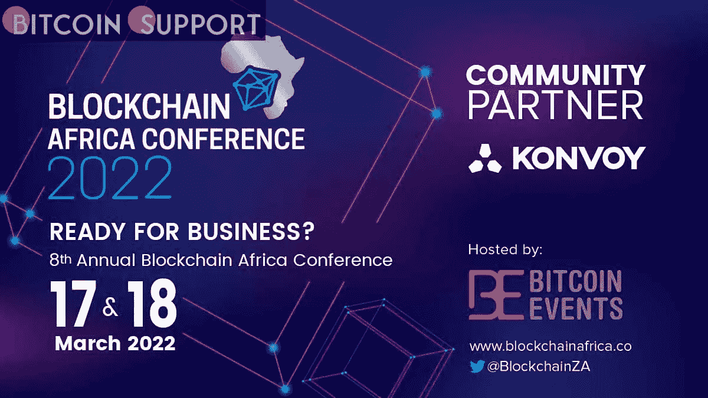

# Cardano 的创始人查尔斯·霍斯金森已被确认为 2022 年区块链非洲大会的主题演讲人

> 原文：<https://medium.com/coinmonks/the-founder-of-cardano-charles-hoskinson-has-been-confirmed-as-a-keynote-speaker-at-the-bea76fc18a27?source=collection_archive---------96----------------------->

**Visit our website:-** [**https://bitcoinsupports.com/**](https://bitcoinsupports.com/)

Charles Hoskinson is a must-see at any blockchain industry gathering. As a result, Bitcoin Events is ecstatic to have the Founder of Cardano, as well as the Founder and CEO of Input Output Hong Kong (IOHK), as a Keynote Speaker at the Blockchain Africa Conference. Charles will speak on IOHK’s projects on the African continent that use the Cardano blockchain. He’s previously discussed the vast prospects for blockchain technology adoption in Africa, as well as IOHK’s collaborations with numerous African countries to onboard students and citizens onto the Cardano platform for a real-world blockchain deployment.

The University of Edinburgh, Tokyo Institute of Technology, and the University of Wyoming are among the blockchain research laboratories that Charles has supported and funded around the world. He is deeply committed to the sector and has played a key role in shifting public opinions of cryptocurrencies and blockchain technology.

On the 17th and 18th of March 2022, Bitcoin Events’ main event, Blockchain Africa Conference 2022, will take place virtually in less than three days. The conference will be the eighth in the highly praised series, with over 2,000 people expected from more than 50 countries, including investors, start-ups, enthusiasts, developers, companies, legislators, and regulators.

The Blockchain Africa Conference 2022 (BAC2022) will focus on the prospects and applications of blockchain technology in Africa and around the world. The conference topics have varied over time to reflect the global acceptance of blockchain technology, including ‘Moving Africa Forward,’ ‘Beyond the Hype,’ ‘From Hype to Mainstream,’ and now ‘Ready for Business?’

**Discussions at the conference will include:**

— What is the state of blockchain technology in enterprise adoption, and what’s next?

— What role does blockchain technology play in unlocking the value of African livestock?

— Is the next generation of cross-border payments in Africa cryptocurrency and blockchain technology?

— In a South African setting, what is the significance of self-sovereign identification to organisations and citizens?

— Smart contracts have the potential to reshape company, and they are one of the main reasons why people are interested in blockchain technology and cryptocurrency trading. What makes some smart-contract platforms stand out from the rest, and why?

— What are the possibilities, and how may blockchain-based gaming be used to empower Africans?

— In 2021, despite an uncertain legal climate, $32.8 billion was invested in crypto and blockchain technology companies. Is this trend likely to continue, and what kinds of firms are gaining traction as a result?

— The eNaira, Nigeria’s first Central Bank Digital Currency (CBDC), was recently launched, making it the first African country to do so. What does the future hold for CBDCs across Africa?

Compliance and regulation: What kind of digital asset regulation are we seeing around the world, and what impact does regulation have on the industry?

Blockchain.com, DafriBank, and Klever Finance are the conference’s Premier Sponsors. AmaZix, Amber Group, Huobi Global, BNB Chain, and Metis are Diamond Sponsors.

The conference’s Gold Sponsors are Luno, AltcoinTrader, Tacen, CryptoCurrencyWire, QuidPro, and the Eastern and Southern African Trade and Development Bank (TDB).

The Blockchain Africa Conference 2022 promises to be a jam-packed two days of cutting-edge debate and networking. The conference will provide attendees with the opportunity to meet and network with some of the most significant personalities and organisations in the African and global blockchain ecosystems.

Africa is a continent with a young population, widespread mobile phone use, and well-developed infrastructure. These are some of the factors that are speeding up the adoption of blockchain and digital currency on the continent.

The Blockchain Africa Conference is a great way to meet people in the African blockchain ecosystem and learn more about it.

There will be around 2,000 attendees from over 50 nations, 50 presenters, and 25 sessions at the event.

**About Bitcoin Events:**

Bitcoin Events is the first event production firm in Africa to host world-class blockchain and cryptocurrency conferences. The firm has held seven highly successful Blockchain Africa Conferences in Cape Town and Johannesburg, as well as an online edition for 2021\. Additional annual events, such as the Crypto Fest and DeFi Conferences, have been added to the Bitcoin Events calendar.

These events drew over 14 000 people and 239 speakers from over 165 nations.

**Visit our website:-** [**https://bitcoinsupports.com/**](https://bitcoinsupports.com/)

**Disclaimer: These are the writer’s opinions and should not be considered investment advice. Readers should do their own research.**

> 加入 Coinmonks [电报频道](https://t.me/coincodecap)和 [Youtube 频道](https://www.youtube.com/c/coinmonks/videos)了解加密交易和投资

# 另外，阅读

*   [密码本交易平台](/coinmonks/top-10-crypto-copy-trading-platforms-for-beginners-d0c37c7d698c) | [Coinmama 审核](/coinmonks/coinmama-review-ace5641bde6e)
*   [印度的加密交易所](/coinmonks/bitcoin-exchange-in-india-7f1fe79715c9) | [比特币储蓄账户](/coinmonks/bitcoin-savings-account-e65b13f92451)
*   [OKEx vs KuCoin](https://coincodecap.com/okex-kucoin) | [摄氏替代品](https://coincodecap.com/celsius-alternatives) | [如何购买 VeChain](https://coincodecap.com/buy-vechain)
*   [币安期货交易](https://coincodecap.com/binance-futures-trading)|[3 comas vs Mudrex vs eToro](https://coincodecap.com/mudrex-3commas-etoro)
*   [如何购买 Monero](https://coincodecap.com/buy-monero) | [IDEX 评论](https://coincodecap.com/idex-review) | [BitKan 交易机器人](https://coincodecap.com/bitkan-trading-bot)
*   [CoinDCX 评论](/coinmonks/coindcx-review-8444db3621a2) | [加密保证金交易交易所](https://coincodecap.com/crypto-margin-trading-exchanges)