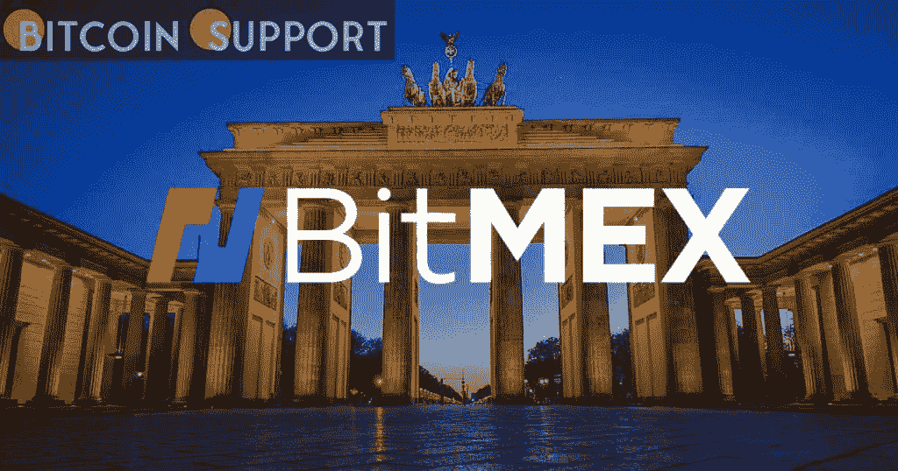

# BitMEX 的创始人已经承认违反了银行保密法

> 原文：<https://medium.com/coinmonks/the-founders-of-bitmex-have-admitted-to-violating-the-bank-secrecy-act-6cf8ad5b32c4?source=collection_archive---------62----------------------->

**Visit our website:-** [**https://bitcoinsupports.com/**](https://bitcoinsupports.com/)

由于他们违反了《银行保密法》并经营“洗钱平台”，亚瑟·海斯和本杰明·德洛将分别支付罚款。在与美国司法部进行了漫长的法律斗争后，加密货币交易所 BitMEX 的创始人承认违反了《银行保密法》(DOJ)。

在他们的加密衍生品和期货交易所，BitMEX、美国人 Arthur Hayes 和英国香港人 Benjamin Delo 承认“故意忽视建立、实施和管理反洗钱(AML)计划”

BitMEX 是一个位于塞舌尔的加密交易平台，提供高达 100 倍的加密期货、衍生品和保证金交易。美国人过去可以使用交易所的服务，而不必通过任何了解你的客户(KYC)或反洗钱(AML)检查。根据 DOJ 2 月 24 日关于此案的通知，由于缺乏监管合规性，BitMEX 成为了一个“洗钱平台”。在 3 月的审判日之前，海斯和德洛都承认有罪，同意支付总计 1000 万美元的刑事罚款。据 DOJ 律师达米安·威廉姆斯称，在美国经营加密业务涉及“这些企业有义务尽自己的一份力量来帮助消除犯罪和腐败”。他接着说，BitMEX 是一个“金融市场阴影下的平台”，它做了以下事情:

**“阿瑟·海斯和本杰明·德洛成立了一个公司，明确的目的是逃避这些要求；他们故意不制定和维持最基本的反洗钱标准。”当 BitMEX 在 2020 年完成向塞舌尔政府的转移时，海斯向塞舌尔政府行贿的指控支持了 DOJ 的说法。据说他夸口说贿赂只花了他一个椰子。

尽管事实上 BitMEX 的总部在大约 2015 年到 2020 年期间都在美国，但 Hayes 和 Delo 声称没有美国人使用这个平台。司法部证实该指控是虚假的。到 2021 年 1 月，该交易所声称已经通过 KYC 反洗钱流程审查了所有用户。

BitMEX 的比特币期货未平仓合约(OI)比例，在正确验证其所有用户后，已经缩水至微不足道。2021 年 2 月，OI 只有大约 35 亿美元，其中 BitMEX 占了近三分之一。根据 CoinGlass 的数据，现在 OI 有 151.8 亿美元，BitMEX 仅占 4.82 亿美元，即 3%。

**访问我们的网站:-**[**https://bitcoinsupports.com/**](https://bitcoinsupports.com/)

**免责声明:以上为作者观点，不应视为投资建议。读者应该自己做研究。****

> *加入 Coinmonks* [*电报频道*](https://t.me/coincodecap) *和* [*Youtube 频道*](https://www.youtube.com/c/coinmonks/videos) *了解加密交易和投资*

# 另外，阅读

*   [AscendEx 保证金交易](https://coincodecap.com/ascendex-margin-trading) | [Bitfinex 赌注](https://coincodecap.com/bitfinex-staking) | [bitFlyer 审核](https://coincodecap.com/bitflyer-review)
*   [Bitget 评论](https://coincodecap.com/bitget-review) | [双子星 vs BlockFi](https://coincodecap.com/gemini-vs-blockfi) cmd| [OKEx 期货交易](https://coincodecap.com/okex-futures-trading)
*   [AscendEx Staking](https://coincodecap.com/ascendex-staking)|[Bot Ocean Review](https://coincodecap.com/bot-ocean-review)|[最佳比特币钱包](https://coincodecap.com/bitcoin-wallets-india)
*   [霍比审核](https://coincodecap.com/huobi-review) | [OKEx 保证金交易](https://coincodecap.com/okex-margin-trading) | [期货交易](https://coincodecap.com/futures-trading)
*   [网格交易机器人](https://coincodecap.com/grid-trading) | [Cryptohopper 审查](/coinmonks/cryptohopper-review-a388ff5bae88) | [Bexplus 审查](https://coincodecap.com/bexplus-review)
*   [7 个最佳零费用加密交易平台](https://coincodecap.com/zero-fee-crypto-exchanges)
*   [氹欞侊贸易评论](https://coincodecap.com/anny-trade-review) | [火币保证金交易](/coinmonks/huobi-margin-trading-b3b06cdc1519)
*   [去中心化交易所](https://coincodecap.com/what-are-decentralized-exchanges) | [比特恩斯 FIP](https://coincodecap.com/bitbns-fip) | [Pionex 评论](https://coincodecap.com/pionex-review-exchange-with-crypto-trading-bot)