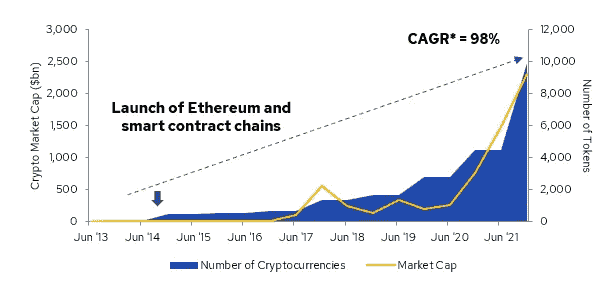
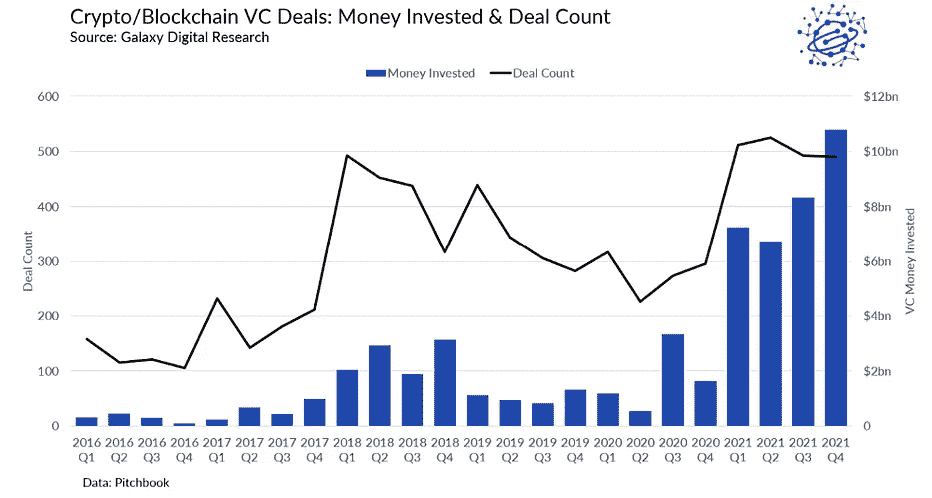
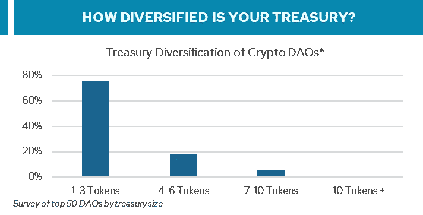
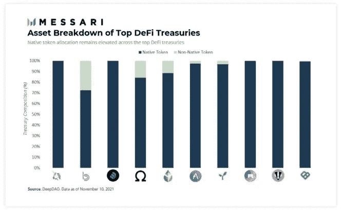
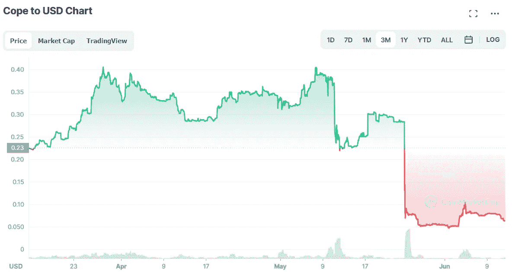
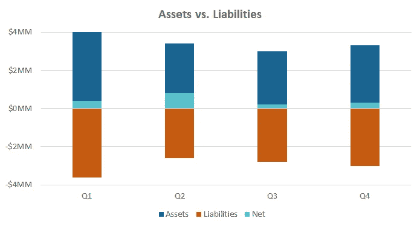
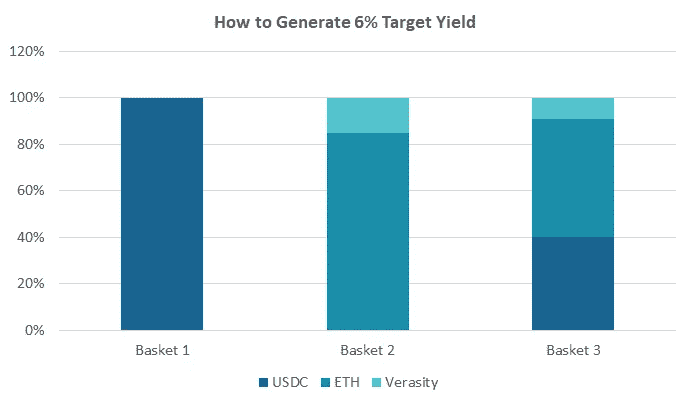
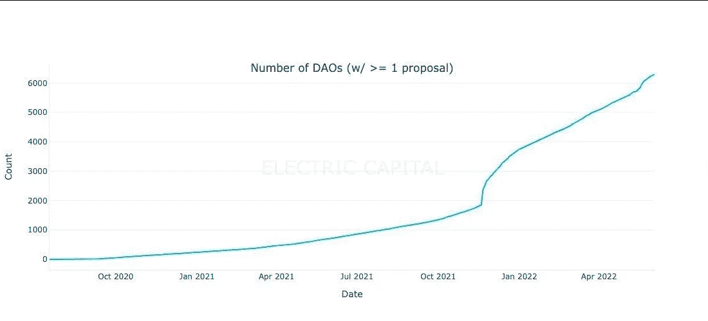

# 加密国库管理的四大支柱

> 原文：<https://medium.com/coinmonks/the-four-pillars-of-crypto-treasury-management-70191806dc3c?source=collection_archive---------7----------------------->

资金管理可能是加密领域中一个非常容易被忽视的方面，但却是最重要的方面之一。最近几个月已经证明，许多 Dao 和协议都是如此，无数新项目由于现金流的原因而被搁置。我们最近采访的一位创始人估计，他们平台上推出的项目中有 80%已经停止运营，估计有 50%撑不过 6 个月。这是在以太坊股价再次下跌 40%至 1050 美元之前。

没有人真正知道加密金库(协议、Dao、基金会、控股公司等)的确切累积规模。)，但也不是不可小觑的东西。Deepdao 向我们指出，仅 dao 国债就突破了 95 亿美元大关，去年的峰值约为 130 亿至 140 亿美元。Gnosis Safe(美国国债存储的行业标准)指出，这一数字将达到 400 亿美元，去年的峰值是这个数字的 3 到 4 倍。实际上，加密国债的总规模可能远远超过这一数字。毕竟，去年仅风险资本就投入了 330 亿美元……这还不包括密码行业在截至 2021 年的过去 8 年中经历的 98%的 CAGR。

Source: coinmarketcap.com, Galaxy Digital

尽管有这样的增长，基本的资金管理问题在整个生态系统中仍然存在。大多数项目以其固有的代币筹资，与这些代币相关联的投票权造成了传统市场所没有的或已经通过 A 类股对 B 类股等机制解决的独特复杂性。主要是，这导致集中风险，在市场高度波动时导致死亡螺旋，并且无法平衡 Arc Street 确定的加密资金管理的四大支柱:

**多元化、流动性、现金流、**和**治理。**

# **多元化:**

多样化是国库最重要的元素之一，虽然它可以通过不同的方法表达，但多样化的主要目标是相同的:获得不同业绩周期的资产，从而减轻特定投资组合的波动性。研究一直表明(根据经验和通过样本外测试),分散投资组合比集中头寸具有更小的波动性和下行风险——这是确保长期运营寿命的一个重要特征。

然而，当查看排名前 50 的 Dao 和协议时(包括 Uniswap、Lido 等。)，近 80%的投资者持有的美国国债集中在不到 3 种资产上，其中大部分仅由本国货币组成，一小部分配置在稳定的货币上。用传统的金融术语来说，这相当于福特的财政部几乎 100%投资于福特自己的股票——这是监管所禁止的。法律要求传统的公司资金团队管理其投资组合中的风险，以确保能够满足公司的日常运营。

Source: deepdao.io, Arc Street Capital, Messari Report: Crypto Theses for 2022

主要由自己的代币组成的国库产生了一定程度的特殊风险，这种风险破坏了组织的稳定性，并且由于这个问题的范围，破坏了整个加密生态系统的稳定性(从最近的事件中可以看出)。

这种程度的集中存在是有原因的。如前所述，国债集中的主要原因之一与这样一个事实有关，即融资通常发生在项目的本地令牌中。从哲学上讲，拥有一个金库就像社区/用户在用户和创作者之间排列激励一样。然而，拥有一个多元化的财政部将增加保持这种激励一致性的可能性，因为建筑商将在动荡的市场条件下保存资本。在现有的解决方案下，真正的国债多元化是很困难的，甚至是不可能的。生态系统中国库的集中造成了囚徒困境，因为解除国库的流动性需要巨大的成本，导致大多数协议和 Dao 在计算其国库资产时完全排除了自己的本地令牌。这就把我们带到了加密资金管理的第二个支柱。

# **流动性:**

加密领域的流动性经常与代币流动性联系在一起讨论，而*财政部*流动性的话题经常是次要的讨论。在 trad-fi 领域，资金流动性使资产能够同时投入使用(例如产生收入或资产增值)和用于负债匹配(例如支付员工工资)。从这个角度来看，如果十亿美元的国债被锁定在不能出售的私人投资中，它对任何人都没有好处。即使捐赠基金的规模足够大，可以永久投资，但也只能将一小部分资产配置到长期非流动性策略中。

然而，对于加密库来说，这种情况经常存在。由于缺乏多样化，任何国库券资产(主要投资于本地代币)的出售将对所述代币的价格产生直接和实质性的影响。这种关系的一个最近的例子可以在 Solana 生态系统上的 COPE 中看到。为了满足开发支出，该团队被迫出售相当于其总令牌供应量 11%的大部分国债，导致价格暴跌 77%。可以说更大的代价是随后失去了社区的信任。

Source: coinmarketcap.com

除了这种动态，协议和 Dao 缺乏传统公司采用的 A 类和 B 类股权结构。因此，投票权仍然与本地代币有着内在的联系，出售其国债中的这些资产通常会导致其投票权的减少(稍后将详细介绍)。这两种动态的结合造成了一种情况，即 DAO 或协议成为它们的库的强制持有者。他们不能出售它，因为它会对价格和投票权产生影响，用它来收获收益也会对投票权产生类似的影响。因此，由于这种流动性不足，加密国债不仅不能像传统国债那样采用多样化策略，还很难产生现金流。

# **现金流**

国库需要现金流(即收益)来满足发生的运营支出(如员工、审计、软件许可等)。).在这种程度上，许多加密国债已经部署了它们的资产，以产生某种形式的收益。毕竟，DeFi 空间的快速增长是由于产量收获的引入。例如，AAVE 通过累积一篮子 aTokens(通过《AAVE 存款协议》生成的令牌，用于识别收益累积的钱包)并通过跨其他协议下注来产生收益。利多通过 Ribbon 等期权库和 Curve farming pools 产生部分收益，Ribbon 是 stEth 上运行每周备兑买入策略的地方。

然而，传统的国库可以将 80%以上的资金配置在不同程度的收益生成资产(债券、股票、货币市场基金等)中。)，大多数加密协议再次受到其资产流动性的限制，远远达不到这一点。此外，虽然传统的国债通常遵循目标收益率或负债匹配方法，但这种策略通常不会出现在加密领域。maker Dao[最近的公告](https://twitter.com/MakerDAO/status/1535290688413306881?s=20&t=8d4ukh5RdFZpOoi7HmXt1w)第一次引人注目地提到了这种方法。

缺乏围绕目标收益率的规范可能导致资产/负债不匹配，即流出超过流入，如果不小心，可能导致资产基础迅速枯竭。协议和 Dao 与传统公司一样有运营开销，因此应考虑目标收益或资产/负债管理方法。当然，我们还必须考虑产生这种收益的正确资产组合。

For illustrative purposes only, yields as of 30/05/2022

# **治理**

最后，治理完善了加密资金管理的第四个支柱。如前所述，A 类和 B 类股票的概念在 crypto 中的存在程度不同于它们在传统股票空间中的存在程度。由于价格行为和投票权是合二为一的，出售国债代币也会导致投票权的丧失。从像 Curve 和 ENS 这样的大型项目到像 Build Finance DAO 这样的小型项目，治理攻击已经成为一个越来越令人担忧的问题。随着项目在开发生命周期中的成熟，以及治理投票作为决策制定的一部分的增长，当项目开始完全去中心化的旅程时，保持对治理权利的适当控制成为一个需要考虑的非常重要的方面。

Source: Electric Capital

目前，像 Snapshot 和 Tally 这样的工具可以帮助 Dao 和 protocols 更全面地管理治理，最近 veTokens 的激增允许更“*现金流式*”的治理权货币化。然而，使用 veTokens 的协议仍然很少(veCRV 是最突出的)。绝大多数原生令牌在多样化或采用收益生成策略时仍然遭受放弃其治理权的痛苦。

很少有项目(如果有的话)解决了加密资金管理的所有四个支柱:**、**流动性**、**现金流**和**治理。**利用市场上可用的工具，国债仍然几乎不可能拥有流动性来成功地多元化，这随后会阻止它们获得适当的现金流。围绕所有这一切的难题是，如何确保治理留在专门的机构群体手中，而不是在改善国库健康的过程中丢失。鉴于加密国债如今面临的诸多问题，不难理解为何如此多的项目在熊市中失败。为了防止项目的大规模失职，确保行业的稳定，必须有比我们今天看到的更好的资金管理解决方案。**

> **交易新手？尝试[加密交易机器人](/coinmonks/crypto-trading-bot-c2ffce8acb2a)或[复制交易](/coinmonks/top-10-crypto-copy-trading-platforms-for-beginners-d0c37c7d698c)**