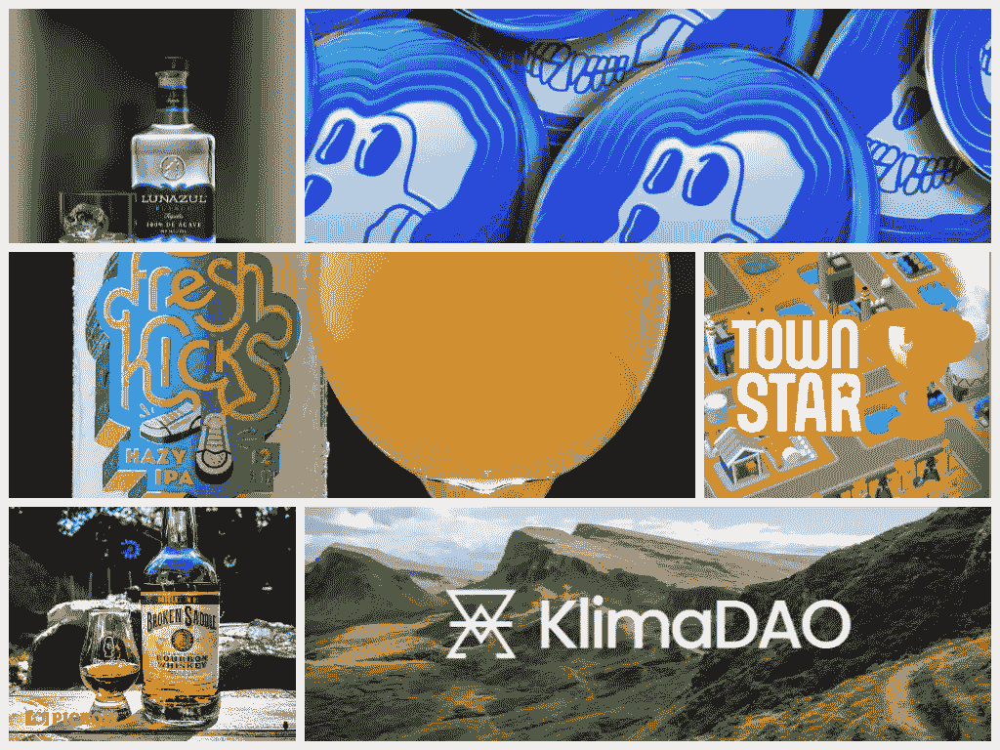
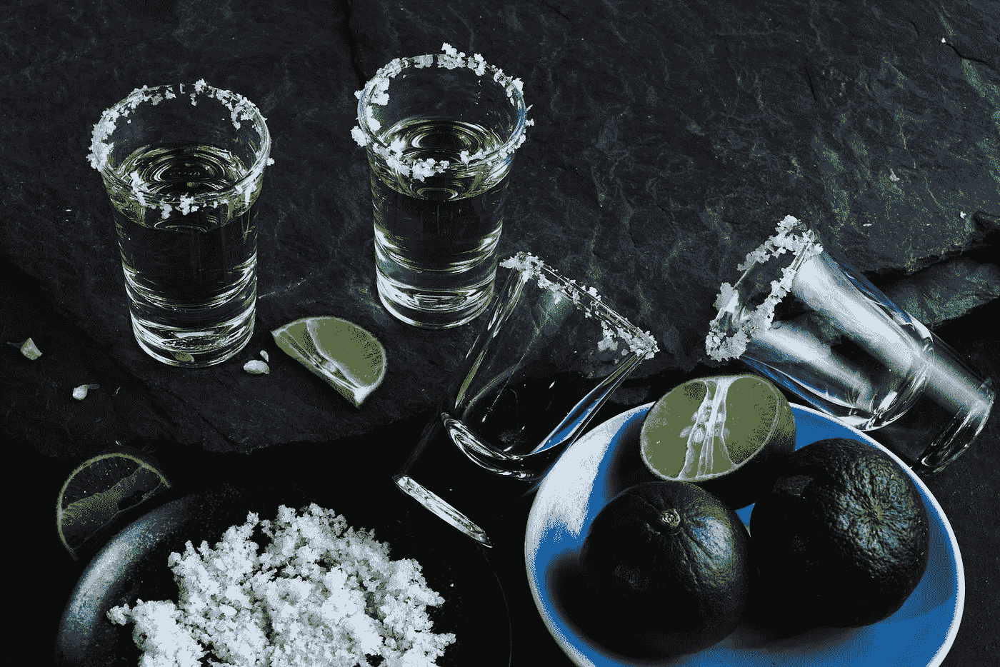
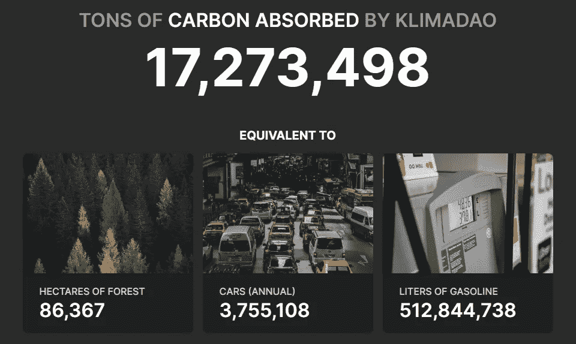
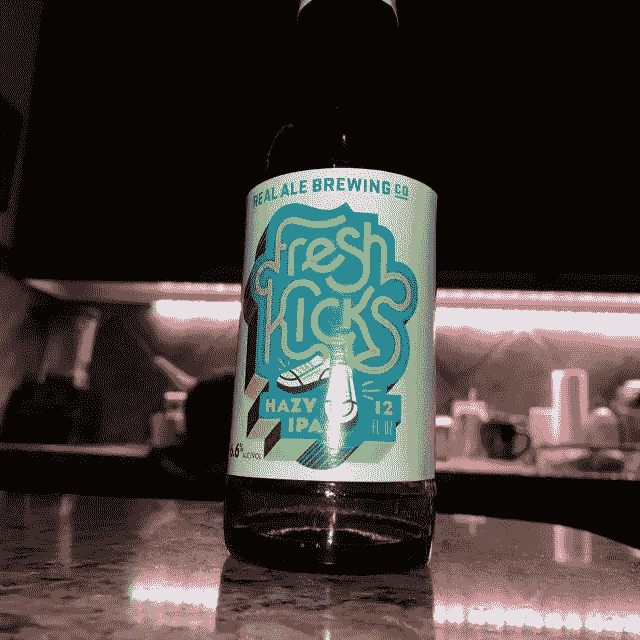

# 星期五的喧闹声

> 原文：<https://medium.com/coinmonks/the-friday-buzz-19753dfc01e0?source=collection_archive---------65----------------------->

Crypto 最好和饮料一起喝

这是漫长的一周。自上周五以来，$BTC 下跌了约 4.5%，DeFi 市值也出现了类似的跌幅，大多数 NFT 指标都让我感到沮丧。

但这是秘密…这几周只是旅程的一部分。所以，让我们把这件事抛在脑后，拿些饮料和一些有趣的项目去满足你整个周末的#德根胃口。

# [APE coin($ APE)](https://apecoin.com/)——[luna zul 龙舌兰酒](https://lunazultequila.com/)

ApeCoin 无疑是本周最热门的硬币之一。自上周五以来，APE 从 15 美元左右飙升至 22 美元以上，在每周中盘表现舞台上名列第一。

所以，如果你是持有者，这是伟大的一周，是时候狂欢了。这是和你的船员一起喝龙舌兰酒庆祝的绝佳时机。你永远不知道接下来会发生什么，所以享受在 crypto 的美好时光是很重要的…只是这次尽量穿上你的衣服，没人想看到那样。

另一方面，如果你和我一样，是旁观者，那么是时候洗去一些记忆了。在错过了今年中盘加密的一些最大周回报后，也许龙舌兰酒的燃烧正是你所需要的。不要买光滑的顶级的东西(反正这个星期后你可能买不起)，它应该会有点痛。我认为 Lunazul 是我最喜欢的龙舌兰酒，价格适中。

# [克利马刀($ Klima)](https://www.klimadao.finance/)——[破鞍波旁](https://www.1792distillery.com/)

[*来源*](https://www.epa.gov/energy/greenhouse-gases-equivalencies-calculator-calculations-and-references)

乍一看，这似乎是一个奇怪的组合。Klima DAO 是一个很有前途的项目，致力于创造一个开放的碳市场。他们让碳补偿更容易获得，对商业世界更有吸引力，这样有利于气候的项目可以更有利可图。Klima 正给企业施加压力，要求它们适应和改善环境政策。

尽管如此，成为一个$KLIMA 持有者并不总是容易的。自 2021 年 11 月以来，代币一直处于亏损状态，本周也不例外，价格又下跌了 24%。这不是胆小或焦虑的交易者的项目。这是一种长期的、不稳定的持有，有时难以下咽，是一种后天习得的味道。然而，如果你相信这个项目，你可能会爱上那种火辣辣的感觉。

我绝不是一个波旁威士忌鉴赏家，但我喜欢尝试所有不同的品牌和变化。问题是波旁威士忌和其他酒类相比太贵了，在亏损一周后，我不得不选择一种价格更低的酒。

就像$KLIMA 一样，断鞍肯定能在下来的路上烧起来。它的余味悠长，可以回味很长一段时间。当我查看日线图时，它的伤害足以帮助我忘记我所看到的。

# [小镇之星(＄Town)](https://townstar.com/)——[新鲜踢踏舞朦胧 IPA](https://realalebrewing.com/beers/fresh_kicks)

虽然我不是那种刻板的啤酒势利者和 IPA 潮人，但有时一个好的 IPA 是开始周末的完美方式。

从真正的啤酒酿造中获得的新鲜刺激是我最近的首选。我喜欢喝它，它的干爽余味让我不断回来喝更多。

这让我想起了 Gala Games 镇明星项目。我真的很喜欢玩这个游戏，我不得不阻止自己过度投资于$TOWN 或者购买更多的 Town Star NFTs 来提高我在游戏中的效率和收益。

这种 P2E 可能会让人上瘾，但重要的是避免配置过多的投资组合，否则那种 IPA 满满的感觉会毁了这个夜晚。这个游戏的未来，以及 P2E 游戏的未来，是模糊的。没有人确切知道一个月后会是什么样子，更不用说几年后了。

所以，享受投资组合中的一小部分，然后转向一些更平稳、更轻松、未来更明朗的选择。

快乐星期五家庭！敬你，谢谢你的支持！

> 加入 Coinmonks [电报频道](https://t.me/coincodecap)和 [Youtube 频道](https://www.youtube.com/c/coinmonks/videos)了解加密交易和投资

# 另外，阅读

*   [从 WazirX 切换到 CoinDCX 的 5 个理由](https://coincodecap.com/reasons-to-switch-from-wazirx-to-coindcx)
*   [联合国硬币评论](https://coincodecap.com/unocoin-review) | [最佳加密赌注硬币](https://coincodecap.com/best-crypto-staking-coins)
*   [如何使用 MetaMask Wallet 获得 KCC 地址？](https://coincodecap.com/kcc-address-metamask)
*   [如何获得自己的。XYZ 领域？](https://coincodecap.com/xyz-domain)
*   [最佳加密交换平台](https://coincodecap.com/best-crypto-swap-platforms) | [最佳加密交易所](https://coincodecap.com/crypto-exchange)