# 加密资产的基本估值框架—第 1.5 部分(LUNA)

> 原文：<https://medium.com/coinmonks/the-fundamental-valuation-framework-for-cryptoassets-part-1-5-luna-ca5f21e14664?source=collection_archive---------9----------------------->

在我们的[上一篇文章](/@xmegaz/the-fundamental-valuation-framework-for-cryptoassets-part-1-edee9e1f6938)中，我们介绍了几个基于加密资产基本面的估值指标，以$ETH 为主要例子。我们还顺便提到了$LUNA 和$FTM，因为这两家连锁店提供的关于各自探索者的统计数据比竞争对手多得多。这一次，我们将再次对$LUNA 进行类似的分析，但会更深入地研究估值模型。

为什么是$LUNA？我们认为$LUNA 是一个更好的例子，因为它通过$LUNA-$UST 燃烧机制动态调整其供应量，而$FTM 有固定的供应量上限。其他 L1 连锁店不提供容易获得的连锁统计数据，所以他们不在列表中。

上周，我们搜索了 Web2，略微扩展了我们的知识范围——我们在这里又带来了两个模型。

我们研究的模型是:

*   Blais (2021):作为交换媒介的交易利益
*   丛(2020):作为交易媒介的动态资产定价模型
*   Hayes (2016) : COP(生产成本)方法
*   吴(2017) : NVT(网络价值到交易)模型
*   PlanB (2019) : S2F(库存到流量)模型
*   Mahmudov (2018) : MVRV(市场价值对实现价值)模型
*   Sockin (2020):作为平台成员的估价
*   刘(2021):根据技术成熟度进行估值
*   刘(2022):价格效用比

大多数上述估价模型被丢弃，因为它们过于复杂，需要估计大量参数，因为它们试图解释每个经济主体的行为。并且一些被丢弃，因为它们仅适用于 PoW(工作证明)加密货币。如果你对经济学和数学感兴趣，也许你可以去看看。

我们精心挑选了其中几个进行$LUNA 分析:

*   阿拉比(2017，2020):网络价值(梅特卡夫定律)
*   Burniske (2017) : QTM(货币数量理论)
*   Viswanath 等人(2021):股权凭证的估值

前两个我们已经在上一篇文章中介绍过了，后一个还没有介绍。我们将查看模型的假设和直觉，并相应地评估$LUNA 的价值。

阿拉比(2017，2020)和伯尼斯克(2017)的基本思路请参考[这个链接](/@xmegaz/the-fundamental-valuation-framework-for-cryptoassets-part-1-edee9e1f6938)。然而，在我们的上一篇文章中，我们故意遗漏了一件事:阿拉比(2017，2020)使用了不同形式的梅特卡夫定律，而不是 V(N) = C*N。

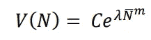

Alabi’s version

我们将运行 Alabi 版本的定价函数，并将其与 MetCalfe 的进行比较。

**维斯瓦纳特等人(2021)——PoS 估价**

维斯瓦纳特·埃尔·阿尔。(2021)为我们提供了一个评估 PoS 令牌价值的框架。他们的逻辑很简单——由于 PoS 代币可以下注，投资者需要决定是出于交易目的 HODL 代币，还是下注以产生现金流。这个 PoS 属性将 PoS 令牌呈现为类似于 TradFi 资产的风险回报配置文件。

我们不会讨论所有的推导，因为这超出了我们的范围，但是基本流程是这样的:

1.  每笔交易都要缴税，而且税款应计给股东(所有税收奖励都转换成美元)。
2.  消费者需要令牌来消费商品和服务(或进行交易)。
3.  因此，应该有一个均衡的比例押令牌持有令牌。
4.  PoS 代币的速度越高，意味着下注的代币越多，因为交易相同的输出需要的代币越少。如果一个 PoS 代币有无限的速度，没有人持有代币，每个人都把所有的袋子押上(在这种情况下，通货膨胀代币经济学不会产生经济效益，因为所有的利益相关者都被同等稀释)。
5.  更高的税收(交易费)可能会增加利益相关者的收益，直到某个拐点，而收益实际上是下降的，因为过高的税收意味着更少的交易(拉弗曲线)。

对于具有常数增长率、税率等的平稳情况。，上述过程可简化为:

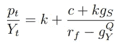

The PoS valuation model, Viswanath et al. (2021)

*模型参数*

*Pt : token value(以美元计)
Yt : total tx(以美元计)
k:消费者持有量，速度的倒数
c:税率
gs:通胀赌注报酬率
rf:无风险率
gyQ:交易增长(风险中性 tx 增长率)*

所以交易越多=代币价值越高。
更多的 HODL 行为=更高的代币价值。
更高的赌注奖励=更高的代币价值(如果有足够多的玩家)。
更高的交易增长率=更高的代币价值。

我们将很快用$LUNA 来说明这个模型。

**$LUNA 估值**

在我们进行任何估价之前，我们需要确定$LUNA 的速度。代币的速度表示代币在一段时间内改变钱包的次数。因为区块链包含了所有的交易，与 TradFi 不同，我们可以从交易量和流通供应量中直接计算周转率。

我们将彻底简化 Terra 生态系统，因为它只有一个产品:LUNA。供应方将考虑其稳定货币采用的影响。

使用$LUNA 的人越多=对$LUNA 的需求越高。
更多的人使用$UST =更低的供应给$露娜。

在我们简化的$LUNA 模型中，只有$LUNA 交易影响对$LUNA 的需求，而$UST 的采用只消耗了$LUNA。这种简化除了易于计算之外，还有一个额外的优势——它可以缓和自流失问题。

自流失问题指的是诸如燃烧和铸造令牌、自发送令牌、移动到 CEXes 等活动。不作为价值交易使用的。Zochowski 的一项研究表明，消除自我流失问题将使加密货币的速度从两位数降至一位数。

当我们从我们的计算中取出巨大的交易量——UST——时，我们会自动调整自我流失问题的速度。

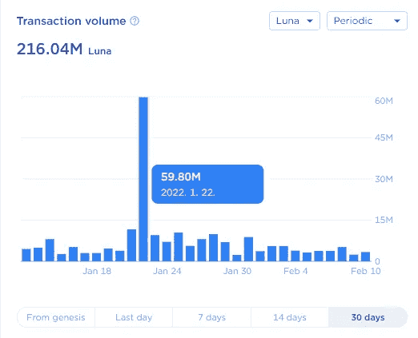

$LUNA tx volume

我们可以在 Terra Station 上找到$LUNA 的交易量，但交易量的突然激增有点令人不安。因此，我们将采用过去 14 天的$LUNA 交易量，并按年计算。

$LUNA 年交易额= 5858 万美元/14*365

如果我们将年交易量除以目前约 4 亿美元的流通供应量，我们的周转率为 3.8。

根据我们取的周期，我们得到的速度在 3-6 之间。它也与$ETH 速度一致，大约为~4，所以我们将它作为一个合理的值。

**PoS 估价模型**

因此，我们针对维斯瓦纳特等人(2021 年)的模型参数将是
*k = 1/6 = 1/速度
c = 0.002% =年化 30 天平均税率(再次在 Terra Station 上提供)
gs = 5% =通货膨胀赌注奖励(在 LR 中)
rf = 17.8% =锚定存款收益率
gy = 5% =交易量增长率*

现在 *k，c，gs* 很容易得到，但是 *rf* 和 *gy* 就比较棘手了。还记得我们说过 Viswanath 模型旨在比较$LUNA 和 TradFi 资产吗？

自然，我们认为我们应该使用美国国债利率，但获得“风险中性交易量增长率”将是另一项艰巨的任务。因此，我们选择了 Terra 生态系统中最常用的无风险指标，锚定率。

对于 *gy* ，请看下图。

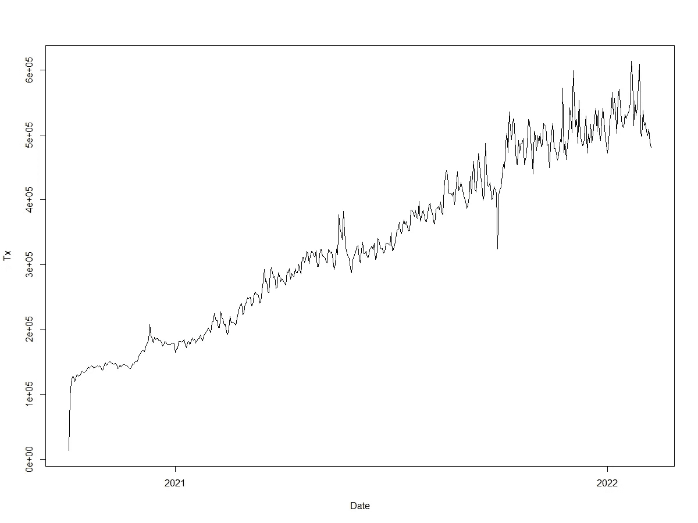

$LUNA transaction count graph

如果您查看 Terra 网络上的事务计数，它似乎与 t 呈线性增长。如果您对 Tx 到 t 进行线性回归，您将获得大于 100 的 t 值，beta 系数为 937，相当于当前的年增长率为 70%。由于我们着眼于“长期”增长率，因此我们将增长率大幅调低至 4.5% —如果网络继续以每天 937 笔交易的速度增长，20 年后，年增长率将达到 4.5%。

插入这些参数，除以循环的 LUNA 电源，我们得到下图。

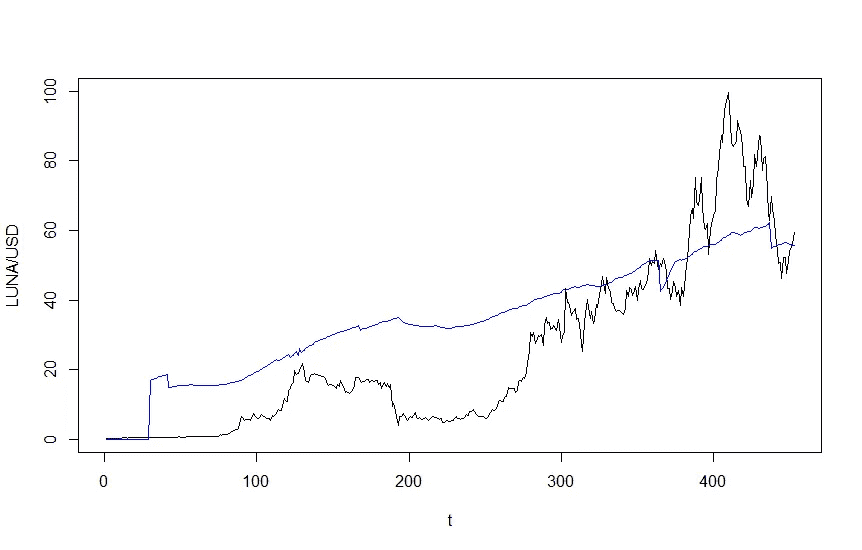

black = actual LUNA price, blue = model LUNA price

乍一看，该模型似乎相当不错，但该模型的美妙之处在于，我们没有使用任何市场价格数据(除了交易量)来评估 LUNA，我们仅使用基本面数据来得出模型价格。

现在，我们将使用该模型根据 LUNA 的预计交易量来预测其未来价格。今年我们用 tx(t) = 937*t 回归方程。

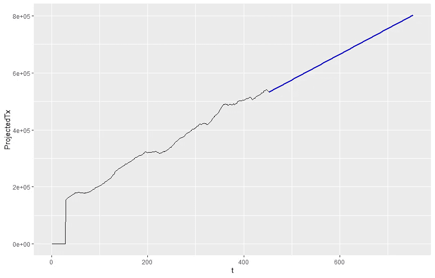

Projected transaction volume until year-end

因此，我们可以对交易量进行价格预测:

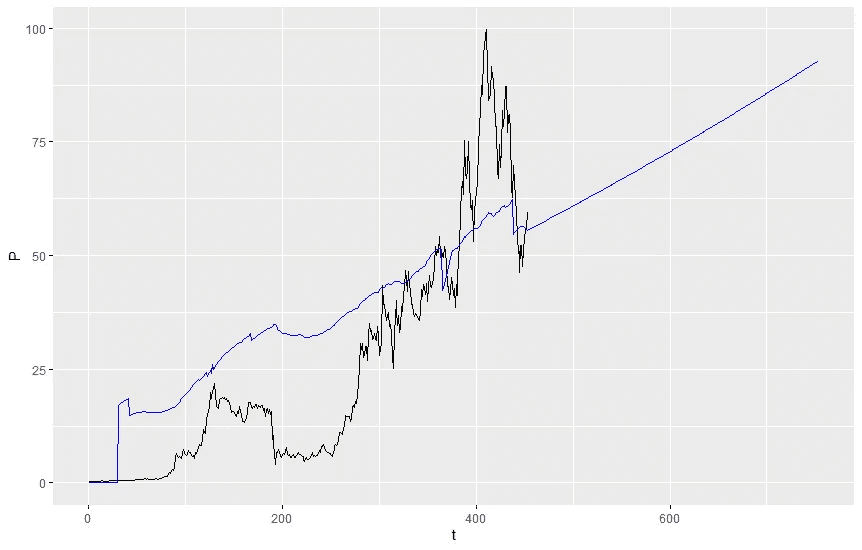

Actual price (black), model price (blue)

根据我们的参数，LUNA 将在年底达到 92 美元。全年的循环供应量将减少至 3.62 亿桶。

**网络模型**

我们上次已经做了同样的工作，所以这次我们将 1)对 LUNA price 进行敏感性测试，2)绘制 Alabi 版本以及 MetCalfe 版本的图表。

首先，我们需要 Terra 网络上活动地址的表示。正如我们上次所做的，我们可以用从 FlipsideCrypto 获取的实际值来拟合 netoid 函数参数，并获得我们的网络函数。

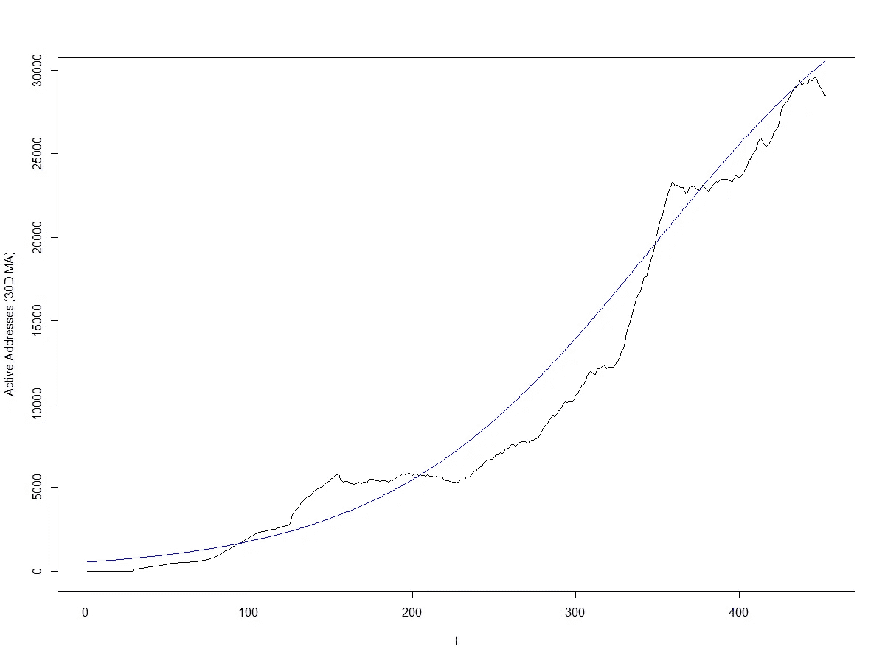

Actual active addresses (black), model active addresses (blue)

模型参数为
p = 38988
v = 0.012
TM = 347
，这意味着 Terra network 的最大日活跃地址数上限为 38988，增长率为 1.2%，最大增长期为 t = 347，大约在 2021 年 11 月。

我们需要估计的另一个函数是价格函数，我们先来看看梅特卡夫定律。如果我们将有效地址(30D 毫安)与$LUNA MC 相匹配，我们会得到下图:

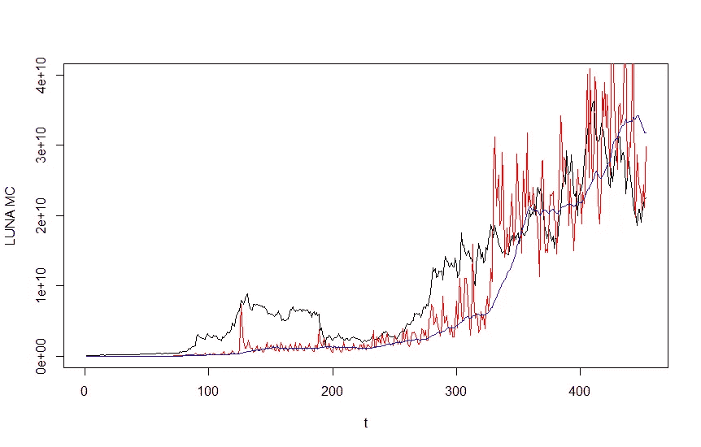

Actual MC (black), model MC of daily active addresses (red), model MC of 30D MA active addresses (blue)

对于梅特卡夫定律，我们有 C = 39.14。我们结合我们的网络函数和价格函数，并除以流通供应量，得到 LUNA 价格估计。

我们有很多关于$ UST MC ~ $露娜供应关系的精彩报道，为了方便起见，我们将把流通供应分为两种情况:熊市，供应上升到露娜历史上的最大供应，以及基本情况，供应下降到露娜曾经的最小供应。

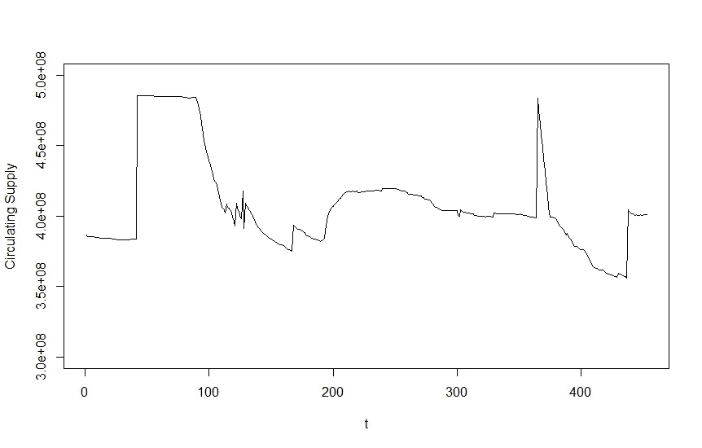

LUNA historical circulating supply

如果我们看看 SmartStake 的供应数据，我们可以观察到随着 MIM-UST 平仓，LUNA 的供应最近飙升。在我们的分析中，我们将 MIM-UST 的 UST 采用作为我们的基本案例。

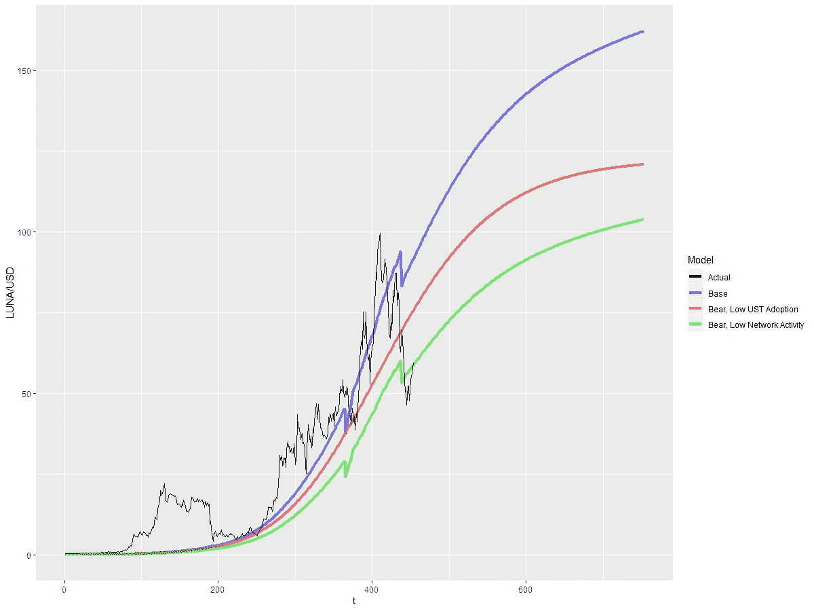

LUNA price model

如上所述，蓝线代表 EOY 的日活跃地址约为 38，700 个，流通供应量为 3.62 亿个。红线代表相同的每日活跃地址，但流通供应量为 485 米。绿线代表 EOY 的日活跃地址约为 31，000 个，循环供应量为 362M。

在我们的基础案例中，EOY 的 LUNA 应该达到 162 美元，而我们的每个熊市案例也指向 EOY 的> 100 美元 LUNA。

**网络—阿拉比模型**

上面这个和这个唯一的区别就是网络的价值变成了:

而不是 V(N) = CN。

如果我们使用统计程序来估计参数，我们有下面的图表。

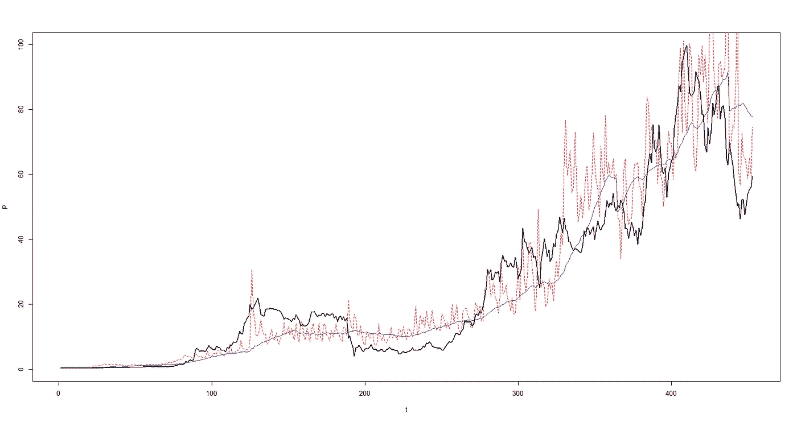

Actual price (black), fitted price 30D MA (blue), fitted price daily (red dotted)

两种型号在趋势方面几乎相同，但阿拉比的版本更快地赶上了上升趋势。

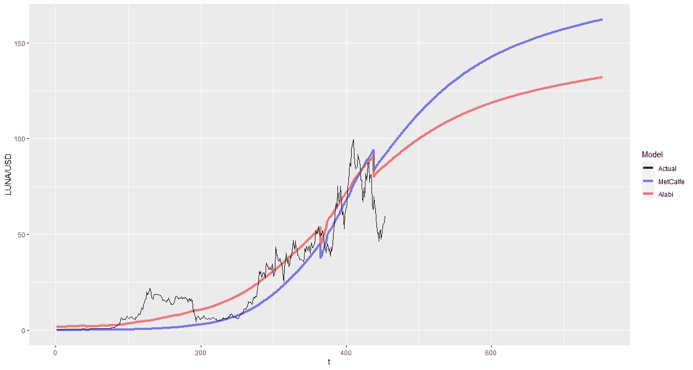

LUNA price function, Actual P (black), MetCalfe P (blue), Alabi P (red)

阿拉比的模型显示，EOY 的每露娜价格为 131 美元。

**QTM 型号**

QTM 模型具有相对简单的结构，所以我们不需要任何统计工具来估计参数。

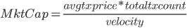

The QTM model for cryptoassets

我们已经从之前的计算中获得了模型参数，因此我们可以直接进行实际评估。

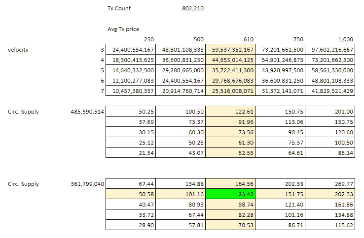

The QTM Valuation model for LUNA

Tx Count 简单地表示 EOY 的每日交易，我们将其用于 PoS 估价，并乘以平均 Tx 价格，以获得以美元计量的交易量。速度，我们还确定它应该在 3 ~ 6 的范围内，其余的都是不言自明的。

由于实际数据显示平均 Tx 价格约为 610，并且我们计算的速度为 3.8 以上，因此这是我们的基本情况。保守一点，我们可以用速度 6。

根据 QTM 模型，露娜应该是 EOY 的 123 美元。

就我个人而言，我更喜欢网络模型，因为与其他模型相比，它需要更少的假设。尽管如此，尽管所有模型都有缺点，但网络模型有一个严重的限制:最大活动地址数被硬性限制在一个数字上。

到 2023 年年底，LUNA MC 将达到 600 亿美元，此后将不再增长。当然，LUNA burn 机制仍然可能导致价格上涨，但将网络增长限制在一定数量是一个巨大的缺陷。也许 Terra 网络仍处于萌芽阶段，所以由于时间跨度短，我们所有的参数都可能是错误的。

如果我们仅使用 2018 年 1 月之前的数据，以太坊网络将在 2020 年初达到其最大 MC。它是从那里长出来的吗？当然可以。

信不信由你，底线是我们都知道的网络基础——交易计数、交易量、活动地址——实际上是网络令牌定价的重要因素。虽然不会有“交易量/价格倍数”这个神奇的数字，因为即使在 400 年的股票市场中我们也没有这个数字，但至少我们现在可以自信地说“网络 A 的交易量和活跃用户都在增长，所以它肯定会更贵。”