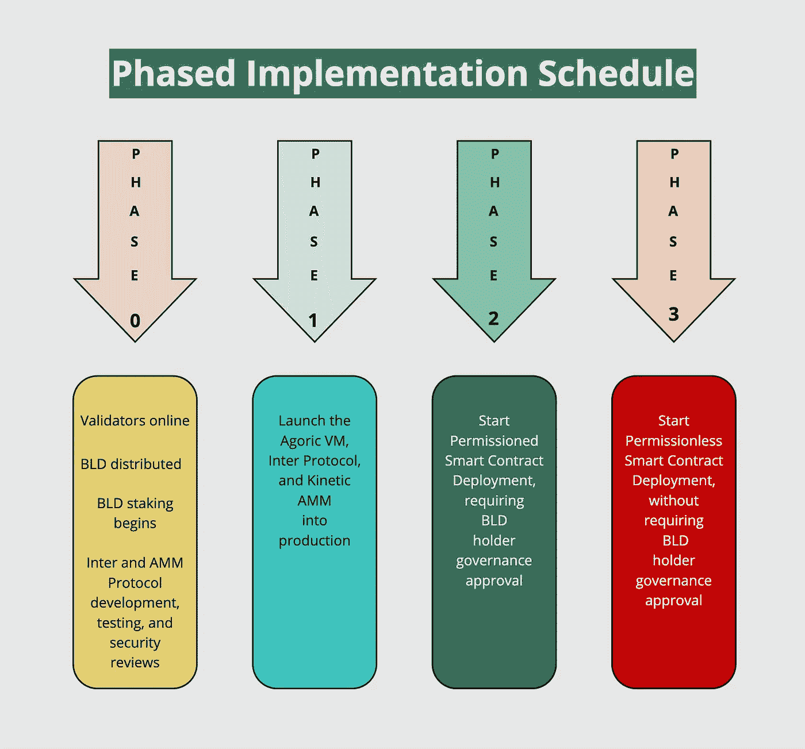
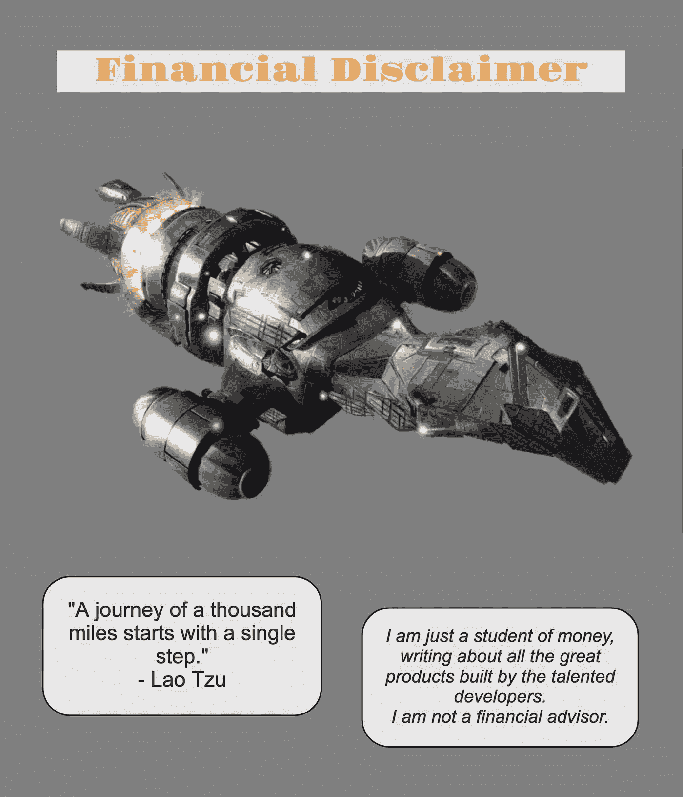

# 未来是建立在 JavaScript 和 Agoric 系统之上的

> 原文：<https://medium.com/coinmonks/the-future-is-built-on-javascript-with-agoric-systems-c7fdecb876b2?source=collection_archive---------10----------------------->

**智能合同开发的先驱**

在区块链公司的估值受到围攻、流动性正从金融市场的各个角落逃离、安全担忧似乎每天都在上升的时候，有哪个头脑正常的人会想要推出一个新的区块链呢？答案出奇的简单:一个由创始人、工程师、安全专家、产品经理和社区经理组成的团队，拥有数十年的经验。事实上，Agoric Systems 的团队甚至在第一个区块链推出之前就已经在设计智能合约了。

**还来得及**

在最近的金融市场动荡之前，世界各国政府禁止加密货币的报道在媒体上越来越少；相反，围绕新金融工具整合区块链技术和监管是讨论的主题。随着焦点转向对加密货币的接受，拥抱更广泛的目标市场终于可以成为一个现实的目标。区块链技术在去中心化金融中的用例已经在技术先进的先驱中得到广泛采用，但刚刚开始吸引主流公司、组织和市场的注意。现在是时候向尚未接触到未来经济的行业和企业介绍通过使用区块链和智能合同可以实现的潜在效率和成本节约。

**一个聪明的方法**

Agoric Systems 完全有能力驾驭区块链技术的下一波增长。Agoric 拥有数十年的智能合同经验，由来自世界上一些最成功的软件开发公司的在技术创新方面有深厚根基的人才团队领导，它正在利用最重要的资产:人！具体来说，Agoric Systems 即将推出区块链，允许 JavaScript 软件开发人员在其基础设施上编程并推出 dApps 和 marketplaces。

已经使用 JavaScript 的大型开发人员社区目前正在世界上一些最具创新性的公司工作。Node.js 是一个用作后端框架的 JavaScript 运行时环境，React.js 是一个用于开发在线应用前端的 JavaScript 库，被优步、网飞、LinkedIn、Meta、Airbnb、Yahoo！、Dropbox、ZenDesk 和《纽约时报》。此外，还有其他生产中的 JavaScript 框架，包括 Angular(被 YouTube、GMail、Google Play、微软 Azure、Forbes.com 和 PayPal 使用)、Vue.js(被 Adobe Portfolio、Adobe Behance、GitLab、Motley Fool 和宝马汽车配置器使用)和 Ember.js(被 GroupOn、Twitch 和 Square 使用)。Agoric 的首席执行官在去年 12 月写道，全世界有超过 1000 万开发人员正在使用 JavaScript(参见下面来源部分的 Agoric 白皮书)。

作为本系列的第一部分，我的目标是介绍 Agoric Systems，提供正在构建的生态系统的核心技术的高级概述，展示其创新解决方案以获得广泛采用，并讨论其迄今为止的进展。在对 Agoric 的介绍中，我还将通过研究今年剩余时间的路线图来展望未来几个月。然而，在本系列的后续部分中，我将重点介绍未来几个月要跨越的几个重要里程碑，并讨论它们对区块链未来的意义。

**公司**

Agoric 是一家总部位于北加州的开源软件开发公司，其目标是覆盖全球的开发人员和用户社区。围绕可组合组件的 JavaScript 库构建，该公司的区块链提供了基础设施，使开发人员能够启动 dApps、NFT 和 DeFi 市场。

Agoric 有一个庞大的内部团队作为核心开发和产品支持团队，它已经接触到了大量受过 JavaScript 培训的开发人员，扩大了一个快速增长且充满热情的外部软件开发团队社区。

**启动治理令牌**

经过最初几轮的私下销售，该公司还在 2021 年 12 月底成功完成了一次大型 Coinlist 公开销售，出售了超过 5000 万美元的 BLD，这是区块链的治理标志。请看下面的图片，了解小组记号组学的概况。

当前在 Main-net 阶段 0 上运行，验证器在线，BLD 治理令牌的标记已经开始。BLD 所有者可以将他们的令牌委托给一百个验证者中的一个或多个来保护区块链。合理的佣金为 10%或更少(大多数为 5%)，活跃的操作者集合包括那些拥有从 67，000 BLD 一直到 2，000 BLD 的委托资产的操作者。治理令牌还没有在交易所交易。

**技术**

精心准备其主网第一阶段的发布，Agoric 加入了区块链互联网，在更大的宇宙生态系统中占据了重要位置。以潜在的 Tendermint 共识引擎为基础，使用 Cosmos 软件开发工具包(SDK)构建公共链，Agoric 有望实现快速的处理速度、低廉的交易成本，并利用 IBC 协议的链间互操作能力。事实上，Agoric 是开发 IBC 团队的一员！

借助区块链间通信，Agoric 的开发人员将能够接入消息中继网络，与宇宙中所有支持 IBC 的区块链的 dApps 和协议进行通信。目前，现有的区块链如 Cosmos Hub、Osmosis、Juno、Secret、Sifchain 等都能够利用这种与 IBC 的互联性。每天都有价值数百万美元的交易通过 IBC 处理。对于 IBC 的范围的概述，区域地图提供了一个精彩的图片(见下面来源部分的链接)。

利用重力桥现有的桥接技术，以太坊资产将在区块链开发的智能合同中启用。Agoric 还将与 Chainlink 的 oracle 网络集成，为运行在 Agoric 区块链上的应用程序提供高级别的数据访问。

当 Main-net 第一阶段上线时，该团队将推出 Agoric 虚拟机、Inter 协议(用于稳定的令牌本地货币)及其自动化做市商(Kinetic AMM)。第 2 阶段将允许在 BLD 持有人治理批准后部署许可的智能合同。然后，阶段 3 将标志着无权限智能合约部署的引入。

**同类最佳的安全性、可组合性和基础设施**

以 Tendermint 共识引擎为基础的 Agoric 区块链技术堆栈由 Endo、Digital Assets 和 Zoe 进一步构建。

Endo 是技术堆栈的一层，是强化的 JavaScript 框架。它使智能合同平台能够提供安全的分布式计算。它与 CapTP 对象到对象消息传递协议交互。CapTP 是能力传输协议，它使一台计算机上的对象能够安全地将消息发送到另一台计算机上。

数字资产层包括可替代和不可替代的电子不记名权利。Agoric 将通过建立一个稳定和健全的经济来实现安全转移和交易这些资产的能力。这将首先通过它的两个标志来实现:IST 和 BLD。IST 稳定令牌将用于执行交易和连锁服务。它将由链上抵押品支持，代表一美元。BLD 令牌是治理和标记令牌。赌注奖励将因保护链而获得，并从链上活动收取的费用收入中支付。

最后，Zoe 是智能合约层，是一个支持构建在区块链上的应用程序的安全框架。使用 Zoe，开发人员可以在链上运行代码，铸造新的数字资产，并交易资产，同时在一个可信的框架内操作。

Zoe 提供了一个基于对象的框架，Agoric 构建了一系列可组合的组件，开发者可以将它们作为应用程序的一部分进行部署。看看下面的图片有什么可用的。

Agoric 技术堆栈的数字资产和 Zoe 层都与 ERTP 交互，后者是电子权利转让协议。它是在由 dApps 和市场组成的区块链市场生态系统中创建和传输数字资产的象征性标准。在 ERTP，数字资产可以被铸造、移动、存储和提取，所有这些都具有相同的安全属性和访问控制。

**未来建立在强化的 JavaScript 之上**

Agoric System 的重点是为开发人员提供基础和基础设施，以便在 dApps、NFT 和 DeFi 市场轻松快速地部署 JavaScript 智能合约。更重要的是，Agoric 团队将通过一个强大的、经过实战检验的、安全的智能合同框架，将他们的虚拟机投入生产。

区块链预计将成为宇宙生态系统中不可或缺的重要平台，利用其所有能力和过去一年的爆炸性增长。最重要的是，Agoric 区块链将利用全球数百万的 JavaScript 开发者。

在下一篇文章中，我将详细介绍即将推出的区块链，预计它将在今年夏末或初秋进入第一阶段生产。鉴于近期围绕稳定的欧元和区块链货币的所有市场动荡，Inter Protocol 和动态 AMM 的推出将是一个热切期待的事件。

Wordt vervolgd — Opa。

# **资料来源、参考文献和进一步阅读**

https://agoric.com/的阿戈里克—

Agoric 白皮书—[https://Agoric . com/WP-content/uploads/2021/12/Agoric-White-Paper-v 1.0-1 . pdf](https://agoric.com/wp-content/uploads/2021/12/Agoric-White-Paper-v1.0-1.pdf)

广场推特—@广场

Agoric 博客—[https://agoric.com/blog/](https://agoric.com/blog/)

分区地图—[https://mapofzones.com](https://mapofzones.com)

> 加入 Coinmonks [电报频道](https://t.me/coincodecap)和 [Youtube 频道](https://www.youtube.com/c/coinmonks/videos)了解加密交易和投资

# 另外，阅读

*   [维护卡审核](https://coincodecap.com/uphold-card-review) | [信任钱包 vs MetaMask](https://coincodecap.com/trust-wallet-vs-metamask)
*   [Exness 点评](https://coincodecap.com/exness-review)|[moon xbt Vs bit get Vs Bingbon](https://coincodecap.com/bingbon-vs-bitget-vs-moonxbt)
*   [如何开始通过加密贷款赚取被动收入](https://coincodecap.com/passive-income-crypto-lending)
*   [BigONE 交易所评论](/coinmonks/bigone-exchange-review-64705d85a1d4) | [电网交易机器人](https://coincodecap.com/grid-trading)
*   [氹欞侊贸易评论](https://coincodecap.com/anny-trade-review) | [CoinSpot 评论](https://coincodecap.com/coinspot-review)
*   [新加坡十大最佳加密交易所](https://coincodecap.com/crypto-exchange-in-singapore) | [购买 AXS](https://coincodecap.com/buy-axs-token)